# 面向数据科学家的 5 大浏览器扩展

> 原文：<https://towardsdatascience.com/top-5-browser-extensions-for-data-scientists-17a0195ca26f>

## 这些扩展将极大地帮助您的工作

格伦·卡斯滕斯-彼得斯在 [Unsplash](https://unsplash.com?utm_source=medium&utm_medium=referral) 上拍摄的照片

大多数数据科学家的工作都是通过 Jupyter Notebook 或现代其他类似的基于浏览器的笔记本在我们的浏览器中完成的。有些部分的工作可以在浏览器之外完成，但是我们不断回到基于浏览器的笔记本。

因为我们大部分时间都在使用互联网浏览器，所以我想介绍一下我的顶级浏览器扩展，它们可以帮助数据科学家工作。扩展是什么？让我们开始吧！

# 1.Diigo

[Diigo](https://www.diigo.com/index) 是一个浏览器扩展，可以在不快速离开页面的情况下给网页添加书签和注释。Diigo 对于数据科学家来说非常有用，可以记录所有的学习材料和研究参考资料，以备将来使用。

对于 Diigo，有几个特性对于数据科学家来说非常重要:

1.  **书签** —收集网站页面

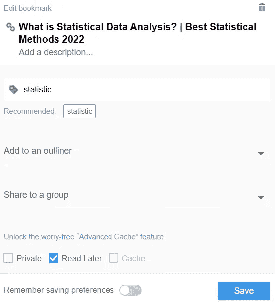

作者图片

2.**标记** —标记收藏

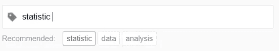

作者图片

3.**高亮显示** —高亮显示网页

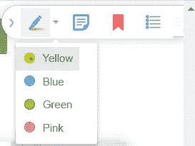

作者图片

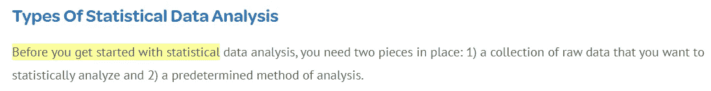

作者图片

4.**便笺** —在网页上添加便笺

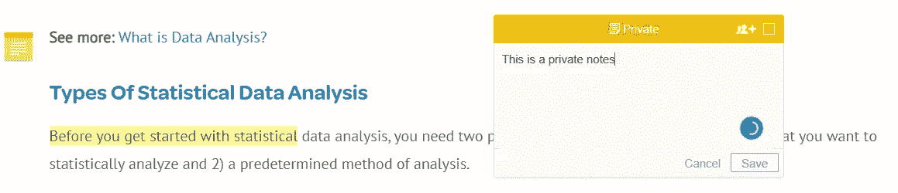

作者图片

5. **Outliners** —根据我们的需要构建研究材料

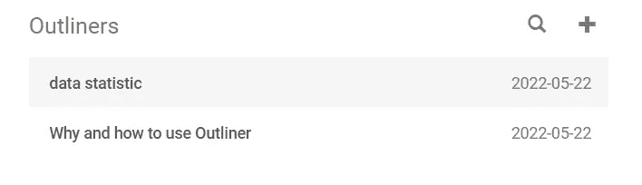

作者图片

6.**小组** —与同事分享材料

作者图片

您还可以使用高级功能，尤其是归档网页功能，但是所有主要的 Diigo 功能对于高效工作已经足够了。

# 2.催化 x

[**catalzex**](https://www.catalyzex.com/)是一个浏览器扩展，用于自动查找 AI/ML 论文中实现的代码。这些扩展可以直接用于研究论文或谷歌搜索结果。

例如，如果我试图找到一篇“神经网络 GAN 论文”，扩展会自动找到代码实现(通常，它会将您带到 GitHub 页面)。

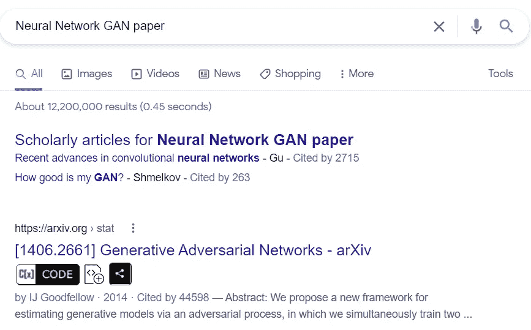

作者图片

如果我尝试按下 CODE 按钮，它会把我带到存储代码的 GitHub 页面。

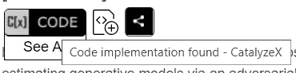

作者图片

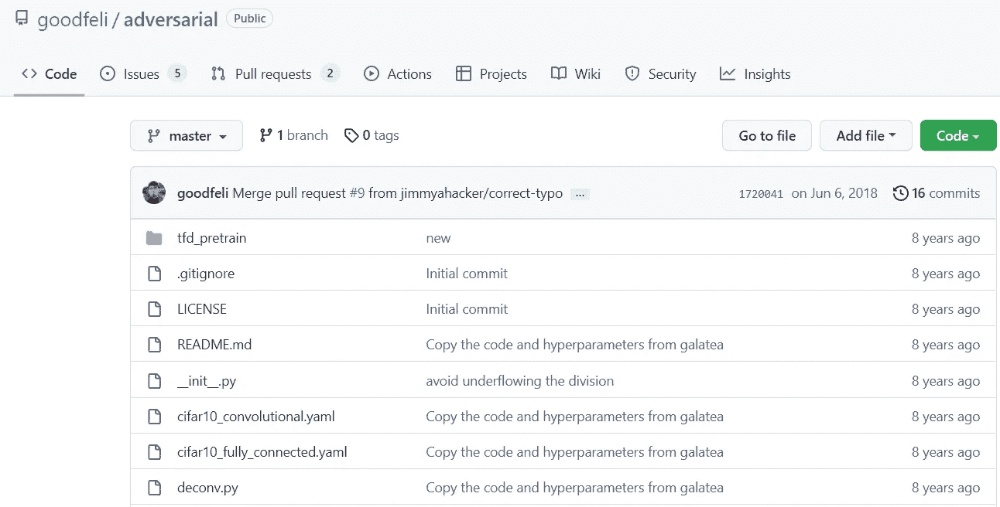

作者图片

与 Google 的结果相似，当我们阅读研究论文时，CatalyzeX 扩展也可以工作。

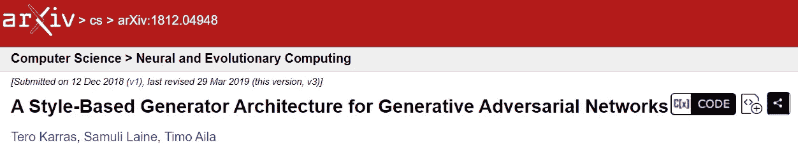

作者图片

甚至是谷歌学术的页面。

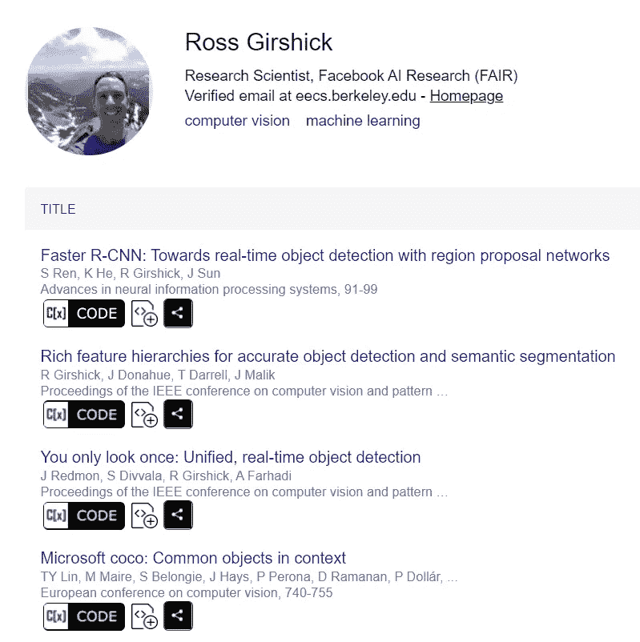

作者图片

最后，你可以访问 CatalyzeX 找到你需要的人工智能/人工智能研究论文。

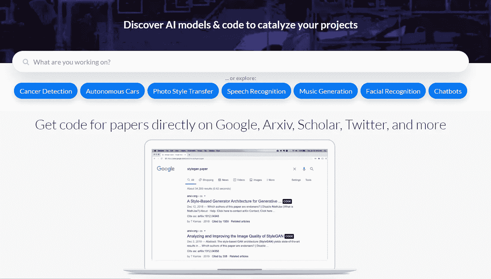

总的来说，扩展允许我们数据科学家快速研究代码实现，这样我们就可以专注于我们的工作。

# 3.八叉树

[Octotree](https://www.octotree.io/) 是一个浏览器扩展，专门用于简化 GitHub 上的代码探索。当你打开 GitHub 页面时，这个扩展会自动工作，并出现在页面上。

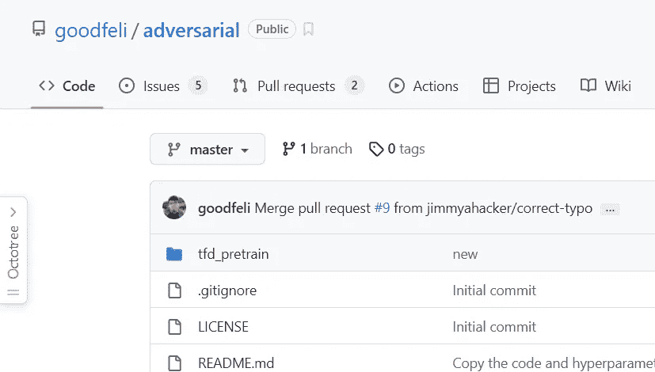

作者图片

扩展功能简单；它将采用当前的 GitHub 页面，并创建一个有见地的树状结构，供我们快速浏览。

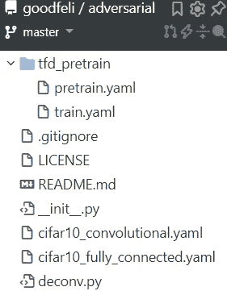

作者图片

有了 Octotree，我们可以立即知道代码结构，并能够很容易地找到所需的代码。此外，Octotree 还提供了一些附加功能，包括:

1.  轻松显示分支和标签

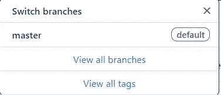

作者图片

2.拉请求查看器

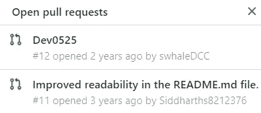

作者图片

3.GitHub 页面书签

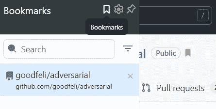

作者图片

总的来说，Octotree 对数据科学家来说是有价值的，因为它允许我们快速理解 GitHub 页面，尤其是代码实现。

# 4.在 Colab 中打开

[Open in Colab](https://chrome.google.com/webstore/detail/open-in-colab/iogfkhleblhcpcekbiedikdehleodpjo/related) 是一个简单的浏览器扩展，可以直接在谷歌协作笔记本上打开 GitHub 中托管的笔记本文件。

通常，如果我们想试用 GitHub 页面中的笔记本文件，需要下载它，但是使用 Colab 扩展中的 Open，我们不需要这样做。让我们通过使用[这个笔记本文件来尝试一个简单的例子。](https://github.com/cornelliusyudhawijaya/Cross-Sell-Insurance-Business-Simulation/blob/main/cross_sell_vehicle_insurance_business.ipynb)

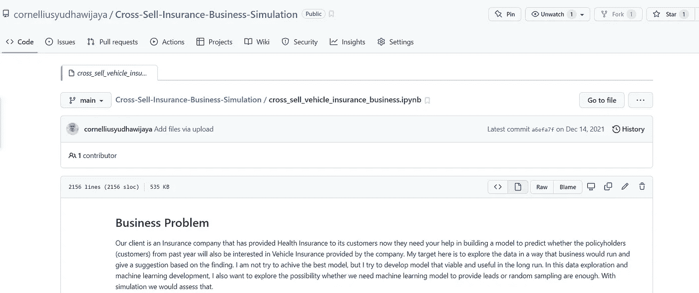

作者图片

只需点击一下扩展，笔记本就可以在在线谷歌实验室中使用了。

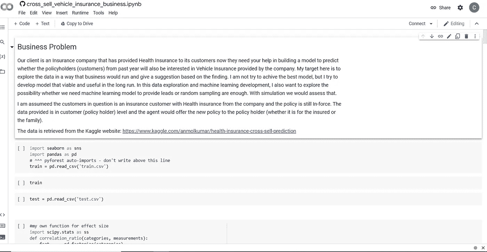

作者图片

有了这个简单的扩展，您将无需担心测试各种笔记本示例或研究实现。

# 5.BibItNow！

BibItNow 是一个浏览器扩展，可以方便地引用各种格式的研究论文。这个扩展是为那些每天需要引用大量论文的数据科学家设计的。

使用该扩展，当我们打开研究论文网页或 pdf 时，我们会自动获得引用。

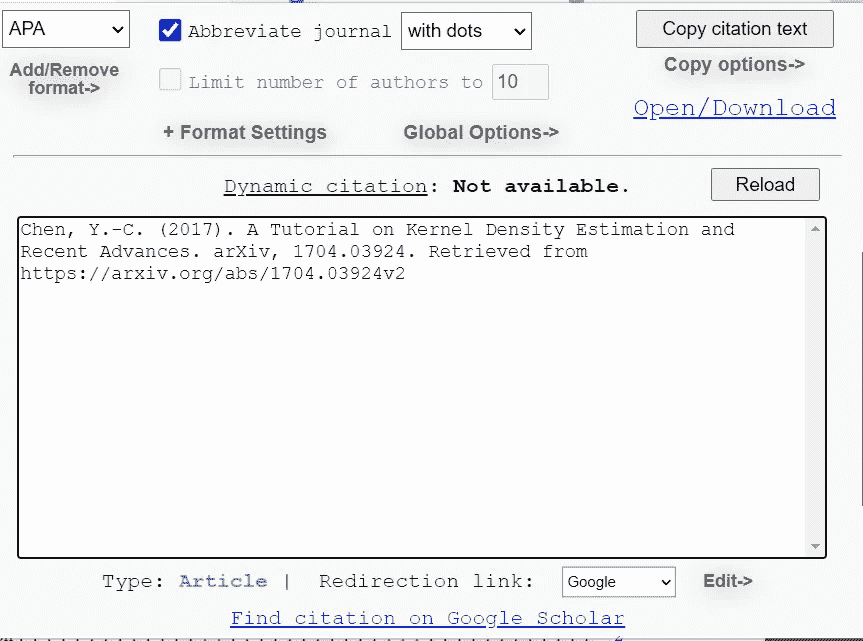

作者图片

还有一种变体格式可供您选择。例如，我选择 Bibtex 格式。

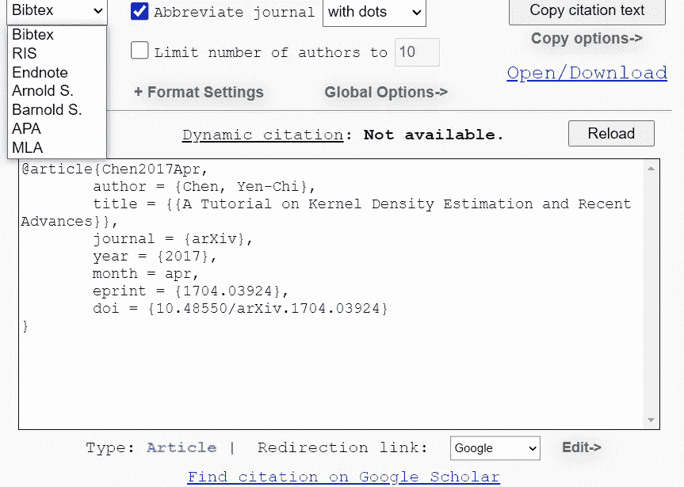

作者图片

当你需要更高级的格式时，可以选择你需要的引文。

作者图片

总的来说，BibItNow 是一个简单的浏览器扩展，但对于阅读大量论文的数据科学家来说很有价值。

# **结论**

现代数据科学家的工作现在与作为工作工具的浏览器密切相关。在这篇文章中，我展示了我的 5 大浏览器扩展来改进数据科学家的工作。它们是:

1.  Diigo
2.  催化 x
3.  八叉树
4.  在 Colab 中打开
5.  BibItNow

希望有帮助！

> *访问我的* [***社交媒体***](https://bio.link/cornelli)**进行更深入的交谈或有任何问题。**

> **如果您不是作为中等会员订阅，请考虑通过* [*我的推荐*](https://cornelliusyudhawijaya.medium.com/membership) *订阅。**