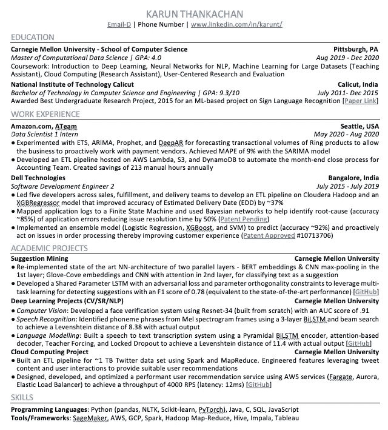
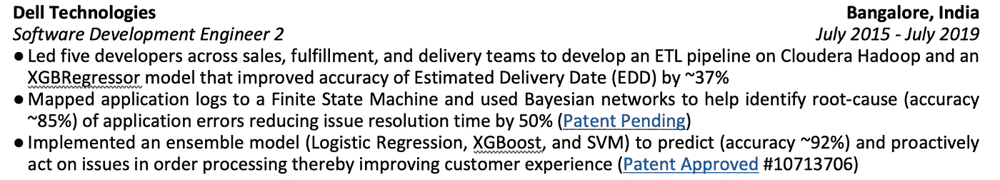

# 撰写优秀数据科学简历的五大常见问题

> 原文：<https://towardsdatascience.com/top-5-faqs-on-writing-a-great-data-science-resume-a439cbc75289>

## 撰写 DS/ML 简历最常见问题的答案

图一。克里斯蒂娜@ wocintechchat.com 在 [Unsplash](https://unsplash.com/s/photos/interview?utm_source=unsplash&utm_medium=referral&utm_content=creditCopyText) 上的照片

以下是我在撰写数据科学简历时收到的一些最常见的问题。所提供的建议将帮助你调整你的简历，使之更好地符合一系列工作要求，并更经常地通过最初的简历筛选。

下面的建议帮助我整理了一份简明的简历，这份简历是为我申请的每个职位定制的，并且随着时间的推移增加了我收到的回电数量。

# *我的简历可以有多长？我应该如何组织我的简历？*

平均来说，一个招聘人员在一份简历上花费 7 秒钟。这意味着你需要把你的简历精简到与招聘人员最相关的数据点。因此，最好把你的简历控制在一页以内。

在组织你的简历时，要让招聘人员容易理解。这意味着使用一种通用的、易于阅读的格式。常见的如下图。

图二。作者图片

需要注意的一些建议是

*   避免多列格式。
*   按时间顺序写。如果你目前是研究生，教育应该是第一部分。如果你目前正在工作，把工作经验放在第一位，教育放在第二位。
*   突出显示您的联系方式。在这种格式中，它位于名称标题的正下方。
*   突出你每一次工作经历的开始和结束时间。大多数角色都需要工作经验，计算你在这个领域的经验应该很容易。
*   保留一个技能部分，这有助于记下你熟悉的 DS/ML 角色中使用的编程语言和框架。当简历被 [ATS(申请跟踪系统)](https://www.jobscan.co/blog/8-things-you-need-to-know-about-applicant-tracking-systems/)自动处理时，这些也可以作为关键词。ATS 识别的关键词越多，人们查看你简历的机会就越大。

# 我应该如何写我的项目？我应该在我的项目描述中提到技术栈吗？

当写项目的时候，坚持一个版本的[星形格式](https://www.themuse.com/advice/star-interview-method)。这意味着提及—你着手解决什么问题(情况)，你建立了什么模型/解决方案(任务&行动)，以及应该产生可量化影响的结果是什么(结果)。下面是一个例子。

图三。作者图片

一个常见的建议是每个要点以一个动作词[开始，并确保一个要点不超过两行。](https://www.themuse.com/advice/185-powerful-verbs-that-will-make-your-resume-awesome)

关于提到技术栈，如果细节可以编织到项目描述中，那么保留它们(如图 3 所示)。否则，我不建议利用简历中有限的空间列出每个项目的技术堆栈(你可以在技能部分列出你熟悉的所有语言和工具)。

# *我应该在简历中加入哪些项目来破解 DS 角色？我应该在简历中喊出哪些技术技能？*

要编写的项目将取决于工作角色描述。

*   如果职位描述是一般性的(例如，仅仅提到使用数据向企业推荐解决方案)，那么你的简历也要保持一般性。试着在诸如 NLP、CV、推荐等领域提及项目。试着提及对框架的熟悉——包括开发 ML 解决方案(PyTorch、TensorFlow、Sklearn 等)。)并部署它们(AWS、ML Pigeon 等。).
*   如果角色描述很具体，就根据它来定制你的项目和简历。例如，对于以 NLP 为中心的角色，确保您的 NLP 项目是前期的。是的，这意味着你**不能只有一份简历**！理想情况下，有一个列出多个项目的文档。然后，根据角色描述，你应该找出与角色最相关的项目，并制作一份简历。

技能也取决于角色描述。

因此，除非你有明确的研究倾向，否则最好在 DS 应用领域积累经验。这有助于你建立一个广泛的工作组合，你可以利用它来申请不同的角色，最大限度地增加你被选中的机会。

# *论文/专利是否应该在简历上提及？*

这要看你瞄准的角色。某些数据科学角色以研究为中心。在这种情况下，提及论文/专利是相关的，应该突出/详细说明。

另一方面，某些角色更面向产品。在这些情况下，最好强调正在解决的最终客户问题。如果这个项目导致了一项专利/论文，只需在最后链接它，如图 3 所示。

# 我应该在简历中强调软技能/课外活动/奖项之类的东西吗？

让我们一个一个地考虑这些

*   软技能——对于大多数面向行业的角色来说，领导能力、解决问题能力、谈判能力等技能都是有价值的。鼓励在简历中使用这些词语。
*   课外活动通常不会给招聘决定增加多少价值。某些角色，如俱乐部领导、主持研讨会等。被正面看待。然而，这些应该是非常低的优先级。只有在提到你的项目后，你的简历上还有空间的时候，才提到它们。
*   奖励——研究资助/奖励与以研究为导向的角色相关。否则，奖励/荣誉应该再次处于低优先级。只有在提到你的项目后，你的简历上还有空间的时候，才提到它们。

# 外卖食品

要记住的主要事情是

*   使用易于阅读的简历格式
*   根据你申请的职位，突出并重新安排你的内容
*   确保你有足够的相关关键词来确保你的简历通过 ATS 的筛选。