# 2022 年你应该知道的五大 SQL 日期函数

> 原文：<https://towardsdatascience.com/top-5-sql-date-functions-you-should-know-in-2022-2180328ab940>

## 数据科学

## 掌握 SQL 日期时间函数，赢得数据科学面试


照片由[本斯·巴拉-肖特纳](https://unsplash.com/@ballaschottner?utm_source=unsplash&utm_medium=referral&utm_content=creditCopyText)在 [Unsplash](https://unsplash.com/collections/4546015/time?utm_source=unsplash&utm_medium=referral&utm_content=creditCopyText) 拍摄

**使用 SQL 节省时间！**⏰

在以数据为中心的世界中，使用时间戳将数据组织到毫秒级的细节。然而，这种详细程度并不总是有用的。相反，通常你只需要日期的一部分，比如年、月或日。

因此，了解从日期时间变量中提取所需数据的不同方法非常重要。

我在这里列出了 5 个最有用的 SQL 函数和例子，以帮助您理解日期-时间数据操作和分析。

我把这篇文章写得很短，这样你就可以很快地完成它，掌握那些必须知道的、赢得面试的 SQL 技巧。🏆

您可以使用此索引快速导航到您最喜欢的部分。

```
**·** [**DATE and TIME function**](#dad0) **·** [**EXTRACT()**](#2d4e) **·** [**DATEDIFF()**](#0f53) **·** [**TIMESTAMPDIFF()**](#e11d) **·** [**MONTHNAME() and DAYNAME()**](#7727)
```

> 📍注意:我使用的 MySQL Workbench &地震数据集来自[ka ggle](https://www.kaggle.com/datasets/usgs/earthquake-database)[public](https://creativecommons.org/publicdomain/zero/1.0/)dataset&现在可以在我的 [**Github**](https://github.com/17rsuraj/data-curious/blob/master/TowardsDataScience/Dummy_Sales_Data_v1.csv) repo 上免费获得，并有 [MIT 许可](https://github.com/17rsuraj/data-curious/blob/master/LICENSE.md)！

我将使用的数据集如下所示..

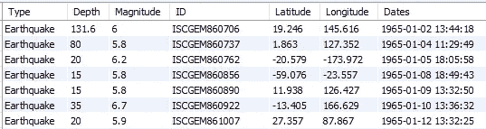

地震数据集|作者图片

这是一个简单的 2000 x 7 数据集！

好了，我们开始吧…🚀

让我们从最简单的部分开始——从日期时间变量中提取日期和时间。

# 日期和时间功能

这个函数只从日期时间变量中提取日期。

如上图所示，日期列包含格式为`**YYYY-MM-DD HH:MM:SS**`的日期和时间，而您只想提取日期部分，即月、日和年。

对于这个问题，`**DATE()**`函数是最简单的解决方案。

```
SELECT Dates, **DATE(Dates)** as only_date
FROM sql_practice.earthquakes;
```

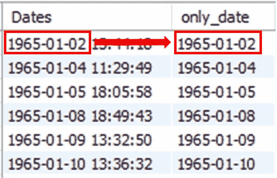

按作者从 SQL | Image 中的日期时间变量提取日期

同样，你也可以使用另一个有用的函数 `**TIME()**`只获取时间部分，即小时、分钟、秒

```
SELECT Dates, **TIME(Dates)** as only_time
FROM sql_practice.earthquakes;
```

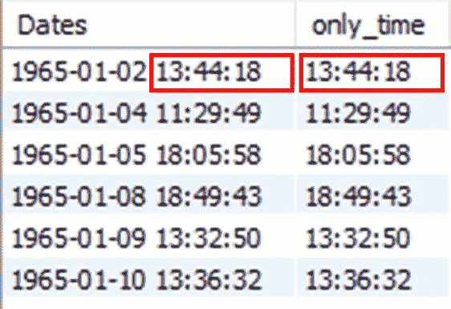

按作者从 SQL | Image 中的日期时间列仅提取时间

嗯，正如它名字所暗示的，它非常简单和直接。

深入研究日期-时间数据，接下来让我们看看如何从日期中只提取日、月或任何其他部分。

# 提取()

它从给定的日期时间值中提取部分日期。

在大多数访谈中，您会被要求按月或按周汇总数据，或者计算特定月份或季度的特定指标。💯

`EXTRACT()`是为提取日期的不同部分提供最大灵活性的函数。它有最简单的语法，

```
**EXTRACT(part_of_date, date-time column)**
```

到目前为止，MySQL 支持使用该函数提取以下类型的日期部分。

```
SELECT Dates AS given_date, 
       EXTRACT(**SECOND** FROM Dates) as seconds_value,
       EXTRACT(**MINUTE** FROM Dates) as minute_value,
       EXTRACT(**HOUR** FROM Dates) as hour_value,
       EXTRACT(**DAY** FROM Dates) as day_value,
       EXTRACT(**MONTH** FROM Dates) as month_value,
       EXTRACT(**YEAR** FROM Dates) as year_value,
       EXTRACT(**WEEK** FROM Dates) as week_value,
       EXTRACT(**QUARTER** FROM Dates) as quarter_value
FROM sql_practice.earthquakes
LIMIT 5;
```


使用 MySQL 中的 MySQL | Image by Author 提取日期部分

这样，您可以提取日期的基本和常用部分。MySQL 还支持其他不常见的日期部分组合，例如

```
SELECT Dates AS given_date, 
       EXTRACT(**YEAR_MONTH** FROM Dates) as year_month_value,
       EXTRACT(**DAY_HOUR** FROM Dates) as day_hour_value,
       EXTRACT(**HOUR_MINUTE** FROM Dates) as hour_minute_value,
       EXTRACT(**MINUTE_SECOND** FROM Dates) as minute_second_value
FROM sql_practice.earthquakes
LIMIT 5;
```

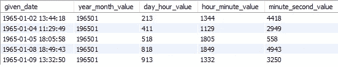

MySQL 摘录中的日期部分组合|作者图片

下面举个例子来了解一下`EXTRACT()`函数在实际中是如何使用的。

🔸假设，你想知道每次地震发生在一天中的什么时间。日期列的时间戳高达秒级。

在这里，你可以得到如下的时间。

```
SELECT Dates, 
       **EXTRACT(HOUR FROM Dates)** as hour_of_day
FROM sql_practice.earthquakes;
```

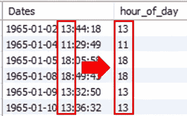

提取一天中的某个小时|作者图片

当您想要汇总每周、每月或每季度的数据或了解数据的每月、每年趋势时，通常会使用此函数。

🔸例如，您想获得 1965 年前三个月的每周地震总数。

```
SELECT **EXTRACT(WEEK FROM Dates)** as week_of_year,
       COUNT(DISTINCT ID) as number_of_earthquakes
FROM sql_practice.earthquakes
WHERE Type LIKE 'Earthquake'
AND **EXTRACT(MONTH FROM Dates)** < 4
AND **EXTRACT(YEAR FROM Dates)** = 1965
**GROUP BY EXTRACT(WEEK FROM Dates)**;
```

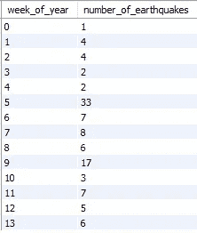

每周汇总|作者图片

如你所见，列*由一年中的周数组成，最大地震发生在第五周。*

这是理解如何提取日期的不同部分以及如何在`WHERE`和`GROUP BY`子句中使用它们的经典示例。

这种类型的聚合问题经常在数据科学访谈中被问到。✅

接下来，有时您需要根据两个事件计时之间的差异来过滤时间戳数据。

# DATEDIFF()

它实际上是比较这两个日期，并返回它们之间的天数差。

它需要两个参数，

```
DATE_DIFF(1st date, 2nd date)
```

举个例子，

```
SELECT **DATEDIFF('1965-02-28', '1965-01-01')** as DATEDIFF_output-- Output
**58**
```

在`DATEDIFF()`中，第一个日期应该总是大于第二个日期。如果相反，输出将是负数。

🔸在另一个例子中，假设您想要查看今天(【2022 年 7 月 3 日)之前每场地震发生了多少天。为此，您可以使用另一个 MySQL 函数`NOW()`，它基本上以时间戳格式返回今天的日期。

```
SELECT Dates,
       **DATEDIFF(NOW(), Dates)** as DATEDIFF_Output
FROM sql_practice.earthquakes
```

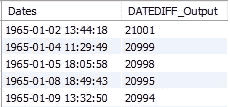

SQL | Image 中的 DATEDIFF(按作者)

嗯，这两个日期之间的差异以天数的形式返回，这对您来说可能太细了，因为`DATEDIFF()`没有提供日期部分的灵活性，比如以月或年的形式获得两个日期之间的差异。

这就是下一个功能出现的时候。

# TIMESTAMPDIFF()

它提供了部分日期的灵活性，并让您在日、周、月、季度和年的两个日期之间有所不同。💯

它的语法略有不同，如下所示:

```
**TIMESTAMPDIFF(part of date, 1st date, 2nd date)**
```

其中，*第一个日期应始终小于第二个日期*，日期的一部分可以是日、月、年、周中的任何内容

因此，截止到`DATEDIFF()`的相同查询可以重写为:

```
SELECT Dates,
       **TIMESTAMPDIFF(YEAR ,Dates, NOW())** as TIMESTAMPDIFF_Output
FROM sql_practice.earthquakes
```

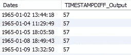

MySQL 中的 timestamp diff |作者图片

现在，今天和日期之间的差值以年数返回。

🔸让我们举一个实际的例子—您想要查看从 1965 年 1 月 2 日起 10 天内发生的所有震级超过 6 级的地震。

```
SELECT ID,
       Latitude,
       Longitude,
       Magnitude,
       Dates
FROM sql_practice.earthquakes
WHERE Type LIKE 'Earthquake'
AND Magnitude > 6
AND Dates >= '1965-01-02'
AND **TIMESTAMPDIFF(DAY, '1965-01-02', Dates) <= 10**;
```

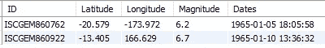

过滤 X 天内发生的日期|按作者分类的图片

正如你在上面的图片中看到的，两次地震的日期都是 1 月 5 日和 10 日，距离 1 月 2 日不到 10 天。

> 根据包裹递送所用的时间选择记录，您需要找出运输日期和递送日期之间的差异
> 或
> 找出用户订阅特定服务的时间。

这些是一些现实生活中的使用案例和常见的数据科学面试问题，可以使用`TIMESTAMPDIFF()`或`DATEDIFF()`解决。

🔸另一个关于`DATEDIFF`或`TIMESTAMPDIFF`的有趣例子是—

> [***温度上升*** 关于 Leetcode](https://leetcode.com/problems/rising-temperature/) 的问题

您需要选择温度高于前一天的所有 id。问题的输入是一个简单的表格，如下所示，

```
**Input table name:** Weather
+----+------------+-------------+
| id | recordDate | temperature |
+----+------------+-------------+
| 1  | 2015-01-01 | 10          |
| 2  | 2015-01-02 | 25          |
| 3  | 2015-01-03 | 20          |
| 4  | 2015-01-04 | 30          |
+----+------------+-------------+
```

在我上一篇文章中提到，[**5 高级 SQL 查询**](/5-advanced-sql-concepts-you-should-know-in-2022-b50efe6c99#3ad5) 这个问题可以结合`SELF JOIN`和`DATEDIFF()`一起使用来解决。💯

```
-- **Query using DATEDIFF()**SELECT today.id FROM Weather AS today 
JOIN Weather AS yesterday
ON today.temperature > yesterday.temperature
AND **DATEDIFF(today.recordDate, yesterday.recordDate) = 1****-- Query using TIMESTAMPDIFF()**# Write your MySQL query statement below
SELECT today.id FROM Weather AS today 
JOIN Weather AS yesterday
ON today.temperature > yesterday.temperature
AND **TIMESTAMPDIFF(DAY, yesterday.recordDate, today.recordDate) = 1****Output:** 
+----+
| id |
+----+
| 2  |
| 4  |
+----+
```

> **注意**在`TIMESTAMPDIFF` 和`DATEDIFF`语法中提及日期值的顺序。

接下来，让我们看看如何获得日期和月份的名称，而不是它的编号。

# 月名()和日名()

顾名思义，`MONTHNAME()`返回月份名称，`DAYNAME()`返回给定日期的日期名称。

🔸例如，从 date 获取今天的日期和月份名称。

```
SELECT NOW() AS given_date,
       **MONTHNAME**(NOW()) AS month_name,
       **DAYNAME**(NOW()) AS day_name;
```

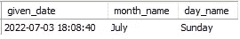

按作者获取 SQL | Image 中的日期和月份

当您需要按天或按月对列进行聚合，并且列中只有日期-时间值时，这很有用。

> **注**:函数`**NOW()**`以`YYYY-MM-DD HH:MM:SS`格式返回当前日期和时间，可以在上图第一栏看到。

🔸例如，您想了解一周中哪一天发生的地震最多。

```
SELECT **DAYNAME(Dates) AS day_name**,
       COUNT(DISTINCT ID) AS number_of_earthquakes
FROM sql_practice.earthquakes
WHERE Type LIKE 'Earthquake'
**GROUP BY DAYNAME(Dates)**
ORDER BY number_of_earthquakes DESC;
```

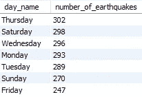

按日期名称分组|按作者分组

这就是你如何找出周四发生地震的最大次数。你可以使用`MONTHNAME()`来获得类似的洞察力。

仅此而已！

我希望您能很快完成这篇文章，并发现它对在 SQL 中处理日期很有用。上面提到的函数涵盖了大量的操作，您将使用日期-时间值进行操作。

我在过去 3 年里一直在使用 SQL，我发现这些概念经常成为数据分析师和数据科学家职位的面试问题。这些功能在处理实际项目时也非常有用。

> *对阅读介质上的无限故事感兴趣？？*

💡考虑 [**成为媒体会员**](https://medium.com/@17.rsuraj/membership)**无限访问媒体上的**故事和每日有趣的媒体文摘。我会得到你的费用的一小部分，没有额外的费用给你。

💡请务必 [**注册我的电子邮件列表**](https://medium.com/subscribe/@17.rsuraj) 以免错过另一篇关于数据科学指南、技巧和提示、SQL 和 Python 的文章。

**感谢您的阅读！**

***不确定接下来要读什么？我为你挑选了另一篇文章—***

[](/5-advanced-sql-concepts-you-should-know-in-2022-b50efe6c99) [## 2022 年你应该知道的 5 个高级 SQL 概念

### 立即掌握这些节省时间的高级 SQL 查询。

towardsdatascience.com](/5-advanced-sql-concepts-you-should-know-in-2022-b50efe6c99) 

甚至更多的实用查询可以在这里查询，

[](/5-practical-sql-queries-you-should-know-in-2022-11b428560a30) [## 2022 年你应该知道的 5 个实用 SQL 查询

### 快速掌握这些省时又强大的 SQL 查询！

towardsdatascience.com](/5-practical-sql-queries-you-should-know-in-2022-11b428560a30) 

尽管如此，了解 SQL 的最佳实践还是很重要的！

[](/5-most-useful-sql-best-practices-you-should-follow-ef753a50ad26) [## 您应该遵循的 5 个最有用的 SQL 最佳实践

### 避免经常犯的错误来改进你的代码！

towardsdatascience.com](/5-most-useful-sql-best-practices-you-should-follow-ef753a50ad26) 

> 你的免费会员故事吗？？

💡考虑 [**成为中等会员**](https://medium.com/@17.rsuraj/membership) 继续阅读**！**