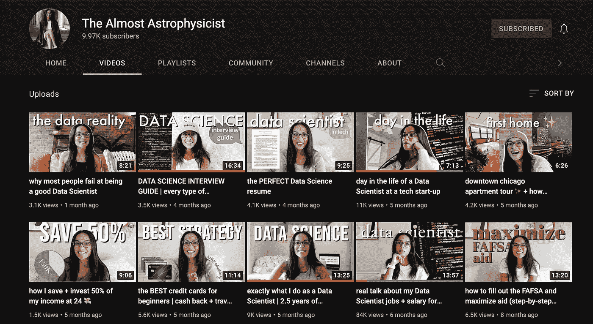
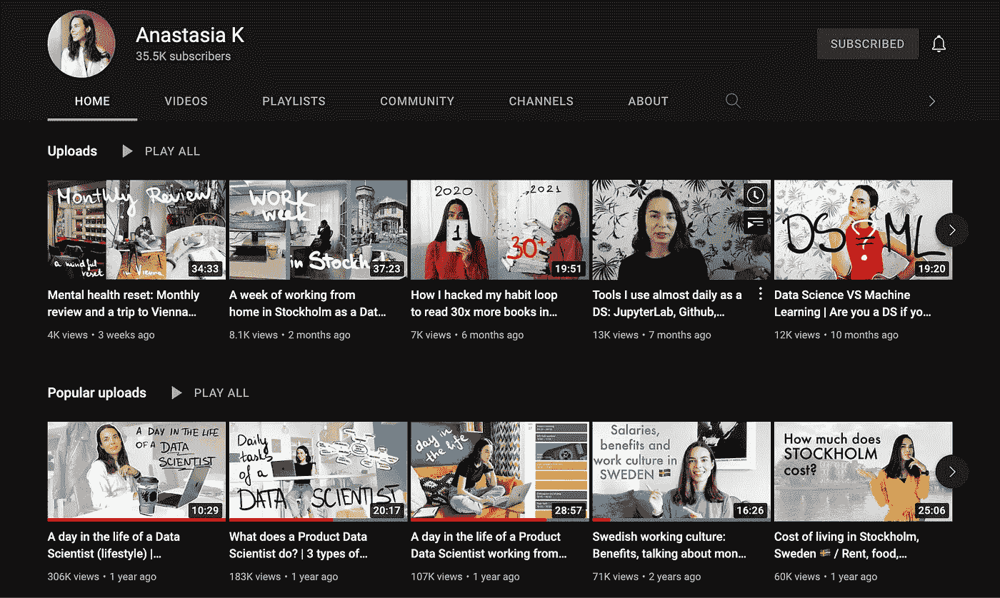
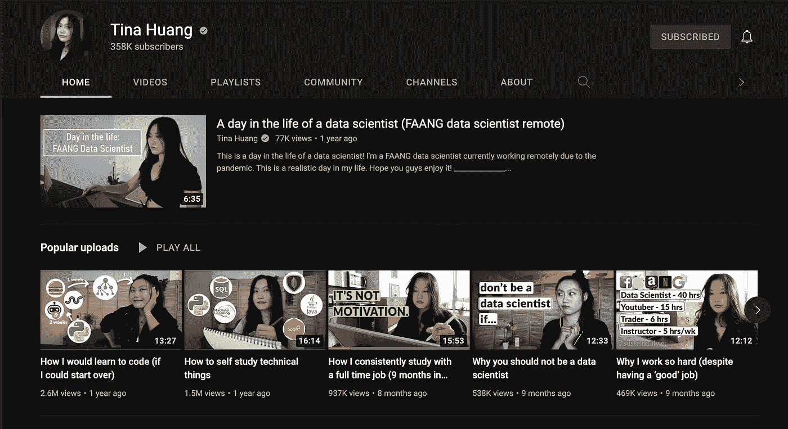
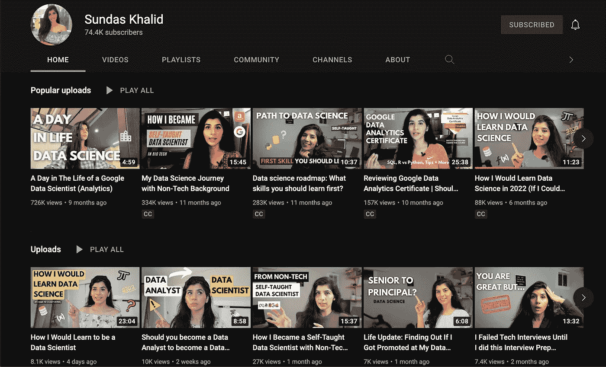
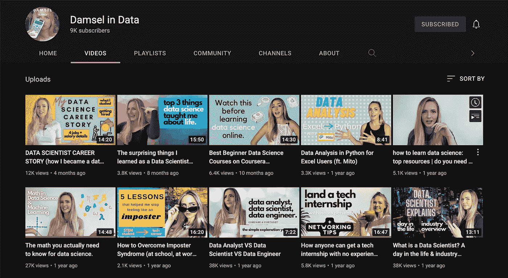
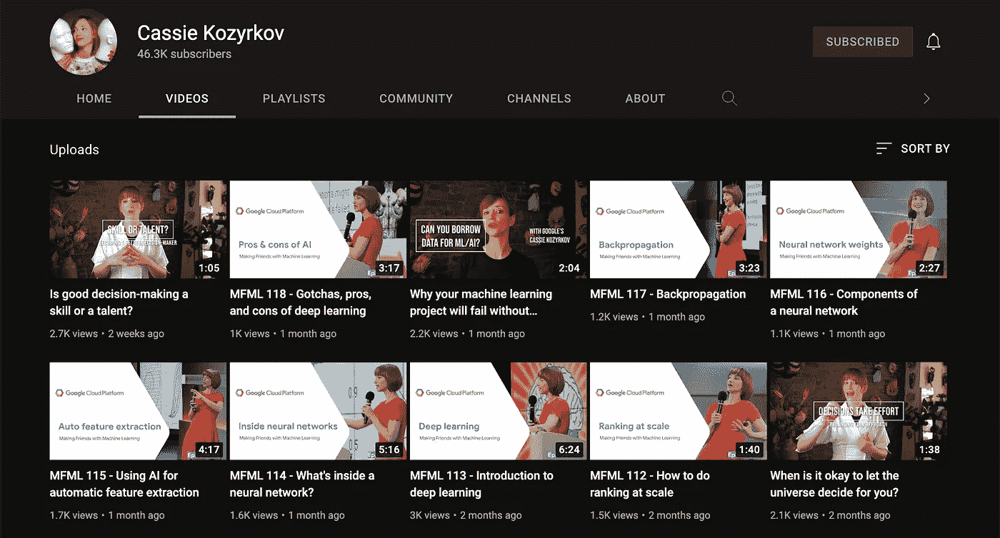

# 值得关注的 6 大女性数据科学 YouTubers

> 原文：<https://towardsdatascience.com/top-6-female-data-science-youtubers-to-watch-a3e921075bfa>

## 这里有一些在数据科学领域工作的最优秀的 YouTubers 用户，可以了解更多关于科技行业和数据科学职业道路的信息

照片由[耶稣爱奥斯丁](https://unsplash.com/@jesuslovesaustin?utm_source=medium&utm_medium=referral)在 [Unsplash](https://unsplash.com?utm_source=medium&utm_medium=referral)

虽然全国大约 55%的大学毕业生是女性，但只有 2/3 的人从事 STEM 相关领域的职业。根据 WEF、[《全球性别差距报告》](https://www.weforum.org/reports/global-gender-gap-report-2021/)和 [BCG Research](https://www.bcg.com/publications/2020/what-keeps-women-out-data-science) 的各种调查，所有数据科学专业人士中只有 15%到 22%是女性。一个突出的原因是学习环境和社会信仰体系，尤其是从高中开始，会影响妇女的进步和职业选择。

作为一名计划追求数据科学的女性，意识到这些社会偏见，我有一个强烈的理由为什么喜欢记录和分享她们在 STEM 领域的经验的女性。它不仅展示了在这一领域取得成功的可能性，而且在追求 STEM 事业的整个过程中为女性提供了支持和动力。

这里列出了我最喜欢的 6 个数据科学 YouTubers，我发现自己作为一名学习数据科学的本科生经常回去看。他们都回答了关于数据科学领域的最常见问题，并提供了关于他们在工作中执行的任务和角色的信息。

## 1.[差点成为天体物理学家](https://www.youtube.com/c/TheAlmostAstrophysicist)

图片作者，主页[几乎天体物理学家](https://www.youtube.com/c/TheAlmostAstrophysicist)

Priya 毕业于 UChicago 大学，获得物理学学位，目前在一家被优步收购的科技初创公司工作。她在自己的频道上制作了许多教育视频，谈论大学指南、物理学、生活方式以及她目前作为数据科学家的经历。她有一个名为“[数据生活✨”的播放列表💻](https://www.youtube.com/playlist?list=PL2S5_naMvyzk81Os7MCNXkyRQ4yIE9_-d)“她讲述了自己的经历、技术角色/项目细节以及数据科学的面试流程。

## 2.阿纳斯塔西娅 K

图片由作者提供，[安娜斯塔西娅 K](https://www.youtube.com/c/AnastasiaKVL) 的主页

Anastasia 是 Spotify 的数据科学家，在瑞典工作，她制作的视频大多是关于生活方式、数据科学和技术的。你可以期待看到许多作为数据科学家的日常视频，统计数据，作为数据科学家利用你的工具，她成为数据科学家的故事，以及这个角色由什么组成。她的视频非常有助于了解数据科学家的日常生活，所以你肯定会更了解会发生什么。

## 3.[蒂娜·黄](https://www.youtube.com/c/TinaHuang1)

图片作者，[主页蒂娜黄](https://www.youtube.com/c/TinaHuang1)

Tina 是 FAANG 的一名数据科学家，她制作关于技术、职业、生产力和生活方式的视频。她讲述了她在 FAANG 担任数据科学家的经历，以及她是如何获得数据科学家职位的。她的生产力和自学视频通常与学习成为数据科学家密切相关，也适用于其他职业。虽然她最近辞去了在 FAANG 的工作，但她正在制作更多关于如何学习和成为数据科学家的视频，所以这些技术细节肯定会在你的旅程中帮助你，因为数据科学的一部分是自学和不断学习新事物。

## 4.[巽他斯·哈立德](https://www.youtube.com/c/SundasKhalid)

图片由作者提供， [Sundas Khalid](https://www.youtube.com/c/SundasKhalid) 主页

Sundas 是一名自学成才的数据科学家，在 FAANG 工作。她的所有视频都围绕着数据科学、技术和职业建议。她讲述了自己自学数据科学的过程，包括商业学位背景、技术面试以及你需要了解的关于数据科学的一切。Sundas 也有一个 Instagram 账户，她在那里定期分享职业、金融和数据科学方面的技巧，它是 STEM 中许多女性聚集和联系的一个伟大社区。

## 5.[数据中的大坝](https://www.youtube.com/channel/UCenqe6Cvfd47aHAOb9Qe8yA/videos)

作者图片，数据中[少女的主页](https://www.youtube.com/channel/UCenqe6Cvfd47aHAOb9Qe8yA/videos)

Data 中的 Damsel 以幽默、有趣的方式讲述了她的数据科学职业故事、数据科学采访以及您需要了解的关于数据科学的一切。她还制作视频，介绍有助于你成为数据科学家的资源以及数据科学行业本身。Data 中的 Damsel 也有一个 Instagram 账户，在那里她制作了许多与数据科学和在科技行业工作有关的有趣、精彩和信息丰富的卷轴。

## 6.[卡西·科济尔科夫](https://www.youtube.com/c/Kozyrkov/videos)

作者图片，[凯西·科济尔科夫](https://www.youtube.com/c/Kozyrkov/videos)主页

凯西是谷歌的首席决策科学家。她不是专门研究数据科学的 YouTuber 用户，但她制作了关于统计概念和机器学习的视频，这两者对数据科学都非常重要。她是一个彻底的讲师，让机器学习概念从根本上容易理解。看了她的视频后，我更加喜欢上了统计学，当我纠结于机器学习相关概念时，她是我的灵感和指导来源。

希望这些对你搜索数据科学家 YouTubers 有帮助！

如果你想了解更多关于我的信息，点击 [**这里**](https://l.instagram.com/?u=https%3A%2F%2Flinktr.ee%2Fsameehaafr&e=ATPxYJOFuWbp7VQ1Th0PGQ2R7F_mrmxHv9pvhe00LOBN_3375QqP1XIcY6y-fUukjzUWPZkS7KJlGFmI3p8FU1k&s=1) 随时连接！

🫶🏽