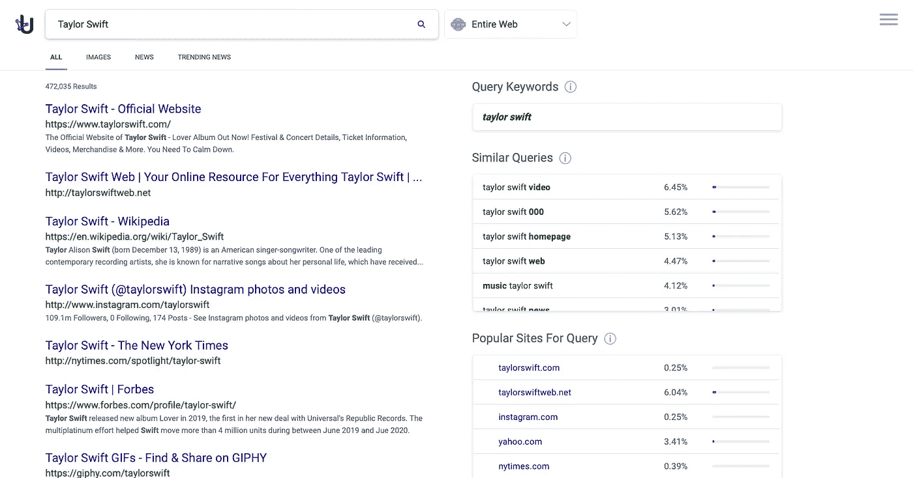
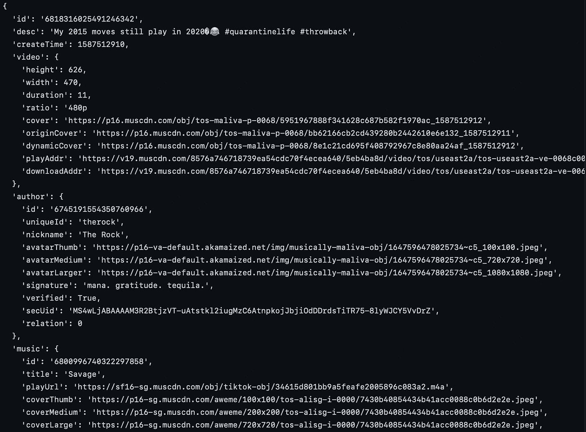
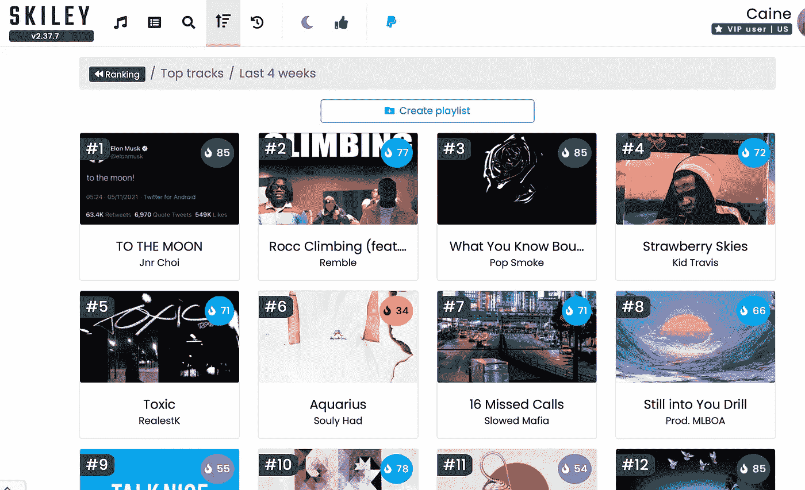

# 将包含在您的下一个项目中的 7 大隐藏 API 宝石

> 原文：<https://towardsdatascience.com/top-7-hidden-api-gems-to-include-in-your-next-project-548e66c34ff9>

## 你可能从来没有听说过这些

[JSON Server Kitty](https://commons.wikimedia.org/wiki/File:Use_JSON_server_kitty.jpg) 来自维基共享| [知识共享](https://en.wikipedia.org/wiki/en:Creative_Commons) [归因 2.0 通用](https://creativecommons.org/licenses/by/2.0/deed.en)

# 介绍

我们程序员有一种重新发明轮子的倾向。重新发明轮子能好玩吗？是的。它能教会你有价值的技能吗？是的。你应该总是写几千行代码来解决已经解决的问题吗？不要！

**通过利用其他程序员编写的数十亿行代码来帮助你完成你的代码目标，来增强你自己的能力**。

想要生成随机图像吗？请，请不要创建另一个网络服务器来处理随机的图像请求。用[一个](https://picsum.photos)代替几十个随机的镜像服务器。

查询随机的维基百科页面？不需要复杂的网页抓取，[这个](https://www.mediawiki.org/wiki/API:Main_page) API 已经覆盖了你。

这里有一些你应该在下一个项目中包含的最有趣、最有趣、最有用的 API。

# 1 —使用 arch🔎

这是 API 所能获得的最接近“谷歌搜索”的结果。usearch API 使用人工智能来检索查询的搜索结果。例如，你可以查询短语“泰勒·斯威夫特”,得到类似谷歌的关于泰勒·斯威夫特的链接页面。

usearch api 检索的屏幕截图。我再也不用谷歌网络抓取了！

你可以试试这里的。

# 2 —临时邮件📫

无论是处理垃圾邮件，免费试用，还是其他事情，我们都使用过临时电子邮件。这个 API 为您提供了一个接口来实现这一点，但是是以编程方式实现的。Tempmail 可以为您生成一个临时电子邮件地址列表。

在你的下一个项目中尝试 [tempmail](https://temp-mail.org/en/) 。

# 3 —谷歌地图🏫

尽管谷歌的 API 被广泛使用，但 places API 似乎有点过时了。Places 返回关于“机构、地理位置和主要兴趣点”的信息例如，我将 [Places Search](https://developers.google.com/maps/documentation/places/web-service/search) API 用于一个 web 抓取项目，用户可以输入类似 Google 的搜索查询(例如“哈佛广场的餐馆”、“旧金山的技术公司”)，我的程序会向每个匹配搜索查询的企业发送赞助请求电子邮件。

使用[地点 API](https://developers.google.com/maps/documentation/places/web-service/overview) 探索世界

# 3 —坎耶休息 API ✨

> “我讨厌在飞机上醒来时身边有一个水瓶，就好像哦，太好了，现在我得为这个水瓶负责”
> - Kanye Rest

返回一个随机的 Kanye 引用。

用 [Kanye Rest API](https://kanye.rest) 构建你的感知 Kanye 人工智能

# 4-非官方的抖音 API💃🏻

作为一个自称为 TikToker 的人，我喜欢这个易于使用、基于 python 的 API。这个 API 可以用来获取视频元数据、作者信息、音乐、浏览量、标签等等。

这就是抖音 API 返回的信息类型！想象一下可能性。

用这个 [API](https://github.com/davidteather/TikTok-Api) 实现你成为一名吉他手的梦想。

# 5 —科诺尔·🪙

Coinlore 是一个加密货币 API，它返回股票信息(例如价格、百分比变化、市值等。)数千种加密货币，包括比特币。我最喜欢的部分是，它还会返回硬币的社交状态，例如其 subreddit 上的活跃用户数或其 twitter 页面上的关注者数。关于 Coinlore 最好的部分——不需要 API 键。

用[硬币](https://www.coinlore.com/cryptocurrency-data-api?ref=apilist.fun)成为比特币百万富翁。

# 6 —中等 API📓

Medium API 可以提供关于任何用户配置文件的信息，并允许您以编程方式将帖子发布到您的配置文件。这有点令人失望，因为除此之外你做不了什么，但是这对于搜集中等用户的信息来说是很棒的！对于查询文章本身来说，定期的网络搜集是个不错的选择。

在这里找到更多关于媒体 API [的信息。](https://github.com/Medium/medium-api-docs)

# 6—img lip😎

Imgflip 是终极记忆工具。使用 imgflip，您可以为一个流行的迷因提供一个模板 ID 和一个标题，然后 imgflip 将返回一个到生成的迷因的链接。你还可以在互联网上找到许多标题最多的(也就是最受欢迎的)迷因。

用 imgflip API 生成的 Meme。

用[img slip](https://imgflip.com/api)制作你的下一个迷因

# 7 — Spotify API🎵

有了 Spotify API，你可以获得你最喜欢的艺术家、专辑和曲目的所有信息。您还可以访问用户相关数据，如他们的音乐库和播放列表中的歌曲。除了有很好的文档记录之外，这个 API 真的很容易使用，而且显然是经过深思熟虑的。用这个 API 你可以创造出无限的可能性！

截图来自[Skiley.net](https://skiley.net/)，一个使用 Spotify API 追踪你的 Spotify 统计数据的网站。

点击此处了解 Spotify API [的更多信息。](https://developer.spotify.com/documentation/web-api/)

这只是我用过的一些最酷、最有趣、最有用、最全面的 API 的汇编。我希望你喜欢这篇文章。

感谢阅读！

# 进一步阅读

 [## 不要只是学习编码。相反，要学会制造酷的东西。

### 遵循这个路线图，从零开始学习构建自己的应用程序、网站和程序。

medium.com](https://medium.com/geekculture/dont-just-learn-to-code-learn-to-build-cool-stuff-instead-7d0783d51655)  [## 你的朋友(可能)比你的朋友多。

### 这个悖论背后的数学可以帮助我们预测下一个疫情。

towardsdatascience.com](/your-friends-probably-have-more-friends-than-you-b44ffcb5280)