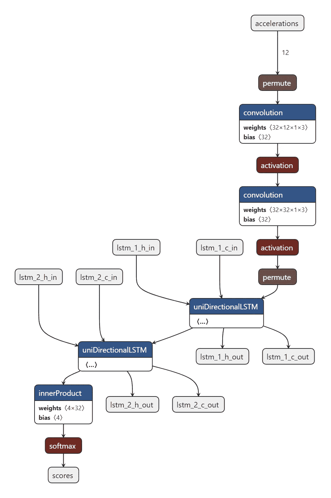
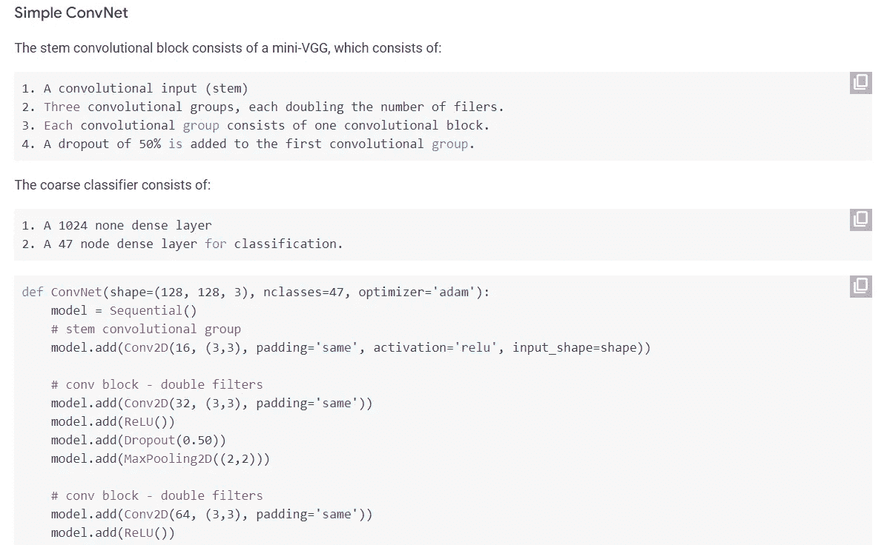
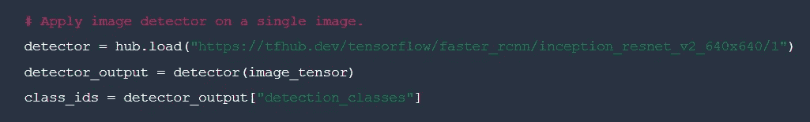

# 我希望早点知道的 7 大机器学习资源

> 原文：<https://towardsdatascience.com/top-7-machine-learning-resources-i-wish-i-knew-earlier-89f4b8d3364c>

## 不是教材，只是有用的网站

马库斯·斯皮斯克在 [Unsplash](https://unsplash.com/?utm_source=unsplash&utm_medium=referral&utm_content=creditCopyText) 上的照片

我学习数据科学和机器学习已经两年多了，在那段时间里我被动地收集了很多有用的资源。你知道它实际上是如何发生的——你正在阅读一本书或观看一门课程，作者引起了你的注意(或只是简单提及)一些你以前没有听说过的东西。这可以是一切:编程语言、技术、数据集、任务、度量、基准、可视化工具，真的是一切。你把它保存起来，以便以后弄明白，然后永远忘记它。

我试着不忘记，并探索这些资源，现在我向你展示我的前 7 个。它们根据用途分成几类，第一类是有趣的东西，最后一类是最有用的:

*   趣味性
*   去哪里找模特？
*   如何开始阅读研究论文

这些不是学习资源(如书籍或课程)。这些材料可以让你的生活变得更简单，或者帮助你从稍微不同的角度看待机器学习世界。

# 趣味性

首先，让我们来看三个适合拥有**任何数据科学和机器学习知识水平的人**的资源。这些只是有趣的东西，熟悉它们可能会让你开心，同时也会给你带来一些好处。

## 虚假相关

你还认为相关性意味着依赖吗？这个网站是劝阻你不要这样做的最简单的方法——而且必须这样做:统计不是 ds 和 ML 中的最后一笔交易。它包含了 15 个高度相关的案例，但是，这些案例之间并不存在因果关系。

掉进泳池淹死的人数和尼古拉斯凯奇出演的电影数量？嗯，相关性只有 66%，看起来像是巧合。缅因州的离婚率和人造黄油的消费呢？99%?什么…

 [## 15 件相互关联的疯狂事情

### 为什么这些事情相互关联？这 15 个相关性会让你大吃一惊。(这个标题够煽情吗……

www.tylervigen.com](https://www.tylervigen.com/spurious-correlations) 

## Netron

Netron 是探索神经网络架构最简单、最方便的方法之一。我在[之前的一篇文章](/predicting-the-number-of-dislikes-on-youtube-videos-part-2-model-aa981a69a8b2)里讲过。不用多说，它会生成以下类型的可视化:

神经网络架构。由 [Netron](https://netron.app/) 可视化

神经网络越来越大，越来越难可视化。然而，在你的 ML 旅程的开始，从内部看架构*或者理解 ResNet152 到底有多大是很有趣的。Netron 给你这个机会。*

这些可视化效果令人愉快且具有交互性——您可以更详细地查看每个结构，甚至可以下载特定层的权重。在这里探究上面[的例子。](https://netron.app/?url=https://raw.githubusercontent.com/Lausbert/Exermote/master/ExermoteInference/ExermoteCoreML/ExermoteCoreML/Model/Exermote.mlmodel)

Netron 支持 TensorFlow 和 Keras，并对 PyTorch 提供实验支持。要了解更多信息，请访问 GitHub 官方回购。

 [## Netron

### Netron 是神经网络、深度学习和机器学习模型的查看器。

netron.app](https://netron.app/) 

## **神经网络操场由 TensorFlow**

本节的最后一个资源也不会让有机器学习经验的人感到惊讶。然而，对于那些刚刚开始发现深度学习的人来说，这个交互式游乐场将有助于更好地理解神经网络的功能原理。

了解单层神经网络的局限性(以及如何添加额外的层来克服这些局限性)，尝试不同的学习速率、数据形状和激活函数，以便获得关于什么是神经网络以及它如何工作的直观想法。

 [## 张量流-神经网络游乐场

### 这是一种构建从数据中学习的计算机程序的技术。它非常松散地基于我们如何思考…

playground.tensorflow.org](http://playground.tensorflow.org/) 

# 去哪里找模特？

你已经认识到什么是机器学习，了解神经网络或 SVM 是如何训练的，并且知道 L1 正则化与 L2 正则化有何不同。

接下来的步骤(可能的步骤之一)是**，看看模型能够做什么**，以及它们现在正在解决什么任务。当然，你现在从新闻中学到了很多，但是从内部看到架构，亲手运行它，并且如果实现是开源的，弄脏你的手，看到它与所有其他模型具有*相同的层和参数，这要有用得多。*

以下三个资源将帮助您解决这个问题。

## 人工智能中心

[来自谷歌的 AI Hub](https://aihub.cloud.google.com/u/0/)是你可以开始的第一个地方。在这里，您可以找到数据集、预训练模型等等。但是也许这种资源的主要优势是**大量的 Google Colab 笔记本**，它们展示了一些模型的功能或训练过程。

*来自 AI Hub 的随机笔记本示例。* [*大众网页*](https://aihub.cloud.google.com/p/products%2F3449d2b3-bc85-4519-9d2b-27a85cb7928a) 截图

因为笔记本是交互式的、简单的，并且通常不包含很多代码，所以这是开始不害怕另一个人写的代码的好方法。

 [## 人工智能中心

### 人工智能中心:一切人工智能的地方

aihub.cloud.google.com](https://aihub.cloud.google.com/u/0/) 

## **TensorFlow Hub**

[TensorFlow Hub](https://www.tensorflow.org/hub) 适合你如果你在用 TensorFlow(令人惊讶)。如果你正在使用 Keras，也许这是一个深入神经网络，切换到 TF 并尝试实现定制模型或层的好机会。

该网站包含大量易于运行的预训练模型。

*使用 TensorFlow Hub 运行预训练模型。* [*大众网页*](https://tfhub.dev/tensorflow/faster_rcnn/inception_resnet_v2_640x640/1) 截图

只有通过微调这些模型，你将能够在许多任务上获得非常好的结果。还要注意[教程选项卡](https://www.tensorflow.org/hub/tutorials)，这里通常会提供一个模型链接，提供更详细的描述和解释。

 [## 张量流集线器

### TensorFlow Hub 是一个经过训练的机器学习模型库，可随时进行微调，并可部署在任何地方。重复使用…

www.tensorflow.org](https://www.tensorflow.org/hub) 

## 拥抱脸

最后，[抱抱脸](https://huggingface.co/)。它是最强大的资源，包含了我认为最大数量的模型，同时，拥有最好的工具来熟悉这些模型。

拥抱脸主要是一组变形金刚或类似变形金刚的模型，它们主要是为解决各种 NLP 任务而设计的。然而，该网站为各个领域的其他任务提供了模型和数据集——从计算机视觉到强化学习。但正如我们所知，变形金刚的主要成功是在 NLP 中实现的，通常就在这里你可以找到一个最先进的**(SOTA)模型，它以最高的质量解决了一个特定的任务。**

**但是让这个网站特别有价值的是社区和在浏览器中直接发布我们模型的演示的能力。现代神经网络可以做很多事情，如果不是所有事情的话。你想[把不同的音乐派对分开吗](https://huggingface.co/spaces/akhaliq/demucs)？不客气。[从图像中移除背景](https://huggingface.co/spaces/eugenesiow/remove-bg)？不客气。[用甘](https://huggingface.co/spaces/hysts/DualStyleGAN)把你的照片变成你喜欢的动漫或漫画的英雄？不客气。没有什么需要下载，一切都是绝对免费的。**

****

**巴拉克·奥巴马和嗝嗝可怕的阿道克三世肖像风格转换的结果。照片由[国会图书馆](https://unsplash.com/@libraryofcongress?utm_source=unsplash&utm_medium=referral&utm_content=creditCopyText)在 [Unsplash](https://unsplash.com/s/photos/president?utm_source=unsplash&utm_medium=referral&utm_content=creditCopyText) 上拍摄，使用 [DualStyleGAN](https://github.com/williamyang1991/DualStyleGAN) 处理**

**这对任何人来说都是最好的资源之一，即使是非机器学习的人，我也很高兴与您分享。**

** [## 拥抱脸-人工智能社区建设未来。

### 训练世界上最大的开源多语言语言模型🌸BigScience 的 176B 参数模型正在训练…

huggingface.co](https://huggingface.co/) 

# 如何开始阅读研究论文

本文的最后一部分是最重要的。这是“如何开始阅读 ML 研究文章”这个问题的答案。。如果我有什么要说的，我肯定会写一篇单独的文章。但是

> 开始阅读研究论文的最好方法是开始阅读研究论文。

这听起来很傻，但是把这个短语再读几遍，一切就会井井有条了。其实很多问题都可以这样回答。学习编程最好的方法是编程，学习骑自行车最好的方法是骑车，阅读研究论文最好的方法是阅读研究论文。

当然，我不会只给你这个愚蠢的建议。这个网站会帮你解决这个问题，它叫做[论文，代码为](https://paperswithcode.com/)。出于某种原因，我很晚才发现这件事，好像每个人都在瞒着我，所以我才和你分享。

 [## 带代码的论文——机器学习的最新进展

### 带代码的论文突出了机器学习研究的趋势和实现它的代码。

paperswithcode.com](https://paperswithcode.com/) 

直观的界面，对数据集和任务的广泛搜索能力，以及看到最佳模型的机会——这个网站对任何 ML 人员来说都是一个真正的发现。

仅此而已。但是等等。我给你看了两类六种资源，但说到最重要的，我只有一种？是的，没错。那是因为**够了**(不用我你大概也知道 [arXiv](https://arxiv.org/) )。剩下的就看你的了。这个网站有很多值得一提的地方，但是你最好自己去发现它。

如果你认为研究论文只针对精英，那么这是不正确的。如果你第一次不明白某件事，感到困惑或者你只是感到无聊——这没关系，没有人一开始就明白。如果你以前从未读过这些文章，请关注这篇令人敬畏的 NVIDIA 博客文章，它可以帮助你很多:

 [## 如何阅读研究论文:面向 ML 从业者的实用方法| NVIDIA 技术博客

### 数据科学家或者机器学习专家有必要看研究论文吗？简单的回答是肯定的。还有…

developer.nvidia.com](https://developer.nvidia.com/blog/how-to-read-research-papers-a-pragmatic-approach-for-ml-practitioners/) 

# 摘要

就是这样！祝你探索这些资源好运，如果你知道更多，请在评论中分享。最后，让我以更简洁的方式再次列举所有内容:

1.  趣味性

*   [虚假关联](https://www.tylervigen.com/spurious-correlations):获得为什么关联不是依赖的直观解释；
*   Netron :可视化神经网络架构；
*   [神经网络游乐场](http://playground.tensorflow.org/):直接在你的浏览器里玩密集的神经网络。

2.去哪里找模特？

*   在 [AI 轮毂](https://aihub.cloud.google.com/u/0/)、 [TensorFlow 轮毂](https://www.tensorflow.org/hub)和[抱紧面](https://huggingface.co/)。

3.如何开始阅读研究论文

*   从 [NVIDIA 博客文章](https://developer.nvidia.com/blog/how-to-read-research-papers-a-pragmatic-approach-for-ml-practitioners/)开始
*   阅读代码为的 [arXiv](https://arxiv.org/) 和[论文。](https://paperswithcode.com/)

# 感谢您的阅读！

*   我希望这些材料对你有用。[在 Medium 上关注我](https://medium.com/@andimid)以获得更多类似的文章。
*   如果您有任何问题或意见，我将很高兴得到任何反馈。在评论中问我，或者通过 [LinkedIn](https://www.linkedin.com/in/andimid/) 或 [Twitter](https://twitter.com/dimid_ml) 联系。
*   为了支持我作为一名作家，并获得数以千计的其他媒体文章，使用[我的推荐链接](https://medium.com/@andimid/membership)获得媒体会员资格(不收取额外费用)。**