# 在 R 中制作漂亮表格的 7 大软件包

> 原文：<https://towardsdatascience.com/top-7-packages-for-making-beautiful-tables-in-r-7683d054e541>

## 了解如何用 R 包构建有吸引力的数据表


在 [Unsplash](https://unsplash.com/s/photos/colored-pencils?utm_source=unsplash&utm_medium=referral&utm_content=creditCopyText) 上由 [Mahbod Akhzami](https://unsplash.com/@mahbodakhzami?utm_source=unsplash&utm_medium=referral&utm_content=creditCopyText) 拍摄的照片

# 介绍

在数据科学中，开发有意义的可视化是一项重要而又具有挑战性的任务。在正确选择工具的同时，对目标受众和分析目标的总体理解也是任何数据分析所期望的。在相同的上下文中，表是组织和总结任何可用数据集的强大而有效的方式，尤其是包含分类变量的数据集。表格通常与支持数据可视化一起在报告中使用，以有效地传达数据分析的结果。通过一些相关的叙述性文本，表格可以精确地共享分析结果，以便在组织中进行决策。虽然 R 中的数据可视化本身是一个巨大的主题，因为有几个健壮且易于使用的绘图库，但 R 中的表格也是如此。 [CRAN](https://cran.r-project.org/) 网站为 R 用户提供了许多开源包。这些包不仅可以创建表格，还可以将基本表格转换成漂亮的表格，有效地传达分析结果。

在本文中，我们将讨论在 r 中构建彩色表格的七个有趣的包。

# 用 R 语言制作漂亮数据表的包

几个 R 包提供了创建结构良好的表的特性。这里有几个软件包，我们将使用它们来创建漂亮的表格。

1.  **gt(许可证:** [**麻省理工**](https://gt.rstudio.com/LICENSE.html) **)**

gt 包提供了一组不同的、易于使用的函数，帮助我们从表格数据中构建显示表。gt 理念指出，桌子零件的综合集合可用于创建各种功能桌子。它们是表体、表尾、扳手列标签、列标签和表头。以下是 gt 包架构的图示:

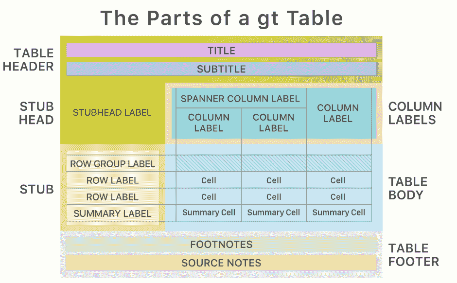

[图像来源](https://gt.rstudio.com/reference/figures/gt_parts_of_a_table.svg)

gt 目前支持的输出格式有 HTML、LaTeX 和 RTF。你可以在这里找到更多关于 gt [的信息](https://cran.r-project.org/web/packages/gt/index.html)。要从 CRAN 安装 gt 包，请使用以下命令:

```
install.packages(“gt”)
```

要从 GitHub 安装 gt 的开发版本，请使用以下命令:

```
devtools::install_github(“rstudio/gt”)
```

接下来，我们将导入 gt 库包。

```
library(gt)
```

让我们从 r 的预装数据集中选取 [**mtcars**](https://search.r-project.org/R/refmans/datasets/html/mtcars.html) 数据集。该数据集是从《美国汽车趋势》杂志(1974 年)中提取的，由 32 辆汽车(1973 年和 1974 年款)的燃油消耗信息以及汽车设计和性能的 10 个属性组成。我们可以使用以下命令打印“mtcars”数据集的前几行:

```
head(mtcars)
```

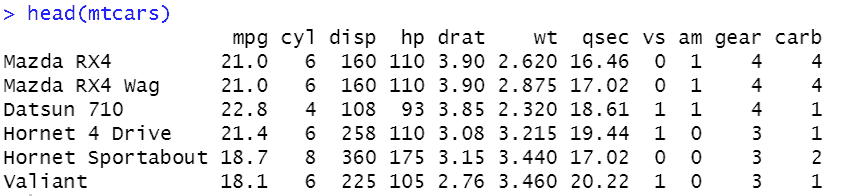

作者图片

接下来，我们使用来自数据集 mtcars 的前几个列和行创建一个新的数据帧 df。

我们将用新创建的数据帧“df”调用主函数“gt”如果您使用 RStudio 或其他 R GUI，该表将出现在您的默认浏览器或查看器面板上。

```
df %>%gt()
```

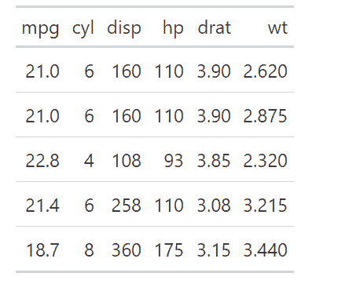

作者图片

我们创建的表是一个简单的表，因为使用的格式属性是默认属性。表格的默认外观可以通过使用`tab_style()`函数来改变，通过这个函数我们可以定位特定的单元格并对它们应用样式。

```
df %>%gt() %>%
tab_header(title = “mtcars dataset”) %>%
tab_style(
style = list(cell_fill(color = “#b2f7ef”),
cell_text(weight = “bold”)),
locations = cells_body(columns = mpg))%>%
tab_style(
style = list(cell_fill(color = “#ffefb5”),
cell_text(weight = “bold”)), 
locations = cells_body(columns = hp))
```


作者图片

**2。formattable(许可证:MIT +文件** [**许可证**](https://cran.r-project.org/web/packages/formattable/LICENSE) **):**

可格式化数据框是将使用格式化程序函数在 HTML 表格中显示的数据框。这个包包括产生具有预定义格式规则的数据结构的技术，这样对象保持原始数据但被格式化。该软件包由几个标准的可格式化对象组成，包括百分比、逗号、货币、会计和科学。你可以在这里找到更多关于 formattable [的信息。](https://renkun-ken.github.io/formattable/)

要从 CRAN 安装 formattable 软件包，请使用以下命令:

```
install.packages(“formattable”)
```

要从 GitHub 安装 formattable 的开发版本，请使用以下命令:

```
devtools::install_github(“renkun-ken/formattable”)
```

接下来，我们将导入 formattable 库包。

```
library(formattable)
```

为了演示这个库，我们将使用内置函数`color_bar()`来比较给定数据列中值的大小。

```
formattable(df, list(
hp = color_bar(“#e9c46a”),
cyl = color_bar(“#80ed99”),
wt = color_bar(“#48cae4”),
disp = color_bar(“#f28482”)))
```

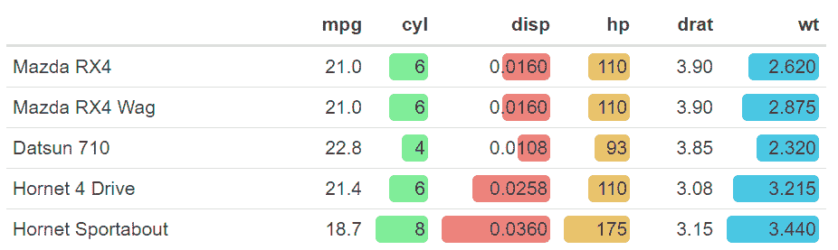

作者图片

**3。kableExtra(许可证:MIT +文件** [**许可证**](https://cran.r-project.org/web/packages/kableExtra/LICENSE) **)**

kableExtra 包用于扩展`knitr::kable tables()`的基本功能。虽然`knitr::kable()`的设计很简单，但它缺少许多其他包中通常有的功能，kableExtra 很好地填补了`knitr::kable().`的空白。关于 kableExtra 最好的事情是它的大多数表格功能都适用于 HTML 和 PDF 格式。你可以在这里找到更多关于 kableExtra [的信息](https://cran.r-project.org/web/packages/kableExtra/vignettes/awesome_table_in_html.html)。

要从 CRAN 安装 kableExtra 包，请使用以下命令:

```
install.packages(“kableExtra”)
```

要从 GitHub 安装 kableExtra 的开发版本，请使用以下命令:

```
remotes::install_github(“haozhu233/kableExtra”)
```

接下来，我们将导入 kableExtra 库包。

```
library(kableExtra)
```

我们将使用数据帧“df”调用 kbl 函数来查看该表的基本版本。

```
kable(df) %>% kable_styling(latex_options = “striped”)
```

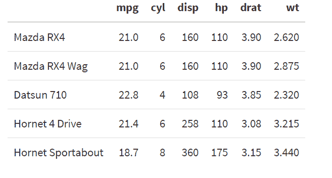

作者图片

要样式化单独的行和列，我们可以使用函数 `row_spec()`和`column_spec()`。

```
df %>% kbl() %>%
kable_paper() %>% column_spec(2, color = “white”,
background = spec_color(mtcars$drat[1:2],end = 0.7)) %>%
column_spec(5, color = “white”,
background = spec_color(mtcars$drat[1:6], end = 0.7),
popover = paste(“am:”, mtcars$am[1:6]))
```

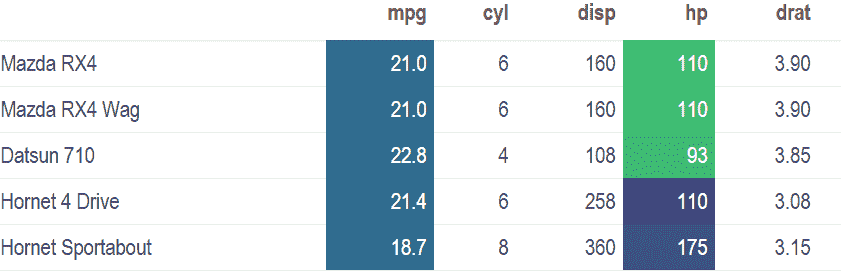

作者图片

**4。dt(许可证:**[**GPL-3**](https://cran.r-project.org/web/packages/DT/LICENSE)**)**

dt 是“数据表”的缩写。R 中的数据对象可以使用 JavaScript 库“数据表”呈现为 HTML 表格(通常通过 R Markdown 或 Shiny)。你可以在这里找到更多关于 dt [的信息](https://cran.r-project.org/web/packages/DT/index.html)。

要从 CRAN 安装 dt 包，请使用以下命令:

```
install.packages(‘DT’)
```

要从 GitHub 安装 dt 的开发版本，请使用以下命令:

```
remotes::install_github(‘rstudio/DT’)
```

接下来，我们将导入 dt 库包。

```
library(DT)
```

DT 包的主要特性是它能够为 HTML 表提供过滤、分页和排序。通过使用这个包，我们可以切片、滚动和排列表格，以便更好地理解表格内容。

```
datatable(
data = mtcars,
caption = “Table”,
filter = “top”
)
```

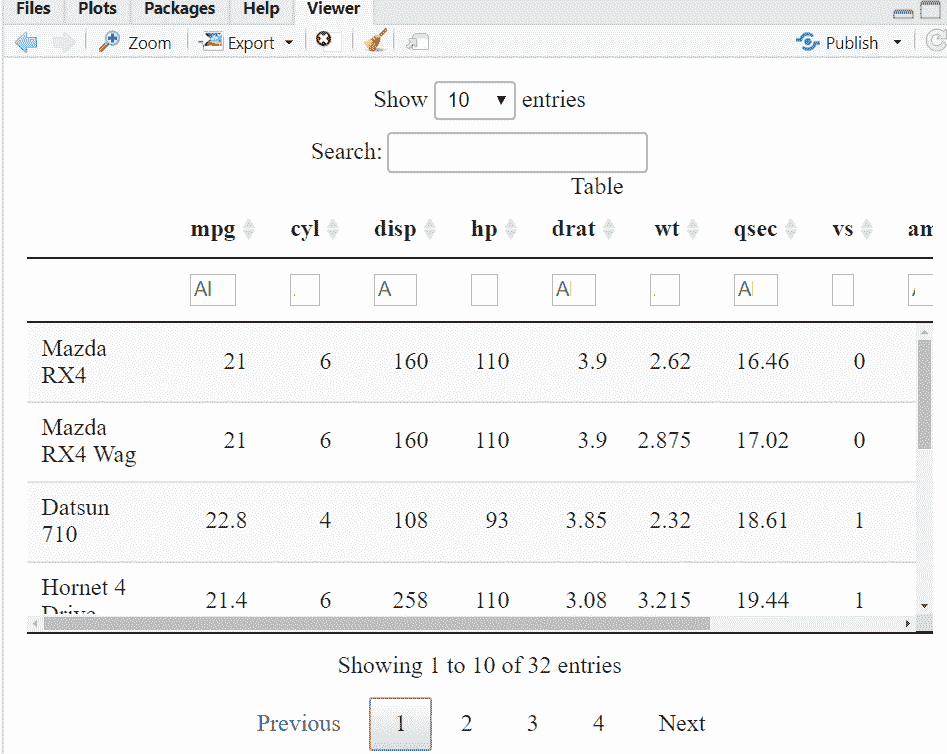

作者图片

**5。flextable(许可证:**[**GPL-3**](https://cran.r-project.org/web/packages/flextable/index.html)**)**

flextable 包帮助您轻松地从数据框架创建报表。您可以合并单元格、添加页眉、添加页脚、更改格式以及设置单元格中数据的显示方式。表格内容也可以包含混合类型的文本和图像内容。表格可以从 R Markdown 文档嵌入到 HTML、PDF、Word 和 PowerPoint 文档中，也可以使用 Package Officer for Microsoft Word 或 PowerPoint 文档嵌入。表格也可以导出为 R 图或图形文件，例如 png、pdf 和 jpeg。点击可以了解更多关于 flextable [的信息。](https://cran.r-project.org/web/packages/flextable/index.html)

要从 CRAN 安装 flextable 包，请使用以下命令:

```
install.packages(“flextable”)
```

要从 GitHub 安装 flextable 的开发版本，请使用以下命令:

```
devtools::install_github(“davidgohel/flextable”)
```

接下来，我们将导入 flextable 库包。

```
library(flextable)
```

对于这个库，主要的函数是 flextable。我们将调用`flextable`函数来查看表格的基本版本，如下所示:

```
flextable(df)
```

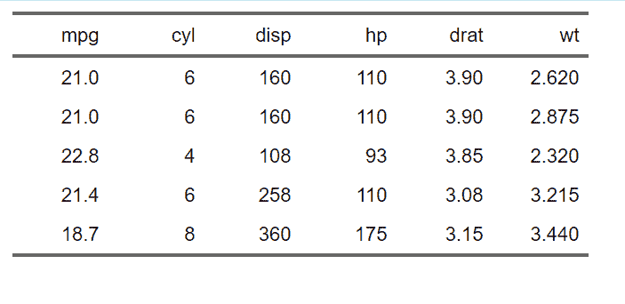

作者图片

我们将使用`set_flextable_defaults`函数来改变表格的默认外观。

```
set_flextable_defaults(
font.family = “Arial”, font.size = 10,
border.color = “#e5383b”,
padding = 6,
background.color = “#EFEFEF”)
flextable(head(df)) %>%
bold(part = “header”)
```

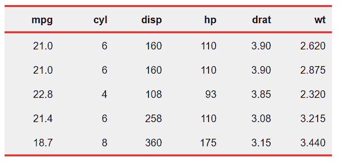

作者图片

**6。reactable(许可证:MIT +文件** [**许可证**](https://cran.r-project.org/web/packages/reactable/LICENSE) **)**

`reactable()`从表格数据创建数据表，默认带有排序和分页。数据表是一个 HTML 小部件，可以在 R Markdown 文档和闪亮的应用程序中使用，或者从 R 控制台查看。它基于 React 表库，用 reactR 制作。[有很多特点可以反应](https://cran.r-project.org/web/packages/reactable/index.html)；其中一些列举如下:

*   它创建一个带有排序、过滤和分页的数据表
*   它有内置的列格式
*   它支持通过 R 或 JavaScript 定制渲染
*   它可以在 R Markdown 文档和闪亮的应用程序中无缝工作

从起重机安装可反应包时，使用以下命令:

```
install.packages(“reactable”)
```

要从 GitHub 安装 reactable 的开发版本，请使用以下命令:

```
# install.packages(“devtools”)
devtools::install_github(“glin/reactable”)
```

接下来，我们将导入 reactable 库包。

```
library(reactable)
```

我们将使用`reactable()`函数创建一个数据表。默认情况下，该表是可排序和分页的:

```
reactable(mtcars)
```

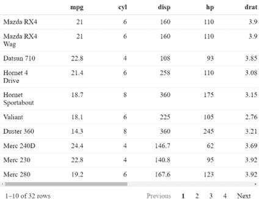

作者图片

为了改变表格的默认外观，我们将使用`reactableTheme()`函数。如果希望为所有表设置默认主题，也可以使用全局 reactable.theme 选项。

```
library(reactable)
reactable(mtcars)
options(reactable.theme = reactableTheme(
color = “black”,
backgroundColor = “#bde0fe”,
borderColor = “#a3b18a”,
stripedColor = “#a3b18a”,
highlightColor = “#2b2d42”
))
```

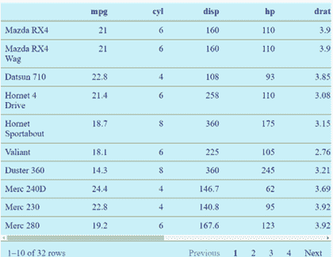

作者图片

**7。reactablefmtr(许可证:MIT +文件** [**许可证**](https://cran.r-project.org/web/packages/reactablefmtr/LICENSE) **)**

[reactablefmtr](https://kcuilla.github.io/reactablefmtr/index.html) 包改进了使用 reactable R 库创建的表格的外观和格式。reactablefmtr 包包括许多条件格式器，这些格式器高度可定制且易于使用。

从 CRAN 安装**reactable fmtr**包时，使用以下命令:****

```
**install.packages(“reactablefmtr”)**
```

****要从 GitHub 安装 reactablefmtr 的开发版本，请使用以下命令:****

```
**remotes::[install_github](https://remotes.r-lib.org/reference/install_github.html)(“kcuilla/reactablefmtr”)**
```

****R 中的 reactable 包允许您创建交互式数据表。然而，在 reactable 内部格式化表需要大量的代码，这对许多 R 用户来说可能是一个挑战，需要更好的可伸缩性。reactablefmtr 库中的`data_bars()`函数使得创建条形图变得更加容易。****

```
**library(reactablefmtr)
reactable(data,defaultColDef = colDef(
cell = data_bars(data,text_position = “outside-base”)
))**
```

****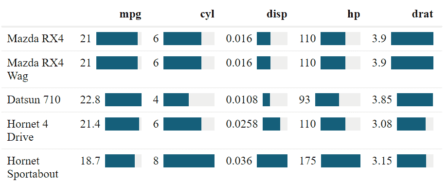****

****作者图片****

****有几种方法可以改变`data_bars()`的外观，包括条对齐、文本标签位置以及向条添加图标和图像的能力。****

```
**library(reactablefmtr)
reactable(data,defaultColDef = colDef(cell = data_bars(df, box_shadow = TRUE, round_edges = TRUE,
text_position = “outside-base”,
fill_color = c(“#e81cff”, “#40c9ff”),
background = “#e5e5e5”,fill_gradient = TRUE)
))**
```

****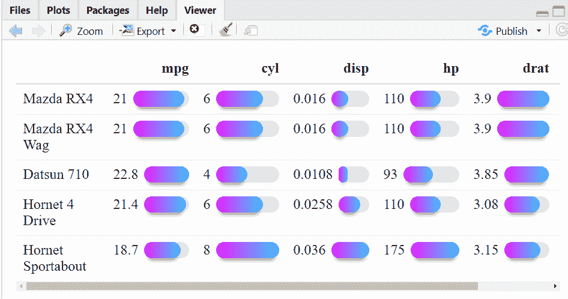****

****作者图片****

******结论******

****在本文中，我们讨论了七个强大的 R 包来为给定的数据集创建漂亮的表。还有更多的 R 库，事实上将来还会开发一些新的 R 库。但是本教程可以帮助那些希望用 r 创建更漂亮、更有效的表的人开始使用这些包。****

****你可以关注我: [GitHub](https://github.com/Devashree21) ， [Kaggle](https://www.kaggle.com/devsubhash) ， [Twitter](https://twitter.com/Dev_Subhash21) 和 [LinkedIn](https://www.linkedin.com/in/devashree-madhugiri/) 。****