# 清理原始数据的 8 大 SQL 函数

> 原文：<https://towardsdatascience.com/top-8-sql-functions-to-clean-raw-data-2b6141de06a>

# 清理原始数据的 8 大 SQL 函数

## 因为垃圾数据进来意味着垃圾数据出去。


[安东](https://unsplash.com/@uniqueton?utm_source=unsplash&utm_medium=referral&utm_content=creditCopyText)在 [Unsplash](https://unsplash.com/s/photos/cleaning?utm_source=unsplash&utm_medium=referral&utm_content=creditCopyText) 上拍照

在一个完美的世界里，我们的数据从一开始就是干净的。不会有丢失的值。列将被转换为正确的类型。我们将能够执行聚合并在模型中使用数据，而无需做任何工作。

不幸的是，原始数据可能非常混乱。如果在模型中使用数据之前，您从未需要对数据进行大量转换，那么您应该感到幸运。每个分析工程师都知道，为我们的分析师提供干净的数据是我们工作的一个关键部分。

混乱的数据输入意味着混乱的数据输出。您的数据模型的有效性和简洁程度取决于您加载到其中的数据。

在本文中，我将简要介绍如何使用 Airbyte 轻松地从业务 API 中提取原始数据，并将它们接收到数据仓库中。然后，我将展示从 Google Sheets 提取原始数据到数据仓库时一些常见的数据质量问题。最后，我将向您介绍一些流行的 SQL 字符串函数来清理这些数据，并准备好供您的分析师使用。

# 将原始数据从 Google Sheets 加载到雪花

在转换原始数据之前，我们需要使用 Airbyte 提供的 100 个[连接器中的一个来接收数据。确保你按照指示](https://docs.airbyte.io/integrations)[在本地设置 Airbyte】并创建你的第一个数据连接器。](https://docs.airbyte.com/quickstart/deploy-airbyte)

您还需要设置目的地，或者您希望将数据加载到的仓库。Airbyte 在这里有关于如何做这个[的详细说明。](https://docs.airbyte.io/quickstart/add-a-destination)

当将数据加载到目的地时，您会注意到选择“基本规范化”的选项。通过选择此项，您将允许 Airbyte 创建适合您的数据及其目的地的模式和表。如果不选择规范化，您的数据将以 JSON blob 的形式作为一列上传。JSON blob 只需要在我们这边做进一步的转换。让我们接受帮助，让 Airbyte 让我们的工作变得更容易！

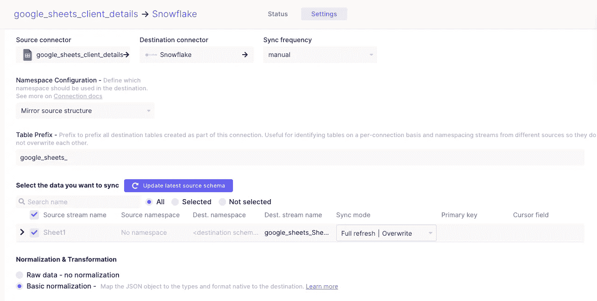

作者图片

值得注意的是，这个模式及其表将始终作为原始数据存在，由 Airbyte 直接接收。我们不会将我们的转换直接应用于这些表，而是将它们写在 SQL 文件中，用 dbt 运行。我们将在下一篇文章中详细介绍如何设置 dbt 源文件和基本模型。

现在，要知道你总是希望有一个数据库只是为了原始数据。这样，如果您需要更改您的转换，您可以这样做，而不必从 Airbyte 源连接器重新吸收数据。

正如 Airbyte 的文件中所写的，

> “ELT 理念的一个核心原则是，数据在 E 和 L 阶段移动时应该保持不变，以便原始数据始终可以访问。”

在建立数据仓库时，请记住这一点。您应该有两个独立的数据库，一个用于原始数据，一个用于转换后的数据。

# 转换和清理原始数据

在本教程中，我从 Google Sheet 向 Snowflake 获取数据。你可以在 [Google Sheets source 文档](https://docs.airbyte.com/integrations/sources/google-sheets)和 [Snowflake destination 文档](https://docs.airbyte.com/integrations/destinations/snowflake)中找到更多关于设置 Airbyte 数据连接器的信息。

虽然 Google sheets 不是自动化和跟踪数据的最佳方式，但它们被经常使用。当你在一家小公司工作时，有时这是你必须跟踪不同信息的唯一解决方案，如营销预算、有影响力的联系人或产品成本。

也就是说，来自 Google sheets 的数据是最难处理的数据之一。与 Shopify 和脸书等其他应用程序不同，这里没有检查。Google sheets 容易出现大量人为错误。我曾多次遇到有人以错误的格式填写值，导致我们整个数据管道中断的情况。

这里有一个加载到雪花的 Google Sheets 数据集的例子，我将在本教程中使用:

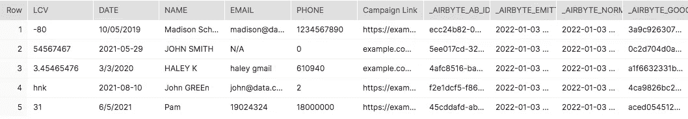

作者图片

让我们看看我们在原始数据中看到的一些常见场景，以及我们如何将它们转换成可以在模型中使用的数据。内置的 SQL 字符串函数帮助您清理来自原始数据的字符串，以便在数据仓库中查询它们。

# 重命名列

清理任何数据时，您要做的第一件事是将列名更改为对您的分析最有意义的名称。在这里， **date** 是一个跨表使用的常见关键字，所以您会希望将其更改为更具描述性。

此外，我们希望将列名**活动链接**更改为没有空格或大写字母的名称。这将使我们的分析顺利。列名中的空格可能会导致将来的查询出现问题。我推荐使用大小写，或者单词间的下划线。您可以使用`AS`语句轻松地重命名表列。

```
select
  LCV AS lifetime_value,
  date AS activation_date,
  name,
  email,
  phone,
  "Campaign Link" AS campaign_link
from AIRBYTE_DATABASE.AIRBYTE_SCHEMA.GOOGLE_SHEETS_CUSTOMER_DETAILS;
```

太棒了，现在我们可以轻松地在转换中使用这些列了！

# 将一列拆分为多列

让我们从查看 **customer_name** 列开始。如您所见，它包含了名和姓。我们希望使用该列创建两个单独的列，**名字**和**姓氏**。

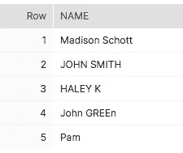

作者图片

这就是`split_part()`字符串函数派上用场的地方。我们指定要拆分的列、要拆分的字符，以及要将字符串放在该字符的右边还是左边。

1 将给出空间左边的字符串，而-1 将给出空间右边的字符串。

```
select
  split_part(name, ' ', 1) AS first_name,
  split_part(name, ' ', -1)    AS last_name
from AIRBYTE_DATABASE.AIRBYTE_SCHEMA.GOOGLE_SHEETS_CUSTOMER_DETAILS;
```

我们现在有两个单独的列，一个用于客户的名，一个用于客户的姓。

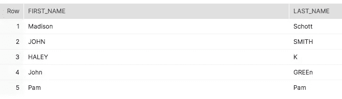

作者图片

# 改变案例

现在，注意仍然有一些大写问题。为了便于分析，所有字符串都小写是有意义的。这样，在过滤或比较值时，您就不必担心字符串会成为问题。

我们可以通过使用`lower()`字符串函数来做到这一点。

```
select
  lower(split_part(name, ' ', 1)) AS first_name,
  lower(split_part(name, ' ', -1)) AS last_name
from AIRBYTE_DATABASE.AIRBYTE_SCHEMA.GOOGLE_CUSTOMER_DETAILS;
```

该查询会产生以下结果:

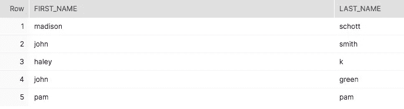

作者图片

现在我们的**名字**和**姓氏**列都是小写的。

# 从字符串中提取值

再来看看 **campaign_link** 栏目。本专栏遵循从 Google 或 Bing 广告生成的典型链接的结构。这在市场营销中屡见不鲜，提取起来可能有点痛苦。

像这样从 URL 中提取字符串的关键是识别模式。在某些情况下，同一列中会有一些不同的模式。幸运的是，在这里，它是统一的。

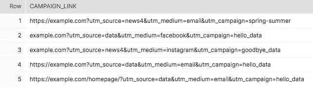

作者图片

我们可以看到 **utm_source** 总是在 a 之后？而在一个&之前。 **utm_medium** 跟在此&之后，在另一个&之前。最后， **utm_campaign** 跟在最后一个&后面。我们需要使用`split_part()`函数编写一些 SQL 代码，该函数使用这种模式提取每个值。

```
select
  split_part(split_part("Campaign Link", 'utm_source=', -1), '&', 1) AS utm_source,
  split_part(split_part("Campaign Link", 'utm_medium=', -1), '&', 1) AS utm_medium,
  split_part(split_part("Campaign Link", 'utm_campaign=', -1), '&', 1) AS utm_campaign
from AIRBYTE_DATABASE.AIRBYTE_SCHEMA.GOOGLE_CUSTOMER_DETAILS;
```

当我们使用前面提到的相同的`split_part()`字符串函数时，我们可以从包围它们的字符之间提取源、媒介和活动字符串。我们使用内部的`split_part()`函数提取每个=右边的值，然后使用另一个函数提取下一个字符左边的值。

这会产生三个新列:

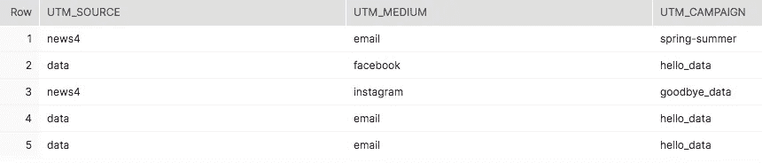

作者图片

现在，原始活动链接的每个部分都有单独的列。

# 设置列条件

再来看 **lifetime_value** 一栏。我们知道该列必须包含数值，而不包含文本。然而，有一栏输入了随机的字母。为了进一步清理这个列，我们需要首先删除这个字符串值。

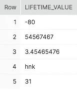

作者图片

Snowflake SQL dialect 有一个名为`[TRY_TO_NUMBER()](https://docs.snowflake.com/en/sql-reference/functions/try_to_decimal.html)`的方便的字符串函数，如果值是数字，它将值转换为数字，如果不是，则返回空值。

```
SELECT
 try_to_number(lifetime_value)
FROM AIRBYTE_DATABASE.AIRBYTE_SCHEMA.GOOGLE_SHEETS_CUSTOMER_DETAILS
```

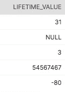

作者图片

注意这个 SQL 函数是如何消除原始值中的小数位的。因此，我们只想在 case 语句中使用它来检查空值。

```
select
    case 
        when try_to_number(lifetime_value) is NULL then NULL else lifetime_value
    end as lifetime_value 
from AIRBYTE_DATABASE.AIRBYTE_SCHEMA.GOOGLE_SHEETS_CUSTOMER_DETAILS;
```

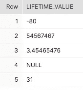

作者图片

我们还可以看到小数的格式不统一，有些是负数。为了清理数据，我们不希望该列中有任何负值。相反，我们希望用 0 代替负数。

我们可以使用`iff()`函数来测试一个列中的条件。首先，指定条件。然后，如果它是 false，它将返回指定的第一个值。如果为 true，将返回指定的第二个值。

```
select
    case 
        when try_to_number(LCV) is NULL then NULL else IFF(LCV<0, 0, ROUND(LCV,2))
    end as lifetime_value 
from
AIRBYTE_DATABASE.AIRBYTE_SCHEMA.GOOGLE_SHEETS_CUSTOMER_DETAILS;
```

在这里，我测试一下 **lifetime_value** 是否小于 0。如果是，函数将返回 0。如果不是，我就使用`round()`函数将数值四舍五入到两位小数。这个函数非常适合舍入货币值或任何小数。指定要舍入的列，然后指定小数位数。

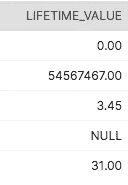

作者图片

# 检查长度

再来看**电话**栏目。我们可以看到其中一些电话号码实际上根本不是电话号码。我们希望最大限度地减少不准确数据的数量，所以让我们看看是否可以向该列添加一个条件。

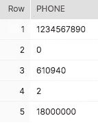

作者图片

我们知道电话号码最多只能是 11 位，如果不包括国家代码，可能是 10 位。为了限制表中虚假数据的数量，让我们删除所有没有 10 位或 11 位数字的电话号码。更好的办法是，在不满足这个条件的情况下，让列值为 NULL。

```
SELECT
  IFF(len(phone) IN (10, 11), phone, null) AS phone
from AIRBYTE_DATABASE.AIRBYTE_SCHEMA.GOOGLE_SHEETS_CUSTOMER_DETAILS;
```

这里我再次使用一个`IFF()`函数来检查列中的值是否满足某个条件。我使用`len()`函数来检查列值中的字符。如果电话号码不是 10 或 11 个字符，我们将用空值替换它。

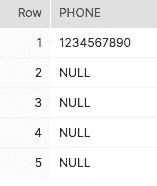

作者图片

现在，我们只有一个电话号码，但至少我们知道它是准确的！干净数据比脏数据好，即使脏数据更少。质量重于数量。

# 检查字符

与电话号码一样，我们希望确保**电子邮件**列包含准确的电子邮件地址。我们可以进行一些检查来确保这些信息的准确性。其中之一是确保这些值包含@字符，这是所有电子邮件都有的字符。

我们可以通过使用 charindex()字符串函数来实现这一点。这个函数返回指定字符在字符串中的位置。如果字符串中不存在该字符，函数将返回 0。

这里，我们在电子邮件列中搜索@符号。我们使用 case 语句来检查这个函数的结果是否是 0 以外的数字。如果不是 0，它必须包含一个@。如果它是 0，它不是一个正确的电子邮件地址，我们用 null 替换这个值。

```
select
  case
     when charindex('@', email) != 0 then email
     else null
  end AS email
from AIRBYTE_DATABASE.AIRBYTE_SCHEMA.GOOGLE_SHEETS_CUSTOMER_DETAILS;
```

新电子邮件将如下所示:

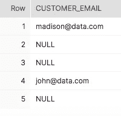

作者图片

类似于**电话**列，**电子邮件**列现在具有空值，而以前的值不满足指定的条件。

# 检查子字符串

除了@符号之外，电子邮件地址必须以“.”结尾。com”。我们可以检查以确保该电子邮件列中的值都以该字符串结尾。如果不是，我们可以用一个空值来代替它。

这里，我们将使用`LIKE`语句来确保它包含这个子串。

```
select
  case
     when email LIKE '%.com' then email
     else null
  end AS email
from AIRBYTE_DATABASE.AIRBYTE_SCHEMA.GOOGLE_SHEETS_CUSTOMER_DETAILS;
```

%符号表示任何字符串都可以出现在“.”之前。com”。但是，既然我们没有一个%的结尾”。该值必须在它之后结束。像麦迪逊这样的价值观。comgmail 不准确，将被 NULL 代替。

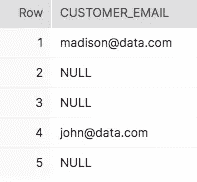

作者图片

因为我们所有的电子邮件都符合这个条件，所以我们得到的表看起来是一样的。

# 铸造日期

将日期输入电子表格有许多不同的方式。我在使用 Google sheets 作为数据源时经常遇到这个问题。每当一个新的人将数据输入到表单中时，列的格式就会改变！如您所见，日期的输入方式不同，有些用斜线，有些用连字符。

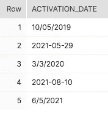

作者图片

幸运的是，有一个 SQL 函数`to_date()`可以将字符串转换成日期。第一次接收数据时，带有日期的列的数据类型为 varchar。使用此函数对它们进行转换会将它们转换为数据类型为 date 的日期，从而使该列为分析做好准备。

```
select 
  to_date(activation_date) AS activation_date 
from AIRBYTE_DATABASE.AIRBYTE_SCHEMA.GOOGLE_SHEETS_CUSTOMER_DETAILS;
```

这将产生一个日期如下所示的列:

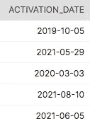

作者图片

# 结论

现在，我们的原始数据已经被清理成我们的数据分析师可以实际使用的数据！这些 SQL 清理函数对于创建可用的数据模型至关重要。你会一遍又一遍地使用它们，所以理解它们是如何工作的很重要。

下面是我们今天学习的 SQL 字符串函数的概述:

*   **split_part()** 按字符分割字符串
*   **lower()** 删除字符串中的所有大写
*   **try_to_number()** 将值转换为数字
*   **iff()** 为测试条件
*   **round()** 将一个数四舍五入到一定的小数位数
*   **len()** 检查字符串的长度
*   **char_index()** 查找字符串中某个字符的索引
*   **to_date()** 将字符串转换为日期

下一步是在 SQL 文件中编写代码，供 dbt 使用和自动化。该代码与 dbt 一起将创建一个自动化系统，在该系统中，当您的分析师需要数据时，您的数据总是干净的和可用的。这就是数据驱动型公司和数据驱动型公司的区别。但是我们将在另一篇文章中讨论这个问题。数据清理快乐！

[通过订阅我的电子邮件列表，了解更多关于 SQL 和分析工程师使用的其他工具的](https://mailchi.mp/e04817c8e57e/learn-analytics-engineering)。