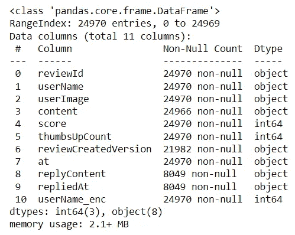
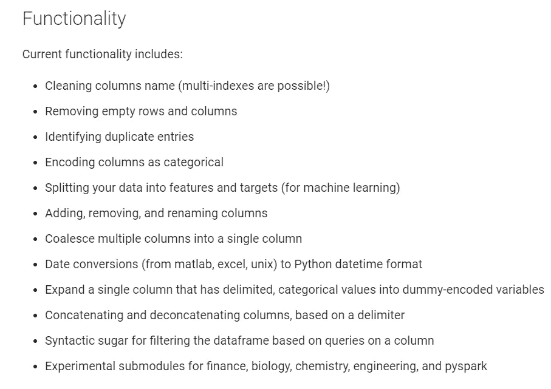
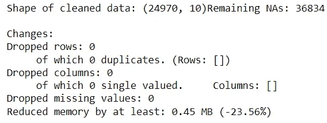
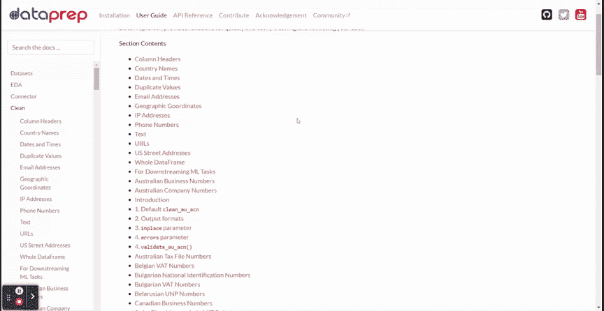
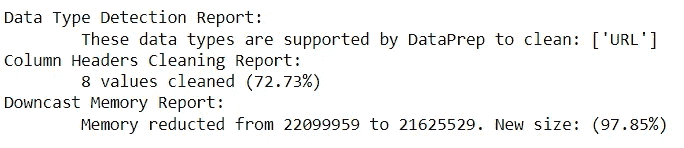
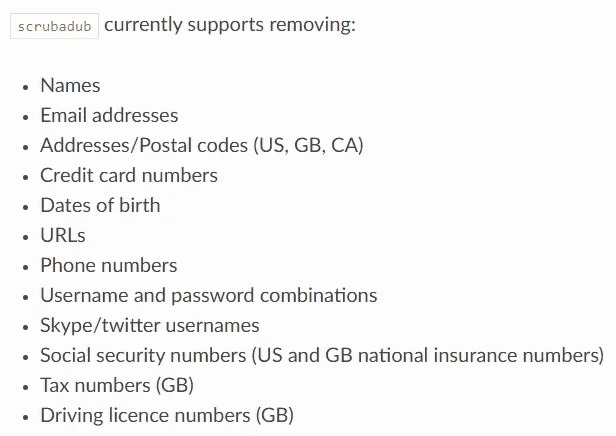
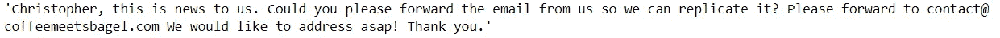
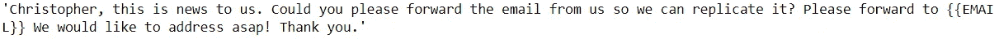
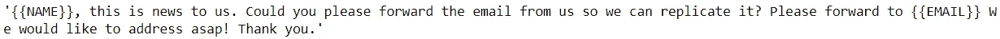

# 顶级数据清理 Python 包

> 原文：<https://towardsdatascience.com/top-data-cleaning-python-packages-e6bde24b273b>

## 使用这些 Python 包轻松清理您的数据


[Towfiqu barbhuiya](https://unsplash.com/@towfiqu999999?utm_source=medium&utm_medium=referral) 在 [Unsplash](https://unsplash.com?utm_source=medium&utm_medium=referral) 上的照片

许多人会认为数据科学工作是开发机器学习模型和评估技术指标的专有工作。虽然没有错，但工作责任要大得多。数据科学家需要从事数据收集、清理、分析、数据理解等工作。

那么，数据科学家在哪个任务上花费的时间最多？根据 [CrowdFlower](https://www.dataversity.net/survey-shows-data-scientists-spend-time-cleaning-data/) 的一项调查，数据科学家 80%的时间都花在[数据清理](/what-is-data-cleaning-how-to-process-data-for-analytics-and-machine-learning-modeling-c2afcf4fbf45)上。这并不奇怪，因为我们的数据科学项目取决于我们的数据有多干净。

但是，有一些方法可以通过使用数据清理包来缩短数据清理处理时间。这些包是什么，它是如何工作的？让我们一起学习。

# 1.py 看门人

[py gateway](https://pyjanitor-devs.github.io/pyjanitor/)是 gateway R 包的一个实现，用于在 Python 环境中用链接方法清理数据。该软件包易于使用，直观的 API 直接连接到 Pandas 软件包。

从历史上看，Pandas 已经提供了很多有用的数据清理功能，比如用`dropna`删除空值，用`to_dummies`进行分类编码。另一方面，py teacher 增强了 Panda 的清理 API 能力，而不是取代它。py guardian 是怎么工作的？让我们试着在我们的数据清理过程中实现 py teacher。

作为一个项目示例，我将使用来自 [Kaggle](https://www.kaggle.com/datasets/shivkumarganesh/coffee-meets-bagel-app-google-play-store-review) 的数据集 Coffee meet Bagel review。

```
import pandas as pd
review = pd.read_csv('data_review.csv')
review.info()
```



我们的数据集中有 11 列包含对象和数字数据。乍一看，有些数据似乎丢失了，列名也不规范。让我们试着用熊猫和 py guardian 清理数据集。

在我们开始之前，我们需要安装 py guardian 包。

```
pip install pyjanitor
```

当你安装完这个包后，我们只需要导入这个包，API 函数就可以通过 Pandas API 立即使用了。让我们用我们的样本数据集来试试 py guardian 包。

```
import janitorjan_review = review.factorize_columns(column_names=["userName"]).expand_column(column_name = 'reviewCreatedVersion').clean_names()
```

在上面的代码示例中，py teacher API 执行了以下操作:

1.  因式分解 userName 列以将分类数据转换为数字数据(`factorize_columns`)，
2.  展开 reviewCreatedVersion 列或一键编码过程(`expand_column`)，
3.  通过将列名转换为小写来清除列名，然后用下划线(`clean_names`)替换所有空格。

以上是我们可以用 py toolter 做的一个示例操作。你还可以用 py guardian 做更多的事情，我将在下面的图片中展示给你看。



作者图片

此外，链式方法还可以与 Panda 的原始 API 一起使用。您可以将两者结合起来实现您想要的干净数据。

# 2.Klib

Klib 是一个用于导入、清理和分析的开源 Python 包。这是一个一站式软件包，用于轻松理解您的数据和预处理。该软件包非常适合使用直观的可视化和易于使用的 API 来评估您的数据。

因为本文只讨论数据清理，所以让我们把重点放在数据清理 API 上。如果您想进一步探索 Klib，您可以查看下面的文章。

[](/speed-up-your-data-cleaning-and-preprocessing-with-klib-97191d320f80) [## 使用 klib 加速您的数据清理和预处理

### 定制和非常容易应用的功能，具有合理的默认值

towardsdatascience.com](/speed-up-your-data-cleaning-and-preprocessing-with-klib-97191d320f80) 

对于数据清理，Klib 依靠`data_cleaning` API 来自动清理数据帧。让我们用数据集例子来试试 API。首先，我们需要安装软件包。

```
pip install klib
```

安装完成后，我们会将数据集传递给`data_cleaning` API。

```
import klib
df_cleaned = klib.data_cleaning(review)
```



作者图片

上面的函数产生了对我们的数据集示例所做的数据清理信息。Klib `data_cleaning`程序遵循当前步骤:

*   列名清理，
*   删除空的和几乎空的列，
*   删除单基数列，
*   删除重复的行，
*   记忆力减退。

# 3.数据准备

[DataPrep](https://dataprep.ai/) 是为数据准备而创建的 Python 包，其主要任务包括:

*   数据探索
*   数据清理
*   数据收集

出于本文的目的，我将重点关注 DataPrep 的数据清理 API。然而，如果您对 DataPrep 包感兴趣，您可以访问我在下面文章中的解释。

[](/clean-connect-and-visualize-interactively-with-dataprep-9c4bcd071ea9) [## 使用 DataPrep 进行交互式清理、连接和可视化

### 适用于您的数据分析过程的一体化软件包

towardsdatascience.com](/clean-connect-and-visualize-interactively-with-dataprep-9c4bcd071ea9) 

DataPrep cleaning 为数据清理和验证提供了 140 多个 API。我将在下面的 GIF 中展示所有可用的 API。



作者 GIF

从上面的 GIF 可以看到，有各种 API 可以使用，比如列标题、国家名称、日期和时间等等。清洁所需的所有 API 都在那里。

如果您不确定要清理什么，您总是可以依赖 DataPrep 的`clean_df` API 自动清理您的数据，并让包推断您需要什么。让我们试试这个 API 来了解更多信息。

首先，我们需要安装 DataPrep 包。

```
pip install dataprep
```

在包安装之后，我们可以在之前的数据集例子中应用`clean_df` API。

```
from dataprep.clean import clean_df
inferred_dtypes, cleaned_df = clean_df(review)
```

API 将有两个输出—推断的数据类型和清理的数据帧。此外，该过程还会生成数据框清理摘要。



作者图片

上面的报告向我们提供了关于处理了哪些数据类型、清理了哪些列标题以及减少了多少内存的信息。如果您认为清理已经足够，则可以在下一步中使用清理后的数据框。如果没有，那么您可以使用可用的清理 API。

# 4.scrubadub

[Scrubadub](https://scrubadub.readthedocs.io/en/latest/index.html) 是一个开源的 Python 包，用于从文本数据中删除个人身份信息。Scrubadub 的工作方式是删除检测到的个人数据，并替换为文本标识符，如{{EMAIL}}或{{NAME}}。

目前，Scrubadub 仅支持删除以下个人数据:



作者图片

让我们尝试用 Scrubadub 清理我们的样本数据集。首先，我们需要安装软件包。

```
pip install scrubadub
```

正如我们在上面的图片中看到的，我们可以使用 Scrubadub 删除各种个人数据，比如姓名和电子邮件地址。让我们使用一个包含姓名和电子邮件个人信息的数据样本。

```
review['replyContent'].loc[24947]
```



作者图片

该数据包含我们想要删除的姓名和电子邮件数据。让我们使用 Scrubadub 来完成它。

```
sample = review['replyContent'].loc[24947]
scrubadub.clean(sample)
```



作者图片

干净数据删除了电子邮件数据，并替换为标识符{{EMAIL}}。但是，我们仍然有识别的名称数据。那么 Scrubadub 怎么能去掉这个名字呢？

为了增强 Scrubadub 名称标识符，我们需要添加来自其他包的[名称检测](https://scrubadub.readthedocs.io/en/latest/names.html)改进。对于这个例子，让我们添加来自 TextBlob 的检测器。

```
scrubber = scrubadub.Scrubber()
scrubber.add_detector(scrubadub.detectors.TextBlobNameDetector)
scrubber.clean(sample)
```



作者图片

现在，我们已经删除了该名称，并替换为{{NAME}}标识符。您可以浏览软件包文档来更好地理解 Scrubadub。

# **结论**

数据清理是数据科学家工作中花费时间最多的过程。为了帮助清理工作，开发了许多用于数据清理的 Python 包。

在本文中，我概述了我的顶级数据清理 Python 包；它们是:

1.  py 看门人
2.  Klib
3.  数据准备
4.  Scrubadub

希望有帮助！

在我的 [**LinkedIn**](https://www.linkedin.com/in/cornellius-yudha-wijaya/) 或 [**Twitter**](https://twitter.com/CornelliusYW) 上访问我。

> *请不要错过我的内容，点击此处订阅我的* ***时事通讯，获取更多关于数据的深入知识，提升您的数据科学事业。***

> *如果您没有订阅为中等会员，请考虑通过* [*我的推荐*](https://cornelliusyudhawijaya.medium.com/membership) *订阅。*