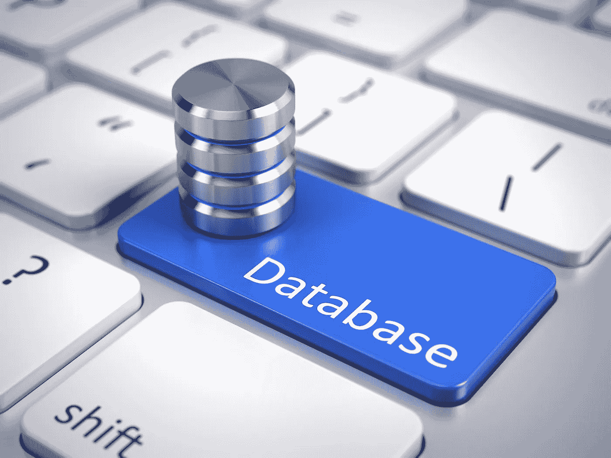
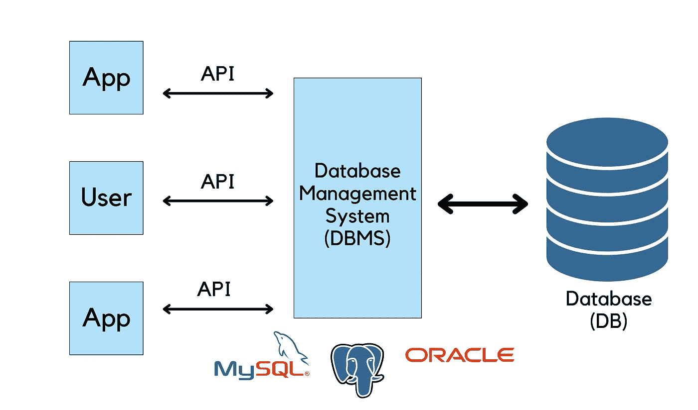
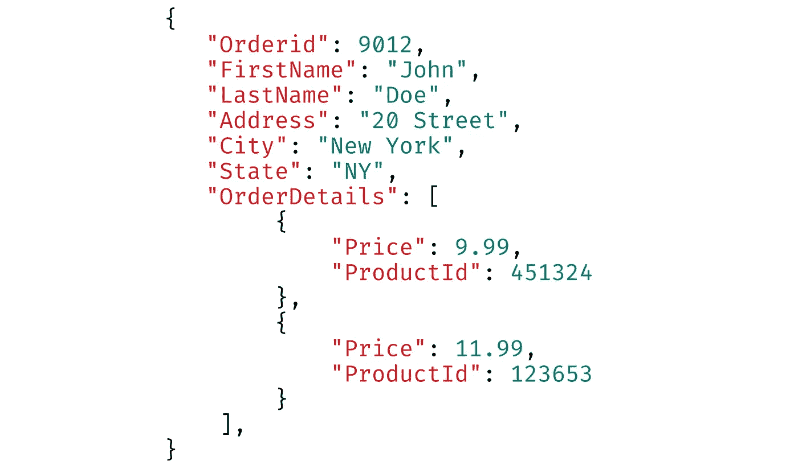
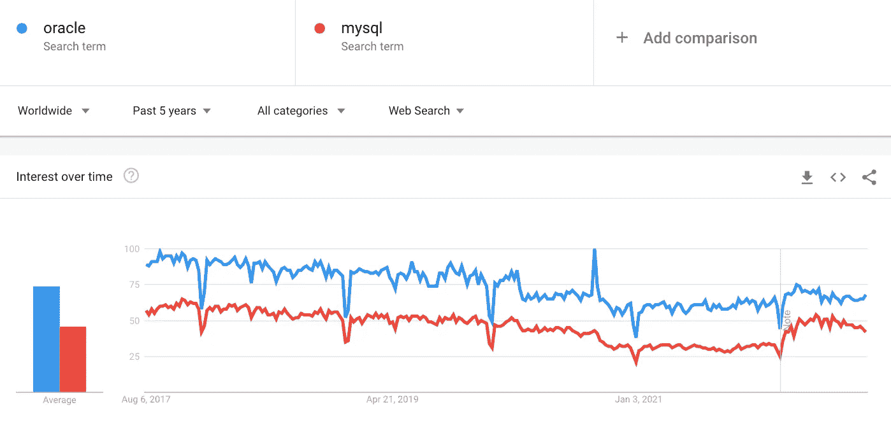
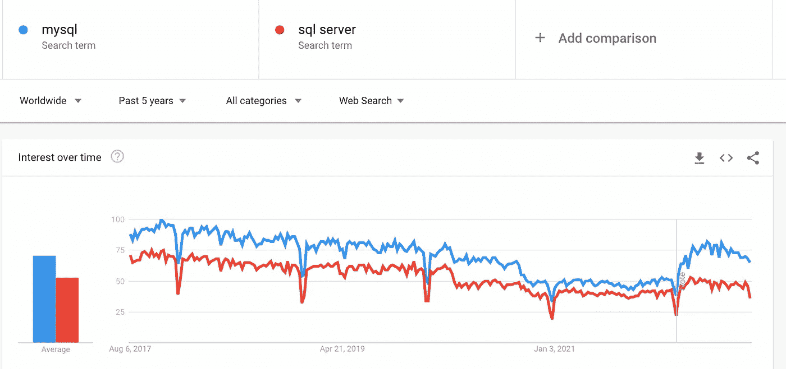
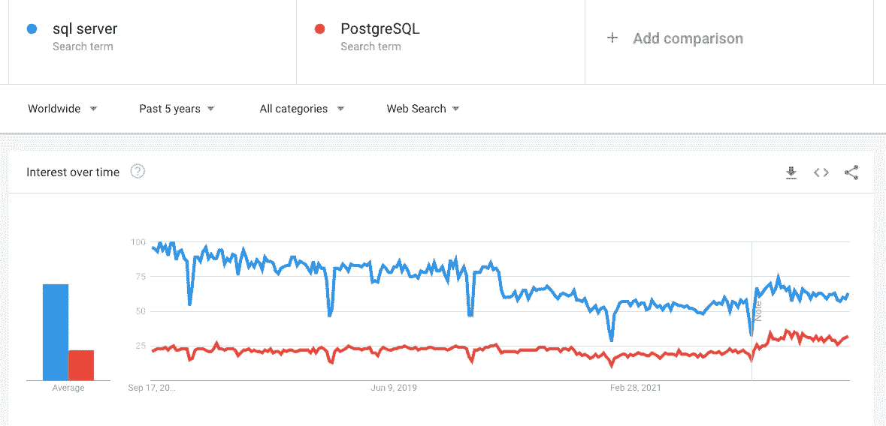
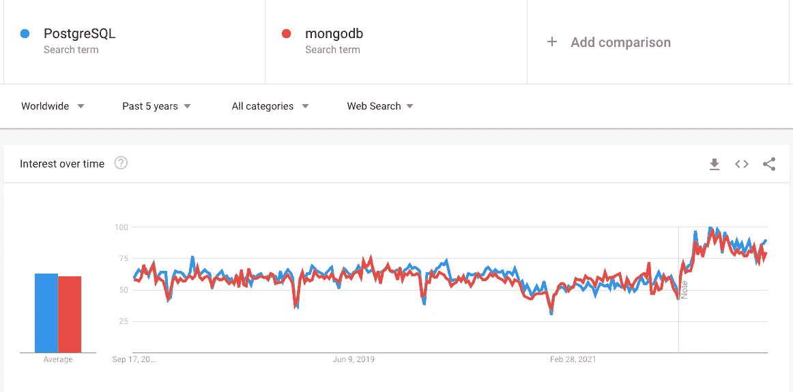

# 2022 年使用的顶级数据库:什么是适合您的用例的数据库？

> 原文：<https://towardsdatascience.com/top-databases-to-use-in-2022-what-is-the-right-database-for-your-use-case-bb8d3f183b21>

## 这里是你需要知道的关于数据库的一切



图片来自 Shutterstock，授权给 Frank Andrade

不管你是做什么工作的，你都可能听说过数据库这个词。

外面的公司使用不同类型的数据库来存储他们多年来收集的所有信息。尽管所有这些数据库可能看起来都一样，但它们有一些功能使它们更适合某些情况，因此值得对它们进行更多的了解。

让我们来看看哪种数据库最适合您的使用情形！为此，我们将了解什么是数据库，什么类型的数据库更适合你，2022 年的顶级数据库是什么，以及它们的优缺点。

```
**Table of Contents** 1\. [What is a Database?](#4272)
2\. [Types of Databases](#2895)
 - [Relational databases](#062a)
 - [Non-Relational databases](#5c9c)
3\. [The top databases in 2022](#ffcb)
 - [Oracle](#6415)
 - [MySQL](#9923)
 - [SQL Server](#a17b)
 - [PostgreSQL](#3ad4)
 - [MongoDB](#6f1e)
```

> **请务必** [**订阅此处**](https://frankandrade.ck.page/f2fbbdc6db) **获取我在所有教程中使用的 SQL 备忘单(免费 PDF)**

# 什么是数据库？

数据库是通常以电子方式存储在计算机系统中并由数据库管理系统(DBMS)控制的数据集合。数据、DBMS 以及与之相关的应用程序被称为数据库系统(或简称为“数据库”)。

数据库管理系统和数据库这两个词经常互换使用，但从技术上讲，它们并不相同。

为了区分它们，考虑一个社交媒体应用程序的情况，该应用程序存储关于其用户的不同信息，如消息、照片、评论等。数据库存储了大量的数据，但这就是它所做的。如果你想编辑、更新或删除数据，你需要一个数据库管理系统为你说话。一些最流行的数据库管理系统是 Oracle、MySQL、SQL Server 和 PostgreSQL。



作者在 Canva 上制作的图像

同样，人们经常把 DBMS 和 DB 简单地称为“数据库”,但是现在你知道这实际上是如何工作的了。

另一种看待数据库的方式是将数据库视为一个包含许多行和列的大电子表格。这是一个很好的比较，但数据库超越了这一点。数据库和电子表格都适合存储信息，但它们主要在以下方面有所不同:

*   数据是如何存储和操作的:数据库允许复杂的数据操作，而电子表格不适合需要大量数据操作的用户。
*   谁可以访问数据:数据库允许多个用户快速访问和查询数据，而电子表格只为单个用户或少数用户设计。
*   可以存储的数据量:数据库被设计用来存储更大的数据集合，而电子表格有一个限制。

最后但同样重要的是，数据库不能只在表和行中存储数据。这就是关系数据库通常的工作方式，但是还有另一种类型的数据库叫做非关系数据库，这就引出了我们的下一点。

# 数据库的类型

数据库通常分为关系数据库和非关系数据库。在前 10 个数据库中，您会看到关系数据库和非关系数据库。一种类型的数据库并不比另一种更好，但是它们适合不同的需求。

## 关系数据库

关系数据库(也称为 SQL 数据库)将数据存储在表和行中，也称为记录。这种类型的数据库通过键链接不同表中的信息。

键是表中的唯一值，也称为“主键”。当这个键被添加到位于另一个表中的记录时，它在第二个表中被称为“外键”。主键和外键之间的这种连接在两个表中的记录之间创建了一种关系。

一些流行的关系数据库管理系统(RDBMS)是 Oracle、MySQL、SQL Server 和 PostgreSQL。

下面是一个基本模式，展示了关系数据库是如何工作的。


来源: [Pixabay](https://pixabay.com/vectors/database-schema-data-tables-schema-1895779/)

为了在 RDBMS 中查询数据，我们使用结构化查询语言(SQL)。使用 SQL，我们可以创建新的记录，更新它们，等等。这使得 RDBMS 适用于需要事务功能、数据挖掘和复杂报告的应用程序。

## 非关系数据库

非关系数据库(也称为 NoSQL 数据库)存储数据时没有表、行或键。换句话说，非关系数据库以非表格形式存储数据。这增加了灵活性，有助于满足所存储数据类型的特定要求。

您可以将非关系数据库视为文档的集合。一个文档可以包含许多关于客户的详细信息。每个客户可以有不同类型的信息，但是它们可以存储在同一个文档中。



作者图片

处理和组织不同类型信息的能力使得非关系数据库比关系数据库更加灵活。

有四种流行的非关系类型:文档数据存储、面向列的数据库、键值存储和图形数据库。最流行的 NoSQL 数据库之一是 MongoDB。

# 2022 年有哪些顶级数据库？

很难根据数据库的功能对其进行排序，因为它们适合不同的需求，并且在某些情况下可能比在其他情况下更方便。也就是说，可以根据数据库管理系统的受欢迎程度对它们进行排序。

事实上， [DB-Engine](https://db-engines.com/en/ranking) 根据 DBMS 当前的流行程度对其进行排名。为此，他们按照不同的[参数](https://db-engines.com/en/ranking_definition)计算分数。

以下是 2022 年最受欢迎的 10 大数据库。

现在让我们更多地了解它们，比较它们，看看它们的优缺点。

# 1.神谕

Oracle 数据库是跨行业广泛使用的 RDBMS。事实上，它在 RDBMS 市场中占有最大的市场份额，约为 30.2%。

Oracle 数据库支持 SQL 语言与数据库交互。它被认为是最好的数据库之一，因为它支持涉及关系、图形、结构化和非结构化信息的所有数据类型。除此之外，Oracle 数据库因其灵活的标准、可伸缩性、高可用性和强大的安全性而成为首选。

## 赞成的意见

*   它与不同的应用程序和平台高度兼容
*   有助于提高可扩展性
*   它提供了良好的隐私和安全性

## 骗局

*   许可证很贵
*   用户可能需要丰富的 SQL 知识才能使用 Oracle 数据库

## 流行

在过去 5 年中，Google Trends 对 Oracle 的兴趣超过了对 MySQL 的兴趣。该图还显示了两个数据库的相同起伏。



来源:谷歌趋势

# 2.关系型数据库

MySQL 是 2022 年最受欢迎的数据库之一。它是开源的，因此任何人或公司都可以免费使用 MySQL，但如果代码需要集成到商业应用程序中，则需要购买许可证。也就是说，对于任何想尝试一个友好而强大的数据库的人来说，这个数据库仍然是值得的。

MySQL 是由 Oracle 开发的，它是一个关系数据库管理系统。如前所述，关系模型包括用行和列来组织表中的数据，而元素之间的关系遵循逻辑结构。脸书、Twitter、维基百科和 YouTube 等公司都使用 MySQL 后端。

## 赞成的意见

*   它是开源的:不像其他选择，你不需要付费就可以使用 MySQL 的大部分特性
*   它是跨平台的:在 Linus、Solaris 和 Windows 上运行，并支持使用 C、C++、Java、Python 等编程语言的平台。
*   可靠的数据安全性:MySQL 是一个安全的数据库管理系统。这也是为什么这么多知名公司在应用中使用它的原因。
*   它很容易使用:任何人都可以在几分钟内下载、安装并开始使用 MySQL。

## 骗局

*   它不适合大数据
*   它不支持 SQL 检查约束
*   与付费数据库相比，它没有一个好的调试工具
*   它处理交易的效率不高

## 流行

Google Trends 显示，在过去 5 年中，对 MySQL 的兴趣略有下降，但与 SQL Server 等其他数据库相比，在 2022 年突然上升。



来源:谷歌趋势

# 3.SQL Server

SQL Server 是由微软开发的，它被认为是适用于内部和云环境的出色的 RDBMS。它有一个数据库引擎组件，允许存储、处理和保护数据。数据库引擎分为两个部分—关系引擎和存储引擎。第一个用于处理命令和查询，而第二个用于管理表、页面、文件、索引和事务等特性。

除了 SQL 语言，SQL Server 还包括 Transact-SQL (T-SQL)，这是微软对用于与关系数据库交互的 SQL 的扩展。对于希望根据需求无缝扩展性能、可用性和安全性的企业来说，SQL Server 是一个不错的选择。

## 赞成的意见

*   它有各种受支持的版本(企业版、标准版、速成版和开发者版)。express SQL server 版是免费的。
*   它有一个在线文档
*   内部和云数据库支持
*   它提供不同的工具和应用程序

## 骗局

*   昂贵的企业版
*   它适用于 Windows、Linux 和 macOS，但在 Mac 上安装它的步骤不像在 Windows 机器上那么简单。

## 流行

随着时间的推移，Google Trends 对 SQL Server 比对 PostgreSQL 更感兴趣。事实上，在过去的 5 年里，人们对 PostgreSQL 的兴趣并没有改变多少。



来源:谷歌趋势

# 4.一种数据库系统

PostgreSQL 被称为世界上最先进的开源对象关系数据库管理系统(ORDBMS)。这种声誉部分归功于它的架构、可靠性、健壮性和可扩展性。

PostgreSQL 提供了许多功能，有助于构建应用程序、保护数据完整性并帮助管理数据，无论数据大小。它在许多领域也是高度可扩展的。仅举几个例子:

*   存储函数和过程
*   PL/PGSQL、Perl、Python
*   SQL/JSON 路径表达式
*   附加功能，如 PostGIS(PostgreSQL 的空间数据库扩展器)

这些扩展帮助我们直接处理来自 PostgreSQL 的数据，因此我们不需要寻找变通方法来实现它们。

## 赞成的意见

*   它是高度可编程的:由于它基于目录的操作和动态加载，您可以扩展 PostgreSQL
*   它是高度可扩展的
*   它有一套非常丰富的索引选项

## 骗局

*   性能:PostgreSQL 有时不如 MySQL 等其他 RDBMS 高效(至少对于简单的精读操作是这样)
*   可能很难排除 PostgreSQL 故障

## 流行

随着时间的推移，Google Trends 对 PostgreSQL 和 MongoDB 表现出了类似的兴趣。也就是说，我们应该考虑 PostgreSQL 最初是在 1996 年发布的，而 MongoDB 是在 2009 年发布的。



来源:谷歌趋势

# 5.MongoDB

MongoDB 是一个开源文档数据库，它使用灵活的模式来存储数据。与将数据存储在行列表中的 SQL 数据库不同，像 MongoDB 这样的 NoSQL 数据库程序使用类似 JSON 的文档和可选的模式。

MongoDB 非常适合那些构建互联网和商业应用程序并需要快速发展和扩展的人。MongoDB 对开发人员的一些优势是面向文档的数据库的强大功能(可以直接以 JSON 格式检索文档，开发人员会发现这很容易使用)、用户体验、可伸缩性和事务性，以及它蓬勃发展的社区。

总的来说，如果您正在寻找一个具有以下特征的数据库，MongoDB 是不错的选择:

*   支持快速迭代开发
*   支持扩展到高水平的读写流量
*   创建应用程序时存储、管理和搜索数据

## 赞成的意见

*   它提供了在 RDBMS 中不可能得到的灵活模式
*   可伸缩性:MongoDB 使用*分片*，这允许数据库使用水平可伸缩性。
*   它是免费的，支持 Windows、macOS 和 Linux

## 骗局

*   高内存使用率:MongoDB 中的数据大小高于其他数据库
*   查询灵活性较差:它不支持作为关系数据库的连接

学习 SQL —数据专业人员最需要的技能。 [**加入我的 20k+人电子邮件列表，获取我的免费 SQL 备忘单。**](https://frankandrade.ck.page/f2fbbdc6db)

如果你喜欢阅读这样的故事，并想支持我成为一名作家，可以考虑报名成为一名媒体成员。每月 5 美元，让您可以无限制地访问数以千计的 Python 指南和数据科学文章。如果你使用[我的链接](https://frank-andrade.medium.com/membership)注册，我会赚一小笔佣金，不需要你额外付费。

<https://frank-andrade.medium.com/membership> 