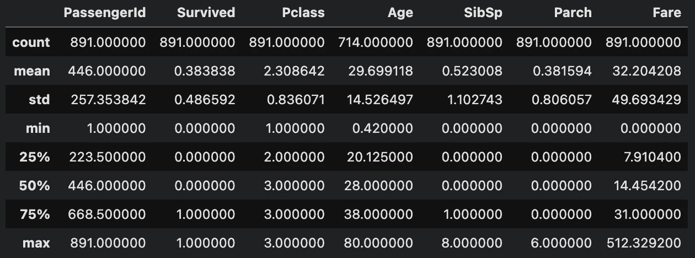
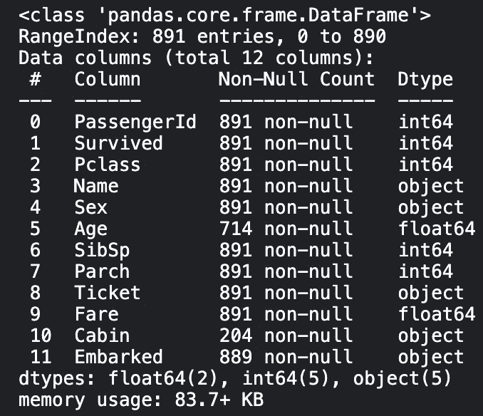
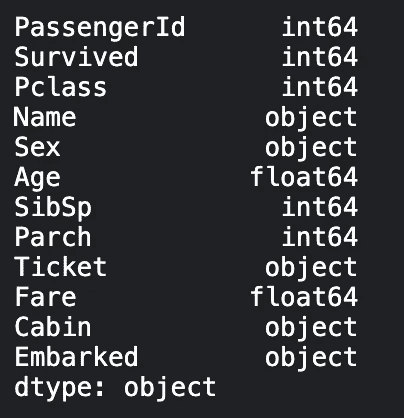
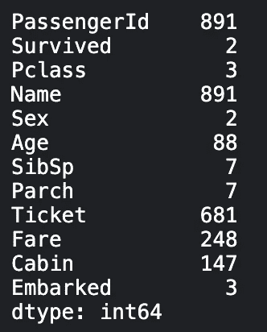
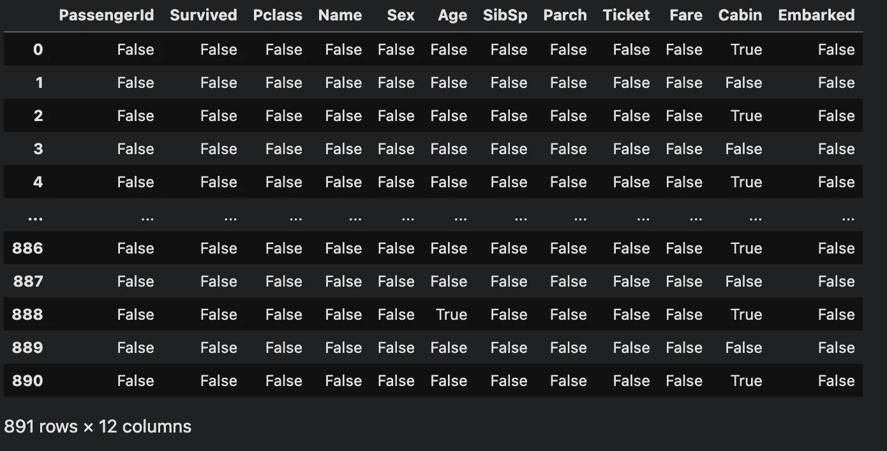
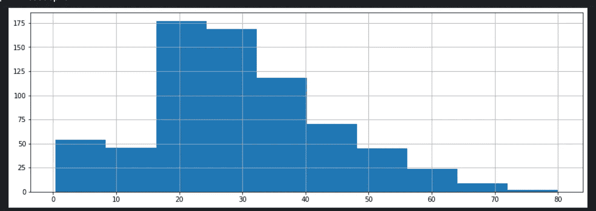

# 熊猫中用于有效探索性数据分析的顶级一行程序

> 原文：<https://towardsdatascience.com/top-one-liners-in-pandas-for-effective-exploratory-data-analysis-a739b1c9de5>

## 使用 Pandas，通过这 6 行代码轻松浏览您的数据


杰伊·温宁顿在 [Unsplash](https://unsplash.com?utm_source=medium&utm_medium=referral) 上的照片

探索性数据分析(EDA)是一种探索数据以发现有用模式的艺术，这些模式可用于创建最强大的模型。数据科学初学者的一个常见错误是直接或相当快速地进入建模，而没有花费适当的时间进行适当的 EDA。

当我问自己为什么总是犯这个错误时，我发现这是因为通常需要很多行代码来进行适当的 EDA，绘制从分布到各种属性的所有特性。拥有一个很长的笔记本只是为了探索数据，甚至没有开始建模，有时会非常令人沮丧，因此我写这篇文章来总结 6 个最有用和最常见的 pandas 函数，可以帮助你快速完成 EDA，尽快开始建模。

在本文中，我将使用 [Kaggle 的泰坦尼克号数据集](https://github.com/ahmedbesbes/How-to-score-0.8134-in-Titanic-Kaggle-Challenge)作为例子来演示这些熊猫函数。

## 1.DF 描述

当然，我不会提到著名的“df.head()”或“df.tail()”，因为几乎每个人都知道它们(它们用于显示数据帧的前 5 /后 5 行)。

```
df.describe()
```



来源:作者

如上所示，数据框描述显示了数据框中每一列的有用数量。例如，了解每列的范围(从最小和最大)是很有用的。查看要素的标准偏差是高还是低也很有用。当然，我们应该知道我们拥有的功能的数量(使用计数)

## 2.测向信息

```
df.info()
```



来源:作者

同样，非常简单而且非常有效。了解内存使用通常非常重要，因为机器学习中的内存不足错误是不可避免的！

## 3.DF 数据类型

```
df.dtypes
```



来源:作者

该属性列出了数据帧中每一列的数据类型。知道您正在处理的是数字特征还是分类特征是非常方便的，因为这将影响您将要使用的编码类型。例如，一些特征可能是字符串，而一些特征可能是数字。如果打算同时使用这两组特性，您可能需要将字符串转换为数值。

我还从经验中了解到，当您的硬件资源有限时，当您处理大型数据集时就会如此。简单的数据类型转换可能非常方便。我举个实实在在的例子。我们在这里使用的数据帧大约有 350 万行，这是相当大的。在大多数计算机上，将该数据帧加载到内存中、对其进行操作、转换和拟合模型可能会导致内存不足的错误。

在这种情况下，一个简单的技巧是检查是否可以减少在这种情况下使用的数据类型的大小。例如，dataframe 可能使用 64 位整数来表示只能用 32 位整数表示的值，对于 floats 也是如此。然后，您可以简单地对数据帧中的值进行循环，并将它们的类型转换为较小的类型。这个技巧可以使数据帧的大小减少 50%!

## 4.DF 应用

```
df.apply(lambda x: x.nunique())
```



来源:作者

应用采用 lambda 函数，并应用于数据框中的所有值。有大量有用的 lambda 函数可以应用。上面列出的方法可用于查找每列中不同值的数量。

## 5.DF 为空

```
df.isnull()
```



来源:作者

永远不要忘记检查是否有空值。我曾经忘记这样做了很长一段时间，总是以多个错误结束，包括 NaN 梯度等等。在存在空值的情况下，您需要找到最有效的方法来处理它们。一种非常常见的方法是用“平均值”替换这些值，完全删除它们，或者简单地用 0 替换它们。

## 6.DF 列历史记录

```
df['Age'].hist(figsize = (15,5))
```



来源:作者

这是我的最爱之一。您可以简单地指定 dataframe 中的任何列(将其名称放在方括号中)，然后添加一个“.”。然后你会得到一个列值分布图！找出特征的分布是至关重要的。通常，正态分布是优选的。在偏态分布的情况下，您可能希望使用标准定标器对数据集进行归一化。如果数据集包含大量异常值，您还需要找出处理异常值的最有效方法。

## 结论

我确信还有更有效的俏皮话！欢迎在下面留下你的评论。我认为让 EDA 变得更容易对数据科学社区非常有帮助。我相信有更多的现代图书馆致力于实现这一目标。

如果您想定期收到关于人工智能和机器学习的最新论文的论文评论、高质量的 ML 教程等，请添加您的电子邮件[此处](https://artisanal-motivator-8249.ck.page/5524b8f934) &订阅！