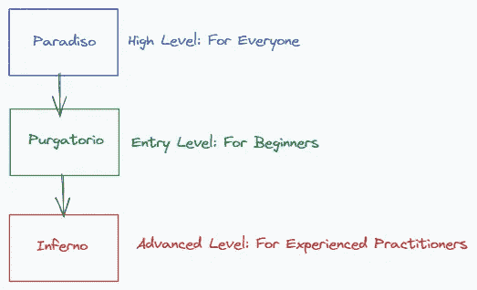
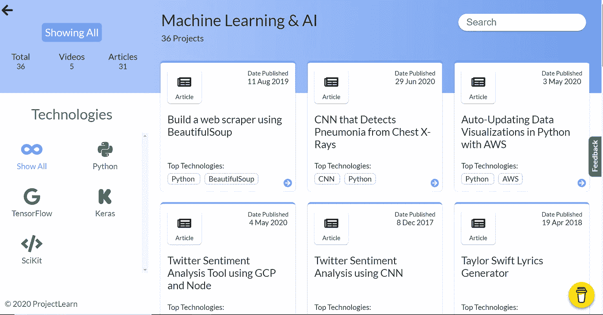
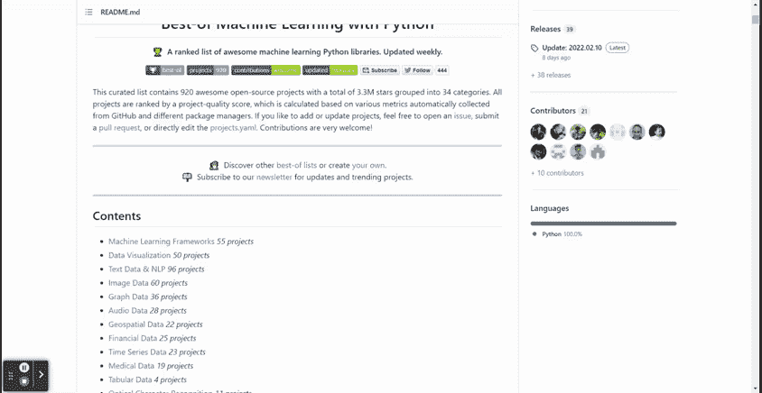

# 学习数据科学的顶级开源项目

> 原文：<https://towardsdatascience.com/top-open-source-project-to-learn-data-science-dc962210d855>

## 利用这些项目启动您的数据科学教育

马文·迈耶在 [Unsplash](https://unsplash.com?utm_source=medium&utm_medium=referral) 上的照片

学习数据科学对初学者和专业人士来说都不容易。之所以辛苦，是因为每天总有新的东西要学，但学习的内容却分散在各处。如果没有正确的指导，许多人会迷失在学习的旅途中。这就是为什么许多人认为数据科学有很高的门槛。

幸运的是，许多优秀的人已经启动了开源项目来学习数据科学。这些项目写得简洁而有见地，人们可以彻底学习。

本文将概述学习数据科学的各种开源项目。让我们开始吧。

# 1.维尔吉利奥

[Virgilio](https://virgili0.github.io/Virgilio/) 被称为数据科学电子学习的新导师，旨在让每个人都有机会学习数据科学。Virgilio 还试图为学习者创建一条结构化学习的路径，以避免在数据科学学习过程中不知所措的混乱。

开源项目由三层构成，以满足每个人的需求。该层被称为高级向导的 Paradiso、入门级的 Purgatorio 和高级向导的 Inferno。

作者图片

学习从**天堂级别**开始，这里的内容都是关于理论以及为什么你应该学习数据科学(完全没有编码)，例如:

*   机器学习和人工智能的区别是什么
*   需要机器学习吗？
*   使用案例
*   教学策略

还有很多。对于开始数据科学之旅并更好地了解该领域的人来说，Paradiso 是一个完美的开始。

从天堂级别，我们移动到 **Purgatorio 级别。**这一级别涵盖了数据科学家的基础知识，从基础知识到动手实践，例如:

*   数学与统计基础
*   编程 Python 基础
*   问题定义
*   数据探索
*   机器学习培训

还有很多。在数据科学领域，你可以学到你需要的一切。不用担心结构，因为 Purgatorio 也是从基础到更基础的用法开始的。

最后，高级等级是**地狱等级，**这部分是为高级用户准备的。本节将教您数据科学的一个具体应用:

*   时间序列
*   计算机视觉
*   自然语言处理

此外，Inferno 级别为特定的数据科学工具和库提供学习材料。这个列表会随着时间的推移而增长，所以请继续关注这个项目。

Virgilio 的项目是由各个核心团队和该领域的专家开发的。如果你有兴趣，试着和这里的团队聊天，特别是为他们的事业做贡献。

# 2.ml 课程

[MLCourse](https://mlcourse.ai/book/index.html) 是一个开源项目，由来自 [OpenDataScience](https://ods.ai/) 的 [Yury Kashnitsky](https://yorko.github.io/) 领导，旨在了解更多关于机器学习的知识，学习者可以在理论和实践技能之间取得完美平衡。顾名思义，MLCourse 是一个课程项目的汇编，我们可以按照自定进度学习。

然而，这些课程稍微面向那些拥有 Python 和数学等基本数据科学技能的人。但是，这并不意味着初学者不能尝试这些课程——毕竟，他们的指南是非常有见地的。

MLCourse 包含十个主题供人们学习，这是一个结构中要遵循的主题；它们是:

1.  EDA 和熊猫
2.  视觉数据分析
3.  分类、决策树和 K-NN
4.  普通最小二乘法和线性模型
5.  制袋材料
6.  特征工程和特征选择
7.  无监督分析
8.  最佳化
9.  时间序列
10.  梯度推进

每个主题都包含一个简单易懂的指南、范例笔记本、作业和视频课程。

MLCourse 的缺点是，针对英语的开发在 2019 年停止(俄语在 2022 年复活)。然而，这些材料仍然与我们当前的数据科学领域相关，尤其是对初学者而言。

# 3.ProjectLearn

ProjectLearn 是一个开源项目，它提供了一个指导项目的精选列表。ProjectLearn 的创建者的目标是更多的实践应用学习，而不是理论学习，所以你可以期望学习一个特定的技能集，而不是一个通用的。

ProjectLearn 不是专门针对数据科学的，因为你也可以学习 web、移动和游戏开发。但是，有一个专门针对机器学习和 AI 的板块，这就是我们想要的。

ML & AI 部分(图片由作者提供)

该项目的大部分是另一篇文章或视频的外部链接，但这些项目已经策划好了，非常适合那些想探索机器学习可以做什么的人。

# 4.迪普卡帕哈

[Deepkapha](https://github.com/TarrySingh/Artificial-Intelligence-Deep-Learning-Machine-Learning-Tutorials#deep-learning) 是一个开源项目，策划了许多人工智能和深度学习教程供人们学习。当我看 Deepkapha 的时候，我感觉这个项目是为有数据科学和编程基础知识的人设计的，所以当你准备好了的时候，最好去探索 Deepkapha。

很多 Deepkapha 专注于深度学习和各种框架教程，如果你想学习深度学习的概念和框架之间的差异，这是非常完美的。然而，你仍然可以探索许多学习材料，尽管它们不是那么具体。

我认为另一个特别的部分是[深度学习博客集](https://github.com/TarrySingh/Artificial-Intelligence-Deep-Learning-Machine-Learning-Tutorials#curated-list-of-deeplearning-blogs)，它由各种作家和深度学习博客组成。这个收藏如此完整，以至于浏览所有的博客可能要花上几天时间。

# 5.最佳 ML Python

[Best-of ML Python](https://github.com/ml-tooling/best-of-ml-python) 是 Best-of 开源项目的一部分，该项目每天管理各种开源包和工具。最佳 ML Python 是专门针对 Python 编程语言的精选开源机器学习包的。

最佳系列没有具体给出如何学习基本概念的教程。然而，相反，他们将所有令人敬畏的 Python 包进行了分类，供我们试用。

最佳 ML Python 项目列表(GIF 由作者提供)

从上面的 GIF 可以看出，这个列表很丰富，并且根据你的需要进行了细分。通过 Python 包学习某个特定主题所需的几乎所有东西都存在，所以尽可能多地尝试探索。

# **结论**

学习数据科学并不容易，当我们不知道从哪里开始时，可能会感到困惑。这就是为什么在本文中，我想展示我学习数据科学的顶级开源项目。这些项目是:

1.  维尔吉利奥
2.  ml 课程
3.  ProjectLearn
4.  迪普卡帕哈
5.  最佳 ML Python

希望有帮助！

在我的[**LinkedIn**](https://www.linkedin.com/in/cornellius-yudha-wijaya/)**或 [**Twitter**](https://twitter.com/CornelliusYW) 上访问我。**

> ***如果您喜欢我的内容，并希望获得更多关于数据或数据科学家日常生活的深入知识，请考虑在此订阅我的* ***简讯。*****

> ***如果您没有订阅为中等会员，请考虑通过* [*我的推荐*](https://cornelliusyudhawijaya.medium.com/membership) *订阅。***