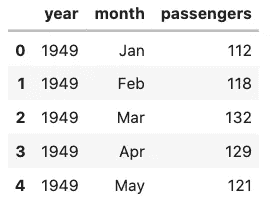
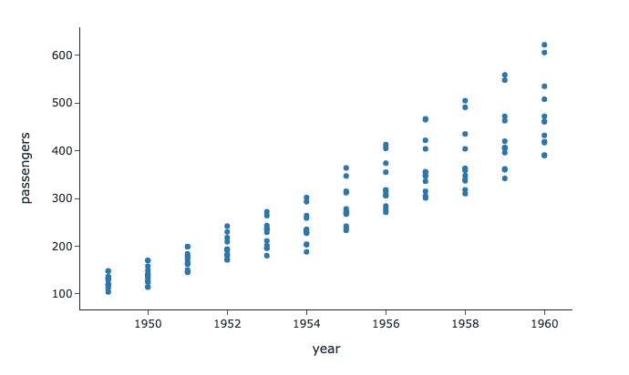
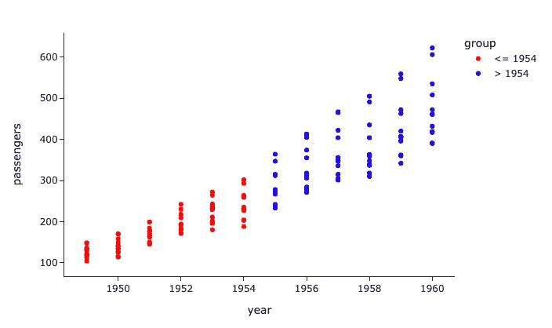
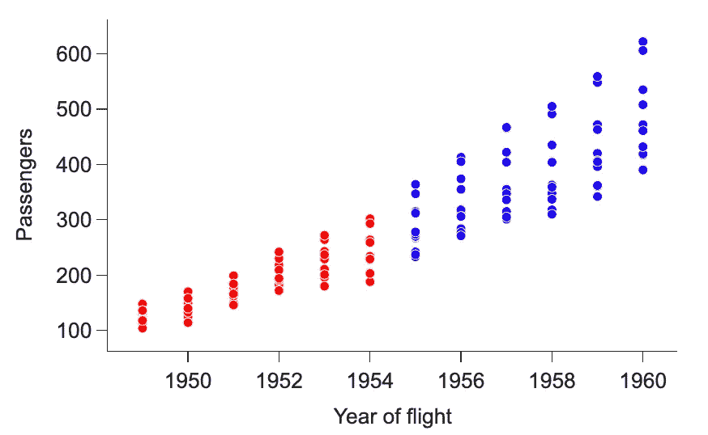
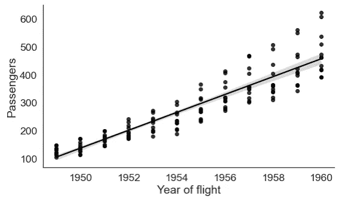
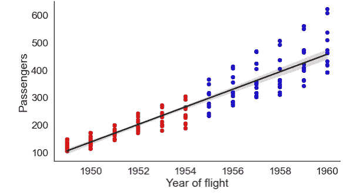
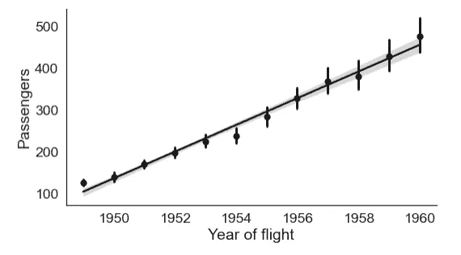
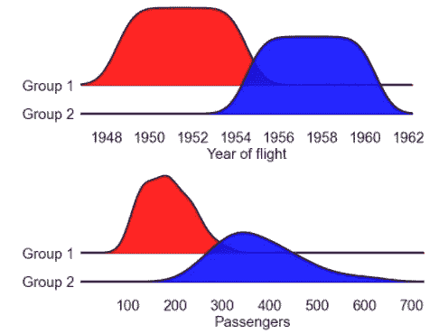
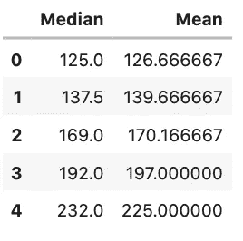
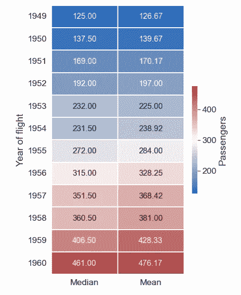

# 可视化顶级 Python 库:入门指南

> 原文：<https://towardsdatascience.com/top-python-libraries-for-visualization-a-starting-guide-73402178811b>

## **Python 中散点图、热图、脊线图和线图绘制指南**


丹尼尔·奥拉在 Unsplash 上的图片。

鉴于 Python 中有大量的库和数据可视化的可能性，对于该领域的新手来说，浏览这些库很快就会变得困难，甚至有些力不从心。有大量的选项可供选择，但是知道哪一个适合你(以及为什么)是有效展示数据的重要一步。在本文中，我们将重点关注几个用于有效数据可视化的关键库，并提供了在任何数据集中实现的清晰工作示例。

# **什么是数据可视化？**

通俗地说，数据可视化是利用图形显示来显示原始数据的“艺术”。更具体地说，它对于探索数据结构、检测异常值、趋势和聚类以降低数据复杂性非常有用。因此，有效的数据可视化将有助于在人脑易于理解的视觉环境中向目标受众传达数据。

数据可视化的前景将会持续下去，并随着技术的进步而继续发展，在科学出版物、媒体和网站展示中留下越来越显著的足迹。更精确的复制、更好的颜色(包括阿尔法混合)和更快的绘图是过去十年中迅速改进的一些变量。

> [此外，在开发图形理论方面也取得了进展，如威尔金森的 *Grammar of Graphics* (2005)和哈德利·威克姆在 R 包 ggplot2 中对其的实现(威克姆，2016)。在这样做的过程中，过去很少使用且难以绘制的图形，如平行坐标图(如 Theus，2015)和镶嵌图(如 Unwin，2015)，现在都得到了完善和发展。](https://hdsr.mitpress.mit.edu/pub/zok97i7p/release/3)

# **为什么要用 Python 进行数据可视化？**

有许多用于数据可视化的非代码工具，比如 Tableau、Power BI、ChartBlocks、Prism 等等。然而，即使编程是必需的，Python 也是数据科学家的首选语言之一，因为它具有可视化功能。这还伴随着用于数据操作和转换的数据收集和探索库(例如 Pandas、NumPy、SciPy)。Python 已经有了许多可用于可视化的库和特性，由于其庞大的用户群和开源特性，这些库和特性还将继续增长。随着技术领域的不断发展，Python 在未来几年内将继续保持其作为数据科学家首选语言的地位。

# 库安装和数据集准备

用 Python 绘制统计图形的方法有很多，但是我更喜欢用下面列出的库来创建。在本文中，我们将使用以下工具重点绘制热图、散点图、折线图和脊线图:

*   快乐
*   海生的
*   plotly.express

*出于一般兴趣，我总结了关键的库信息，并提供了源文档的链接:*

*   [**Plotly Express**](https://plotly.github.io/plotly_express/) 是一个高级 Python 可视化库，作为 [Plotly.py](https://plot.ly/python/) 的包装器，为复杂的图表提供简单的语法。它可以用于在一个函数调用中制作丰富的交互式绘图，包括分面、地图、动画和趋势线。Plotly Express 也完全兼容 Plotly 生态系统的其余部分。
*   [**Seaborn**](https://github.com/mwaskom/seaborn) 构建在 matplotlib 之上，通过捕获整个数据帧或包含数据的数组来工作，并执行必要的内部函数进行语义映射和统计聚合，以生成信息丰富的图。
*   [**Joypy**](https://github.com/leotac/joypy) 是一个基于 matplotlib 和 pandas 的单功能 Python 包，目的只有一个:绘制 joyplots(即脊线图)。这个库对于以清晰的方式可视化数据分布非常有用。

## 库安装

*如果还没有，请运行以下命令行通过终端安装这些库:*

```
pip install seaborn
pip install joypy
pip install plotly
```

完成后，我们将导入以下结节，然后继续:

```
import numpy as np
import pandas as pd
import seaborn as sns
from joypy import joyplot
import plotly.express as px
from scipy import stats
import matplotlib.pyplot as plt
```

## 加载数据集

没有数据，我们无法想象任何东西。因此，在我们逐步完成一系列绘图示例之前，我们将使用`seaborn`库加载以下关于航班的内置(常用)python 数据集:

```
# Load a dataframe
flights_data = sns.load_dataset("flights")# Display dataset
flights_data.head()
```



航班数据数据框示例。图片由作者提供。

# 散点图

可以使用`plotly.express`制作基本散点图，灵活地改变其宽度和高度，以获得更佳的图像输出。模板也可以从`simple_white`更改为包含网格和更深的颜色:

```
px.scatter(flights_data, x=”year”, y=”passengers”, width=700, height=600,template=”simple_white”)
```



作者使用 plotly.express. Image 的基本散点图示例。

值得注意的是，`plotly.express`非常适合颜色排序，这就是为什么我更喜欢用它来可视化分组数据。您还可以选择将颜色从离散颜色序列(如下所示)更改为连续颜色方案，这对于连续数据测量非常有效。总的来说，不同的颜色可以赋予不同的数据组，以提高视觉清晰度。

```
#group data 
flights_data.loc[flights_data.year <= 1954 , 'group'] = '<= 1954'
flights_data.loc[flights_data.year > 1954 , 'group'] = '> 1954'

#re-plot data with discrete color scheme
px.scatter(flights_data, x="year", y="passengers", width=700, height=600, template="simple_white", color="group", color_discrete_sequence=['red','blue'])
```



Plotly.express 带组显示的散点图。红色和蓝色分别对应≤ 1954 和> 1954 飞行年。图片由作者提供。

如果您和我一样，不喜欢散点图的默认美学，这里有一些有用的示例，可以用来更改刻度长度、字体大小、轴标题、标记颜色等等:

```
#size dimension change
fig1 = px.scatter(flights_data, x="year", y="passengers", width=700, height=450,template="simple_white", color="group",color_discrete_sequence=['red','blue'])#tick font and size change
fig1.update_layout(
yaxis = dict(
tickfont = dict(size=20)),
xaxis = dict(
tickfont = dict(size=20)),
font_family="Arial")#x-axis title and size + tick length changes
fig1.update_xaxes(
title_text = "Year of flight",
title_font = {"size": 20},
title_standoff = 15, ticklen=10)#y-axis title and size + tick length and value changes
fig1.update_yaxes(
title_text = "Passengers",
title_font = {"size": 20},
title_standoff = 15, ticklen=10, tickvals=list(range(0,700,100)))#marker size, outline and color change 
fig1.update_traces(marker=dict(size = 9,
line=dict(width=0.8, color='white')),
selector=dict(mode='markers'))#legend off 
fig1.update_layout(showlegend=False)

fig1.show()
```



作者使用 plotly.express. Image 调整了标记和字体大小，以及刻度长度和字体样式。

值得注意的是，您可以从`px.colors.qualitative`模块中选择以下任何内置的定性颜色序列，或者定义您自己的颜色序列:


ploty.express 调色板示例。图片由[绘声绘色](https://plotly.com/python/discrete-color/)。

# 线形图

尽管`plotly.express`可以选择添加趋势线，这里我们展示了如何使用`seaborn`库对现有数据实现**填充的**趋势线。这对于可视化变量之间的关系特别有帮助。在年份和乘客变量的情况下，可以看到线性关系，因此趋势线将有助于加强这一点。

```
#use lmplot to plot scatter points
sns.set(font_scale = 1.6)
sns.set_style("white")
fig2 = sns.lmplot(data = flights_data, x="year", y="passengers", height=5, aspect=1.64, legend=False, line_kws={'color': 'black'}, scatter_kws={"color": "black"})#change axis titles
fig2.set(xlabel='Year of flight', ylabel='Passengers')
```



带有填充趋势线的 seaborn 散点图示例。图片由作者提供。

为了保持先前数据组的配色方案，我们可以为特定的数据点指定颜色。填充了**的**趋势线也可以应用于整个数据集，如下所示:

```
#get coeffs of linear fit
slope, intercept, r_value, p_value, std_err = stats.linregress(flights_data['year'],flights_data['passengers'])#use lmplot to plot scatter points
sns.set(font_scale = 1.6)
sns.set_style("white")
sns.lmplot(data = flights_data, x="year", y="passengers", height=5, aspect=1.64, hue="group", fit_reg= False, legend=False, palette=["red","blue"])#use regplot to plot the regression line and use line_kws to set line label for legend
fig3 = sns.regplot(data = flights_data, x="year", y="passengers", scatter_kws={"zorder":-1}, line_kws={'label':"y={0:.1f}x+{1:.1f}".format(slope,intercept)}, color="black")#change axis titles
fig3.set(xlabel='Year of flight', ylabel='Passengers')
```



第 1 组和第 2 组的 Seaborn 散点图，带有填充的趋势线和不同的配色方案。图片由作者提供。

或者，可以使用以下代码将单独的填充趋势线应用于每个组:

```
#use lmplot to plot scatter points
sns.set(font_scale = 1.6)
sns.set_style("white")
fig4 = sns.lmplot(data = flights_data, x="year", y="passengers", height=5, aspect=1.64, hue="group", palette=["red","blue"], legend = False)#change axis titles
fig4.set(xlabel='Year of flight', ylabel='Passengers')
```


使用色调填充趋势线的 Seaborn 散点图。图片由作者提供。

在所有情况下，为了简化数据，每个相应 x 值的所有 y 值的平均值(或中值)可以显示如下:

```
#set fontsize
sns.set(font_scale = 1.6)
sns.set_style("white")fig5 = sns.regplot(data = flights_data, x="year", y="passengers", x_estimator=np.mean, color = "black")#set fig size
fig5.figure.set_size_inches(8.2, 4.5)#change axis titles
fig5.set(xlabel='Year of flight', ylabel='Passengers') #despine
sns.despine()
```



Seaborn 散点图，填充趋势线，x_estimator = np.mean。图片由作者提供。

# 脊线图

观察折线图和散点图很容易看出，各组内的数据分布有很大差异。*Python 中的 Joyplots 或 ridgeline plots* 是可视化所述分布的绝佳方法，同时提供对分布类型(如正态、伽玛、贝塔)的洞察。作为复习，可以在 [**这里**](https://medium.com/@srowen/common-probability-distributions-347e6b945ce4) 找到这些的精彩总结。

我特别喜欢用 Python 可视化 joyplots 或 ridgeline plots 的一个库是— `joypy.`它归结为一个函数调用，使其易于使用和修改。

```
# x variables to plot with corresponding text
xvar = ['year', 'passengers']
xlabel = ['Year of flight', 'Passengers']for x,xlabel in zip(xvar,xlabel):
    joyplot(data = flights_data[[x, "group"]], 
            by="group", figsize=(10, 4), 
            labels = ["Group 1","Group 2"],
            linecolor = 'black',
            color = ['red','blue'], 
            alpha = 0.85, 
            linewidth=3, overlap = 0.9)
    plt.rc("font", size=24)
    plt.xlabel(xlabel, fontsize = 24)
    plt.show()
```



组 1 和组 2 的脊线图示例。图片由作者提供。

当然，这是两个任意组的一个简化的脊线图，你能用这个库做的事情取决于用户。更多文档可在 [**此处**](/ridgeline-plots-the-perfect-way-to-visualize-data-distributions-with-python-de99a5493052) 找到，并提供更多示例以获取灵感。

# 热图

热图可以通过彩色编码叠加提供数据集的简化摘要。为了实现这一点，`seaborn`库为热图绘制提供了多种选项。

对于这个例子，我已经通过`“year”`对数据集进行了分组，并将均值和中值输出生成到一个连接的数据帧中。这使我能够在生成热图之前简化数据集:

```
#grouped flights_data and calculated mean
grouped_df = flights_data.groupby("year")
mean_df = grouped_df.mean()
mean_df.rename({'passengers': 'Mean'}, axis=1, inplace=True)
mean_df = mean_df.reset_index()#grouped flights_data and calculated median
median_df = grouped_df.median()
median_df.rename({'passengers': 'Median'}, axis=1, inplace=True)
median_df = median_df.reset_index()#concat dataframes
data_concat = pd.concat([median_df['Median'], mean_df['Mean']], axis=1, ignore_index=False)#display 
data_concat.head()
```



data_concat 数据帧。图片由作者提供。

完成后，您可以绘制每年的热图:

```
#finding y-axis titles
y_axis_labels = flights_data.year.unique()# plot heatmap
fig, ax = plt.subplots(figsize=(6,10)) 
fig7 = sns.heatmap(data_concat, cmap="vlag", linewidth=0.1, annot=data_concat, fmt=".2f", cbar_kws={'label': 'Passengers', "shrink": .4}, annot_kws={"size": 16}, yticklabels=y_axis_labels)# set yticks and axis label
plt.yticks(rotation=0) 
fig7.set(ylabel='Year of flight')
```



使用 seaborn 库的热图示例。不同的列对应于每个分组飞行年的中间值和平均值。图片由作者提供。

# 结论

当然，数据科学领域有大量可用于数据可视化的工具，这些工具在不断改进和变化。然而，对于任何刚接触 Python 语言的人来说，保持更新和导航可能是一项有些难以完成的任务。

**总结一下**——`seaborn``joypy`和`plotly.express`等关键库为初次接触 Python 数据可视化的人提供了一个有效的起点。在本文中，我们利用这些数据生成散点图、热图、折线图和带有简单数据集的喜悦图。

我希望你喜欢读这篇文章，就像我喜欢写它一样。

在接下来的文章中，我将深入研究机器学习和深度学习理论，以及进一步的数据可视化技术。