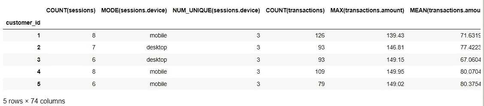
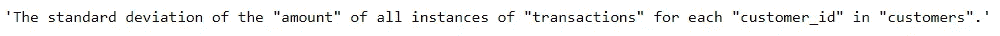
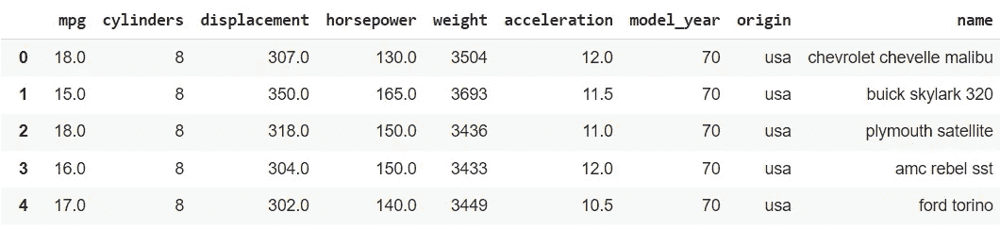
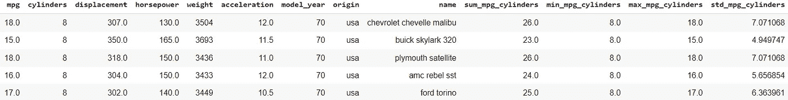
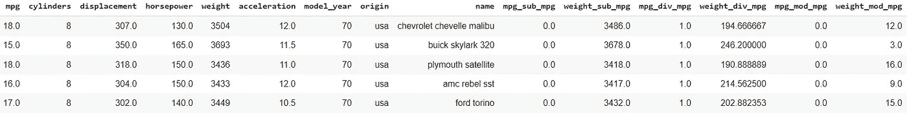
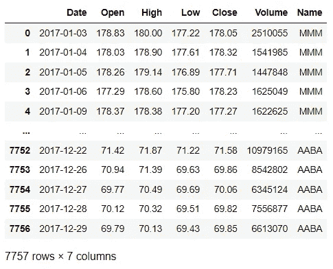
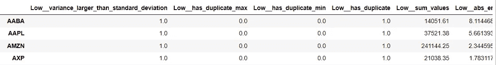
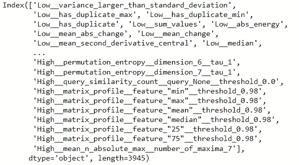

# 用于要素工程的顶级 Python 包

> 原文：<https://towardsdatascience.com/top-python-packages-for-feature-engineering-c0a75dba0081>

## 了解这些软件包以改进您的数据工作流程


马库斯·斯皮斯克在 [Unsplash](https://unsplash.com?utm_source=medium&utm_medium=referral) 上的照片

特征工程是从现有数据创建新特征的过程。无论我们是简单地增加两列还是组合一千多个特性，这个过程都已经被认为是特性工程了。

特征工程过程本质上不同于数据清理。虽然特征工程会创建附加特征，但数据清理可能会更改或减少现有特征。

特征工程是数据工作流程的重要组成部分，因为这项活动可以极大地提高我们的项目绩效。例如，[希顿](https://arxiv.org/pdf/1701.07852.pdf) (2020)的实证分析表明，特征工程提高了各种机器学习模型的性能。

为了帮助特征工程过程，本文将介绍我的用于特征工程的顶级 Python 包。让我们开始吧！

# 1.功能工具

[Featuretools](https://www.featuretools.com/) 是一个开源的 Python 包，用于自动化由 Alteryx 开发的特性工程过程。这是一个为从我们拥有的任何特征，尤其是从时态和关系特征中进行深度特征创建而设计的包。

深度特征合成(DFS)是 Featuretools 活动的核心，因为它允许我们快速从数据中获取新特征。如何执行？让我们使用 Featuretools 中的示例数据集来做这件事。首先，我们需要安装软件包。

```
pip install featuretools
```

接下来，我将加载已经来自包的玩具数据集来执行深度特征合成。

```
import featuretools as ft#Loading the mock data
data = ft.demo.load_mock_customer()cust_df = data["customers"]
session_df = data["sessions"]
transaction_df = data["transactions"]
```


所有来自 Featuretools 模拟数据的数据集(图片由作者提供)

在上面的数据集中，我们有三个不同的连接数据集:

*   客户表(唯一客户)
*   会话表(客户的唯一会话)
*   事务表(会话事务活动)

在某种程度上，所有的数据集都与它们各自的键相关联。要使用 Featuretools DFS，我们需要用 dictionary 对象指定表名和主键(如果有 DateTime 特性，我们也将其添加为键)。

```
dataframes = {
    "customers": (cust_df, "customer_id"),
    "sessions": (session_df, "session_id", "session_start"),
    "transactions": (transaction_df, "transaction_id", "transaction_time"),
}
```

然后我们需要指定表之间的关系。这很重要，因为 DFS 将依赖这种关系来创建特性。

```
relationships = [
    ("sessions", "session_id", "transactions", "session_id"),
    ("customers", "customer_id", "sessions", "customer_id"),
]
```

最后，我们可以启动 DFS 流程。为此，我们可以运行下面的代码。重要的是需要为您想要的结果级别指定`target_dataframe_name`参数。例如，该代码将导致客户级别的特性工程。

```
feature_matrix_customers, features_defs = ft.dfs(
    dataframes=dataframes,
    relationships=relationships,
    target_dataframe_name="customers",
)
feature_matrix_customers
```



作者图片

从上图中我们可以看到，客户数据有了新的特性，会话和事务表有了各种新的特性；例如，某些特征的计数和平均值。用很少的台词，我们制作了很多特写。

当然，并不是所有的特征都有助于机器学习建模，但这是特征选择的工作。在我们的例子中，特征工程只关心创建特征。

如果您需要对每个特性的解释，我们可以使用下面的函数。

```
feature = features_defs[10]
ft.describe_feature(feature)
```



作者图片

# 2.特征引擎

[特征引擎](https://feature-engine.readthedocs.io/en/latest/index.html#)是一个开源的 Python 包，用于特征工程和选择过程。这个包就像一个转换器，类似于 scikit-learn 函数，比如`fit`和`transform`。

特征引擎有多大价值？当您已经有了一个机器学习管道时，这是有益的，主要是如果您使用基于 scikit-learn 的 API。功能引擎转换器旨在与 scikit-learn 管道一起工作，并与 scikit-learn 包进行类似的交互。

在特性引擎包中有许多 API 可以尝试，但是就本文的目的而言，我们将只关注可用的特性工程功能。对于功能工程，我们可以尝试三种 API:

*   [数学特性](https://feature-engine.readthedocs.io/en/latest/api_doc/creation/MathFeatures.html):将特性与数学函数结合起来
*   [相对特征](https://feature-engine.readthedocs.io/en/latest/api_doc/creation/RelativeFeatures.html):结合特征和参考
*   [循环特征](https://feature-engine.readthedocs.io/en/latest/api_doc/creation/CyclicalFeatures.html):使用正弦和余弦创建特征(适合循环特征)

让我们尝试所有的变形金刚来测试特征工程过程。对于初学者，我将使用 seaborn 的示例 mpg 数据集。

```
import seaborn as snsdf= sns.load_dataset('mpg')
```



作者图片

首先，我想尝试一下特征工程数学函数的`MathFeatures`函数。为了做到这一点，我将使用我们想要做的列和转换来设置转换器。

```
from feature_engine.creation import MathFeaturestransformer = MathFeatures(variables=["mpg", "cylinders"],
func = ["sum", "min", "max", "std"])
```

设置完成后，我们可以使用转换器来转换原始数据。

```
df_t = transformer.fit_transform(df)
df_t
```



作者图片

正如我们在上面看到的，我们的特征工程过程中有新的栏目。列名已经被很容易地陈述，以便理解在这个过程中发生了什么。注意，我们总是可以将我们的函数传递给 transformer 函数来进行计算。

我们还可以尝试使用`RelativeFeatures`函数来创建一个使用引用变量来开发特性的转换器。

```
from feature_engine.creation import RelativeFeaturestransformer = RelativeFeatures(
variables=["mpg", "weight"],
reference=["mpg"],
func = ["sub", "div", "mod"])df_r = transformer.fit_transform(df)
df_r
```



作者图片

从上面的结果中我们可以看到，新创建的列都是基于引用特征(' mpg ')；例如，重量减去 mpg。这样，我们可以根据我们想要的功能快速开发功能。

# 3.Tsfresh

[Tsfresh](https://tsfresh.readthedocs.io/en/latest/text/introduction.html) 是一个开源的 Python 包，用于时序和序列数据特征工程。这个包允许我们用几行代码创建数千个新功能。此外，该包与 Scikit-Learn 方法兼容，这使我们能够将该包合并到管道中。

来自 Tsfresh 的特征工程是不同的，因为提取的特征不能直接用于机器学习模型训练。这些功能用于描述时间序列数据集，需要额外的步骤才能将数据包含到训练模型中。

让我们用一个示例数据集来试试这个包。对于这个示例，我将使用来自 Kaggle 的 [DJIA 30 股票数据(许可证:](https://www.kaggle.com/datasets/szrlee/stock-time-series-20050101-to-20171231) [CC0:公共域](https://creativecommons.org/publicdomain/zero/1.0/))。具体来说，我将只使用 2017 年的所有股票数据。我们来读一下数据集。

```
import pandas as pd
df = pd.read_csv('all_stocks.csv')#cleaning the data by dropping nan values
df = df.dropna().reset_index(drop = True)df
```



作者图片

股票数据包含作为时间索引的日期列和作为股票引用的名称列。其他列是我们想用 Tsfresh 描述的值。

让我们使用下面的代码来测试这个包。

```
from tsfresh import extract_features
extracted_features = extract_features(df, column_id="Name", column_sort="Date")extracted_features
```



作者图片

```
extracted_features.columns
```



作者图片

从上面的结果可以看出，提取的特征包含大约 3945 个新特征。这些特性都是对可用特性的描述，随时可以使用。如果你想知道每个特性的描述，你可以在这里阅读全部[。](https://tsfresh.readthedocs.io/en/latest/text/list_of_features.html)

我们还可以使用特征选择功能来只选择相关的特征。您可以在下面的[页](https://tsfresh.readthedocs.io/en/latest/text/feature_extraction_settings.html)上阅读功能选择。

# 结论

要素工程是从现有数据集创建新要素的活动。该行动被证明有助于改善数据科学项目。但是，创建我们的功能可能需要很长时间。

本文展示了我为本文中的特性工程过程编写的顶级 Python 包。它们是:

1.  功能工具
2.  特征引擎
3.  Tsfresh

希望有帮助！

> *访问我的* [***社交媒体***](https://bio.link/cornelli)**进行更深入的交谈或有任何问题。**

> **如果您不是作为中等会员订阅，请考虑通过* [*我的推荐*](https://cornelliusyudhawijaya.medium.com/membership) *订阅。**