# 获取数据集的热门 Python 包

> 原文：<https://towardsdatascience.com/top-python-packages-to-acquire-dataset-3c1b4a31a287>

## 利用这些数据集改善您的数据科学产品组合


托拜厄斯·菲舍尔在 [Unsplash](https://unsplash.com?utm_source=medium&utm_medium=referral) 上的照片

学习数据科学并不容易，产生学习成果的过程也不容易。您的数据科学项目组合是被评估为输出的东西。无论你是否理解数据科学过程，它都会反映在投资组合中。

然而，有时我们不能实现我们的意图，有预期的项目，因为数据不可用。在我的教学时间里，我知道许多学生会问，“在哪里可以轻松地为我们的数据科学项目获取数据集？”。这个问题引起了我的共鸣，所以我在写这篇文章。

我想在本文中分享我的顶级 python 包来获取数据集。让我们开始吧。

# 1.seaborn/Scikit-Learn/stats models

从我们常见的数据科学 Python 包开始:Seaborn、Scikit-Learn 和 Statsmodels。这三个包本质上有不同的可用性，但是它们有共同点——一个内置的数据集。让我们看看这些包中的每个数据集。

## 海生的

Seaborn 是一个可视化软件包，有我们可以用来做实验的基本数据集。让我们尝试获取数据集列表以及如何获取它。

```
import seaborn as snssns.get_dataset_names()
```

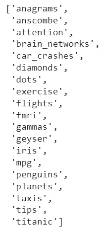

作者图片

从 seaborn 包中，我们有 19 个不同的数据集可以探索。如果您想要为您的环境获取数据集，让我们使用下面的代码行。

```
titanic = sns.load_dataset('titanic')titanic.head()
```

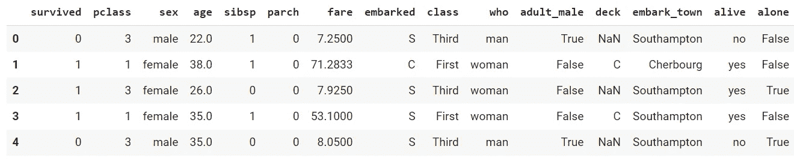

作者图片

## sci kit-学习

[Scikit-Learn](https://scikit-learn.org/stable/datasets.html) 包含各种用于玩具和真实世界数据集的 API，我们可以利用它们进行实验。

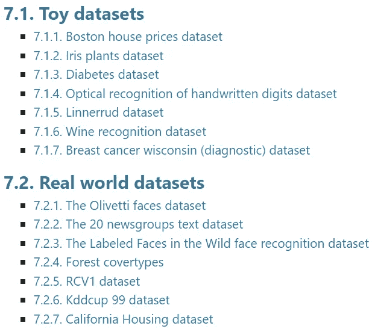

作者图片

对于每个数据集，都有一个 API 来加载该特定数据集。例如，您可以使用以下代码行加载 Iris 数据集。

```
from sklearn.datasets import load_iris
data = load_iris()
data.target[[10, 25, 50]]data.keys()
```

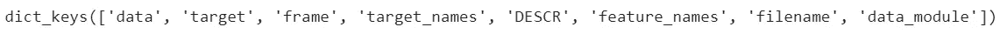

作者图片

所有数据集都包含在字典中，您可以将它们加载到另一个变量中进行研究。

## 统计模型

Statsmodels 是一个用于统计建模的 Python 包，但该包也提供了各种数据集供用户探索。下图显示了可用的数据集。

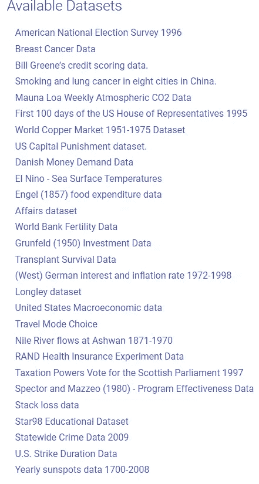

作者图片

要从 statsmodels 获取数据集，我们可以使用下面的代码行。例如，我们可以用朗利数据集。

```
data = sm.datasets.longley.load_pandas()
data.data
```

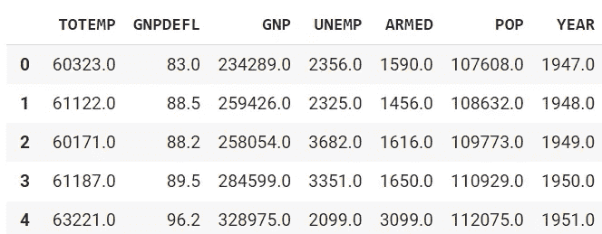

作者图片

您可以访问参考页面以获得每个数据集的详细信息。

# 2.Pydataset

[Pydataset](https://github.com/iamaziz/PyDataset) 是一个 Python 包，提供各种开源数据集。这些包中的许多数据集可能是您之前在介绍性数据科学学习中发现的，如 Titanic 和 Iris。

但是，这并不意味着 pydataset 不是一个好的数据集包。我发现很多数据集对你的初始项目很有帮助。

让我们试着探索我们能得到什么样的数据集。首先，我们需要安装 pydataset 包。

```
pip install pydataset
```

成功安装软件包后，我们需要导入下面一行来获取所有数据集列表。

```
from pydataset import datadata()
```

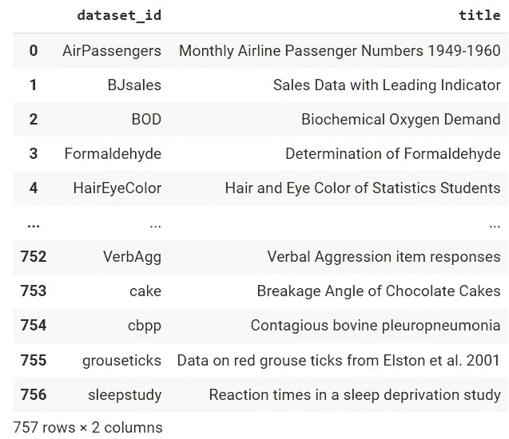

作者图片

我们最终得到了 757 个数据集。有很多数据集需要探索。

如果我们想检查每个数据集的细节，该怎么办？然后我们可以用下面的代码行。

```
#Pass the dataset_id to the first parameter and show_doc = True
data('BJsales', show_doc=True)
```

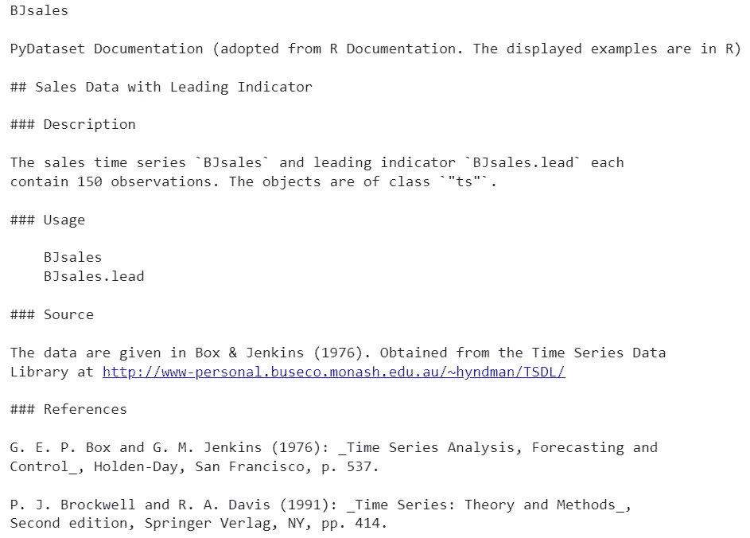

作者图片

所有的数据集信息都在你的可及范围内，并且是有用的。现在，我们只需要用下面的代码获取数据集。

```
bjsales = data('BJsales')bjsales.head()
```

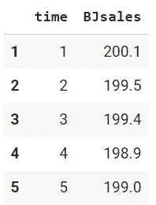

作者图片

Pydataset 非常易于使用和直观。然而，除了基本数据集之外，您可能还需要其他东西。所以，让我们来看看其他的包。

# 3.NLTK

[NLTK](https://www.nltk.org/) 是一个专门用于自然语言处理工作的 Python 包。它提供了各种与文本相关的任务 API。对于我们的使用，NLTK 还提供了一个文本数据集，我们可以将其用于我们的项目。

大约有 111 个来自 NLTK 的文本数据集可供我们使用。完整列表请参见[本页](https://www.nltk.org/nltk_data/)。让我们尝试从 NLTK 获取一个数据集。

```
import nltk# Download the abc corpus 
nltk.download('abc')
```

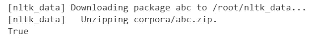

作者图片

数据集现在已经下载完毕，可供我们使用。出于探索的目的，我们可以使用下面的代码行来访问数据。

```
abc.words()
```

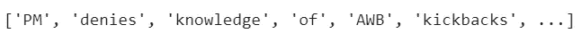

作者图片

单词列表现在是可用的。其他数据集包含的数据不仅仅是单词，所以请根据您的需求进行探索。

# 4.数据集

[Datasets](https://huggingface.co/docs/datasets/index) 是 HuggingFace 专门为访问和共享数据集而创建的 Python 包。数据集包旨在快速获取自然语言处理(NLP)、计算机视觉和音频任务数据，尤其是用于深度学习建模。

数据集包的伟大之处在于，无论数据集有多大，您都可以通过零拷贝读取来处理数据集，而没有任何内存限制，因为数据集在后台使用 Apache Arrow。您可以查看[数据集 HuggingFace hub](https://huggingface.co/datasets) 以获得完整的 2600+数据集列表。

让我们试着用 Datasets 包加载样本数据集。首先，我们需要安装软件包。

```
pip install datasets
```

首先，我们需要决定要将哪些数据集加载到我们的环境中。在您知道您想要什么数据集之后，让我们使用下面的行来读取数据集元数据信息。

```
from datasets import load_dataset_builder#I want the IMDB dataset
dataset_builder = load_dataset_builder('imdb')
```

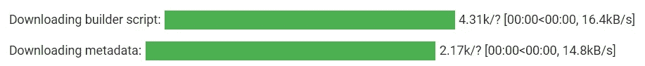

作者图片

使用`load_dataset_builder`函数，我们可以推断数据集特性和可用的特定数据集子集。

```
print(dataset_builder.info.features)
```


作者图片

```
print(dataset_builder.info.splits)
```

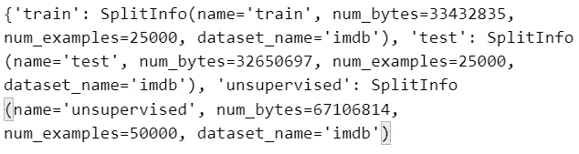

作者图片

我们可以获得数据集特征(“文本”、“标签”)和可用子集(“训练”、“测试”、“无监督”)。此外，每个输出包含更详细的信息。

让我们尝试加载数据集。我们将使用下面几行来加载 IMDB 数据。

```
from datasets import load_dataset#We load the train dataset subset from IMDB dataset
dataset = load_dataset('imdb', split='train')
```

上面的代码行将让我们从 IMDB 获取列车数据。让我们看看完整的数据集信息。

```
print(dataset.info)
```

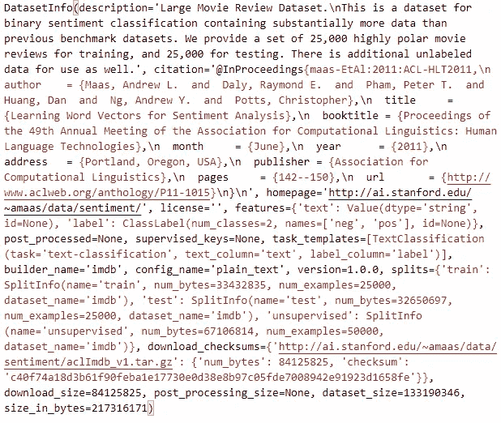

作者图片

我们也可以使用下面几行来访问列名。

```
dataset.column_names
```

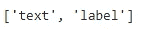

作者图片

如果我们想更详细地查看数据集，我们总是可以访问类似于 Pandas API 的数据集。例如，如果我想访问 IMDB 数据集中的第一个数据，我将使用零索引子集。

```
dataset[0]
```

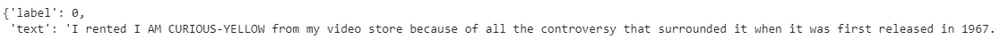

作者图片

或者，如果我们想要访问列方式，我们只需要选择具有特性名称的数据集。当我们按特征选择时，数据集本身将是一个列表对象，以便我们可以使用零索引进一步选择它。

```
dataset['text'][0]
```

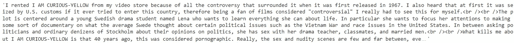

作者图片

您可以使用以下页面了解有关数据集包可用性的更多信息。

# 5.打开数据集

[Opendatasets](https://github.com/JovianML/opendatasets) 是一个 Python 包，用于从在线资源下载数据集，尤其是 Kaggle 和 Google Drive。此外，opendatasets 提供了我们可以从包中内置使用的各种数据集。

要开始从 [Kaggle 数据集](https://www.kaggle.com/datasets)下载数据集，我们需要登录 Kaggle 网站并获取 API。从 Kaggle 部分的 API 中，您将获得包含您的用户名和密钥的 kaggle.json 文件。

```
**{"username":"YOUR_KAGGLE_USERNAME","key":"YOUR_KAGGLE_KEY"}**
```

让我们从安装包开始。我们将使用下面一行来安装 Opendatasets。

```
pip install opendatasets
```

要开始从 Kaggle 下载数据集，我们需要找到您想要获取的链接数据集。在这个例子中，我将尝试从 Kaggle 下载美国选举数据集。

```
import opendatasets as odod.download('https://www.kaggle.com/tunguz/us-elections-dataset'
```

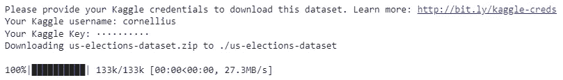

作者图片

在开始下载之前，您需要提供您的 Kaggle 用户名和密钥。数据集文件夹将位于您的 Jupyter 笔记本目录路径中。

此外，还有可从 Opendatasets 包中下载的内置数据集。下图是您可以获取的数据集。

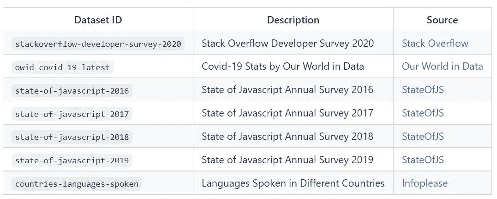

作者图片

```
od.download('stackoverflow-developer-survey-2020')
```

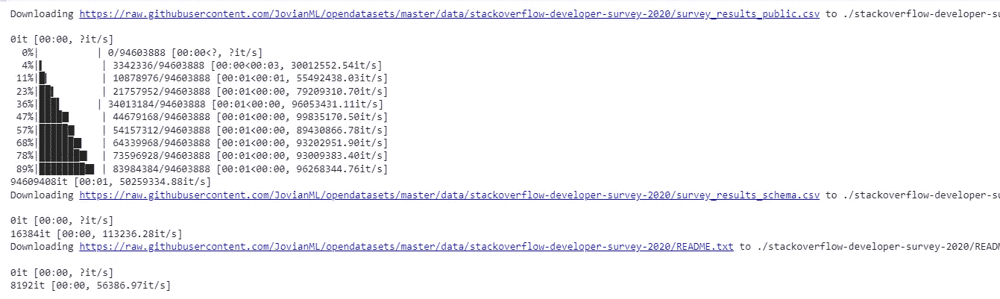

作者图片

您下载的数据集也将出现在您的目录中。

# 结论

每个数据科学项目都需要一个合适的数据集来处理。没有数据集，我们就无法开展数据项目。在本文中，我想概述一下我用来获取数据集的顶级 Python 包。这些软件包是:

1.  seaborn/Scikit-Learn/stats models
2.  Pydataset
3.  NLTK
4.  数据集
5.  打开数据集

希望有帮助！

在我的 [**LinkedIn**](https://www.linkedin.com/in/cornellius-yudha-wijaya/) 或 [**Twitter**](https://twitter.com/CornelliusYW) 上访问我。

> *请不要错过我的内容，点击此处订阅我的* ***时事通讯，获取更多关于数据的深入知识，提升您的数据科学事业。***

> *如果您没有订阅为中等会员，请考虑通过* [*我的推荐*](https://cornelliusyudhawijaya.medium.com/membership) *订阅。*