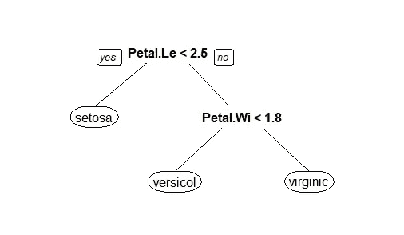
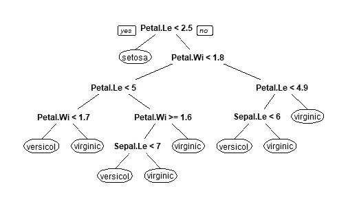

# 面向数据科学家的顶级 R 库

> 原文：<https://towardsdatascience.com/top-r-libraries-for-data-scientists-16f064151c04>

## r 是一种开源语言，有大量的库可供探索。在这篇文章中，你会发现一些最著名的，你可以在那里了解更多。


照片由[阿尔方斯·莫拉莱斯](https://unsplash.com/@alfonsmc10)@ unsplash.com 拍摄

L 在过去的十年里，开源语言已经成为数据科学领域事实上的标准。开源工具是免费的、可扩展的，并且在合作社区中拥有成千上万个人的广泛支持。

r 是最著名的开源语言之一，受到了全世界数百万数据科学家的青睐。其主要优势之一是大型社区支持大量不断更新和改进的图书馆，能够捕捉世界各地机器学习和数据科学研究的最新发展。

使用 R 时，可以使用的库实际上有数百个——对于初学者来说，这可能会令人困惑，尤其是在您注意到许多库有相同的目的并做类似的事情之后。

这篇文章将帮助你了解世界各地的数据科学家经常使用哪些库。这个摘要应该为您提供数据科学领域最著名的库的详细列表。

从数据争论到训练机器学习模型，以下库是当今生产中大多数数据科学脚本的一部分。如果你是 R 的新手，围绕下一个库制定一个学习计划会给你一个很好的方法来提高你的 R 技能，并且能够处理我们那里的大量数据科学项目。

**我们开始吧！**

提示:为了能够运行本文中的示例，不要忘记下载并安装本文中提到的库。

# 数据争论— Dplyr

我们的第一个库来自于包的宇宙。 *Dplyr* 是一个数据角力库，以解锁 R ( `%>%`)内部管道运算符的权力而闻名。

在处理复杂的数据管道时，r 语法并不是特别简洁。添加几个过滤器或合并不同的数据框可能会使您的代码混乱不堪。 *Dplyr* 增强您的数据争论游戏，使您能够快速编写复杂的数据管道。

此外，使用 *dplyr* 你可以很容易地将一个函数封装在另一个函数中，而不是使用典型的复合格式 *f(g(x))* ，这种格式会扩展到混乱的 R 代码，几乎不可能维护或调试，并且会产生大量的技术债务。

让我们来看看下面这个关于 *iris* 数据集的例子——想象一下，在过滤了 *virginica* 物种的行之后，我想要对 *sepal_width* 求平均值。如果我们使用 R 基代码，我们可能会做以下事情:

```
mean(iris[iris$Species==’virginica’, ‘Sepal.Width’])
```

那好像也不太复杂！但是，现在假设我们想要添加另一个条件，取出 *virginicas* 一个小于 2:

```
mean(iris[(iris$Species==’virginica’) & (iris$Petal.Width < 2), ‘Sepal.Width’])
```

这段代码有点令人困惑。有了 *Dplyr* ，我们可以简单地:

```
iris %>% 
 filter(Species == ‘virginica’, Petal.Width < 2) %>%
 summarise(mean(Sepal.Width))
```

多酷啊。`%>%`通过作用于前一个函数返回的元素来工作。功能`summarise`仅在`filter`返回时应用。在`filter`中，我们直接使用逗号分隔的两个条件，这比使用多个`&`条件更加实用和简洁。

如果你想改进你的代码，让它对其他人来说更可读，Dplyr 真的很酷，也是最重要的学习内容之一。您可以使用一些资源来了解更多信息:

*   [图书馆的官方页面。](https://dplyr.tidyverse.org/)
*   [*Dplyr*小抄。](https://github.com/rstudio/cheatsheets/blob/main/data-transformation.pdf)
*   我的数据科学课程的第一部分。

# 数据访问— RODBC

当你想直接从数据库中检索数据时，RODBC 是你的好朋友。该库使您能够使用 *ODBC(开放式数据库连接)*通道直接连接到数据库管理系统中的表，并直接从数据库系统中检索一些示例，而无需使用任何 *csv* 、 *xlsx* 或 *json* 接口。使用 *RODBC，*你使用查询语言将数据库管理系统中的数据直接转换成数据帧。

要使用 *RODBC* ，您需要:

*   在您的系统中配置一个 *ODBC* 连接到您想要的 DBMS
*   设置访问数据库服务器的凭据。当然，这意味着您需要有效的权限来访问数据。

就是这样！超级简单。

例如，在下面的例子中，我使用 *root* 用户名创建了一个到本地 *MYSQL* 服务器的连接:

```
connection <- odbcConnect(“mysqlconn”, uid=”root”)
```

创建之后，我可以立即使用一些 SQL 代码直接从 *MYSQL* 服务器检索数据:

```
result1 <- sqlQuery(channel, paste(“SELECT * from sakila.city”))
```

我使用带有查询`SELECT * from sakila.city`的 SQL 代码从 sakila 数据库中检索整个城市表。这样做的时候，这个表将以 dataframe 格式存储在我的`result1`对象中！之后，我可以将我所知道的所有 R 代码应用到这个对象中，因为我正在使用一个*数据框架*！

RODBC 可以访问大多数数据库系统，如*微软 SQL Server* 、*PostgreSQL*、 *MYSQL* 、 *SQLite 等。*

与 *sqldf* 相结合，这两个库能够解释 R 内部的 *SQL* 代码，并且能够为您的数据科学和分析项目带来巨大的生产力收益。

您可以了解更多关于 RODBC 的信息:

*   RODBC 的官方文档。
*   [R 博主 RODBC](https://www.r-bloggers.com/2019/05/rodbc-helper-function/) 举例。
*   从我的编程课程中读取外部数据部分。

# 数据可视化— GGPlot2

R base 包含绘图功能，一旦安装 R 就可以使用——例如分别绘制线图和条形图的`plot`或`barplot`。这些功能很酷，但它们有两个主要限制:

*   每个函数都有自己的参数来提供数据和设置绘图画布。
*   添加元素(标题、标签等。)的情节相当繁琐和混乱。

幸运的是，在 tidyverse 之外还有另一个图书馆，可以说是有史以来最著名的 R 图书馆。 ***GGplot2，*** 俗称 ***GGplot*** 。

掌握 *GGplot* 本身就是一种技能。它的一个主要特点是使用户能够在代码变化最小的情况下在图之间切换。例如，假设我们想要使用折线图绘制每分钟互联网使用时间序列——我们使用的是 R 的 *WWWusage* 沙盒数据集:

```
internet <- data.frame(
  internetusage = WWWusage
)
```

为了绘制线图，我可以使用 *GGplot 的*本地函数:

```
ggplot(
  data = internet,
  aes(x=row.names(internet), y=internetusage)
) + geom_line(group = 1) +
  theme(axis.title.x=element_blank(),
        axis.text.x=element_blank(),
        axis.ticks.x=element_blank())
```

GGplot 是模块化的，分解了我们上面看到的元素:

*   我们从包含我们绘图“基础”的`ggplot`函数开始。这是我们陈述数据的地方，也是我们将如何映射 x 和 y 维度的地方。
*   然后，我们加一个`geom_line`。我们刚刚添加了一个新的“模块”到我们的图中，声明我们想要一个线图。
*   最后，我们使用`theme`为我们的情节添加了一些小的美学变化。在我们的例子中，我们隐藏了 x 轴的所有标签和信息。

我们可以使用一个`+`符号继续向我们的 *GGplot* 添加模块。

但是..我已经告诉过你，在不同类型的图之间转换非常简单——我们如何将它转换成另一种类型的图呢？

**超级简单！**例如，要将该图变为散点图，我们只需用`geom_point`替换`geom_line`:

```
ggplot(
  data = internet,
  aes(x=row.names(internet), y=internetusage)
) + geom_point() +
  theme(axis.title.x=element_blank(),
        axis.text.x=element_blank(),
        axis.ticks.x=element_blank())
```

与*plottly*并列(另一个很酷的绘图库！)， *GGplot* 大概是大部分 R 用户画剧情的首选。与 R base 相比，它更容易在不同的情节之间切换，并且格式在灵活性和代码流畅度方面无法与 *GGPlot* 竞争。

一些学习资源 *GGplot* :

*   [R 图库](https://r-graph-gallery.com/ggplot2-package.html)—gg plot；
*   [GGplot2 的小抄。](https://raw.githubusercontent.com/rstudio/cheatsheets/main/data-visualization.pdf)
*   我的编程课程中的绘图数据部分。

# 模型培训— rpart 和 randomForest/ranger

如果我们在谈论数据科学家的库，我们必须包括训练模型的库，对吗？让我们从训练基于树的模型的三个最著名的库开始。

Rpart 是训练决策树的首选库。使用 *rpart* 你可以用一行代码训练一个[简单决策树](/classification-decision-trees-easily-explained-f1064dde175e):

```
rpart(
 formula = Species ~ .,
 data = iris
)
```

使用默认参数， *rpart* 训练以下决策树:



使用默认 Rpart 参数在 Iris 数据集上训练的树模型-按作者分类的图像

我们还可以使用`control`参数覆盖 *rpart，*上的其他树参数:

```
rpart(
 formula = Species ~ .,
 data = iris,
 control = list(minsplit=1, minbucket=1, cp=.001)
)
```

这里，我们覆盖了决策树上的三个[超参数](/5-decision-tree-hyperparameters-to-enhance-your-tree-algorithms-aee2cebe92c8)—`minsplit`、`minbucket`和`cp`。这产生了一个更深的树:



在 Iris 数据集上训练的带有调整参数的树模型-图片由作者提供

Rpart 是用 r 训练你的第一个模型的好方法，也是让你了解超参数的巨大影响的好方法，尤其是在基于树的模型中。

在偶然发现了决策树的概念之后，你自然会学习随机森林——前者的一个更稳定的版本。

随机森林是决策树的“民主”版本。它们更稳定，更不容易过拟合新数据。在 R 中，我们也有用一行代码训练这些模型的库，即 *randomForest* 和 *ranger* 库。

*randomForest* 库是 [Leo Breiman 的原始 pape](https://www.stat.berkeley.edu/~breiman/randomforest2001.pdf) r 的第一个 R 实现。因此，它也比 *ranger* 慢。您可以通过执行以下操作，使用 *randomForest* 库训练随机森林算法:

```
randomForest(
 formula = Species ~ .,
 data = iris,
 ntree=10
)
```

就这么简单！这里，我们用 10 个不同的决策树来训练一个随机森林。我们还可以通过向函数添加新参数来调整超参数:

```
randomForest(
 formula = Species ~ .,
 data = iris,
 ntree=10,
 mtry = 2
)
```

在本例中，我们在构建的每棵树中使用 2 个随机列作为样本。您可以使用*查看完整的参数列表。R 控制台上的 randomForest* 。

或者， *ranger* 是随机森林的一个更快的实现——如果您有高维数据(大量行或列), *ranger* 是更好的选择:

```
ranger(
 formula = Species ~ .,
 data = iris,
 num.trees=10
)
```

我们还可以使用函数的新参数为 ranger 提供新的超参数:

```
ranger(
 formula = Species ~ .,
 data = iris,
 num.trees = 10, 
 mtry = 2
)
```

*rpart、randomForest* 和 *ranger* 是理解我们如何使用 r 训练具有不同超参数的模型的很好的起点。如果我们有一些抽象层，就像 *GGplot* 为 plots *、*即*、*所做的那样，一个可以让我们更快地在模型之间切换的库，岂不是很酷？

幸运的是，我们有！叫*脱字符号*！

在谈论*插入符号*之前，先了解一些关于这些库的资源:

*   正式文件；
*   [randomForest](https://www.rdocumentation.org/packages/randomForest/versions/4.7-1/topics/randomForest) 官方文档；
*   [游侠](https://cran.r-project.org/web/packages/ranger/ranger.pdf)官方文档；
*   我的数据科学课程[的基于树的模型部分。](https://www.udemy.com/course/r-for-data-science-first-step-data-scientist/?referralCode=6D1757B5E619B89FA064)

# 模型培训—Caret

*caret* 库是 r 内部与机器学习相关的最酷的库之一，正如我们之前看到的，有某些库可以训练特定的模型，如 *rpart* (用于决策树)和 *randomForest/ranger* (用于随机森林)。为了在这些模型之间切换，我们需要改变函数，并且可能调整我们提供给它们的一些参数。

*Caret* 将模型抽象成一个通用的`train`函数，可以用于不同的模型，提供了一个`method`。与其他库的主要区别在于，这个模型现在被抽象为`caret`内部的一个参数，而不是一个独立的函数。

有了 *caret* ，比较模型的性能和结果也非常简单——这是机器学习项目中的一项标准任务。

举例来说，让我们看看如何使用来自 *caret —* 的这个`train` 函数来训练一个随机森林模型。为简单起见，我们使用 *iris* 数据集:

```
caret_model <- train(
  Species ~ .,
  data = iris, 
  method = "ranger",
  num.trees = 4
 )
```

不错！我们只是用`method`来定义模型！在这种情况下，我们使用`ranger`来训练一个基于 ranger 库实现的随机森林。在同一个数据集上训练决策树有多容易？

我们只要换上`method`！

```
decision_tree <- train(
  Species ~ .,
  data = iris, 
  method = "rpart"
 )
```

使用*脱字符号*时可以随便选择[上百种型号](https://topepo.github.io/caret/available-models.html)。

这种灵活性使 *caret* 成为您可以在 r 中使用的最令人印象深刻的库之一。

*   交叉验证方法的良好实现；
*   对超参数执行网格搜索的平滑方法；

您可以通过以下链接了解更多关于 *caret* 的信息:

*   *脱字符号的* [正式文档](https://topepo.github.io/caret/index.html)；
*   [机器学习加](https://www.machinelearningplus.com/machine-learning/caret-package/)博文关于*脱字符号*；

# 模型训练— h2o

*Caret* 适合大多数机器学习模型。然而，当你想变得更高级一点的时候， *h2o* 是你的朋友。

*h2o* 包含非常酷的前馈神经网络和其他高级模型的实现。如果你想对你的模型进行实验和高级调整， *h2o* 应该是一个不错的起点。

在这里介绍的所有库中， *h2o* 绝对是最先进的一个。通过学习它，你会偶然发现很多新概念，比如分布式和可扩展环境。这些特性使得 h2o 适合机器学习部署，这是 *caret* 或其他 ML 库可能会遇到的问题。

让我们在 *iris* 数据集上使用 *h2o* 构建一个简单神经网络的快速示例:

```
h2o.init()iris.frame <- as.h2o(iris)model <- h2o.deeplearning(
 x = c(‘Sepal.Length’,’Sepal.Width’,’Petal.Length’,’Petal.Width’),
 y = ‘Species’,
 training_frame = iris.frame,
 hidden = c(2,2),
 epochs = 10
 )
```

由于它的分布式本质，使用 h2o 不像使用其他机器学习库那样简单。在上面的代码中，我们执行了以下操作:

*   `h2o.init()` —启动 *h2o* 本地集群。
*   `as.h2o(iris)` —将*光圈*数据帧转换成 *h2o* 帧。
*   `h2o.deeplearning()` —使用 *iris h2o* 框架训练神经网络。

虽然 *caret* 支持神经网络，但是 *h2o* 在调整图层、激活函数和其他参数时具有更大的灵活性。上面，我们使用了 2 个隐藏层和 2 个节点——使用`hidden`参数，我们可以通过修改这个参数中给出的向量将它扩展到更深的网络。

使用以下资源更深入地了解水资源:

*   KDNuggets' [h2o 使用 R 博文](https://www.kdnuggets.com/2018/01/deep-learning-h2o-using-r.html)；
*   h2o [官方文件](https://docs.h2o.ai/h2o-tutorials/latest-stable/index.html)；

我们完事了。感谢你花时间阅读这篇文章。你在工作中经常使用这里没有提到的其他库吗？把它们写在下面的评论里吧！

***我在 Udemy 上建立了一个***[***R***](https://www.udemy.com/course/r-for-absolute-beginners/?referralCode=F839A741D06F0200F312)***入门和一个*** [***学习数据科学的 boot camp***](https://www.udemy.com/course/r-for-data-science-first-step-data-scientist/?referralCode=6D1757B5E619B89FA064)***。这两个课程都是为初学者量身定做的，我希望你能在我身边！***

[](https://ivopbernardo.medium.com/membership) 