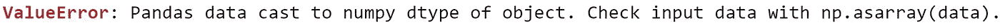
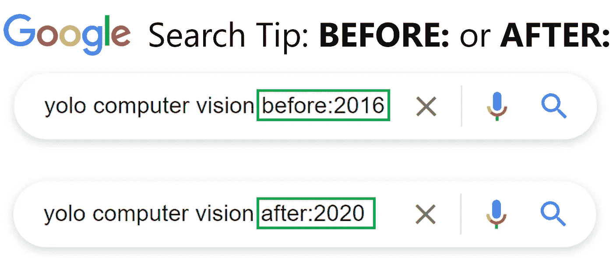

# 像经验丰富的数据科学家一样使用谷歌搜索的顶级技巧

> 原文：<https://towardsdatascience.com/top-tips-to-google-search-like-a-data-science-pro-897599f4d9ae>

# 像经验丰富的数据科学家一样使用谷歌搜索的顶级技巧

## 了解高级 Google 搜索功能，提高您查找数据科学解决方案的效率

[凯文泽尔](https://unsplash.com/@kai_wenzel?utm_source=medium&utm_medium=referral)在 [Unsplash](https://unsplash.com?utm_source=medium&utm_medium=referral) 上拍照

在一个经验丰富的数据从业者应该具备的许多技能中，**准确高效地用谷歌搜索答案的能力**名列前茅。

在本文中，探索 Google 搜索技巧，帮助您更快更好地搜索数据科学解决方案和想法。

# 内容

> ***(1)*** [*确切的*](#8f33)***(2)***[*排除*](#3a1c)***(3)***[*站点*](#74b6)

# *(1)精确*

*虽然简单的搜索词通常工作良好，但带有多个关键字的较长搜索词可能会返回与我们想要的不匹配的混合结果。*

*一个很好的例子是寻找我们在编写数据科学项目时遇到的错误消息的解决方案。以下错误是我最近用[*stats model*](https://www.statsmodels.org/stable/index.html)*包运行线性回归模型时得到的一个。**

****

**找到准确答案的技巧是使用引号( **" "** )来括住我们冗长的搜索词。**

****

**作者图片**

**这样，我们会看到我们的搜索结果已经大大缩小到那些直接回答我们的问题。**

# **(2)排除**

**有时候，我们不希望特定的术语作为搜索的一部分被返回，尤其是当结果往往由特定的主题所主导时。**

**例如，我们可能想知道如何在除 Python 之外的其他编程语言**中实现**XGBoost**算法。这种排除可以通过在要排除的术语后加上连字符( **-** )来实现。****

****

**作者图片**

**结果将是 R 和 KNIME 等其他流行软件中关于 XGBoost 的信息。**

# **(3)场地**

**如果我们只想要特定网站的结果，我们可以在搜索词中包含 **SITE:** 。**

**例如，我们想要搜索可信赖的 **StackOverflow** 来找出如何使我们的 **matplotlib** 图显示为全屏图像。**

****

**作者图片**

**搜索结果将显示与我们的特定查询相关的 **StackOverflow** 网站的链接。**

# **(4)文件类型**

**在我们的数据科学工作过程中，我们可能希望找到特定文件类型的项目(例如，图像、文档)。**

**例如，我们可能正在寻找斯坦福大学最新人工智能报告的 **PDF 版本**。为此，我们可以在搜索中包含**文件类型:**。**

****

**作者图片**

**然后我们会看到一个 pdf 文件结果的列表，最上面的结果将是我们斯坦福大学的'[人工智能指数报告 2021](https://aiindex.stanford.edu/wp-content/uploads/2021/11/2021-AI-Index-Report_Master.pdf) '。**

# **(5)日期范围**

**数据科学是一个快速发展的领域，每年都有许多进步。如果我们想要特定年份之前或之后的信息，我们可以在搜索中包括之前的**:**或之后的**:**。**

**例如，我们想了解更多关于计算机视觉中 YOLO 算法的最早**和最新**版本的出版物。**

****

**作者图片**

**此外，如果我们希望在某个时间段内找到结果，我们可以使用**双点** ( **..**)来指定日期范围。**

**例如，假设我们想了解更多关于 YOLO 算法在 2016 年和 2020 年之间的多次迭代。**

****

**作者图片**

# **(6)通配符**

**如果我们对想要搜索的内容只有一个模糊的概念，我们可以在搜索词中使用通配符星号作为占位符。谷歌搜索引擎会自动填充 ***** 作为搜索的一部分。**

**例如，我们可能想要发现各种**云**平台，以构建和托管一个 **SQL 数据库**。**

****

**作者图片**

**搜索结果将显示流行的云平台(如 GCP、AWS 等。)提供关系数据库服务。**

# **(7)逻辑运算符**

**如果搜索需要多个标准，我们可以使用 Google search 中可用的逻辑运算符来检索更准确的结果。**

**例如，假设我们想要找到用 Python 或 R. 构建**数据可视化仪表板的资源，在这种情况下，我们可以使用**|**(‘or’操作符)并将它们放在括号 **()** 中，将其与下面的搜索词链接起来。****

****

**作者图片**

**搜索结果将显示与 Python 和 r。**

# **在你走之前**

**欢迎您来到**加入我的数据科学学习之旅！**关注我的 [Medium](https://kennethleungty.medium.com/) 页面，查看我的 [GitHub](https://github.com/kennethleungty) ，了解更多精彩的教育数据科学内容。同时，祝你谷歌搜索愉快！**

** [## F1 分数的微观、宏观和加权平均值，解释清楚

### 理解多类分类中 F1 分数的微观平均值、宏观平均值和加权平均值背后的概念

towardsdatascience.com](/micro-macro-weighted-averages-of-f1-score-clearly-explained-b603420b292f)  [## H2O AutoML、MLflow、FastAPI 和 Streamlit 的端到端 AutoML 管道

### 关于使用一系列功能强大的工具来培训和服务 AutoML 管道的简单易懂的综合指南

towardsdatascience.com](/end-to-end-automl-train-and-serve-with-h2o-mlflow-fastapi-and-streamlit-5d36eedfe606)  [## MLOps 专业化认证的关键学习点—课程 1

### 面向生产的机器学习工程课程 1 的主要课程(包括课堂讲稿)

towardsdatascience.com](/key-learning-points-from-mlops-specialization-course-deeplearning-ai-andrew-ng-5d0746605752)**