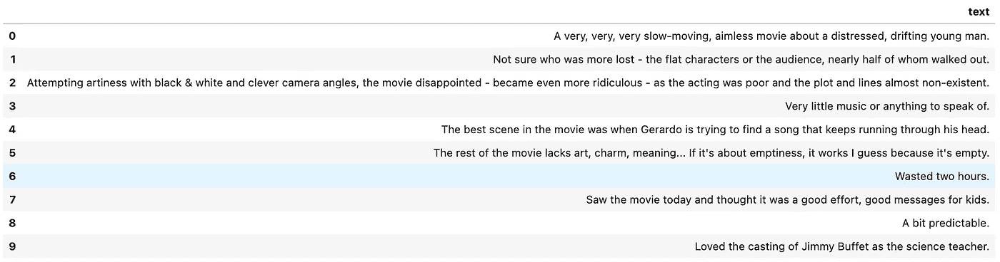
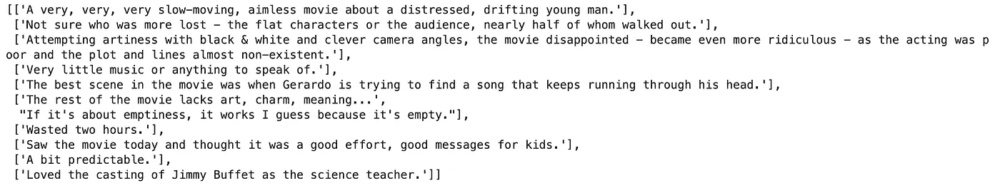
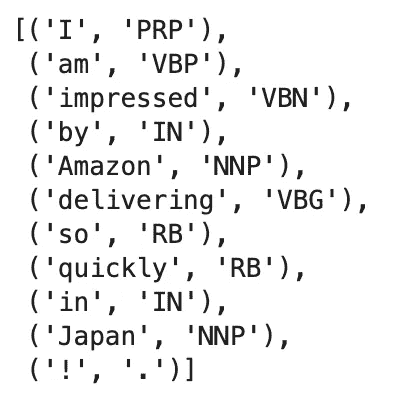
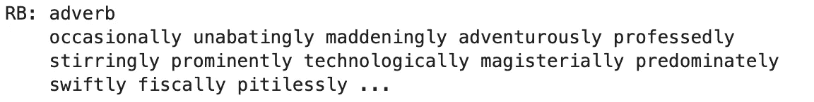
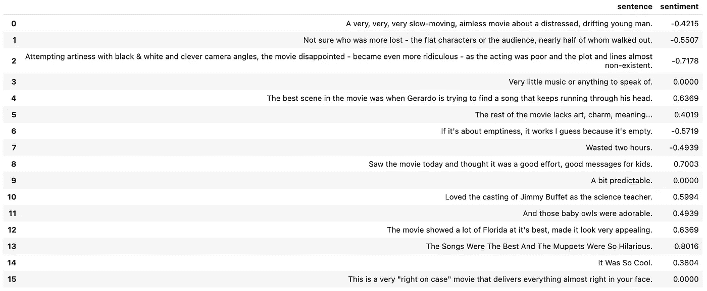
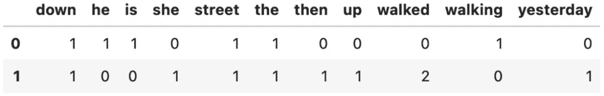
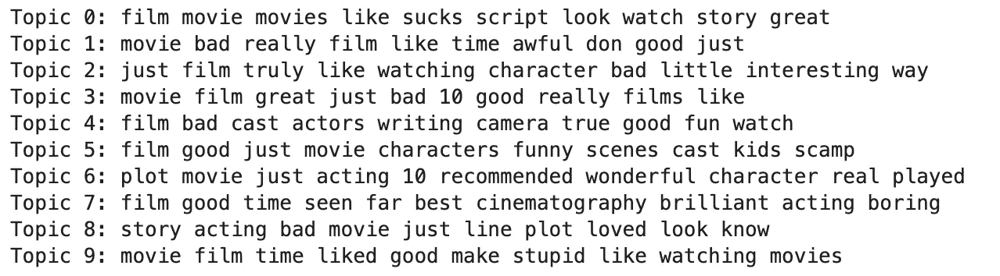
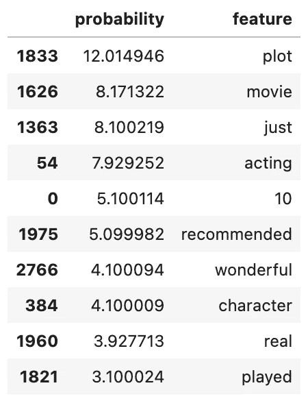

# 主题建模——介绍和实现

> 原文：<https://towardsdatascience.com/topic-modeling-intro-and-implementation-927d6463b892>

## 使用 NLTK 进行主题建模的简短教程


成堆的书。E 2

企业与他们的客户互动，以更好地了解他们，也改善他们的产品和服务。这种互动可以采取电子邮件、文本社交媒体帖子(如 Twitter)、客户评论(如 Amazon)等形式。让人类代表浏览所有这些形式的文本通信，然后将这些通信路由到相关团队以对客户进行审查、采取行动和/或做出响应，这将是低效且成本高昂的。将这样的交互分组并分配给相关团队的一种廉价方法是使用主题建模。

自然语言处理(NLP)环境中的主题建模是一种无监督(即，数据未被标记)的机器学习任务，其中算法的任务是基于文档的内容将主题分配给文档集合。给定的文档通常包含不同比例的多个主题，例如，如果文档是关于汽车的，我们将期望汽车的名称比某些其他主题(例如，动物的名称)更显著地出现，而我们期望诸如“the”和“are”之类的某些词以几乎相等的比例出现。主题模型实现了数学方法来量化给定文档集合中这种主题的概率。

在本帖中，我们将扩展我们的 NLP 知识深度，作为[数据科学家角色要求](https://medium.com/@fmnobar/data-scientist-role-requirements-bbae1f85d4d5)的一部分。我们将首先围绕标记化、词性和命名实体识别的概念建立一些基础知识。然后，我们将实现一个情感分析练习，最后使用潜在的狄利克雷分配进行主题建模。

和我的其他帖子类似，学习会通过练习问答来实现。我将根据需要在问题中包含提示和解释，以使旅程更容易。最后，我用来创建这个练习的笔记本链接在文章的底部，你可以下载，运行和跟随。

我们开始吧！

*(所有图片，除非特别注明，均为作者所有。)*

<https://medium.com/@fmnobar/membership>  

# 数据集

为了实现这篇文章中涵盖的概念，我们将使用来自 [UCI 机器学习知识库](https://archive.ics.uci.edu/ml/datasets/sentiment+labelled+sentences)的数据集，该数据集基于论文“使用深度特征从组到个体标签”([Kotzias et al .al，2015](http://www.datalab.uci.edu/papers/kdd2015_dimitris.pdf) )并且可以从[这个链接](https://gist.github.com/fmnobar/88703ec6a1f37b3eabf126ad38c392b8)下载(CC BY 4.0)。

让我们从导入我们今天将使用的一些库开始，然后读取数据集并查看数据帧的前 10 行。每个命令前都有注释来进一步解释这些步骤。

```
# Import libraries
import pandas as pd
import numpy as np
import nltk

# Making the full width of the columns viewable
pd.set_option('display.max_colwidth', None)

# Making all rows viewable
pd.set_option('display.max_rows', None)

# Read the data set and drop the df['label'] column
df = pd.read_csv('imdb_labelled.csv').drop('label', axis = 1)

# Taking out a list of strings to clean up the data
df = df.replace(['\n', '\t1', '\t0'],'', regex=True)

# Return top 10 rows of the dataframe
df.head(10)
```

结果:



# 教程+问答

## 标记化

标记化是指将文本字符串分解成更小的子字符串。这些子字符串可以位于不同的级别。例如，一个句子级的标记化策略将一个给定的字符串分解成句子，而其他标记化器可以将一个句子分解成更小的标记，如单词、二元模型等。在这个练习中，我们只需要将字符串分解成句子和单词，所以我不会深入研究其他标记化策略，但是如果你有兴趣了解更多，我有另一个帖子[链接到这里](https://medium.com/towards-data-science/sentiment-analysis-intro-and-implementation-ddf648f79327)，在这里我将更详细地介绍标记、二元模型和 N-gram。

**问题 1:**

定义一个名为“make_sentences”的函数，它接受一个系列作为它的参数，默认为我们的数据帧的“text”列的前 15 行，将每个条目分解成句子并返回这样的句子的列表。然后将该函数应用于数据帧的前 10 行。

***提示:*** *使用* `*nltk.sent_tokenize*` *，将一个给定的字符串分成一个句子级别的子字符串列表。*

**答案:**

```
# Import packages
from nltk import sent_tokenize

# Define the function
def make_sentences(text = df['text'].head(15)):

    # Define a lambda function to apply the sent_tokenize to the df['text']
    return text.apply(lambda x: sent_tokenize(x)).tolist()

# Return the results for the top 10 rows of the dataframe
make_sentences(df['text'].head(10))
```

结果:



## 词性

到目前为止，我们可以把给定的字符串分成句子，句子由单词的集合组成。单词可以分解成词汇类别(类似于分类机器学习任务中的类)，包括名词、动词、形容词、副词等。这些词汇组在自然语言处理中被称为词类。将词性自动分配给单词的过程称为词性标注，这是 NLP 管道的常见步骤。标记在各种 NLP 任务中非常有用，例如，在机器翻译中，任务是提供输入文本(原始语言)的翻译(目标语言)。如果原始文本输入包括一个人的名字，我们不希望机器翻译模型翻译这个名字。确保这一点的一种方法是将那个人的名字标记为实体，然后当有标记的实体时，该模型将被绕过。换句话说，除了那个标记的实体之外，句子中的其他所有内容都将被翻译。然后，在最后，作为后处理步骤的一部分，标记的实体将被映射到最终翻译结果中的正确位置。

有各种方法来创建标记策略，例如基于正则表达式的或甚至训练过的机器学习模型。在今天的练习中，我们将依靠 NLTK 提供的现有的词性标注。让我们看一个例子来更好地理解这个概念。

让我们从创建一个样本字符串开始，然后通过 NLTK 的 POS 标记器运行它并检查结果。

```
# Create a sample sentence
sample = 'I am impressed by Amazon delivering so quickly in Japan!'

# Import required libraries
from nltk import word_tokenize, pos_tag

# Break down the sample into word tokens
tokens = word_tokenize(sample)

# Create POS tagging
pos = pos_tag(tokens)

# Return the POS tag results
pos
```

结果:



现在我们看看标记结果是什么样的。例如，“快速”被标记为“RB”，这意味着一个副词，或者“亚马逊”被标记为“NNP”，这意味着一个名词。NLTK 为标签提供了文档。例如，如果我们想知道“RB”指的是什么，我们可以运行以下命令:

```
nltk.help.upenn_tagset('RB')
```

结果:



如果您想查看所有的标签，您可以不带参数运行相同的命令。

## 命名实体识别

现在我们对句子中的每个单词都进行了词性标注，但并不是所有的名词都是相同的。例如，“亚马逊”和“日本”都被标记为“NNP”，但一个是公司名称，另一个是国家名称。命名实体识别或 NER(又名命名实体分块)涉及通过将给定的文本输入分类成预定义的类别，如个人、组织、位置等，来从给定的文本输入中提取信息。让我们看一个例子来看看这是如何工作的。

**问题二:**

首先将示例句子分解成标记，然后应用词性标注，接着进行命名实体识别并返回结果。

**回答:**

```
# Import required packages
from nltk import word_tokenize, pos_tag, ne_chunk

# Break down the sample into tokens
tokens = word_tokenize(sample)

# Create POS tagging
part_of_speach = pos_tag(tokens)

# Create named-entity chunks
named_entity_chunks = ne_chunk(part_of_speach)

# Return named_entity_chunks
named_entity_chunks
```

结果:


让我们看看结果，特别是“亚马逊”和“日本”，因为我们知道这两个是实体。亚马逊被归类为“人”，这是我们算法的改进机会。我更喜欢“公司”或类似的类别。然后“日本”被归类为 GPE，代表一个地缘政治实体。听起来没错！因此，我们观察了 NER 是如何帮助我们将名词进一步细分为实体类的。

现在我们已经学习了如何执行词性标注和 NER，让我们创建一个可以自动实现这些任务的函数。

**问题三:**

定义一个名为“make_chunks”的函数，它接受一个句子列表作为参数，默认为问题 1 中定义的“make_sentences”函数，并返回一个字典(将被称为外部字典)，其中外部字典的键是一个整数，表示条目的行号。外部字典的值是字典本身(将被称为内部字典)，其中内部字典的关键字是句子编号，内部字典的值是命名实体识别的结果(类似于问题 2)。例如，回顾问题 1 的结果，结果的第六行是以下句子列表:

```
['The rest of the movie lacks art, charm, meaning...',  
"If it's about emptiness, it works I guess because it's empty."],
```

因此，使用默认参数运行问题 3 中定义的函数，预计会为第六行返回以下内容:

```
5: {
     0: [('The', 'DT'),
         ('rest', 'NN'),
         ('of', 'IN'),
         ('the', 'DT'),
         ('movie', 'NN'),
         ('lacks', 'VBZ'),
         ('art', 'RB'),
         (',', ','),
         ('charm', 'NN'),
         (',', ','),
         ('meaning', 'NN'),
         ('...', ':')
     ],
     1: [('If', 'IN'),
         ('it', 'PRP'),
         ("'s", 'VBZ'),
         ('about', 'IN'),
         ('emptiness', 'NN'),
         (',', ','),
         ('it', 'PRP'),
         ('works', 'VBZ'),
         ('I', 'PRP'),
         ('guess', 'NN'),
         ('because', 'IN'),
         ('it', 'PRP'),
         ("'s", 'VBZ'),
         ('empty', 'JJ'),
         ('.', '.')
     ]
 },
```

**回答:**

为了定义这个函数，我们将遍历两个字典，其中内部字典将包括标记化、词性标注和 ner，类似于这个问题之前的例子。

```
# Define the function
def make_chunks(make_sentences = make_sentences):

    # Create the outer dictionary with row number as key
    row_dict = dict()

    # Form the first iteration
    for i, row in enumerate(make_sentences()):

        # Create the inner dictionary with sentence number as key
        sent_dict = dict()

        # Form the second iteration
        for j, sent in enumerate(row):

            # Tokenize
            w = word_tokenize(sent)

            # POS tagging
            pos = pos_tag(w)

            # Add named-entity chunks as the values to the inner dictionary
            sent_dict[j] = list(ne_chunk(pos))

        # Add the inner dictionary as values to the outer dictionary
        row_dict[i] = sent_dict

    # Return the outer dictionary
    return row_dict

# Test on the sixth row of the dataframe
make_chunks()[5]
```

结果:

```
{0: [('The', 'DT'),
  ('rest', 'NN'),
  ('of', 'IN'),
  ('the', 'DT'),
  ('movie', 'NN'),
  ('lacks', 'VBZ'),
  ('art', 'RB'),
  (',', ','),
  ('charm', 'NN'),
  (',', ','),
  ('meaning', 'NN'),
  ('...', ':')],
 1: [('If', 'IN'),
  ('it', 'PRP'),
  ("'s", 'VBZ'),
  ('about', 'IN'),
  ('emptiness', 'NN'),
  (',', ','),
  ('it', 'PRP'),
  ('works', 'VBZ'),
  ('I', 'PRP'),
  ('guess', 'NN'),
  ('because', 'IN'),
  ('it', 'PRP'),
  ("'s", 'VBZ'),
  ('empty', 'JJ'),
  ('.', '.')]}
```

正如所料，结果与问题中提供的示例相匹配。

## 情感分析

在自然语言处理领域，情感分析是从文本数据中识别、量化、提取和研究主观信息的工具。在这个练习中，我们将使用极性得分，这是一个在[-1.0，1.0]范围内的浮动值，旨在区分文本是积极还是消极的情绪。这种熟悉程度足以满足这篇文章的目的，但如果你有兴趣了解更多，请参考我关于情绪分析的文章[，链接于此](https://medium.com/towards-data-science/sentiment-analysis-intro-and-implementation-ddf648f79327)。我们一起来看一个例子。

**问题 4:**

创建一个接受句子列表作为参数的函数，默认为问题 1 中定义的“make_sentences”函数，然后返回一个包含“句子”和“情感”两列的 dataframe。请使用 NLTK 的“SentimentIntensityAnalyzer”进行情感分析。最后，使用默认参数运行函数并返回结果。

**回答:**

```
# Import the package
from nltk.sentiment.vader import SentimentIntensityAnalyzer

# Define the function
def sentiment_analyzer(make_sentences = make_sentences):

    # Create an instance of SentimentIntensityAnalyzer
    sia = SentimentIntensityAnalyzer()

    # Create the dataframe with two columns as described
    df = {
        'sentence' : []
        , 'sentiment' : []
    }

    # Create two loops to add the column vlaues
    for i, row in enumerate(make_sentences()):
        for sent in row:

            # Add the sentence to the dataframe
            df['sentence'].append(sent)

            # Add the polarity score of the sentiment analysis to the sentiment column of the dataframe
            df['sentiment'].append(sia.polarity_scores(sent)['compound'])

    # Return the dataframe
    return pd.DataFrame(df)

# Run the function
sentiment_analyzer()
```

结果:



## 主题建模——潜在的狄利克雷分配

潜在狄利克雷分配(LDA)是用于主题建模的常用模型之一。虽然探索 LDA 的数学细节超出了本文的范围，但我们可以将它视为一个将单词与主题和文档联系起来的模型。例如，当一组文档被提供给 LDA 模型时，它将查看单词，并根据每个文档中包含的单词，为每个文档分配具有各自概率的主题。

幸运的是，LDA 可以在 scikit-learn 中轻松实现。NLTK 的 LDA 类接受文档术语矩阵(DTM)作为参数，因此，让我们回顾一下什么是 DTM，然后我们将看一个使用 scikit-learn 的 LDA 模型进行主题建模的例子。

## 文档术语矩阵

DTM 是一个矩阵，表示在文档集合中出现的术语的频率。让我们看两个句子来理解 DTM 是什么。

假设我们有以下两个句子(在本例中，每个句子都被视为一个“文档”):

```
sentence_1 = 'He is walking down the street.'

sentence_2 = 'She walked up then walked down the street yesterday.'
```

DTM 的上述两句话将会是:



DTM 可以使用 scikit-learn 的计数矢量器来实现。这将满足我们当前练习的目的，但如果你有兴趣了解更多关于 DTM 的知识，请访问我在情感分析上的帖子，[链接于此](/sentiment-analysis-intro-and-implementation-ddf648f79327)。

让我们把目前所学的东西付诸实践。我们将实施以下步骤:

1.  导入 DTM 和 LDA 所需的包并实例化它们
2.  为我们的数据框架的“文本”列创建一个 DTM
3.  使用 LDA 为提供的 DTM 创建主题

```
# Step 1 - Import packages
from sklearn.decomposition import LatentDirichletAllocation
from sklearn.feature_extraction.text import CountVectorizer

# Create an instance of the imported packages
lda = LatentDirichletAllocation()
cvect = CountVectorizer(stop_words='english')

# Step 2 - Create a DTM of 50 randomly-selected rows of the dataframe
dtm = cvect.fit_transform(df['text'])

# Step 3 - Create list of topics using LDA
topics = lda.fit_transform(dtm)
```

既然我们已经做好了模型，让我们来看看每个话题都包括哪些单词。可以使用`lda.components_`查看模型的结果。让我们看一个例子。

**问题 5:**

定义一个名为“top_n_words”的函数，它接受两个参数:
1。“特征名称”，这是从 DTM
2 产生的特征名称。“n”，这是将要返回的行数和字数。

该函数接受上面的两个参数，并返回 n 个主题以及该主题中的前 n 个单词。例如，第一个主题的结果可能如下:

```
Topic 0: film ve really end movies just dialogue choked drama worthless
```

最后，运行函数，返回每个主题的前 10 个单词。

**回答:**

```
# Define the function
def top_n_words(feature_names, n): 

    for topic_index, topic in enumerate(lda.components_):

        # Create the "Topic {index}:" portion of the output
        output = "Topic %d: " % topic_index 

        # Add the top n words of that topic
        output += " ".join([feature_names[i] for i in topic.argsort()[:-n - 1:-1]])

        # Print the output
        print(output)

    # Print the output
    print()

# Create function names from the DTM
feature_names = cvect.get_feature_names_out()

# Run the function for top 10 words of each topic
top_n_words(feature_names, n=10)
```

结果:



**问题 6:**

定义一个函数，它接受两个参数“search_word”和“n ”,并返回与“search_word”中提供的主题相关的前“n”个最可能的单词。结果应该是数据帧的形式，包含两列。第一列是每个单词的“概率”，第二列是“特征”或与提供的主题相关的单词(即“search_word”)。最后，使用“action”作为“search_word”运行该函数，并返回与该主题相关的前 10 个单词。

**回答:**

```
# Define the function
def word_feature(search_word, n=10):
    search_word_cvect = cvect.transform(np.array([search_word])) 
    probabilities = lda.transform(search_word_cvect)
    topics = lda.components_[np.argmax(probabilities)]
    features = cvect.get_feature_names_out()
    return pd.DataFrame({'probability': topics, 'feature': features}).nlargest(n, 'probability')

# Run the function for the given search_word and return top 10 results
word_feature('action', n=10)
```

结果:



# 带练习题的笔记本

下面是带问题和答案的笔记本，您可以下载并练习。

# 结论

在这篇文章中，我们讨论了如何使用机器学习，特别是主题建模来将一组文档分组在一起，这可以促进企业的下游任务，处理大量以电子邮件、社交媒体帖子、客户评论等形式传入的文本数据。我们从建立所需的直觉和基础开始，涵盖了标记化、词性和命名实体识别，然后是情感分析和主题建模的实现，使用潜在的狄利克雷分配。

# 感谢阅读！

如果你觉得这篇文章有帮助，请[在媒体](https://medium.com/@fmnobar)上关注我，订阅接收我的最新文章！