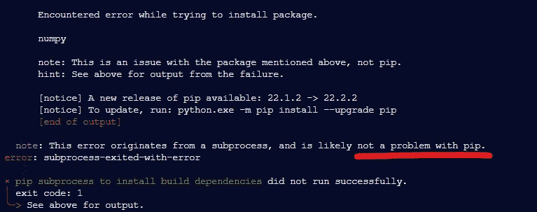
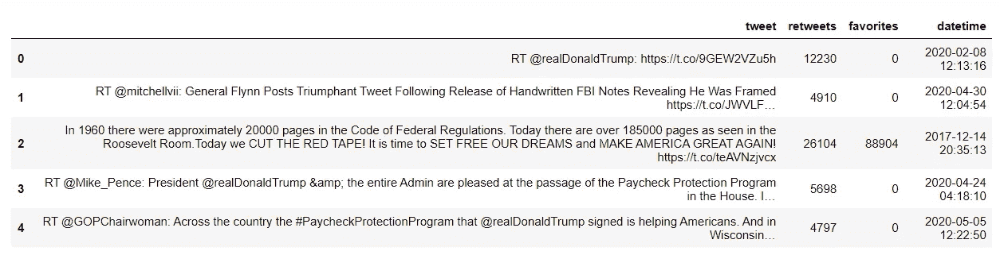
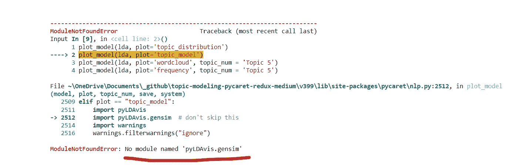
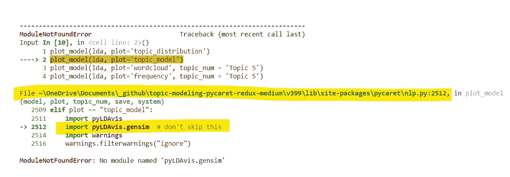
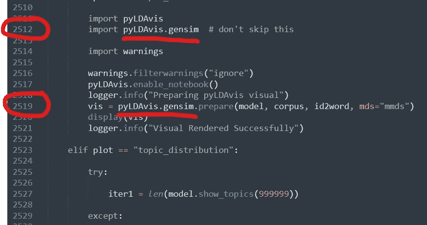
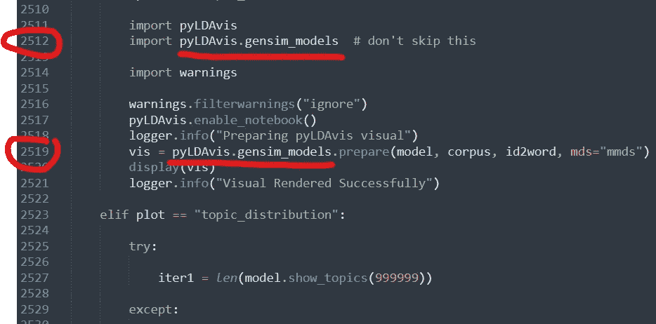
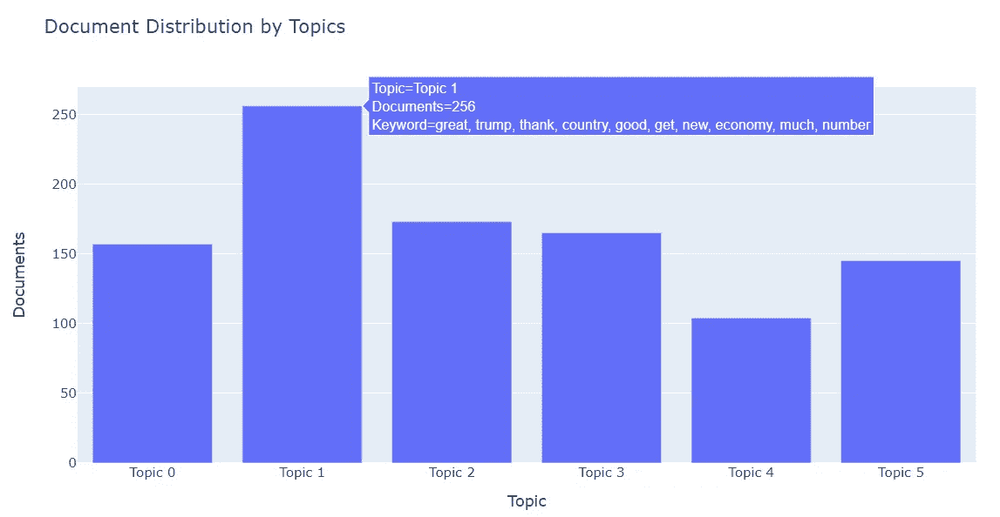
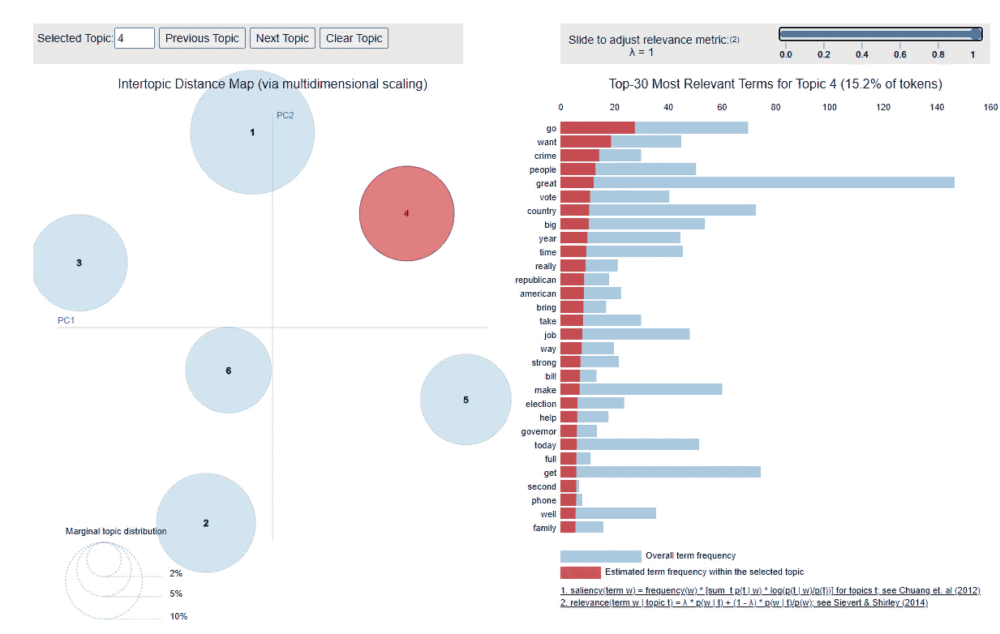

# PyCaret — Redux 上的主题建模

> 原文：<https://towardsdatascience.com/topic-modeling-on-pycaret-redux-46cd8e4869f4>

## 数据科学/ PYTHON NLP 片段

## PyCaret 自然语言处理模块初学者指南


照片由 [Unsplash](https://unsplash.com?utm_source=medium&utm_medium=referral) 上的[尼克·费因斯](https://unsplash.com/@jannerboy62?utm_source=medium&utm_medium=referral)拍摄

*我以前说过，现在我再说一遍，“我们从数据到见解的速度越快，我们的境况就越好。”*

PyCaret 可以帮助我们做到这一点。通过几行 Python 代码，它帮助我们比以往任何时候都更快地获得洞察力。

*那么，PyCaret 是什么？*

> PyCaret 是 Python 中的一个开源、低代码机器学习库，允许您在几秒钟内从准备数据到在您选择的笔记本环境中部署模型。

换句话说，PyCaret 让数据科学变得更加简单。

像往常一样，我不会告诉你所有的事情，而是给你看。

# 家政

首先，让我们安装 PyCaret。在终端中键入以下内容:

```
pip install pycaret
```

但是等等，一个问题！

> "安装构建依赖项的 pip 子进程没有成功运行"



作者截图

没起作用？您可能正在使用不兼容的 pip 最新版本。让我们稍微降级一下:

```
python.exe -m pip install pip==21.3.1
```

其次，我们将下载一些语言包。对于英语语言模型，在终端中一次键入以下一行:

```
python -m spacy download en_core_web_smpython -m textblob.download_corpora
```

第三，让我们安装我们最好的朋友，熊猫:

```
pip install pandas
```

现在，我们准备好摇滚了。

# 摇滚

让我们开始一个 Jupyter 笔记本，让我们做一些编码！

上面，我们只是简单地导入 PyCaret 的 NLP 模块，当然还有 pandas。其他代码块完全是可选的，但是很有帮助。第一个代码块让我们不必一直键入 print()语句，而第二个代码块让我们看到了数据帧的所有优点——也就是说，没有截断列和行。

接下来，我们将获取数据并将其加载到 dataframe 中。

对于这个实验的其余部分，我们将只处理一千条 tweets 的样本，以使我们的代码运行得更快。

让我们来看看我们的数据:



作者截图

现在让我们进入这个小项目的核心部分。不要忘记更改目标，因为它适用于您的数据。在本例中，我要分析的 dataframe 列在“tweet”列中，所以这就是我放在 setup()的目标参数中的内容。

在短短的三行代码中，我们预处理了文本数据，定制了停用词，创建了模型，并将模型分配回我们的数据框架。

现在是时候进行一些可视化了！

唉，没那么快。如果您遇到了下面的错误，不要惊慌。

# 打嗝

> ModuleNotFoundError:没有名为“pyLDAvis.gensim”的模块



作者截图

让我们阅读错误消息，寻找如何纠正问题的线索。

在这种情况下，脚本没有找到 pyLDAvis.gensim 模块，因为它更改了名称。以前的“gensim”现在是“gensim_models ”,修复这个问题只需要修改 pycaret 包中的两行代码。

是的，我们将改变库本身的代码，因为它已经过时了。



作者截图

上面的错误告诉我们查看“nlp.py”文件的第 2512 行。让我们简单地转到目录，找到文件进行一些编辑。



在“nlp.py”文件的第 2512 行和第 2519 行，我们发现两个 pyLDAvis.gensim 需要更改为“pyLDAvis.gensim_models”。让我们更改它们并保存文件。



作者截图

在改变生效之前。我们需要重启笔记本电脑的内核。

简单地运行所有的单元格，我们不应该得到任何更多的错误。

以下是一些输出:



作者截图



作者截图


作者截图

# 结论

使用 PyCaret 的 NLP 模块，我们已经看到了如何通过几行代码快速地从获取数据到洞察。

感谢您的阅读！PyCaret 的 NLP 模块有更多的特性，我鼓励您阅读他们的文档来进一步熟悉这个模块，甚至整个库！

请登录查看

[](https://pycaret.org/)  

# *敬请期待！*

你可以通过[推特](https://twitter.com/ecdedios)或 [LinkedIn](https://www.linkedin.com/in/ednalyn-de-dios/) 联系我。

[1] PyCaret。(2020 年 6 月 4 日)。*为什么是 PyCaret* 。[https://pycaret.org/](https://pycaret.org/)