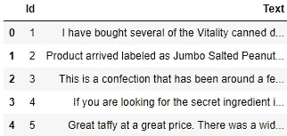
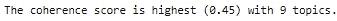
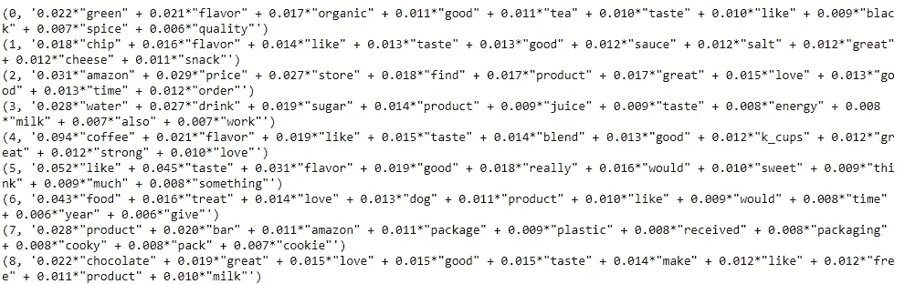
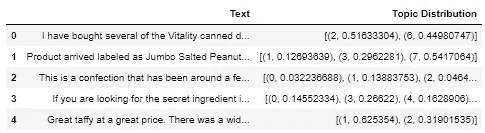
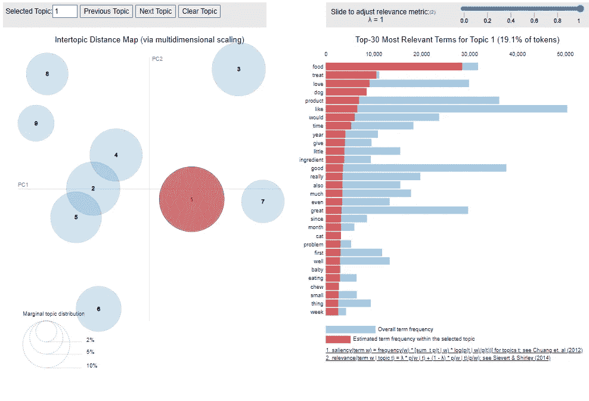

# 基于潜在狄利克雷分配的主题建模

> 原文：<https://towardsdatascience.com/topic-modeling-with-latent-dirichlet-allocation-ea3ebb2be9f4>

## 自然语言处理中一种流行建模技术的综述与实现

布雷特·乔丹在 [Unsplash](https://unsplash.com?utm_source=medium&utm_medium=referral) 上的照片

## 介绍

随着大量数据以文档的形式出现，例如文章、电子邮件和简历，对组织、总结、访问和解释这些数据的方法有了新的需求。

这就是主题建模发挥作用的地方。

主题建模是一种无监督的学习技术，在给定的文档集合中挖掘潜在的“主题”。它能够根据主题对文档进行分组或划分，这使它成为企业非常宝贵的资产。主题建模存在于许多应用中，例如推荐系统和搜索引擎。

主题建模最流行的方法之一是潜在狄利克雷分配(LDA)。

在这里，我们提供了一个关于 LDA 的快速概要，并演示了如何使用 Python 来执行它。

## 皱胃向左移

执行 LDA 需要用概率模型捕获给定文档集合中的信息。

这项技术基于以下两个假设:

1.  每个文档都包含多个主题
2.  每一个主题都由单词组合而成

LDA 用主题概率表示文档，用词概率表示主题。

由于 LDA 背后的算法，使用这种主题建模方法需要大量的计算。

幸运的是，有了 Python 的 NLP 模块(我们将很快介绍)，所有繁重的工作都为您完成了。任何给定文档集合的实际 LDA 模型都可以用最少的代码构建！

在这种情况下，我们可以坐视引用栈溢出，让我们的程序为我们做所有的工作，对吗？

不完全是。

## 挑战

虽然由于 Python 强大的模块，LDA 中的计算并不难执行，但在进行 LDA 时，用户需要做出一些关键决定。

首先，一个给定的数据集应该有多少个主题？这是用户定义的参数。如果分配的主题数量不适合给定的文档集，任何从文档中获取主题的努力都将失败。

此外，在建立 LDA 模型之后，你将会得到每个主题的单词概率。请记住，LDA 是一种无监督的学习技术，因此用户的工作是根据每个主题所关联的单词来决定每个主题代表什么。即使 LDA 模型是健壮的，如果它的结果是不可理解的，它也没有用。

## 个案研究

为了巩固对这种主题建模方法的理解，使用真实数据来应用它是有益的。

LDA 可用于汇总大量数据。人们可以利用这种主题建模方法来识别文档中陈述的要点，而不是解析每个文档中的每个细节。

让我们使用 LDA 从评论集中挖掘话题。

在这个演示中，我们使用了亚马逊食品评论(无版权)的数据集，可以在这里访问。这是一个很大的数据集，所以我们将研究范围限制在前 100，000 条记录。

这是数据集的预览。

代码输出(由作者创建)

1.  **预处理**

当然，在执行 LDA 之前，需要对评论进行预处理，以便成功地进行分析。

首先，我们使用 [Gensim](https://radimrehurek.com/gensim/) 模块对评论进行标记。此外，我们小写所有字符，并删除任何标点符号。

接下来，我们将二元模型添加到标记化文档中。

最后，我们删除所有出现的停用词或短词，并使用 [NLTK](https://www.nltk.org/) 模块对剩余的标记执行词汇化。

为了查看预处理后数据是如何被修改的，我们可以将其添加到数据框中。

代码输出(由作者创建)

**2。创建文档术语矩阵和字典**

像大多数 NLP 模型一样，LDA 模型需要一个文档术语矩阵作为输入。它还需要语料库中所有单词的字典。

**3。确定主题数量**

在构建 LDA 模型之前，我们需要决定食品评论集合中的主题数量。

这可能很难确定，因为在任何给定的文档集合中没有多少主题的经验法则。因此，有不同的方法可以用来确定这个数字。

第一种方法是用不同数量的主题创建多个 LDA 模型，看看哪一个最容易解释。另一种方法是利用领域知识来确定这个值。

在这种情况下，我们将使用 coherence score 度量作为食品评论集合中有多少主题的指标。连贯性分数本质上是对分配给每个主题的单词在语义值方面有多相似的度量。分数越高越好。

让我们计算具有 2 到 10 个主题的 LDA 模型的一致性分数，并查看哪个数量的主题导致最高的一致性分数。

代码输出(由作者创建)

根据一致性得分指标，亚马逊食品评论中应该有 9 个潜在主题。

**4。构建 LDA 模型**

既然我们已经确定了主题的最佳数量，我们就可以构建 LDA 模型了。

**5。解读结果**

一旦建立了模型，我们就可以根据概率得分来查看哪些单词与每个主题的亲和力最强。

代码输出(由作者创建)

我们可以使用与每个主题相关的单词来解释主题，并找出它们所代表的内容:

主题 0:茶相关产品的评论

话题 1:美味小吃评论

主题 2:对产品质量的总体正面评价

话题 3:对含糖饮料的评论

议题 4:对咖啡相关产品的评论

主题 5:对产品口味的总体评价

主题 6:宠物食品评论

主题 7:关于产品包装的评论

主题 8:巧克力相关产品的评论

就这样，我们能够以 9 个主题的形式总结 10 万条食品评论中的数据。这些主题提供了客户谈论内容的大致概念。

我们还可以使用该模型来确定每个文档中的主题混合。

代码输出(由作者创建)

我们以第一篇美食评论为例。

评论:“我已经购买了几个活力罐装狗粮产品，发现它们的质量都很好。这种产品看起来更像炖肉，而不是加工过的肉，而且闻起来更香。我的拉布拉多很挑剔，她比大多数人都更喜欢这个产品。”

根据 LDA 模型，本综述包含主题 2 和主题 6。与主题 2 和主题 6 相关的单词证实了这次复习的主题任务。

**6。可视化结果(可选)**

虽然我们可以用已经提供给我们的信息来解释文档中的每个主题，但是可视化 LDA 的结果将增强后续的分析。

[pyLDAvis](https://pyldavis.readthedocs.io/en/latest/readme.html) 模块允许我们通过交互式可视化更好地解释 LDA 模型的结果。

代码输出(由作者创建)

交互式可视化以图表(左)和水平条形图(右)的形式出现。

图中的每个气泡代表一个主题。气泡的大小代表包含该主题的评论的比例，气泡越大，比例越高。气泡之间的距离代表主题之间的相似度；距离越短，话题越相似。

条形图中的条代表每个单词的词频。蓝色条显示了文档集合中的总术语频率，而红色条显示了所选主题的术语频率。

当然，在执行 LDA 时，创建这样一个工具并不是一个强制性的步骤，但是任何漂亮而实用的视觉辅助工具总是一个受欢迎的补充，因为它可以更容易地从研究中获得发现并向他人展示。

毕竟，谁不喜欢好的视觉效果呢？

## 结论

照片由 [Unsplash](https://unsplash.com?utm_source=medium&utm_medium=referral) 上的 [Prateek Katyal](https://unsplash.com/@prateekkatyal?utm_source=medium&utm_medium=referral) 拍摄

到目前为止，您已经对 LDA 的功能以及如何使用 Python 强大的模块来执行它有了大致的了解。

也就是说，这只是 LDA 作为主题建模方法的一个概述。如果你有兴趣了解更多关于 LDA 的内部运作，我强烈建议你从查看这篇[论文](https://www.jmlr.org/papers/volume3/blei03a/blei03a.pdf)开始。

我祝你在数据科学的努力中好运！

## 参考

1.  J.麦考利和 j .莱斯科维奇。从业余爱好者到行家:通过在线评论模拟用户专业知识的演变。WWW，2013。
2.  布莱，大卫和吴，安德鲁和乔丹，迈克尔。(2001).潜在狄利克雷分配。机器学习研究杂志。3.601–608.