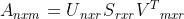
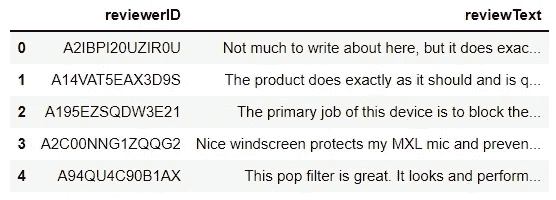
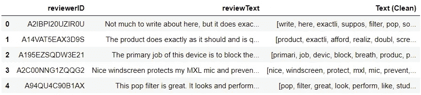
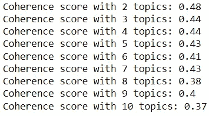
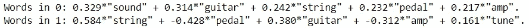
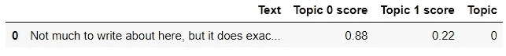
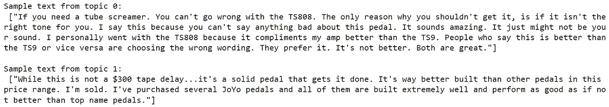

# 基于潜在语义分析的主题建模

> 原文：<https://towardsdatascience.com/topic-modeling-with-latent-semantic-analysis-58aeab6ab2f2>

## 探索一种从文本中提取主题的流行方法

布雷特·乔丹在 [Unsplash](https://unsplash.com?utm_source=medium&utm_medium=referral) 上的照片

想想目前流通的大量文本。新闻文章、博客文章、在线评论、电子邮件和简历都是大量存在的文本数据的例子。

由于大量非结构化数据以这些文档的形式涌入，我们需要一种自动化的方法来分析这些大量的文本。

这就是主题建模发挥作用的地方。主题建模是一种无监督的学习方法，允许我们从文档中提取主题。

它在诸如文档聚类和信息检索等许多应用中起着至关重要的作用。

在这里，我们提供了一个最流行的主题建模方法的概述:潜在语义分析。

## 重要的一点

在讨论潜在语义分析之前，理解“主题”在 NLP 中的含义是很重要的。

一个**主题**由一组强相关的单词定义。例如，单词“土豆”、“汤”和“吃”可以代表主题“食物”。

由于文档不受有限的一组单词的限制，它们通常包含多个主题。我们可以通过找到与文档最相关的主题，将文档分配给主题。

## 潜在语义分析

潜在语义分析(LSA)是一种允许我们通过将文本转换成单词-主题和文档-主题矩阵来从文档中提取主题的方法。

LSA 的程序相对简单:

1.  将文本语料库转换成文档术语矩阵
2.  实现截断奇异值分解
3.  用提取的主题对单词/文档进行编码

简单吧？

好吧，我可能忽略了一些细节。让我们一次检查一个步骤。

**1。将原始文本转换成文档术语矩阵**

在从文档中导出主题之前，必须将文本转换成文档术语矩阵。这通常通过单词袋或 TF-IDF 算法来完成。

**2。实现截断奇异值分解**

截断奇异值分解(SVD)是 LSA 的核心。该操作是从给定的文档集合中获取主题的关键。

数学上，可以用下面的公式来解释:

这个公式乍一看令人生畏，但它相当简单。

通俗地说，该操作将高维文档术语矩阵分解成 3 个更小的矩阵(U、S 和 V)。

变量 A 表示*文档术语矩阵*，在每个文档和单词对之间分配一个基于计数的值。该矩阵具有 n×m 个维度，其中 n 表示文档的数量，m 表示单词的数量。

变量 U 代表*文档-主题矩阵*。本质上，它的值显示了每个文档与其派生主题之间的关联强度。矩阵有 n×r 个维度，n 代表文档的数量，r 代表主题的数量。

变量 S 表示评估文档集合中每个主题的“强度”的对角矩阵。矩阵有 r×r 维，r 代表主题的数量。

变量 V 代表*词-主题矩阵*。它的值显示了每个单词和派生主题之间的关联强度。矩阵有 m×r 维，m 代表字数，r 代表题目数。

注意，虽然语料库中的文档和单词的数量总是恒定的，但是主题的数量不是固定的变量，因为它是由运行操作的人决定的。因此，SVD 的输出取决于您希望提取的主题数量。例如，与提取 4 个主题的 SVD 相比，提取 3 个主题的 SVD 将产生不同的矩阵。

**3。用衍生主题编码单词/文档**

通过 SVD 操作，我们能够将文档术语矩阵转换成文档主题矩阵(U)和单词主题矩阵(V)。这些矩阵允许我们找到与每个主题关联最强的单词。

我们可以使用这些信息来决定每个派生主题代表什么。

我们还可以确定哪些文档属于哪个主题。

## 限制

LSA 使我们能够快速有效地发现文档中的潜在主题。话虽如此，但它确实有自己的缺点。

首先，在进行 LSA 时，一些信息的丢失是不可避免的。

当文档被转换成文档-术语矩阵时，词序被完全忽略。由于词序在单词的语义值中起着很大的作用，省略它会导致主题建模过程中的信息丢失。

此外，LSA 无法解释同形异义或一词多义。因为该技术基于单词出现的上下文来评估单词，所以它不能识别具有多重含义的单词，也不能通过单词在文本中的使用来区分这些单词。

对于给定的一组文档，也很难确定主题的最佳数量。虽然在寻找表示文档集合的理想主题数量方面有几种思想流派，但是没有一种确定的方法可以实现这一点。

最后，LSA 缺乏可解释性。即使在成功地提取了具有强关联性的词语集的主题之后，从这些词语集中获得洞察力也是具有挑战性的，因为很难确定每组词语代表什么主题。

## **案例研究**

现在我们已经给出了 LSA 的概要，让我们看看如何用 Python 实现它。

这个案例研究将主要利用 [Gensim](https://radimrehurek.com/gensim/) 库，这是一个专注于主题建模的开源库。

我们将使用一个包含乐器评论的数据集，看看我们如何从中挖掘出主要话题。数据集(无版权)可以在这里获得[。](https://www.kaggle.com/eswarchandt/amazon-music-reviews?select=Musical_instruments_reviews.csv)

以下是数据预览:

代码输出(由作者创建)

第一步是将这些评论转换成文档术语矩阵。

为此，我们必须对文本进行一些预处理。这需要将所有文本小写，删除标点符号、停用词、短词(即少于 3 个字符的词)，并用词干将每个词还原为其基本形式。

所有这些都可以通过 preprocess_string 函数来实现，该函数将给定的文本转换成一系列经过处理的标记。

这是预处理后文本的快速预览。

代码输出(由作者创建)

现在，我们可以使用单词袋模型将这些经过处理的评论转换成文档术语矩阵。

接下来，我们必须对这个矩阵进行截断奇异值分解。在 Gensim 库中，我们可以使用 [LSImodel](https://radimrehurek.com/gensim/models/lsimodel.html) 来构建一个在给定矩阵上执行 SVD 的模型。

然而，在我们创建低维矩阵之前，我们需要确定应该从这些综述中提取的主题数量。

寻找最佳主题数量的一种方法是使用一致性分数度量。一致性分数实质上显示了来自每个主题的单词在语义值方面有多相似，较高的分数对应于较高的相似性。

同样，我们可以用 Gensim 模块获得一致性分数。让我们来看看 2 到 10 个主题的连贯性得分如何。

代码输出(由作者创建)

2 个主题的一致性得分最高，所以这是我们在执行 SVD 时将提取的主题数。

我们能够从文档术语矩阵中获得 2 个主题。这样一来，我们就可以看到哪些词与每个话题的关联最强，并推断出这些话题代表了什么。

让我们来看看与每个话题关联最强的 5 个单词。

代码输出(由作者创建)

根据给定的词，主题 0 可以表示针对使用产品时产生的声音或噪音的评论，而主题 1 可以表示针对设备本身的评论。

此外，我们可以看到模型为每个文档和主题配对分配了什么值。

如前所述，文档通常有多个主题。但是，有些主题与文档的关联比其他主题更强。因此，我们可以通过找到记录最高值的主题来确定文档属于哪个主题。

让我们看一个样本评论作为例子。

代码输出(由作者创建)

样本评论的主题 0 和主题 1 的得分分别为 0.88 和 0.22。虽然这两个主题都出现在评论中，但是主题 0 比主题 1 具有更高的价值，因此我们可以将该评论分配给主题 0。

让我们看看属于每个主题的评论。

代码输出(由作者创建)

主题 0 中的示例文本讨论了购买电子管尖叫器后乐器的声音，而主题 1 中的示例文本则更关注购买的踏板本身的质量。这符合两个衍生话题的解读。

## 结论

照片由 [Unsplash](https://unsplash.com?utm_source=medium&utm_medium=referral) 上的 [Prateek Katyal](https://unsplash.com/@prateekkatyal?utm_source=medium&utm_medium=referral) 拍摄

现在，您已经对如何使用 LSA 在一组文档中找到潜在主题有了一些了解。

虽然这种技术相对快速有效，但由于其局限性，应该谨慎使用。

我祝你在 NLP 的努力中好运！

## 参考

1.  麦考利法官(未注明)。*亚马逊产品数据*。亚马逊评论数据。于 2022 年 3 月 1 日从 http://jmcauley.ucsd.edu/data/amazon/取回