# 主题建模与 LSA、pLSA、LDA、NMF、BERTopic、Top2Vec 的比较

> 原文：<https://towardsdatascience.com/topic-modeling-with-lsa-plsa-lda-nmf-bertopic-top2vec-a-comparison-5e6ce4b1e4a5>

## 不同主题建模策略的比较，包括实际的 Python 例子

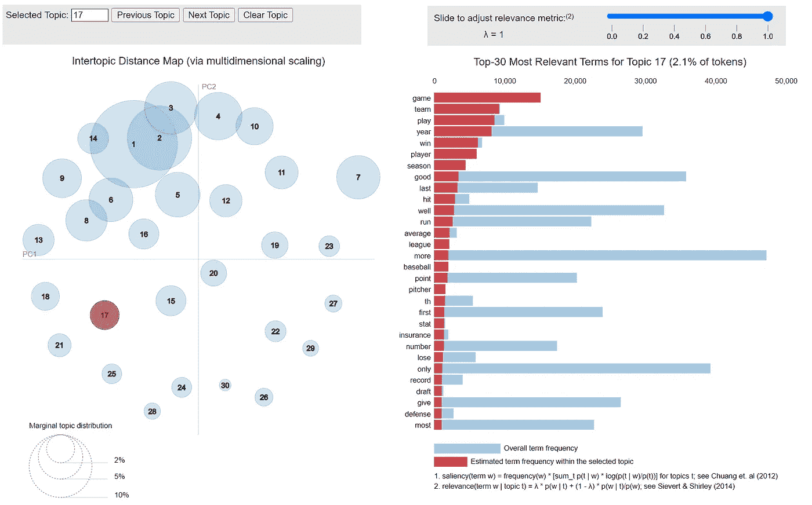

图片作者。

# 目录

1.  [简介](#b6e0)
2.  [话题建模策略](#ff29)
    2.1 [简介](#80de)
    2.2 [潜在语义分析(LSA)](#78f7)
    2.3 [概率潜在语义分析(pLSA)](#5a51)
    2.4 [潜在狄利克雷分配(LDA)](#1825)
    2.5 [非负矩阵分解(NMF](#aee1)
    2.6[BERTopic 和 Top2Vec](#5763)
3.  [对比](#e768)
4.  [附加备注](#5868)
    4.1 [一个题目不一定是我们所想的](#70a3)
    4.2 [题目不容易评价](#1ef5)
5.  [结论](#f916)
6.  [参考文献](#675c)

# 1.介绍

在自然语言处理(NLP)中，术语主题建模包含一系列统计和深度学习技术，以在文档集中找到隐藏的语义结构。

主题建模是一个*无监督的*机器学习问题。*无监督*意味着算法在没有标签或标记的情况下学习模式。

我们人类产生和交换的大多数信息都具有文本的性质。文档、对话、电话、消息、电子邮件、笔记、社交媒体帖子。在缺乏*先验*知识的情况下，从这些来源中自动提取价值的能力是数据科学中一个永恒且普遍存在的问题。

在这篇文章中，我们讨论了主题建模的流行方法，从传统算法到基于深度学习的最新技术。我们旨在分享一个**对这些模型的友好介绍**，以及**比较它们在实际应用中的优缺点**。

我们还为最主要的方法提供了端到端的 Python 示例。

最后，我们分享了关于无监督文本数据分析的两个最具挑战性的方面的一些考虑:人类对“主题”的定义与其统计对应物之间的差异，以及与主题模型性能的定量评估相关的困难。

# 2.主题建模策略

## 2.1 简介

**潜在语义分析(LSA)** (Deerwester 等，1990)**概率潜在语义分析(pLSA)** (Hofmann，1999)**潜在狄利克雷分配(LDA)** (Blei 等，2003)**非负矩阵分解** (Lee 等，1999)是传统的和众所周知的主题建模方法。

他们将文档表示为一个单词包，并假设每个文档都是潜在主题的混合物。

它们都是从将文本语料库转换成**文档术语矩阵(DTM)** 开始的，这是一个表格，其中每行是一个文档，每列是一个不同的单词:

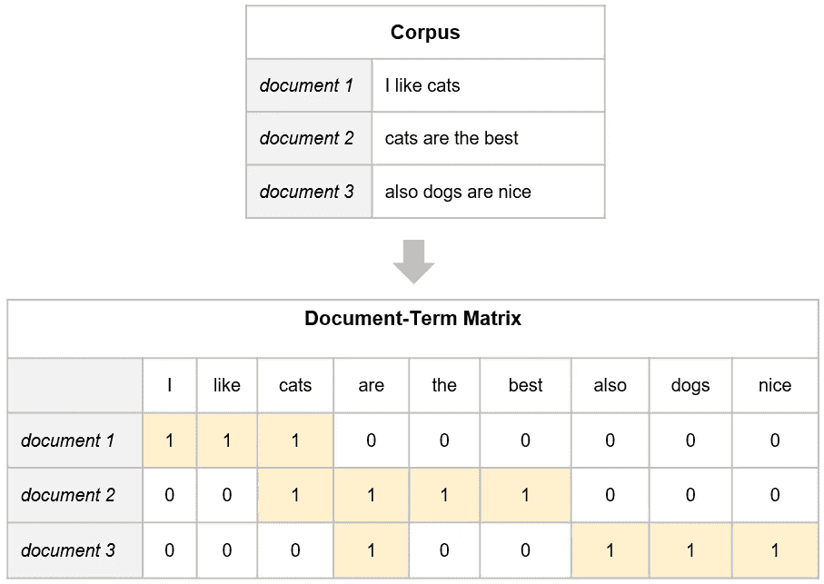

来自一组样本文档的文档术语矩阵。图片作者。

*注*:实施/研究论文也可能使用/参考术语文档矩阵(TDM)，即 DTM 的转置。

每个单元格`<i, j>`包含一个计数，即单词`j`在文档`i`中出现的次数。字数统计的一个常见替代方法是 **TF-IDF** 评分。它考虑了**词频(TF)** 和**逆文档频率(IDF)** 来惩罚在语料库中出现非常频繁的词的权重，并增加更罕见的词的权重:

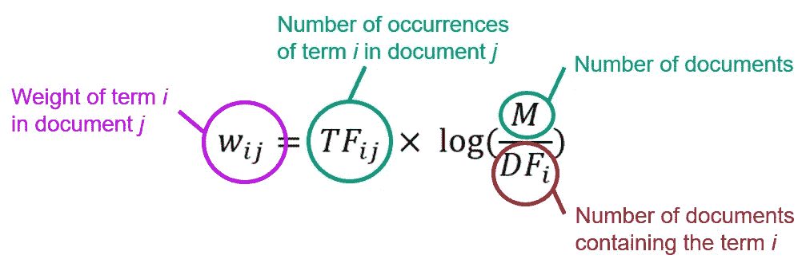

TF-IDF。图片作者。

潜在主题搜索的基本原理是将 DTM 分解为文档-主题和主题-术语矩阵。以下方法在定义和实现这一目标的方式上有所不同。

## **2.2 潜在语义分析(LSA)**

为了分解 DTM 和提取主题，**潜在语义分析(LSA)** 应用称为**单值分解(SVD)** 的矩阵分解技术。

SVD 将 DTM 分解为三个不同矩阵的乘积:`DTM = U ∙ Σ ∙ Vᵗ`，其中

*   `U`和`V`的大小分别为`m x m`和`n x n`，分别是文档的数量`m`和语料库中单词的数量`n`。
*   `Σ`是`m x n`，并且只有它的主对角线被填充:它包含 DTM 的奇异值。

LSA 选择 DTM 的前`t <= min(m, n)`个最大奇异值，从而分别丢弃`U`和`V`的最后`m - t`和`n - t`列。这个过程被称为**截断奇异值分解**。得到的 DTM 近似值的等级为`t`，如下图所示。

就 L₂范数而言，DTM 的秩`t`近似是最接近 DTM 的秩`t`矩阵，从这个意义上说，DTM 的秩`t`近似是最佳的。剩下的列`U`和`V`可以解释为文档-主题和单词-主题矩阵，`t`表示主题的数量。

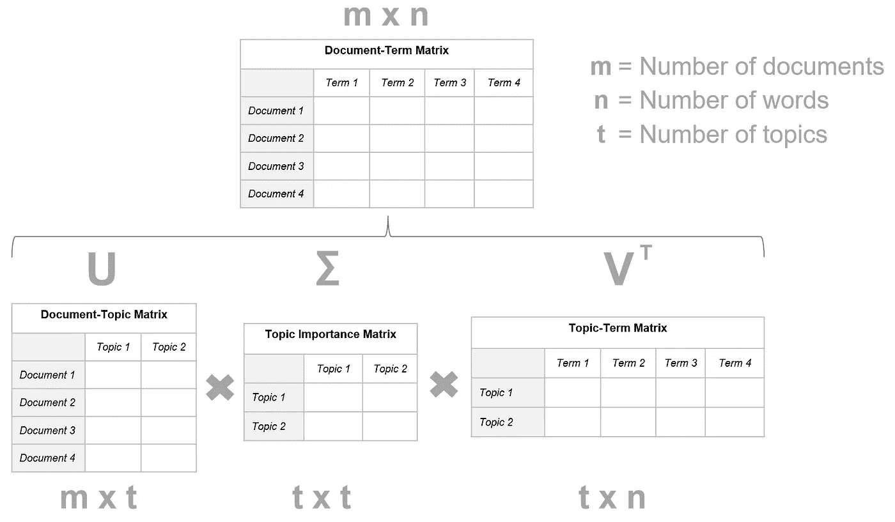

在文档术语矩阵(DTM)上截断 SVD 以提取潜在变量(主题)。图片作者。

**优点**:

*   直觉。
*   它既适用于短文档，也适用于长文档。
*   主题通过`V`矩阵向人类解释开放。

**缺点**:

*   DTM 不考虑语料库中单词的语义表示。相似的概念被视为不同的矩阵元素。预处理技术可能会有所帮助，但只是在一定程度上。例如，词干可能有助于将"*意大利语*"和"*意大利语*"视为相似的术语(它们应该是相似的)，但是具有不同词干的相近单词，如" *money* "和" *cash* "仍然会被视为不同的。此外，词干化也可能导致更难解释的主题。
*   LSA 需要大量的预处理阶段来从文本输入数据中获得有意义的表示。
*   截断 SVD **中要维护的奇异值`t`(题目)个数必须是已知的** *先验的*。
*   `U`和`V`可能包含负值。这就造成了可解释性的问题(详见第 2.5 段)。

## **2.3 概率潜在语义分析(pLSA)**

Hofmann (1999)提出了一种 LSA 的变体，其中使用概率模型而不是 SVD 来估计主题。因此得名，**概率潜在语义分析(pLSA)** 。

特别地，pLSA 将看到单词`w`和文档`d`的联合概率`P(d, w)`建模为条件独立多项式分布的混合:

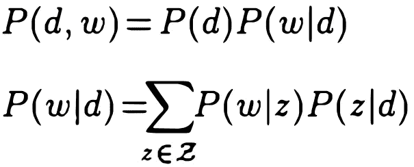

摘自霍夫曼(1999)。

其中:

*   `w`表示一个词。
*   `d`表示文档。
*   `z`表示一个话题。
*   `P(z|d)`是主题`z`出现在文档`d`中的概率。
*   `P(w|z)`是单词`w`出现在主题`z`中的概率。
*   我们假设`P(w|z, d) = P(w|z)`。

前面的表达式可以重写为:

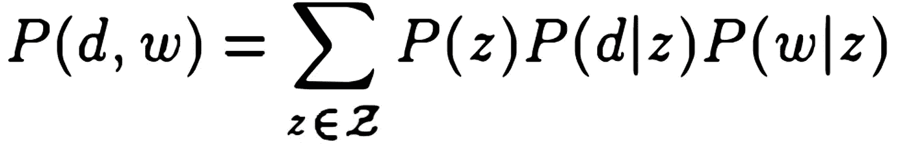

摘自霍夫曼(1999)。

我们可以在这个表达式和以前的 DTM 分解公式之间进行类比，其中:

*   `P(d, w)`对应于 DTM。
*   `P(z)`类似于`Σ`的主对角线。
*   `P(d|z)`和`P(w|z)`分别对应`U`和`V`。

该模型可以使用**期望最大化算法(EM)** 进行拟合。简而言之，EM 在潜在变量(在本例中是主题)存在的情况下执行最大似然估计。

值得注意的是，DTM 的分解依赖于不同的目标函数。对于 LSA，它是 L₂范数，而对于 pLSA，它是似然函数。后者旨在明确最大化模型的预测能力。

pLSA 与 LSA 模型具有相同的优点和缺点，但也有一些特殊的差异:

**优点:**

*   与 LSA 相比，pLSA 表现出更好的性能(Hofmann，1999)。

**缺点:**

pLSA 没有提供文档级别的概率模型。这意味着:

*   参数的数量随着文档的数量线性增长，导致可伸缩性和过度拟合的问题。
*   它不能给新文档分配概率。

## **2.4 潜在狄利克雷分配(LDA)**

**潜在狄利克雷分配(LDA)** (Blei 等人，2003)通过使用狄利克雷先验以贝叶斯方法估计文档-主题和术语-主题分布来改进 pLSA。

狄利克雷分布`Dir(α)`是一族由正实数向量`α`参数化的连续多元概率分布。

让我们想象一份报纸有三个部分:政治、体育和艺术，每个部分也代表一个主题。报纸版面中主题混合的假设分布是狄利克雷分布的一个例子:

第一节(政治):

*   混合主题:政治 0.99，体育 0.005，艺术 0.005。

第二节(体育):

*   主题混合:政治 0.005，体育 0.99，艺术 0.005。

第 3 节(艺术):

*   混合主题:政治 0.005，体育 0.005，艺术 0.99。

让我们观察 LDA 的平板符号(在图形模型中表示变量的传统方法)来解释 Dirichlet 先验的使用:

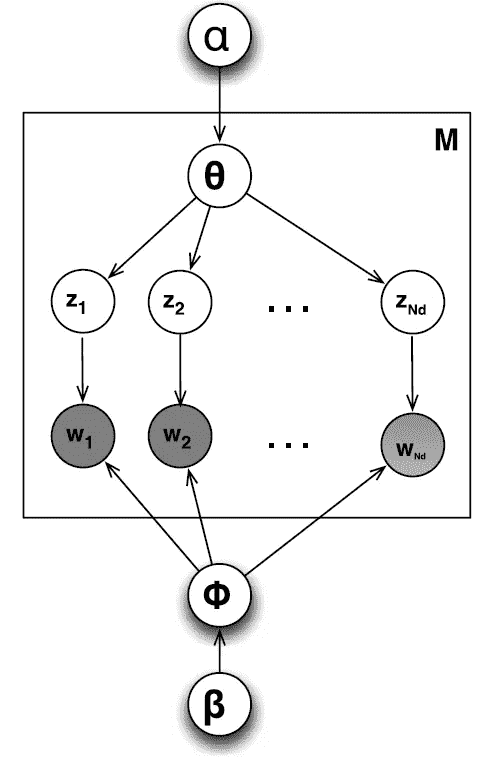

LDA 的平面符号。来自 Barbieri⁵ (2013)。灰色圆圈表示观察变量(语料库中的单词)，而白色圆圈表示潜在变量。

m 表示文档的数量，N 表示文档中的字数。从顶部开始，我们观察到`α`，它是每个文档主题分布的 Dirichlet 先验的参数。从狄利克雷分布`Dir(α)`中，我们抽取一个随机样本来代表文档的主题分布`θ`。就好像，在我们的报纸例子中，我们用一个混合物( *0.99 政治，0.05 体育，0.05 艺术*)来描述一篇文章的主题分布。

从选择的混合物`θ`中，我们根据分布绘制一个主题`z`(在我们的例子中，*政治*)。从底部，我们观察到`β`，狄利克雷先验关于每主题单词分布的参数。从狄利克雷分布`Dir(𝛽)`中，我们选择一个代表给定主题`z`的词分布`φ`的样本。并且，从`φ`我们画出一个字`w`。

最后，我们感兴趣的是在给定文档`d`和参数`α`和`𝛽`的情况下，估计主题`z`的概率，即`P(z|d, α, 𝛽)`。该问题被公式化为给定文档的隐藏变量的后验分布的计算:

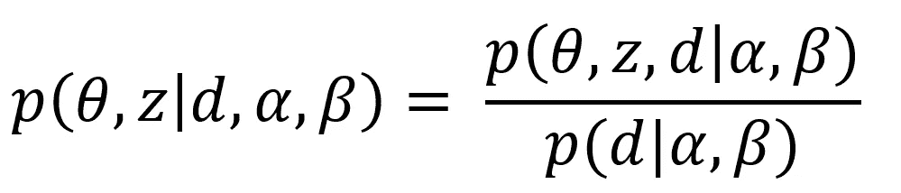

图片作者。

由于这种分布难以计算，Blei 等人(2013 年)建议使用近似推理算法(变分近似)。通过最小化近似分布和真实后验分布之间的 Kullback-Leibler 散度找到优化值`P(θ, z|d, α, 𝛽)`。一旦我们获得了数据的最佳参数，我们可以再次计算`P(z|d, α, 𝛽)`，在某种意义上，它对应于文档-主题矩阵`U`。`𝛽₁, 𝛽₂, ..., 𝛽ₜ`的每一个条目都是`p(w|z)`，与术语-主题矩阵`V`相对应。主要区别在于，很像 pLSA，矩阵系数有一个统计解释。

**优点**:

*   它提供了比 LSA 和 pLSA 更好的性能。
*   与 pLSA 不同，由于文档主题狄利克雷分布，LDA 可以为新文档分配概率。
*   它既适用于短文档，也适用于长文档。
*   主题可以由人来解释。
*   作为一个概率模块，LDA 可以嵌入到更复杂的模型中，也可以扩展。Blei 等人(2013)的原始工作之后的研究扩展了 LDA，并解决了一些原始限制。

**缺点:**

*   题目的数量必须事先知道。
*   与 LSA 和 pLSA 类似，词袋方法不考虑语料库中词的语义表示。
*   贝叶斯参数`α`和`β`的估计基于文档可交换性的假设。
*   它需要大量的预处理阶段来从文本输入数据中获得有意义的表示。
*   研究报告 LDA 可能会产生*过于笼统的* (Rizvi⁶等人，2019 年)或*不相关的* (Alnusyan⁷等人，2020 年)主题。不同的执行结果也可能不一致(Egger⁸等人，2021)。

**LDA 的实际例子**

流行的 LDA 实现在 [Gensim](https://radimrehurek.com/gensim/models/ldamodel.html) 和 [sklearn](https://scikit-learn.org/stable/modules/generated/sklearn.decomposition.LatentDirichletAllocation.html) 包(Python)和 [Mallet](https://mimno.github.io/Mallet/) (Java)中。

在下面的例子中，我们使用 Gensim 库和 [pyLDAvis](https://pypi.org/project/pyLDAvis/) 进行可视化主题探索。

由前面的代码片段生成的 pyLDAvis 主题探索的交互式图表。图片作者。

## 2.5 非负矩阵分解(NMF)

**lee⁴等人(1999)提出的非负矩阵分解(NMF)** 是 LSA 的一种变体。

LSA 利用奇异值分解分解文档术语矩阵，提取潜在信息(主题)。SVD 的一个特性是基向量彼此正交，迫使基中的一些元素为负。

简而言之，矩阵系数为负的因式分解(如 SVD)带来了可解释性的问题。减法组合不允许理解一个成分如何对整体作出贡献。NMF 将文档-术语矩阵分解成主题-文档矩阵`U`和主题-术语矩阵`Vᵗ`，很像奇异值分解，但是有一个额外的约束，即`U`和`Vᵗ` **只能包含非负元素**。

此外，虽然我们利用了形式`U ∙ Σ ∙ Vᵗ`的分解，但在非负矩阵分解的情况下，这变成了:`U ∙ Vᵗ`。

DTM 的分解可以被视为一个优化问题，其目标是最小化 DTM 与其近似值之间的差异。经常采用的距离度量是 Frobenius 范数和 Kullback-Leibler 散度。

NMF 与其他经典模型具有相同的主要优点和缺点(单词袋方法、需要预处理等)，但也有一些独特的特征:

**优点:**

*   文献论证了 NMF 比 SVD(因此 LSA)在产生更多可解释的和连贯的主题方面的优势(Lee⁴等 1999，Xu⁹等 2003；卡萨利诺·⁰等人，2016 年)。

**缺点:**

*   非负约束使得分解更加困难，并可能导致不准确的主题。
*   NMF 问题是非凸问题。不同的`U`和`Vᵗ`可能近似 DTM，导致不同运行的结果可能不一致。

**NMF 的实际例子**

## 2.6 BERTopic 和 Top2Vec

Grootendorst (2022)和安杰洛夫(2020)提出了主题建模的新方法，分别是 **BERTopic** 和 **Top2Vec** 。这些模型解决了迄今为止讨论的传统策略的局限性。我们将在下面的段落中一起探讨它们。

**2.6.1 文件嵌入**

BERTopic 和 Top2Vec 从输入文档中制造语义嵌入。

在最初的论文中，BERTopic 利用 BERT 句子转换器(SBERT)来制造高质量的上下文单词和句子向量表示。相反，Top2Vec 使用 Doc2Vec 创建联合嵌入的单词、文档和主题向量。

在撰写本文时，这两种算法都支持各种嵌入策略，尽管 BERTopic 对嵌入模型的覆盖范围更广:

BERTopic 和 Top2Vec 目前支持的嵌入模型。表中的参考资料提供了更详细的信息。

**2 . 6 . 2 UMAP 降维**

可以将聚类算法直接应用于嵌入，但是这将增加计算开销并导致较差的聚类性能(由于“*维数灾难*”)。

因此，在聚类之前应用降维技术。 **UMAP(均匀流形近似和投影)**(麦金尼斯等人，2018)提供了几个好处:

*   它在较低的投影维度中保留了更多的高维数据的*局部*和*全局*特征(麦金尼斯等人，2018)。
*   UMAP 对嵌入维数没有计算限制(麦金尼斯等人，2018)。因此，它可以有效地用于不同的文档嵌入策略。
*   使用 UMAP 降低嵌入维数提高了 K-Means 和 HDBSCAN 在准确性和时间方面的聚类性能(阿拉维⁴等人，2020)。
*   UMAP 可以轻松扩展到大型数据集(安杰洛夫，2020)。

**2.6.3 聚类**

BERTopic 和 Top2Vec 最初都利用 HDBSCAN(麦金尼斯·⁵等人，2017 年)作为聚类算法。

**优点:**

*   HDBSCAN 继承了 DBSCAN 的优点，并对其进行了改进(麦金尼斯·⁵等人，2017)。
*   HDBSCAN(作为 DBSCAN)不会将观察结果强制到集群中。它将不相关的观察值建模为异常值。这提高了主题的代表性和连贯性。

**缺点:**

*   将不相关的文档建模为离群值可能会导致信息丢失。离群值可能成为噪声数据集中原始语料库的相关部分。

BERTopic 目前还支持 **K 均值**和**凝聚聚类**算法，提供了选择的灵活性。K-Means 允许选择所需数量的簇，并强制每个文档成为一个簇。这避免了离群值的产生，但也可能导致较差的主题表示和连贯性。

**2.6.4。主题表示**

BERTopic 和 Top2Vec 在如何制造主题的表示方面互不相同。

BERTopic 将同一个集群(主题)内的所有文档连接起来，并应用修改后的 TF-IDF。简而言之，它用原始 TF-IDF 公式中的集群替换文档。然后，它使用每个聚类的第一个最重要的词作为主题表示。

这个分数被称为**基于类别的 TF-IDF (c TF-IDF)** ，因为它估计的是词在聚类中的重要性，而不是文档。

**Top2Vec** 相反，使用最接近集群的**质心**的单词来生成表示。特别地，对于通过 HDBSCAN 获得的每个密集区域，计算原始维度中文档向量的质心，然后选择最接近的单词向量。

**BERTopic 和 Top2Vec 的优劣:**

*   题目数量不一定事先给定。BERTopic 和 Top2Vec 都支持分层主题缩减，以优化主题数量。
*   与单词袋方法不同，高质量的嵌入考虑了语料库中单词之间的语义关系。这就引出了更好、更丰富的话题。
*   由于嵌入的语义本质，在大多数情况下不需要文本预处理(词干化、词元化、停用词移除等)。
*   BERTopic 支持动态主题建模。
*   模块化。每个步骤(文档嵌入、降维、聚类)实际上都是自洽的，并且可以根据该领域的进步、特定项目的特性或技术限制而改变或发展。例如，可以使用具有 Doc2Vec 嵌入的 BERTopic 来代替 SBERT，或者应用 K-Means 聚类来代替 HDBSCAN。
*   与传统方法相比，它们在更大的语料库中具有更好的扩展性(安杰洛夫，2020)。
*   BERTopic 和 Top2Vec 都提供了高级的内置搜索和可视化功能。它们使调查主题质量和推动进一步优化变得更加简单，并为演示制作高质量的图表。

**BERTopic 和 Top2Vec 的对比:**

*   他们更擅长处理较短的文本，如社交媒体帖子或新闻标题。大多数基于 transformers 的嵌入在构建语义表示时，对可以考虑的标记数量有限制。T2 有可能对较长的文档使用这些算法。例如，可以在嵌入步骤之前将文档分成句子或段落。然而，这不一定有利于为较长的文档生成有意义和有代表性的主题。
*   每个文档只分配给一个主题。相反，像 LDA 这样的传统方法是建立在每个文档都包含混合主题的假设之上的。
*   与传统模型相比，它们的速度较慢(Grootendorst，2022)。此外，更快的训练和推理可能需要更昂贵的硬件加速器(GPU)。
*   尽管 BERTopic 利用基于 transformers 的大型语言模型来制造文档嵌入，但主题表示仍然使用单词包方法(c TF-IDF)。
*   对于小数据集，它们可能不太有效(<1000 docs) (Egger¹⁶ et al., 2022).

**BERTopic**的实际例子)

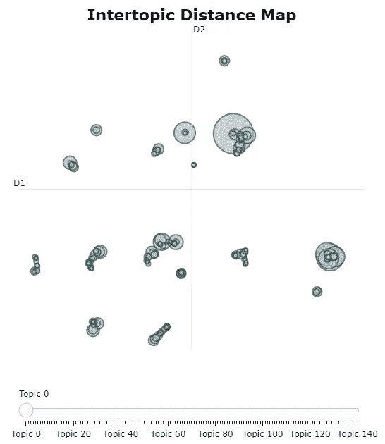

由前面的代码片段生成的主题间距离图。该可视化类似于 pyLDAvis 获得的可视化。图片作者。

记录由前面的代码片段生成的投影(细节)。图片作者。

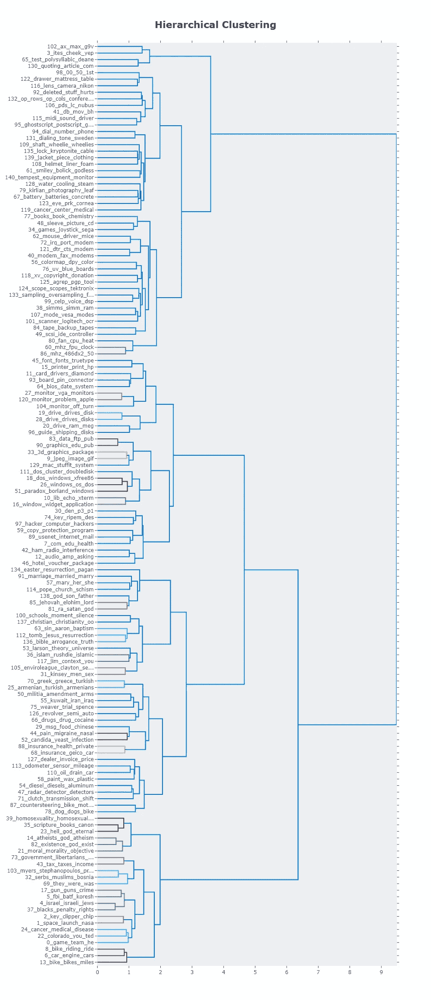

由前面的代码片段生成的主题层次结构(树状图)。图片作者。

**top 2 vec 的实际例子**

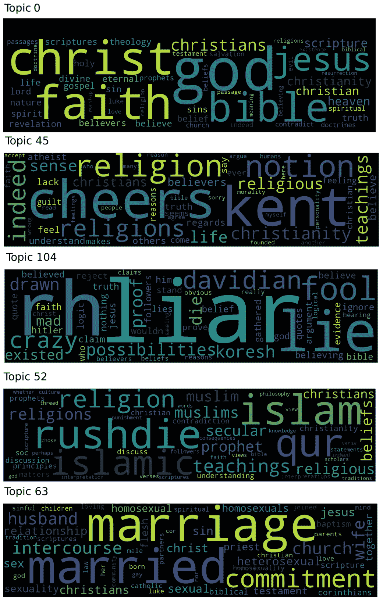

由前面的代码片段生成的与输入查询“faith”最接近的五个主题的词云。图片作者。

# 3.比较

下表总结了考虑到实际应用场景的不同主题建模策略的显著特征:

不同主题建模技术的比较。**注** : LSA 和 pLSA 未包括在内，因为 LDA 克服了它们的局限性，被认为是三种方法中的最佳方法。按作者分类的表格。

该汇总表为给定用例提供了**高级选择标准**。

下面分享一些例子。

想象一下，只需很少的预处理工作，就能在推文中找到热门话题。在这种情况下，可以选择使用 Top2Vec 和 BERTopic。它们在较短的文本资源上表现出色，并且不需要太多的预处理。

相反，设想一个场景，其中客户有兴趣发现一个给定的文档如何包含多个主题的混合。在这种情况下，像 LDA 和 NMF 这样的方法会更好。BERTopic 和 Top2Vec 只为一个主题分配一个文档。虽然 HDBSCAN 的概率分布可以作为主题分布的代理，但 BERTopic 和 Top2Vec 并不是混合成员模型*的设计*。

# 4.附加备注

在讨论主题建模时，有两个主要的注意点值得在我们的旅程结束时提及。

## **4.1 一个话题(不一定)是我们想象的那样**

当我们在候诊室看到一本杂志时，我们一眼就知道它属于哪种类型。当我们进入一段对话时，几句话就足以让我们猜出讨论的对象。这是一个从人类角度出发的*话题*。

不幸的是，术语“*主题*”在到目前为止讨论的模型中具有完全不同的含义。

让我们记住文档术语矩阵。在高层次上，我们希望将其分解为文档-主题和主题-术语矩阵的产物，并提取该过程中的潜在维度-主题。这些策略(如 LSA)的目标是最小化分解误差。

概率生成模型(如 LDA)添加了一个额外的统计形式层，采用了一种健壮而优雅的贝叶斯方法，但它们真正试图做的是以最小的误差重建原始的文档词分布。

这些模型*都不能确保*从*人类*的角度来看，所获得的主题是有信息的或有用的。

用 Blei 等人(2013)的漂亮话来说:

> *“我们将 LDA 模型中的潜在多项式变量称为主题，以便利用面向文本的直觉，但是* ***除了这些潜在变量在表示单词集*** *上的概率分布的效用之外，我们不对这些潜在变量做出认识论上的声明。”*

另一方面，BERTopic 和 Top2Vec 利用了语义嵌入。因此，从“人”的角度来看，用来表示文档的向量代表了它们的“意义”(这是目前为止我们所知道的最接近的)。这些令人惊叹的模型假设，将这些嵌入的投影聚集起来可能会导致更有意义和更具体的主题。

研究(举几个例子:Grootendorst 2022，Angelov 2020，Egger ⁶等人 2022)表明，利用语义嵌入获得的主题在几个领域中更具信息性和连贯性。

但即使在这种情况下，人类和这类模型的主题定义之间仍然存在潜在的不匹配。这些算法产生的是**“语义相似的文档的可解释的、良好表示的和连贯的组”**。

毫无疑问:这是一个杰出和独特的结果，在该领域开辟了一个全新的前沿，取得了前所未有的成绩。

但是我们仍然会争论这如何接近人类对主题的定义，以及在什么情况下。

而如果你认为这是一个微不足道的微妙之处，你有没有尝试过向商业利益相关者解释类似“ *mail_post_email_posting* ”这样的话题？是的，它是连贯的，可解释的，但它是他们想象一个“*题目*”时想到的吗？

这就引出了我们要注意的第二点。

## 4.2 题目不好评价

主题建模是一种无监督的技术。评估期间没有标签可依赖。

**连贯性测量**已被提议用于评估主题在可解释性方面的质量。例如，**归一化逐点互信息(NPMI)** (布马·⁷，2009)估计两个单词`x`和`y`同现的可能性比我们随机预期的要大:

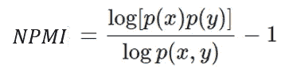

图片作者。

NPMI 可以从-1(无共现)到+1(完全共现)不等。`x`和`y`发生之间的独立性导致 NPMI=0。

刘⁸等人(2014)认为，这一指标在合理的程度上模仿了人类的判断。

还存在其他一致性措施。例如，Cv(罗德⁹等人，2015 年)和 UMass(明诺⁰等人，2011 年)。

这些一致性度量存在一系列缺点:

*   对于定性绩效应使用何种指标，目前尚无统一的约定(左等人，2016 年；布莱尔等人，2020 年；杜根等人，2021 年)。
*   Blair 等人(2020)报告了不同一致性测量之间的不一致结果。
*   Doogan 等人(2021 年)指出了一致性测量在评估特定领域(Twitter 数据)的主题模型时的不可靠性。
*   霍伊尔·⁴等人 2021 年提出，NPMI 等指标可能无法评估神经主题模型的可解释性。
*   由于报道的不一致，Cv 的作者不鼓励⁵使用 cv。

正如 Grootendorst (2022 年)所写:

> 主题一致性和主题多样性等验证措施是本质上主观评估的代理。一个用户对主题的连贯性和多样性的判断可能与另一个用户不同。因此， ***虽然这些衡量标准可以用来得到一个模特表现的指标，但它们仅仅是一个指标*** *。*

总之，验证方法无法清晰地评估主题模型的性能。它们不像分类问题的*准确度*或 *F1 分数*那样提供明确的解释。因此，对所获得主题的“*品质度量*的量化仍然需要领域知识和人工评估。商业价值的评估(*“这些主题会使项目受益吗？”*)不是一件小事，可能需要综合指标和整体方法。

# 5.结论

在这篇文章中，我们分享了流行主题建模算法的友好概述，从生成统计模型到基于变压器的方法。

我们还提供了一个表格，突出了每种技术的优点和缺点。这可用于比较，并有助于不同场景下的初步模型选择。

最后，我们分享了无监督文本数据分析的两个最具挑战性的方面。

首先，人类对“主题”的定义和它的统计对应物之间的差异经常被忽视，这是“主题建模”算法的结果。理解这种差异对于满足项目目标和指导 NLP 工作中业务涉众的期望是至关重要的。

然后，我们讨论了定量评估主题模型性能的困难，介绍了流行的度量标准及其缺点。

# 6.参考

[1] Deerwester 等人，*潜在语义分析索引*，《美国信息科学学会杂志》第 41 卷第 6 期第 391–407 页，1990 年([链接](http://lsa.colorado.edu/papers/JASIS.lsi.90.pdf))。

[2] Hofmann，*概率潜在语义分析*，第十五届人工智能不确定性会议论文集(UAI1999)，1999 ( [链接](https://arxiv.org/abs/1301.6705))。

[3] Blei 等人，*潜在狄利克雷分配*，《机器学习研究杂志》第 3 卷第 993–1022 页，2003 ( [链接](https://dl.acm.org/doi/10.5555/944919.944937))。

[4] Lee 等，*用非负矩阵分解*学习物体的部件，《自然》，第 401 卷，第 788–791 页，1999 ( [链接](https://www.nature.com/articles/44565))。

[5]巴比耶里等，*序列数据的概率主题模型*，《机器学习》第 93 卷第 5–29 页，2013 ( [链接](https://link.springer.com/article/10.1007/s10994-013-5391-2))。

[6] Rizvi 等人，*分析社交媒体数据以了解消费者对膳食补充剂的信息需求*，Stud。健康技术。告知。，第 264 卷，第 323–327 页，2019 年([链接](https://www.ncbi.nlm.nih.gov/pmc/articles/PMC6792048/))。

[7] Alnusyan 等，*一种用于用户评论主题建模和分类的半监督方法*，国际计算与信息技术会议，2020 年 1–5 期([链接](https://ieeexplore.ieee.org/document/9213721))。

[8] Egger 和 Yu，*识别 Instagram 数据中隐藏的语义结构:一个主题建模比较*，Tour。版本 2021:244，2021 ( [链接](https://www.researchgate.net/publication/355425735_Identifying_hidden_semantic_structures_in_Instagram_data_A_topic_modelling_comparison))。

[9]徐等，*基于非负矩阵分解的文档聚类*，第 26 届国际 ACM 信息检索研究与发展会议论文集，2003 年第 267–273 页([链接](https://dl.acm.org/doi/10.1145/860435.860485))。

[10] Casalino 等人，*智能数据分析的非负矩阵分解*，非负矩阵分解技术。Springer，第 49–74 页，2016 ( [链接](https://www.researchgate.net/publication/282942631_Non_Negative_Matrix_Factorizations_for_Intelligent_Data_Analysis))。

[11] Grootendorst， *BERTopic:基于类的 TF-IDF 过程的神经主题建模*，2022 ( [链接](https://arxiv.org/abs/2203.05794))。

[12]安杰洛夫， *Top2Vec:主题的分布式表示*，2020 ( [链接](https://arxiv.org/abs/2008.09470))。

[13]麦金尼斯等， *UMAP:降维的一致流形逼近与投影*，2018 ( [链接](https://arxiv.org/abs/1802.03426))。

[14] Allaoui 等人，*使用 umap 降维技术显著改进聚类算法:比较研究*，图像和信号处理国际会议，斯普林格，第 317–325 页，2020 ( [链接](https://link.springer.com/chapter/10.1007/978-3-030-51935-3_34))。

[15]麦金尼斯等， *hdbscan:基于层次密度的聚类*，开源软件杂志，2(11):205，2017 ( [链接](https://www.researchgate.net/publication/315508524_hdbscan_Hierarchical_density_based_clustering))。

[16] Egger 等人，*LDA、NMF、Top2Vec 和 BERTopic 之间的一个主题建模比较，以揭开 Twitter 帖子的神秘面纱*，Frontiers in Sociology，Volume 7，Article 886498，2022 ( [链接](https://www.frontiersin.org/articles/10.3389/fsoc.2022.886498/full))。

[17] Bouma，*词语搭配抽取中的归一化(逐点)互信息*，GSCL 学报，2009 年 30:31–40([链接](https://www.researchgate.net/publication/267306132_Normalized_Pointwise_Mutual_Information_in_Collocation_Extraction))。

[18] Lau 等，*机器阅读茶叶:自动评估话题连贯性和话题模型质量*，计算语言学协会欧洲分会第 14 届会议论文集，第 530–539 页，2014 ( [链接](https://aclanthology.org/E14-1056/))。

[19]roder 等人，*探索主题一致性测量的空间*，第八届 ACM 网络搜索和数据挖掘国际会议论文集，第 399-408 页。ACM，2015 ( [链接](https://svn.aksw.org/papers/2015/WSDM_Topic_Evaluation/public.pdf))。

[20] Mimno 等人，*优化主题模型中的语义一致性*，Proc .Conf 的。论自然语言处理中的经验方法，第 262–272 页，2011 ( [链接](http://dirichlet.net/pdf/mimno11optimizing.pdf))。

[21] Y .左等，*词网主题模型:一种简单但通用的解决短小不平衡文本的方法*，《知识与信息系统》，48(2)，第 379–398 页([链接](https://link.springer.com/article/10.1007/s10115-015-0882-z#Sec10))

[22] Blair 等人，*增加社交媒体话题连贯性的聚合话题模型*，Applied Intelligence，50(1)，第 138–156 页，2020 ( [链接](https://link.springer.com/article/10.1007/s10489-019-01438-z#Sec15))。

[23]杜根等人，*话题模型还是话题废话？重新评估语义可解释性测量*，计算语言学协会北美分会 2021 年会议记录:人类语言技术，第 3824–3848 页，2021 年([链接](https://aclanthology.org/2021.naacl-main.300/))。

[24] Hoyle 等，*自动化话题模型评估是否被打破？相干性的非相干性*，神经信息处理系统进展，34，2021 ( [链接](https://arxiv.org/abs/2107.02173))。

[https://github.com/dice-group/Palmetto/issues/13](https://github.com/dice-group/Palmetto/issues/13)

**数据集许可**:本文中的 Python 示例使用了 *20 个新闻组数据集*，这些新闻组数据集是由 [scikit-learn](https://scikit-learn.org/stable/modules/generated/sklearn.datasets.fetch_20newsgroups.html) 包在 [BSD 3 条款](https://opensource.org/licenses/BSD-3-Clause)许可下提供的。