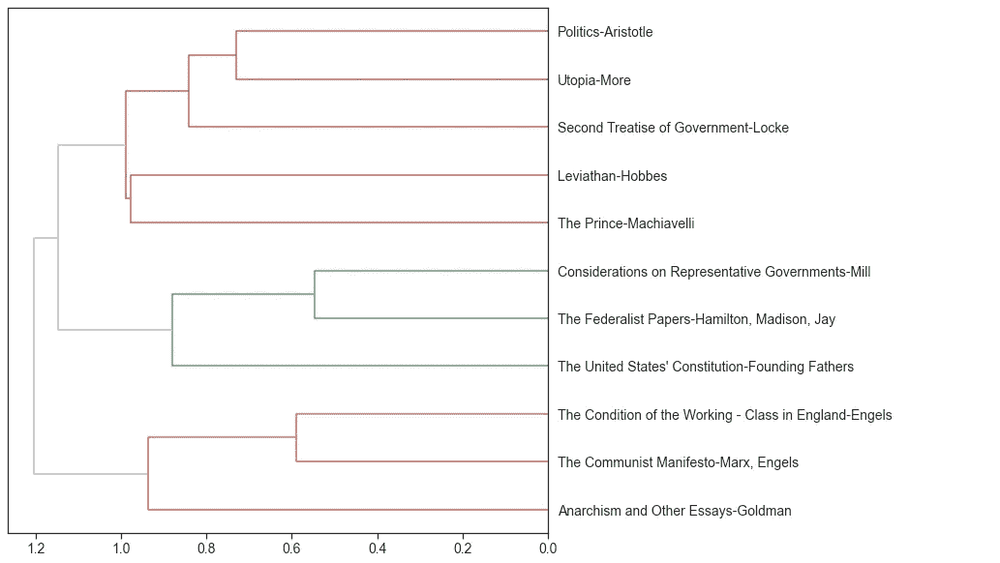
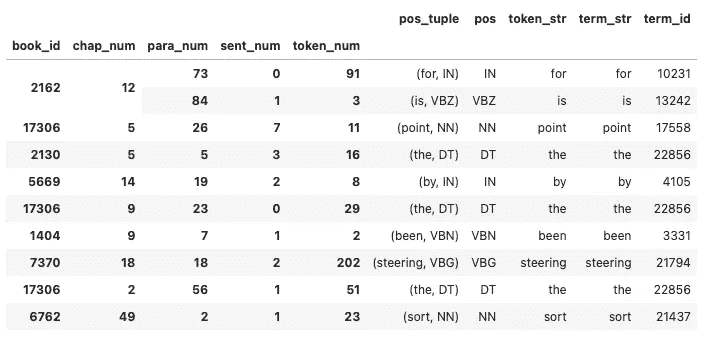
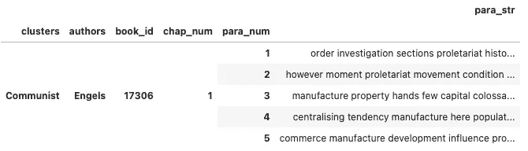
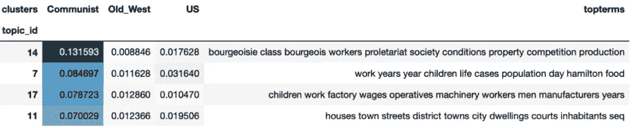
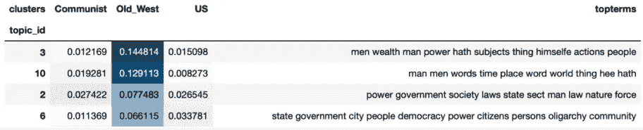
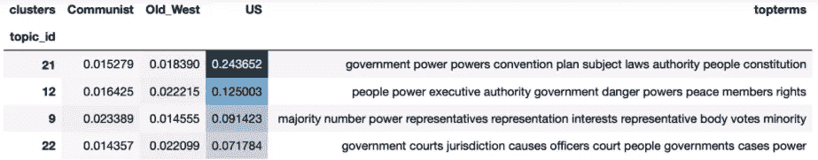

# 政治文本的话题建模

> 原文：<https://towardsdatascience.com/topic-modeling-with-political-texts-4a9b20b5e91>

## 自然语言处理和文本分析系列的第二部分——利用 LDA

欢迎来到我们的自然语言处理和文本分析系列的第二部分！如果你还没有机会，请阅读本系列的第一部分[这里](/using-nlp-and-text-analytics-to-cluster-political-texts-41fdb2c3a325)。为了总结我们迄今为止的进展，我们从政治著作的文集开始，如马基雅维利的《君主论》、汉密尔顿/麦迪逊/杰伊的《联邦党人文集》和马克思/恩格斯的《共产党宣言》。从这些作品中，我们导出了文本表格，并使用余弦相似性度量来确定各个作品的聚类，如下所示。



作者图片

在下一部分中，我们将在先前结果的基础上，尝试为这些集群找到最相关的主题。我们确定的三个集群将被称为“Old_West ”,代表较老的西方政治哲学(红色部分),“US”代表美国政治哲学(绿色部分),而“Communist”代表共产主义政治哲学(橙色部分)。我们还将构建在本系列第 1 部分中创建的令牌表，下面显示了一个示例。



作者图片

**主题建模** 首先我们应该定义什么是主题建模，以及我们希望通过进行这种分析达到的目标。根据维基百科的定义，主题建模是“一种用于发现出现在文档集合中的抽象‘主题’的统计模型”。考虑到我们使用的是政治作品，很明显，每部作品的主题都与政治理想相关，但是通过使用主题建模，我们将寻找在每个聚类的顶级主题中找到的特定单词，并寻找我们不同聚类之间的潜在关系。

我们的第一步将是把我们的令牌表做成进行建模所需的格式。为此，我们首先为标记表中的每个标记添加聚类和作者名称作为主要的分层术语，然后我们将各个标记和句子聚合成一个字符串，形成完整的段落字符串。如果我们聚集了太多，比如整个章节的字符串，我们的许多主题将会完全相同，如果我们使用的样本太少，比如一个句子或单个术语，我们的模型将无法识别正确的主题。我们的新层级应反映以下内容:

```
*# Create Topic Model OHCO*
OHCO_TM **=** ['clusters', 'authors', 'book_id', 'chap_num', 'para_num']
```



作者图片

现在我们已经准备好了表，我们可以开始应用我们的主题建模算法了。

```
tfv **=** CountVectorizer(max_features**=**4000, stop_words**=**'english')
tf **=** tfv**.**fit_transform(PARAS**.**para_str)
TERMS **=** tfv**.**get_feature_names()
**def** model(PARAS **=** PARAS, tf **=** tf, TERMS **=** TERMS):
    lda **=** LDA(n_components**=**25, max_iter**=**10, learning_offset**=**50)
    THETA **=** pd**.**DataFrame(lda**.**fit_transform(tf), index**=**PARAS**.**index)
    THETA**.**columns**.**name **=** 'topic_id'

    *#PHI*
    PHI **=** pd**.**DataFrame(lda**.**components_, columns**=**TERMS)
    PHI**.**index**.**name **=** 'topic_id'
    PHI**.**columns**.**name  **=** 'term_str'

    **return** THETA, PHI
```

在这个代码块中，我们从使用 sklearn 模块中的 CountVectorizer 函数开始，它遍历我们新创建的表“PARAS”，为前 4000 个术语的计数创建一个稀疏矩阵。可以在传递给 CountVectorizer 函数的参数“max_feature”中调整项数。我们最终将使用潜在的狄利克雷分配(LDA)模型来创建我们的主题。LDA 模型通常用于主题建模，并且在我们的上下文中通过基于所使用的术语识别文档语料库中的主题，然后将这些文档分配给最合适的主题来工作。

上面的 LDA 函数可以在 sklearn 库中找到。我们传递的第一个参数“n_components”设置我们选择创建的主题数量，在本例中是 25 个。第二项“max_iter”指的是在训练数据上的迭代次数，而“learning_offset”用于避免由训练数据中的早期学习引起的错误。

作为 LDA 函数的结果，我们得到了θ和φ的输出。Theta 矩阵将用于确定给定文档中主题的分布，而 Phi 将用于表示特定主题中单词的分布。使用下面的代码块，我们可以做到这一点，这意味着我们可以识别组成每个主题的单词，以及每个集群中最流行的主题。

```
*# Create topics*
TOPICS **=** PHI**.**stack()**.**to_frame()**.**rename(columns**=**{0:'weight'})\
    **.**groupby('topic_id')\
    **.**apply(**lambda** x: 
           x**.**weight**.**sort_values(ascending**=False**)\
               **.**head(10)\
               **.**reset_index()\
               **.**drop('topic_id',1)\
               **.**term_str)*# Add label column to TOPICS table*
TOPICS['label'] **=** TOPICS**.**apply(**lambda** x: str(x**.**name) **+** ' ' **+** ' '**.**join(x), 1)

*# Set topics by Doc weight*
TOPICS['doc_weight_sum'] **=** THETA**.**sum()*# Topics by book cluster given top 25 topics*
topic_cols **=** [t **for** t **in** range(25)]
CLUSTERS **=** THETA**.**groupby('clusters')[topic_cols]**.**mean()**.**T                                            
CLUSTERS**.**index**.**name **=** 'topic_id'
CLUSTERS**.**TCLUSTERS['topterms'] **=** TOPICS[[i **for** i **in** range(10)]]**.**apply(**lambda** x: ' '**.**join(x), 1)
```

现在，我们可以对三个集群中的每一个进行排序，以确定哪些主题是最受欢迎的，以及组成这些主题的单词。如下面可以看到的，每个聚类用不同的主题和相关术语集合来最大程度地标识。如前所述，大多数话题都属于政治思想的范畴，这在我们的领域中并不奇怪，但在这些话题中，我们可以看到一些不同的词汇选择。例如，在共产主义集群的主题 17 中，我们可以看到，这个主题通常是关于劳动者和/或劳动条件的，根据我们对这些作品的了解，这也是有意义的，而美国集群中最普遍的主题似乎反映了我们的共和制度的基础词汇。



作者图片



作者图片



作者图片

**结论:**
如上图所示，我们可以使用主题建模来发现哪些主题在我们的文本聚类中最普遍。主题建模可以是一个强大的工具，用于区分不同的文本数据集，同时识别与数据相关的主要主题和单词。然而，主题建模也有一些缺点，例如潜在的需要专家给每个主题 ID 一个整体的身份，以及主题中单词的重复性质，尤其是那些彼此密切相关的主题。这里获得的结果是基于我们为 LDA 模型选择的特定参数。我鼓励您试验这些参数，看看调优如何改变您的结果。这篇文章是 LDA 和主题建模的基本演示，应该如此对待，而不是模型准确性/成功的决定性证明。一如既往地感谢你花时间阅读这篇文章，如果你想阅读更多，请关注我的频道！

**这个项目的完整代码可以在我的 GitHub 页面上找到:**[https://GitHub . com/nbehe/NLP _ texts/blob/main/Beheshti _ project _ code . ipynb](https://github.com/nbehe/NLP_texts/blob/main/Beheshti_project_code.ipynb)

*这个项目是我的文本分析课程的一个大项目的一小部分。来自这个项目的代码是我自己写的，由讲师提供的，以及通过课程材料提供的作品的混合物。*