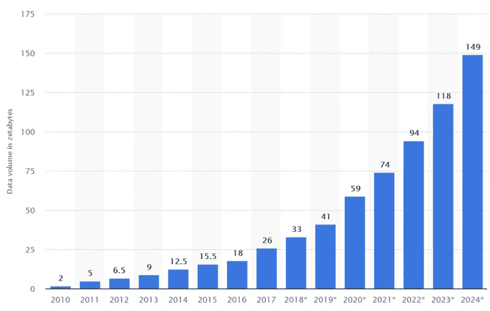
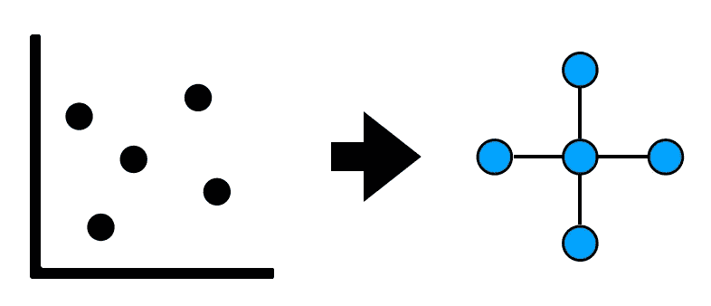
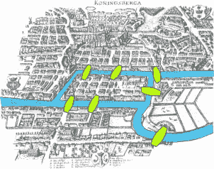
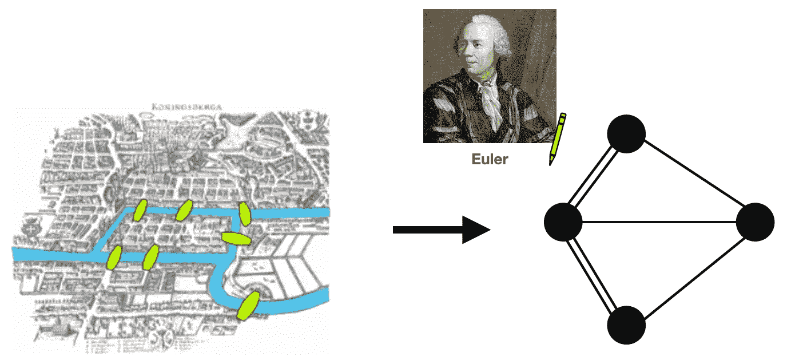
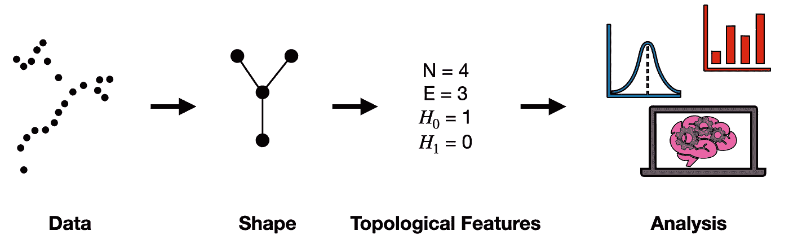
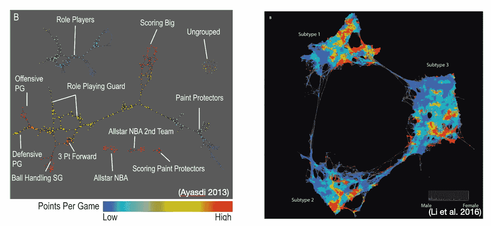

# 拓扑数据分析(TDA)

> 原文：<https://towardsdatascience.com/topological-data-analysis-tda-b7f9b770c951>

## 不太数学化的介绍

这是关于拓扑数据分析(TDA)的三篇系列文章中的第一篇。TDA 是一种正在兴起的数据科学工具，它可以让**观察数据**的*形态*。它由各种方法组成，其基本主题是从非结构化数据(即点云)中提取结构(即形状)。在这第一篇文章中，我将对 TDA 做一个浅显易懂的介绍，较少关注数学术语，而更多关注宏观观点。以后的帖子会在 TDA 的保护伞下讨论两个具体的技术: [**Mapper 算法**](https://medium.datadriveninvestor.com/the-mapper-algorithm-d0842f926658) 和 [**持久同调**](https://shawhin.medium.com/persistent-homology-f22789d753c4) 。

## 要点

1.  TDA 研究数据的*形状*
2.  TDA 非常适合高噪声和高维数据集

# 数据的崛起

跨域的数据量似乎在加速增长。这已经成为许多现代技术的燃料，例如 NLP、图像识别、自动驾驶汽车等。尽管数据是创新的关键，但细节中有魔鬼。

数据量的加速增长。[图像来源](https://www.researchgate.net/publication/348937287_Big_Data_Analytics_in_Cloud_Computing_An_overview)

**生产任务数据，生产任务问题**。任何从业者都会告诉你，来自真实世界的数据往往是嘈杂的。我们需要投入大量的精力和精力来将我们测量的东西转化为我们可以分析的东西。

这就是**拓扑数据分析(TDA)** 可以帮忙的地方。TDA **的目标不是直接处理原始数据，而是提取数据的潜在形态**。从这种形状，我们可以评估拓扑特征，它(通常)比原始数据本身更好地适应噪声。

数据→形状。TDA 的基本思想是从数据中提取形状。图片作者。

# 拓扑学

TDA 是建立在拓扑学数学领域的思想之上的。拓扑学的故事可以追溯到一个著名的数学问题，叫做柯尼斯堡的七座桥。

柯尼斯堡是一座由 7 座桥连接的 4 块陆地组成的城市(如下图)。这个著名的问题是:*一个人如何在一条路径上穿过所有 7 座桥，但每座桥只穿过一次？*

柯尼斯堡的七座桥(1736 年)。[图片来源](https://en.wikipedia.org/wiki/File:Konigsberg_bridges.png)。

如果你试图找到这样一条没有运气的路，不要难过；不存在这样的路径。然而，这一证明使著名数学家莱昂哈德·欧拉为现代图论和拓扑学奠定了基础。

那么，*他是怎么做到的呢？*欧拉画了一幅柯尼斯堡的图，但不像上面的地图，而是更基本的东西。他画了我们现在称之为**的图**，它只是**一组由线**连接起来的点。下图说明了这一点。

欧拉用图表示柯尼斯堡问题的 7 座桥。从[到这里](https://en.wikipedia.org/wiki/File:Konigsberg_bridges.png)的柯尼斯堡地图。欧拉的图片从[这里](https://www.irishtimes.com/news/science/euler-a-mathematician-without-equal-and-an-overall-nice-guy-1.4455424)。

这张**图代表了与问题相关的柯尼斯堡**的基本要素。每个点对应于柯尼斯堡的一块陆地，如果相应的陆地由一座桥连接，则两个点由一条线连接。这个问题的简化描述可能看起来微不足道，但它让欧拉解决了问题，改变了数学。

# 拓扑数据分析(TDA)

TDA 的基本思想让人想起欧拉解决柯尼斯堡问题的七座桥。我们采用真实世界的数据(例如，柯尼斯堡的地图)并提取与我们的问题最相关的潜在形状(例如，代表柯尼斯堡的图形)。这样做的**关键好处**是我们将数据归结为它的**核心结构**，它(希望)**对噪声**不变。

## 管道

TDA 不是一种单一的技术。更确切地说，它是具有从数据中提取形状这一共同主题的方法的集合。夏萨尔和米歇尔在论文中描述了一种通用的 TDA 管道。该管道的直观概述如下所示。

基于夏萨尔和米歇尔 [1](https://doi.org/10.3389/frai.2021.667963) 描述的基本 TDA 管道。图片作者。

管道从数据开始。通常，我们可以将任何数据集视为一个 N 维点云。这是因为将数据集中的 *N* 个变量视为数据点所在的 N 维空间的轴。

下一步是基于点云生成形状。有许多方法可以做到这一点，这区分了不同的 TDA 方法，我们将在本系列的下一篇博客中讨论。

一旦我们有了数据的形状，我们就可以描述它的拓扑特征。我们可以用多种方法来描述形状。例如，给定一个图表(如上图所示)，我们可以计算点和线的数量。我们也可以求助于一种叫做**同源性**的东西，统计数据中“洞”的**数。**

最后一步，我们可以使用这些拓扑特征进行分析。这可能是基于拓扑特征的统计数据对数据进行分类这样简单的事情，也可能是更复杂的事情，例如使用拓扑特征作为机器学习模型的输入。

## 承诺

当我第一次接触 TDA 时，我真的很兴奋。我看到了超级酷的用例，如[重新定义篮球位置](http://www.ayasdi.com/wp-content/uploads/_downloads/Redefining_Basketball_Through_Topological_Data_Analysis.pdf)和[发现 2 型糖尿病亚组](https://www.ncbi.nlm.nih.gov/pmc/articles/PMC4780757/)。这些数据以引人入胜的可视化方式呈现，如下图所示，清晰地显示了数据中的模式。

TDA 的两个用例。(左)TDA 应用于体育分析。图片来自 Ayasdi 白皮书[ [2](http://www.ayasdi.com/wp-content/uploads/_downloads/Redefining_Basketball_Through_Topological_Data_Analysis.pdf) ]。(右)TDA 用于识别糖尿病亚组。图片来自李等人的论文 [3](https://www.ncbi.nlm.nih.gov/pmc/articles/PMC4780757/) 。

  

## 问题(术语)

但是当我开始更多地了解 TDA 时，这种兴奋被抑制了。(对我来说)问题是大多数文献都充斥着数学证明和术语。我不是说这是一件坏事，只是说这让我更难理解这里发生了什么。这让我想到了这个系列的目标。

## 目标

在这个系列中，我的目标是捕捉 TDA 所做的事情的本质，而不是深入数学领域。我希望这第一个帖子已经让你对 TDA 有所了解。在以后的文章中，我将通过在 TDA 的保护伞下讨论两种具体的方法来进行更详细的讨论: [**映射器算法**](https://medium.datadriveninvestor.com/the-mapper-algorithm-d0842f926658) 和 [**持久同调**](https://shawhin.medium.com/persistent-homology-f22789d753c4) 。每篇文章都将介绍这种方法，并通过代码介绍一个具体的、真实的例子。

# 资源

**更上 TDA** : [映射器算法](https://medium.datadriveninvestor.com/the-mapper-algorithm-d0842f926658) | [持久同调](https://shawhin.medium.com/persistent-homology-f22789d753c4)

**连接** : [我的网站](https://shawhint.github.io/) | [预定电话](https://calendly.com/shawhintalebi) | [消息我](https://shawhint.github.io/connect.html)

**社交**:[YouTube](https://www.youtube.com/channel/UCa9gErQ9AE5jT2DZLjXBIdA)|[LinkedIn](https://www.linkedin.com/in/shawhintalebi/)|[Twitter](https://twitter.com/ShawhinT)

**支持** : [给我买杯咖啡](https://www.buymeacoffee.com/shawhint?source=about_page-------------------------------------) ☕️ | [成为会员](/membership?source=about_page-------------------------------------) ⭐️

  

[1] [夏萨尔，f .，&米歇尔，B. (2021)。拓扑数据分析导论:数据科学家的基础和实践。*人工智能前沿*， *4* ，108。https://doi.org/10.3389/FRAI.2021.667963/BIBTEX](https://doi.org/10.3389/frai.2021.667963)

[2] Ayasdi (2013 年)。使用拓扑数据分析进行体育分析。[http://www . ayas di . com/WP-content/uploads/_ downloads/Redefining _ Basketball _ Through _ topology _ Data _ analysis . pdf](http://www.ayasdi.com/wp-content/uploads/_downloads/Redefining_Basketball_Through_Topological_Data_Analysis.pdf)(2022 年 5 月 2 日访问)

[3]李，l .，程，W. Y .，格利克斯伯格，B. S .，戈特斯曼，o .，塔姆勒，r .，陈，r .，博廷格，E. P .，&达德利，J. T. (2015)。通过患者相似性的拓扑分析识别二型糖尿病亚组。*科学转化医学*， *7* (311)，311ra174。[https://doi.org/10.1126/scitranslmed.aaa9364](https://doi.org/10.1126/scitranslmed.aaa9364)