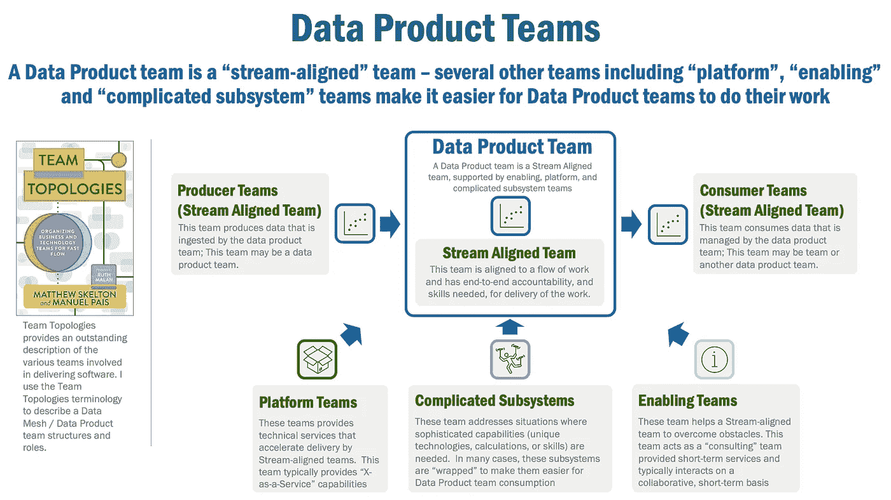
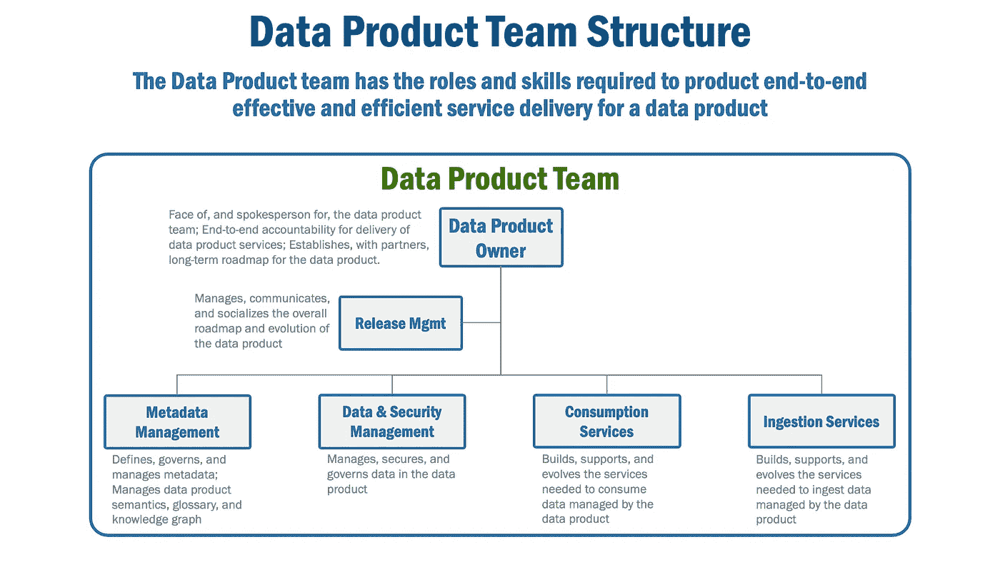

# 数据产品团队的拓扑结构

> 原文：<https://towardsdatascience.com/topology-of-a-data-product-team-75dc5471fccf>

## 您的数据网格之旅的成功将取决于您的数据产品团队结构，而不是您的技术选择。以下是组建数据产品团队需要了解的内容。

[尤金妮亚·艾](https://unsplash.com/@eugeniia?utm_source=unsplash&utm_medium=referral&utm_content=creditCopyText)在 [Unsplash](https://unsplash.com/s/photos/map-desk?utm_source=unsplash&utm_medium=referral&utm_content=creditCopyText) 上的照片

# 设计高效的数据产品团队

我发现组织变革是企业数据网格之旅中最困难的部分。除非你为它们做好计划，并尊重改变人们行为的内在挑战，否则你的旅程将是漫长而艰难的。

在本文中，我将讨论数据网格中涉及的团队，并定义数据产品团队的结构和角色。

# 数据网格是一种“社会技术”方法

data mesh 的创始人扎马克·德格哈尼(Zhamak Dehghani)在她杰出的著作[Data Mesh:deliver Data Driven Value at Scale](https://www.amazon.com/Data-Mesh-Delivering-Data-Driven-Value/dp/1492092398)中强调，Data Mesh 是一种共享和访问数据的“社会技术”方法。这意味着，虽然技术方面得到了很多关注(事实上，我的大多数[文章](https://medium.com/@ericbroda)讨论了数据网格的实际技术方面)，但也有重要的组织(“社会技术”的“社会”部分)考虑。

想想数据网格带来的变化:数据所有权从集中转变为分散，体系结构从单一转变为分布式，随着组织从自上而下转变为联合治理模型，责任也发生了变化。

简单地说，数据网格的组织方面非常重要。这些变化指向一个简单的命题:您的企业数据网格之旅将改变数据团队的组织方式和工作方式。

# 团队的拓扑

Matthew Skelton 和 Manual Pais 的杰出著作[Team topology](https://www.amazon.com/Team-Topologies-Organizing-Business-Technology/dp/1942788819/)，描述了交付软件所需的团队生态系统。Dehghani 也使用团队拓扑方法来识别团队。

首先，让我们介绍一下斯凯尔顿和派斯的团队:

*   **流程协调团队**是主要的交付团队，负责软件产品或服务的端到端交付。每一个与流程一致的团队都与其他类型的团队(平台、授权和复杂的子系统团队，如下)相互作用。
*   **平台团队**，提供工具、实用程序和技术服务，使流程协调团队更容易完成工作，通常提供“X 即服务”功能。
*   **使能团队**，作为“顾问”帮助团队克服障碍，通常在短时间内协同互动。
*   **复杂的子系统团队**，将需要独特技能或具有显著复杂性的工作交付从流对齐团队中卸载。我发现，在很多情况下，为这些子系统提供一个“包装器”是有意义的，这样可以使数据产品团队更容易使用。

# 数据产品团队的拓扑结构

现在我们已经奠定了基本的团队结构基础，让我们将这些概念应用到数据产品和更广泛的数据网格中。

数据产品团队是一个与流程一致的团队。它负责端到端的服务交付(接收、消费、发现、可观察性等)。)是数据产品所要求的。像一个与流一致的团队一样，数据产品团队有一个清晰的范围和界限(管理一个确定的数据库、一组表、文件等)。)、负责任的所有者以及提供必要功能的熟练团队。

*图 1，数据产品团队*

一个数据产品团队与几个团队相互作用:

*   **生产者团队**，管理数据产品团队获取的数据源。这个团队的结构可以是传统的源系统团队，或者在企业数据网格中是与流一致的数据产品团队。
*   **消费者团队**，访问和使用数据产品团队提供的数据。像生产者团队一样，这个团队可以是一个传统的数据分析团队，或者在企业数据网格中是一个与流一致的数据产品团队。
*   **平台团队**提供“X 即服务”功能，使数据产品团队更容易获取、消费和共享数据。根据我的经验，在大型企业中，由几种类型的平台团队支持的数据产品团队非常常见，在许多大型组织中，这些平台团队可能包括云、API、安全和网络团队。
*   **使能团队**，帮助数据产品团队克服短期障碍或解决特定需求；在许多大型组织中，这种支持团队可能包括指导小组、企业治理和架构小组，以及培训小组。
*   **复杂的子系统团队**,解决需要深入知识的问题领域，这些领域不是单个数据产品团队能够建立和支持的；例如，大型企业可能包括处理主数据管理和大型机技术的团队。

# 数据产品团队的结构

但是一个数据产品团队是什么样子的呢？当然，没有“标准”的数据产品团队。每种数据产品可能需要特定于它们所使用的技术堆栈的技能，或者消费者要求的可互操作接口的类型，或者用于接收数据的管道技术。尽管如此，数据产品团队的规模通常在 8-15 人之间变化(Skelton 和 Pais 建议在任何与流一致的团队(如数据产品团队)中最多 15 人)。

数据产品团队由“数据产品所有者”领导。Dehghani [声明](https://www.amazon.com/Data-Mesh-Delivering-Data-Driven-Value/dp/1492092398)该角色“负责一个领域的数据产品在交付价值、满足和发展数据用户以及维护数据产品的生命周期方面的成功”。他们负责建立数据产品的方向和路线图，获取数据产品的资金，并确定和联络各种利益相关者和与数据产品团队互动的其他团队。简而言之，数据产品负责人是数据产品团队的代言人。

*图二，数据产品团队架构*

通常有几个向数据产品所有者报告的角色:

*   **元数据管理**，为数据产品定义、控制和管理元数据。这个团队/角色将具有元数据存储库方面的专业知识，并将维护数据产品语义、术语表和知识图的完整性。
*   **数据管理和安全**，管理、保护和控制数据产品中的数据；该团队/角色拥有关于业务领域、元数据和数据产品所管理的数据的安全需求的专业知识。
*   **消费服务**，构建、支持和发展消费由数据产品管理的数据所需的服务。这个团队通常拥有开发由数据产品提供的可互操作接口的技能。
*   **摄取服务**，构建、支持和发展摄取由数据产品管理的数据所需的服务。这个团队/角色拥有将数据导入数据产品的管道、SQL 和数据工程技能。
*   **发布管理**，对数据产品的整体路线图和演进进行管理、沟通和社会化。这个团队/角色具有多种技能:与企业发布过程集成的开发人员技能，以及传播数据产品中的变更所需的沟通技能。

# 总结想法

构建您的团队和组织以取得成功对于加速您的数据网格之旅至关重要。希望本文为您提供了构建数据产品团队的组织构件。

***

本文假设您对数据网格有很高的理解。更多信息可在[此处](/the-anatomy-of-a-data-product-d3140f068311)(数据产品)[此处](/data-mesh-architecture-patterns-98cc1014f251)(数据网格模式)[此处](/an-architecture-for-the-data-mesh-32ff4a15f16f)(数据网格架构)[此处](https://martinfowler.com/articles/data-mesh-principles.html)(数据网格原则)和[此处](https://medium.com/google-cloud/10-reasons-why-you-should-not-adopt-data-mesh-7a0b045ea40f)(经验教训)。对于感兴趣的读者，我的全套数据网格文章可在这里获得。

***

*除非另有说明，本文中的所有图片均由 Eric Broda(本文作者)创作。图像中使用的所有图标都是普通的 PowerPoint 图标和/或不受版权保护。*

*本文表达的观点仅代表我个人，不一定代表我的客户的观点。*