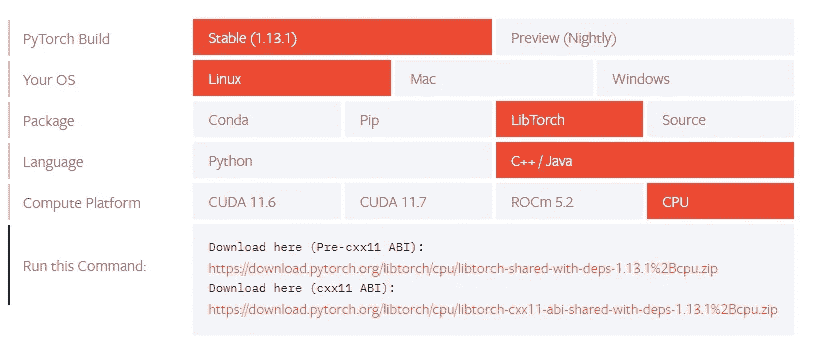
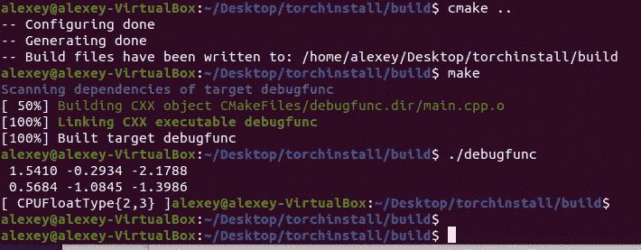

# Torch 和 Torchvision C++在 Linux 上的安装和调试

> 原文：<https://towardsdatascience.com/torch-and-torchvision-c-installation-and-debugging-on-linux-263676c38fa2>

## Torchvision 中的 RoIAlign 调试示例


[https://unsplash.com/@udayawal](https://unsplash.com/@udayawal)

## 介绍

在本教程中，我们将在 Linux 机器上安装 *Torch* 和 *Torchvision* C++库来调试一个不是用 Python 而是用 C++编写的函数。因为我们感兴趣的函数是用 C++编写的，而不是用 *Pytorch* 编写的，所以我们不能从 Python API 到 *Torchvision* 调试它，因此我们需要深入研究 C++代码。如果你想知道更多关于 Python 和 C++如何链接以及如何从 Python 中调用 C++代码的信息，你可以参考我之前的文章[这里](https://medium.com/towards-data-science/calling-c-code-from-python-with-ctypes-module-58404b9b3929)。

## 火炬安装

首先我们需要下载 *Torchlib* C++库，它提供了使用 Torch 所需的所有头文件和库的二进制发行版。这可以从 PyTorch 官方网站[这里](https://pytorch.org/get-started/locally/)完成。我选择了以下下载配置:



作者图片—图 1

然后，我们为项目创建一个新文件夹，将。我们刚刚下载的 zip 文件夹，并在那里解压缩。

```
mkdir torchinstall
unzip libtorch-cxx11-abi-shared-with-deps-1.13.1+cpu.zip
```

从这里我们将参考 Torch 的[官方文档](https://pytorch.org/cppdocs/installing.html)来编译和构建依赖于 *Torch* 库的文件。首先让我们创建两个文件:

*   *main.cpp* — C++文件，我们将在其中编写一些代码，以确保我们可以使用安装火炬库，并且它在我们的机器上工作
*   *CMakeLists.txt* —包含 CMake 工具生成和构建文件的指令的文本文件

以及一个构建文件夹，我们编译的 *main.cpp* 文件将存储在其中

```
touch main.cpp
touch CMakeLists.txt

#################################################################
touch main.cpp file will contain the following code:

// import libraries 
#include <iostream>
#include <torch/torch.h>

int main(){
  torch::manual_seed(0); // set manual seed
  torch::Tensor x = torch::randn({2,3}); // create torch random tensor
  std::cout << x;} // print tensor

#################################################################
touch CMakeLists.txt file will contain the following:

cmake_minimum_required(VERSION 3.0)
# project name
project(debugfunc)

# define path to the libtorch extracted folder
set(CMAKE_PREFIX_PATH /home/alexey/Desktop/torchinstall/libtorch)

# find torch library and all necessary files
find_package(Torch REQUIRED)
set(CMAKE_CXX_FLAGS "${CMAKE_CXX_FLAGS} ${TORCH_CXX_FLAGS}")

# executable to add that we want to compile and run
add_executable(debugfunc main.cpp)
# link torch libraries to our executable
target_link_libraries(debugfunc "${TORCH_LIBRARIES}")
set_property(TARGET debugfunc PROPERTY CXX_STANDARD 14)
#################################################################

# create build folder
mkdir build
```

现在我们已经准备好编译、构建和运行我们的 *main.cpp* 文件。

```
# go into the build folder
cd build
# compile main.cpp file
cmake ..
# build it
make
# run the built file
./debugfunc
```

如果一切正常，您应该会看到以下输出:


作者图片—图 2

恭喜你，你现在可以构建和运行使用 *torch* C++库的文件了！下一步是安装 *torchvision* C++库。

## 火炬视觉装置

让我们回到我们的*桌面*目录，创建另一个名为*火炬视觉*的文件夹。首先从[这里](https://github.com/pytorch/vision)下载 zip *torchvision* C++库，放入 out *torchvision* 目录并解压。之后我们进入解压后的文件夹 *vision-main* ，创建一个 *build* 目录，打开 *vision-main* 中的 *CMakeLists.txt* 文件进行修改和添加一些东西。

```
mkdir torchvision
unzip vision-main.zip
cd vision-main

mkdir build
```

对我来说， *CMakeLists.txt* 文件的最终版本如下所示。我添加了 *CMAKE_PREFIX_PATH* ，关闭了所有选项像 *WITH_CUDA* 、 *WITH_PNG* 、 *WITH_JPEG* 、 *USE_PYTHON* 。

```
cmake_minimum_required(VERSION 3.12)
project(torchvision)
set(CMAKE_CXX_STANDARD 14)
file(STRINGS version.txt TORCHVISION_VERSION)

# added CMAKE_PREFIX_PATH
set(CMAKE_PREFIX_PATH /home/alexey/Desktop/torchinstall/libtorch;)

# turned off all the options
option(WITH_CUDA "Enable CUDA support" OFF)
option(WITH_PNG "Enable features requiring LibPNG." OFF)
option(WITH_JPEG "Enable features requiring LibJPEG." OFF)
option(USE_PYTHON "Link to Python when building" OFF)

if(WITH_CUDA)
  enable_language(CUDA)
  add_definitions(-D__CUDA_NO_HALF_OPERATORS__)
  add_definitions(-DWITH_CUDA)
  set(CMAKE_CUDA_FLAGS "${CMAKE_CUDA_FLAGS} --expt-relaxed-constexpr")
  # CUDA-11.x can not be compiled using C++14 standard on Windows
  string(REGEX MATCH "^[0-9]+" CUDA_MAJOR ${CMAKE_CUDA_COMPILER_VERSION})
  if(${CUDA_MAJOR} GREATER 10 AND MSVC)
    set(CMAKE_CXX_STANDARD 17)
  endif()
endif()

find_package(Torch REQUIRED)

if (WITH_PNG)
    add_definitions(-DPNG_FOUND)w
    find_package(PNG REQUIRED)
endif()

if (WITH_JPEG)
    add_definitions(-DJPEG_FOUND)
    find_package(JPEG REQUIRED)
endif()

if (USE_PYTHON)
  add_definitions(-DUSE_PYTHON)
  find_package(Python3 REQUIRED COMPONENTS Development)
endif()

function(CUDA_CONVERT_FLAGS EXISTING_TARGET)
    get_property(old_flags TARGET ${EXISTING_TARGET} PROPERTY INTERFACE_COMPILE_OPTIONS)
    if(NOT "${old_flags}" STREQUAL "")
        string(REPLACE ";" "," CUDA_flags "${old_flags}")
        set_property(TARGET ${EXISTING_TARGET} PROPERTY INTERFACE_COMPILE_OPTIONS
            "$<$<BUILD_INTERFACE:$<COMPILE_LANGUAGE:CXX>>:${old_flags}>$<$<BUILD_INTERFACE:$<COMPILE_LANGUAGE:CUDA>>:-Xcompiler=${CUDA_flags}>"
            )
    endif()
endfunction()

if(MSVC)
  set(CMAKE_CXX_FLAGS "${CMAKE_CXX_FLAGS} /wd4819")
  if(WITH_CUDA)
    set(CMAKE_CUDA_FLAGS "${CMAKE_CUDA_FLAGS} -Xcompiler=/wd4819")
    foreach(diag cc_clobber_ignored integer_sign_change useless_using_declaration
      set_but_not_used field_without_dll_interface
      base_class_has_different_dll_interface
      dll_interface_conflict_none_assumed
      dll_interface_conflict_dllexport_assumed
      implicit_return_from_non_void_function
      unsigned_compare_with_zero
      declared_but_not_referenced
      bad_friend_decl)
      string(APPEND CMAKE_CUDA_FLAGS " -Xcudafe --diag_suppress=${diag}")
    endforeach()
    CUDA_CONVERT_FLAGS(torch_cpu)
    if(TARGET torch_cuda)
      CUDA_CONVERT_FLAGS(torch_cuda)
    endif()
    if(TARGET torch_cuda_cu)
      CUDA_CONVERT_FLAGS(torch_cuda_cu)
    endif()
    if(TARGET torch_cuda_cpp)
      CUDA_CONVERT_FLAGS(torch_cuda_cpp)
    endif()
  endif()
endif()

include(GNUInstallDirs)
include(CMakePackageConfigHelpers)

set(TVCPP torchvision/csrc)
list(APPEND ALLOW_LISTED ${TVCPP} ${TVCPP}/io/image ${TVCPP}/io/image/cpu ${TVCPP}/models ${TVCPP}/ops
  ${TVCPP}/ops/autograd ${TVCPP}/ops/cpu ${TVCPP}/io/image/cuda)
if(WITH_CUDA)
    list(APPEND ALLOW_LISTED ${TVCPP}/ops/cuda ${TVCPP}/ops/autocast)
endif()

FOREACH(DIR ${ALLOW_LISTED})
    file(GLOB ALL_SOURCES ${ALL_SOURCES} ${DIR}/*.*)
ENDFOREACH()

add_library(${PROJECT_NAME} SHARED ${ALL_SOURCES})
target_link_libraries(${PROJECT_NAME} PRIVATE ${TORCH_LIBRARIES})

if (WITH_PNG)
    target_link_libraries(${PROJECT_NAME} PRIVATE ${PNG_LIBRARY})
endif()

if (WITH_JPEG)
    target_link_libraries(${PROJECT_NAME} PRIVATE ${JPEG_LIBRARIES})
endif()

if (USE_PYTHON)
  target_link_libraries(${PROJECT_NAME} PRIVATE Python3::Python)
endif()

set_target_properties(${PROJECT_NAME} PROPERTIES
  EXPORT_NAME TorchVision
  INSTALL_RPATH ${TORCH_INSTALL_PREFIX}/lib)

include_directories(torchvision/csrc)

if (WITH_PNG)
    include_directories(${PNG_INCLUDE_DIRS})
endif()

if (WITH_JPEG)
    include_directories(${JPEG_INCLUDE_DIRS})
endif()

set(TORCHVISION_CMAKECONFIG_INSTALL_DIR "share/cmake/TorchVision" CACHE STRING "install path for TorchVisionConfig.cmake")

configure_package_config_file(cmake/TorchVisionConfig.cmake.in
  "${CMAKE_CURRENT_BINARY_DIR}/TorchVisionConfig.cmake"
  INSTALL_DESTINATION ${TORCHVISION_CMAKECONFIG_INSTALL_DIR})

write_basic_package_version_file(${CMAKE_CURRENT_BINARY_DIR}/TorchVisionConfigVersion.cmake
  VERSION ${TORCHVISION_VERSION}
  COMPATIBILITY AnyNewerVersion)

install(FILES ${CMAKE_CURRENT_BINARY_DIR}/TorchVisionConfig.cmake
  ${CMAKE_CURRENT_BINARY_DIR}/TorchVisionConfigVersion.cmake
  DESTINATION ${TORCHVISION_CMAKECONFIG_INSTALL_DIR})

install(TARGETS ${PROJECT_NAME}
  EXPORT TorchVisionTargets
  LIBRARY DESTINATION ${CMAKE_INSTALL_LIBDIR}
  )

install(EXPORT TorchVisionTargets
  NAMESPACE TorchVision::
  DESTINATION ${TORCHVISION_CMAKECONFIG_INSTALL_DIR})

FOREACH(INPUT_DIR ${ALLOW_LISTED})
    string(REPLACE "${TVCPP}" "${CMAKE_INSTALL_INCLUDEDIR}/${PROJECT_NAME}" OUTPUT_DIR ${INPUT_DIR})
    file(GLOB INPUT_FILES ${INPUT_DIR}/*.*)
    install(FILES ${INPUT_FILES} DESTINATION ${OUTPUT_DIR})
ENDFOREACH()
```

之后，我们进入*构建*文件夹，编译、构建并安装库。

```
cd build
cmake ..
make
sudo make install
```

如果您没有看到任何错误(警告不是错误！)那么一切应该都没问题。现在让我们测试一下我们可以在项目中导入 *torchvision* 库。回到 *torchinstall* 文件夹，进入 *main.cpp* 和 *CMakeLists.txt* 文件，修改如下:

```
// main.cpp we import torchvision library

#include <iostream>
#include <torch/torch.h>
#include <torchvision/vision.h>

int main(){
  torch::manual_seed(0);
  torch::Tensor x = torch::randn({2,3});
  std::cout << x;
}
```

```
cmake_minimum_required(VERSION 3.0)
project(debugfunc)

set(CMAKE_PREFIX_PATH /home/alexey/Desktop/torchinstall/libtorch)

find_package(Torch REQUIRED)
find_package(TorchVision REQUIRED)

set(CMAKE_CXX_FLAGS "${CMAKE_CXX_FLAGS} ${TORCH_CXX_FLAGS}")

add_executable(${PROJECT_NAME} main.cpp)
target_compile_features(${PROJECT_NAME} PUBLIC cxx_range_for)
target_link_libraries(${PROJECT_NAME} TorchVision::TorchVision)
set_property(TARGET ${PROJECT_NAME} PROPERTY CXX_STANDARD 14)
```

现在像以前一样编译、构建和运行:

```
# compile main.cpp file
cmake ..
# build it
make
# run the built file
./debugfunc
```

您应该看不到错误，并再次看到相同的张量输出:



作者图片—图 3

酷，我们现在已经安装了*火炬视觉*库！

## 调试功能

现在，假设我们想从 C++的 *torchvision* 库中调试 *roi_align* 函数。我使用可视代码进行调试，因为我们使用 CMake，所以您需要在可视代码中安装一些依赖项，以便能够在其中进行调试。我发现[这个视频](https://www.youtube.com/watch?v=Rfj40xW9q6w&t=541s)上手挺有用的。

为了调试 *roi_align* 函数，我必须从这个路径复制粘贴一些位:*torch vision/CSRC/ops/CPU*以下面的 *main.cpp* 文件结束

```
#include <iostream>
#include <torch/torch.h>
#include <torchvision/vision.h>
#include <torchvision/ops/nms.h>
#include <torch/script.h>

#include <ATen/core/dispatch/Dispatcher.h>
#include <torch/library.h>
#include <torch/types.h>

#include <ATen/ATen.h>
#include <torchvision/ops/cpu/roi_align_common.h>

namespace vision {
namespace ops {

namespace {

template <typename T>
void roi_align_forward_kernel_impl(
    int n_rois,
    const T* input,
    const T& spatial_scale,
    int channels,
    int height,
    int width,
    int pooled_height,
    int pooled_width,
    int sampling_ratio,
    bool aligned,
    const T* rois,
    T* output) {a
  // (n, c, ph, pw) is an element in the pooled output
  // can be parallelized using omp
  // #pragma omp parallel for num_threads(32)
  for (int n = 0; n < n_rois; n++) {
    int index_n = n * channels * pooled_width * pooled_height;

    const T* offset_rois = rois + n * 5;
    int roi_batch_ind = offset_rois[0];

    // Do not using rounding; this implementation detail is critical
    T offset = aligned ? (T)0.5 : (T)0.0;
    T roi_start_w = offset_rois[1] * spatial_scale - offset;
    T roi_start_h = offset_rois[2] * spatial_scale - offset;
    T roi_end_w = offset_rois[3] * spatial_scale - offset;
    T roi_end_h = offset_rois[4] * spatial_scale - offset;

    T roi_width = roi_end_w - roi_start_w;
    T roi_height = roi_end_h - roi_start_h;
    if (!aligned) {
      // Force malformed ROIs to be 1x1
      roi_width = std::max(roi_width, (T)1.);
      roi_height = std::max(roi_height, (T)1.);
    }

    T bin_size_h = static_cast<T>(roi_height) / static_cast<T>(pooled_height);
    T bin_size_w = static_cast<T>(roi_width) / static_cast<T>(pooled_width);

    // We use roi_bin_grid to sample the grid and mimic integral
    int roi_bin_grid_h = (sampling_ratio > 0)
        ? sampling_ratio
        : ceil(roi_height / pooled_height); // e.g., = 2
    int roi_bin_grid_w =
        (sampling_ratio > 0) ? sampling_ratio : ceil(roi_width / pooled_width);

    // We do average (integral) pooling inside a bin
    // When the grid is empty, output zeros.
    const T count = std::max(roi_bin_grid_h * roi_bin_grid_w, 1); // e.g. = 4

    // we want to precalculate indices and weights shared by all chanels,
    // this is the key point of optimization
    std::vector<detail::PreCalc<T>> pre_calc(
        roi_bin_grid_h * roi_bin_grid_w * pooled_width * pooled_height);
    detail::pre_calc_for_bilinear_interpolate(
        height,
        width,
        pooled_height,
        pooled_width,
        roi_start_h,
        roi_start_w,
        bin_size_h,
        bin_size_w,
        roi_bin_grid_h,
        roi_bin_grid_w,
        pre_calc);

    for (int c = 0; c < channels; c++) {
      int index_n_c = index_n + c * pooled_width * pooled_height;
      const T* offset_input =
          input + (roi_batch_ind * channels + c) * height * width;
      int pre_calc_index = 0;

      for (int ph = 0; ph < pooled_height; ph++) {
        for (int pw = 0; pw < pooled_width; pw++) {
          int index = index_n_c + ph * pooled_width + pw;

          T output_val = 0.;
          for (int iy = 0; iy < roi_bin_grid_h; iy++) {
            for (int ix = 0; ix < roi_bin_grid_w; ix++) {
              detail::PreCalc<T> pc = pre_calc[pre_calc_index];
              output_val += pc.w1 * offset_input[pc.pos1] +
                  pc.w2 * offset_input[pc.pos2] +
                  pc.w3 * offset_input[pc.pos3] + pc.w4 * offset_input[pc.pos4];

              pre_calc_index += 1;
            }
          }
          output_val /= count; // Average pooling

          output[index] = output_val;
        } // for pw
      } // for ph
    } // for c
  } // for n
}

template <class T>
inline void add(T* address, const T& val) {
  *address += val;
}

at::Tensor roi_align_forward_kernel(
    const at::Tensor& input,
    const at::Tensor& rois,
    double spatial_scale,
    int64_t pooled_height,
    int64_t pooled_width,
    int64_t sampling_ratio,
    bool aligned) {
  TORCH_CHECK(input.device().is_cpu(), "input must be a CPU tensor");
  TORCH_CHECK(rois.device().is_cpu(), "rois must be a CPU tensor");
  TORCH_CHECK(rois.size(1) == 5, "rois must have shape as Tensor[K, 5]");

  at::TensorArg input_t{input, "input", 1}, rois_t{rois, "rois", 2};

  at::CheckedFrom c = "roi_align_forward_kernel";
  at::checkAllSameType(c, {input_t, rois_t});

  auto num_rois = rois.size(0);
  auto channels = input.size(1);
  auto height = input.size(2);
  auto width = input.size(3);

  at::Tensor output = at::zeros(
      {num_rois, channels, pooled_height, pooled_width}, input.options());

  if (output.numel() == 0)
    return output;

  auto input_ = input.contiguous(), rois_ = rois.contiguous();
  AT_DISPATCH_FLOATING_TYPES_AND_HALF(
      input.scalar_type(), "roi_align_forward_kernel", [&] {
        roi_align_forward_kernel_impl<scalar_t>(
            num_rois,
            input_.data_ptr<scalar_t>(),
            spatial_scale,
            channels,
            height,
            width,
            pooled_height,
            pooled_width,
            sampling_ratio,
            aligned,
            rois_.data_ptr<scalar_t>(),
            output.data_ptr<scalar_t>());
      });
  return output;
}

} // namespace

} // namespace ops
} // namespace vision

int main(){
  torch::manual_seed(0);

  // load tensors saved from Python 
  torch::jit::script::Module tensors = torch::jit::load("/media/sf_Linux_shared_folder/roialign/tensors.pth");
  c10::IValue feats = tensors.attr("cr_features");
  torch::Tensor feat_ts = feats.toTensor();

  c10::IValue boxes = tensors.attr("cr_proposal");
  torch::Tensor boxes_ts = boxes.toTensor();

  std::cout << boxes_ts << std::endl;

  double spatial_scale = 1.0;
  int64_t pooled_height = 2, pooled_width = 2, sampling_ratio = -1;
  bool aligned = false;

  at::Tensor out = vision::ops::roi_align_forward_kernel(feat_ts, boxes_ts, spatial_scale, pooled_height, pooled_width, sampling_ratio, aligned);

  std::cout << out;

}
```

你会注意到我加载了*特性*和*建议*张量，我在[这篇文章](https://medium.com/p/d30f6843da3a)中使用了这些张量用于 *roi_align。现在你可以在任何你想调试代码的地方放置断点，然后一行一行地查看发生了什么。*

## 结论

在本文中，我们看到了如何在 Linux 机器上安装 *torch* 和 *torchvision* C++库，并调试我们无法在 Pytorch Python API 中直接调试的函数。如果你知道如何不用复制粘贴就能调试函数的简单方法，请在评论中告诉我。