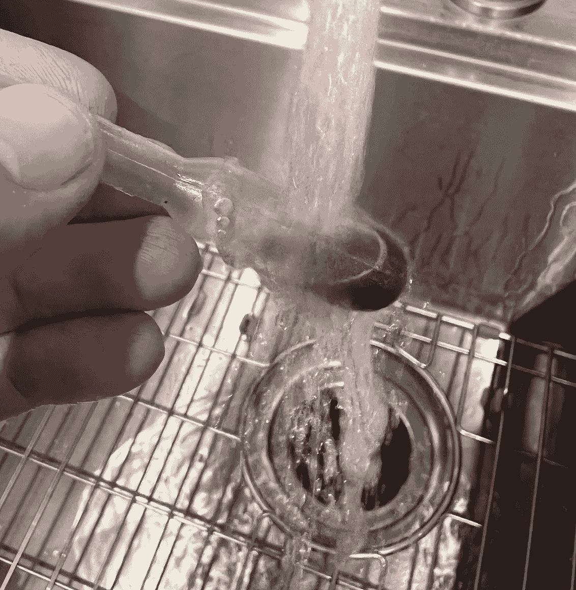
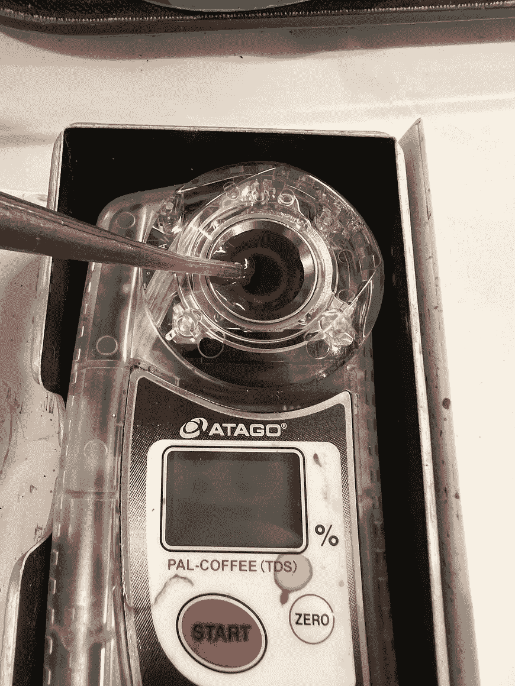
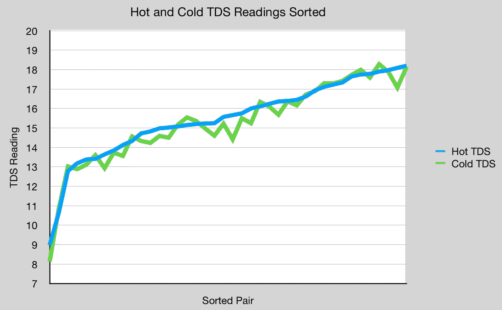
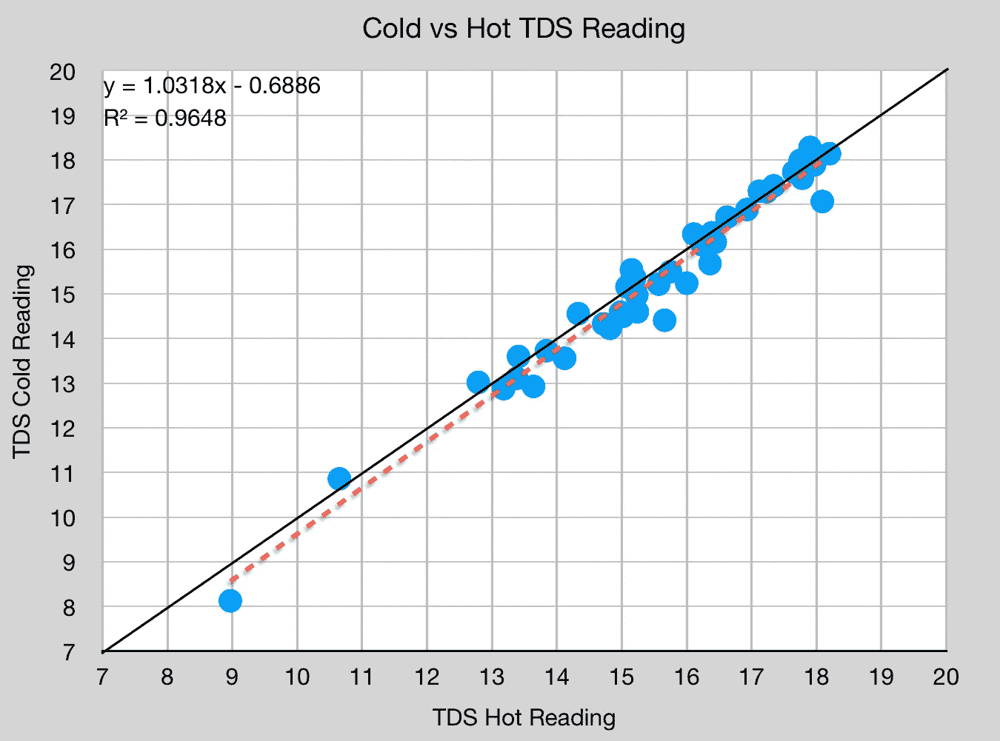
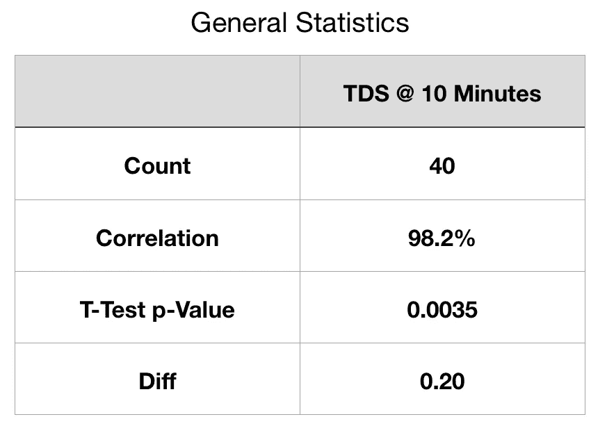

# 咖啡中总溶解固体的测量会受到样品温度的轻微影响

> 原文：<https://towardsdatascience.com/total-dissolved-solids-tds-in-coffee-is-slightly-affected-by-sample-temperature-929390babf2d>

## 咖啡数据科学

## 收集数据以帮助定义协议

对咖啡进行量化很困难，但在咖啡行业的所有咖啡方法中，有一个常用的单一指标， [**【总溶解固体量】**](/coffee-solubility-in-espresso-an-initial-study-88f78a432e2c) 。TDS 是用折射仪测量的，它会告诉你杯子里有多少咖啡固体。从这个指标，你可以得出提取率(EY)，以量化咖啡提取的效率。

许多人提议制定一个更严格的 T4 协议来收集 TDS 样本。我专门查看了样本温度。在 40 对数据样本中，我确实在热测量和冷测量中发现了统计上的显著差异，但这种差异很小，并且是线性相关的。

# 审查建议的 TDS 方案

一些人提出了具体而详细的 TDS 测量方案，让我们回顾一下主要组成部分:

1.  将咖啡彻底混合
2.  收集样本
3.  在冷水下冲洗或让样品达到室温
4.  用过滤注射器过滤
5.  测量样品

这些步骤中的一些还没有被证明能提供更好的 TDS 测量。我之前对过滤样本有过异议[。我不认为过滤已被证明能更好地衡量地面真相。](/dont-filter-coffee-tds-samples-bd662acaa4d9?source=your_stories_page-------------------------------------)

所有图片由作者提供

本文将关注第 3 步，即样本温度。我还没有看到数据显示，由于样品的冷热，TDS 发生了有统计意义的变化。我更喜欢测量热样品，我认为只要测量所有热样品，这个变量就是可控的。然而，我想知道它与较冷的样品相比如何。

# 数据

我在 40 杯浓缩咖啡中收集了 40 个样本。对于每个样本，我执行了以下方案:

1.  立即读取 TDS 读数(热 TDS 样本)。
2.  用移液管吸取样本液体。
3.  倒置移液管。
4.  放在冷水中。
5.  收集了另一个 TDS 读数(冷 TDS 样本)。

以下是按热 TDS 值排序的数据:

以下是冷 TDS 和热 TDS 的散点图比较:

样本具有高相关性，最佳拟合趋势线具有高 R 值，但略有偏移。读数有 0.20 的微小差异，该值具有统计学意义，因为双尾 t 检验显示值为 0.0035(统计学显著性< 0.05)。

如果冷样品具有更高的 TDS，我将测试重量是否因蒸发而改变，但这并没有发生。

我对冷热 TDS 样本进行了测试比较，发现温度会导致测量值略有差异。这种差异具有统计学意义，但冷热样品之间有很好的线性拟合。这意味着，如果你有一个测量，你可以准确地预测另一个。

对我来说，0.2 的差别并不算多，因为我的浓缩咖啡有很高的 TDS。对于 TDS 读数较低的咖啡，这种差异可能更有影响。然而，只要线性相关性对于较低的 TDS 值是强的，对我来说结论将是相同的。

我的结论是，我不需要一个方案来冷却样品。不疼，但是比较费时间。只要我在收集所有热的或冷的样品，它们都是可比较的。甚至为了与其他人的 TDS 读数进行比较，人们只需要知道它是热的还是冷的。

TDS 是一个如此重要的指标，我希望对该设备有更好的了解可以消除一些障碍，使其在整个咖啡社区得到更广泛的采用。

如果你愿意，可以在推特、 [YouTube](https://m.youtube.com/channel/UClgcmAtBMTmVVGANjtntXTw?source=post_page---------------------------) 和 [Instagram](https://www.instagram.com/espressofun/) 上关注我，我会在那里发布不同机器上的浓缩咖啡照片和浓缩咖啡相关的视频。你也可以在 [LinkedIn](https://www.linkedin.com/in/dr-robert-mckeon-aloe-01581595) 上找到我。也可以关注我在[中](https://towardsdatascience.com/@rmckeon/follow)和[订阅](https://rmckeon.medium.com/subscribe)。

# [我的进一步阅读](https://rmckeon.medium.com/story-collection-splash-page-e15025710347):

[我未来的书](https://www.kickstarter.com/projects/espressofun/engineering-better-espresso-data-driven-coffee)

[我的链接](https://rmckeon.medium.com/my-links-5de9eb69c26b?source=your_stories_page----------------------------------------)

[浓缩咖啡系列文章](https://rmckeon.medium.com/a-collection-of-espresso-articles-de8a3abf9917?postPublishedType=repub)

工作和学校故事集

[咖啡萃取](https://rmckeon.medium.com/coffee-extraction-splash-page-3e568df003ac?source=your_stories_page-------------------------------------)