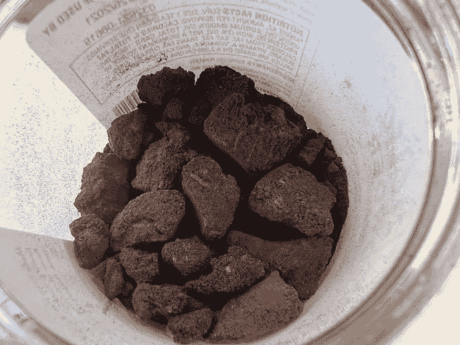
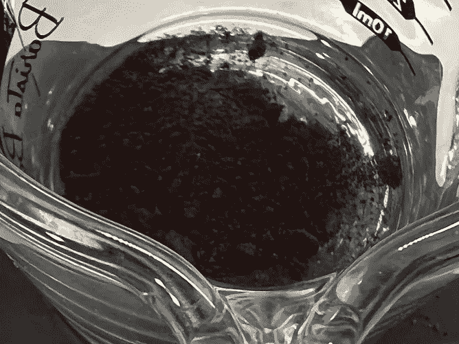
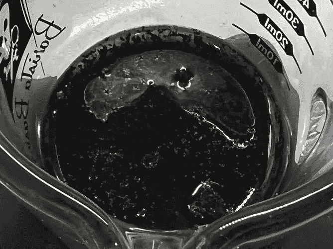
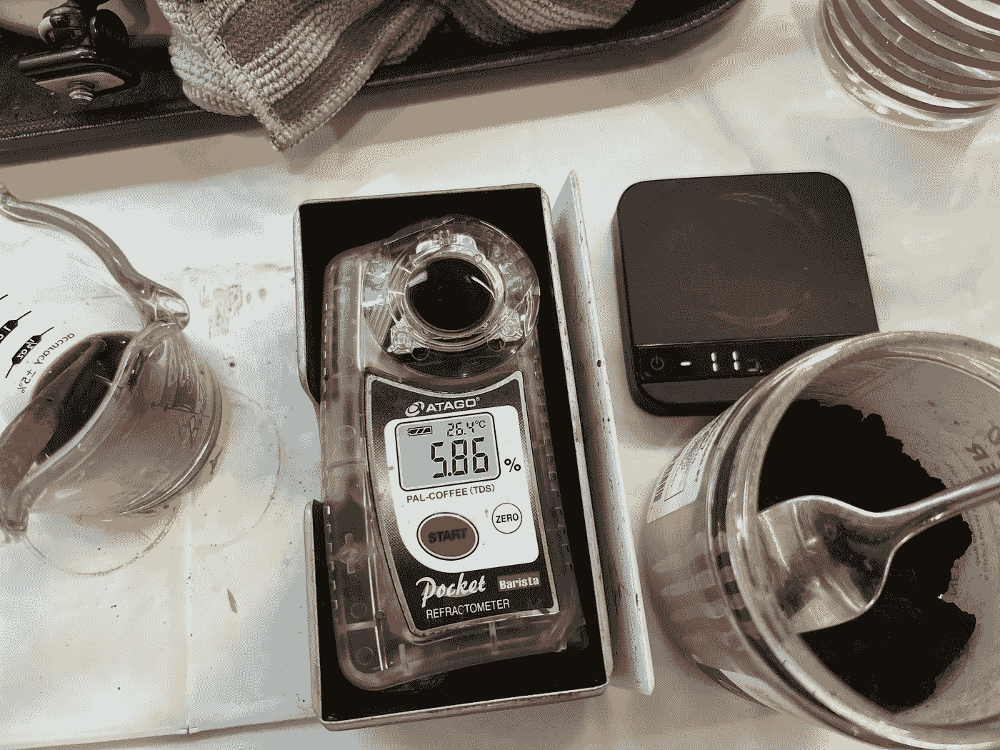
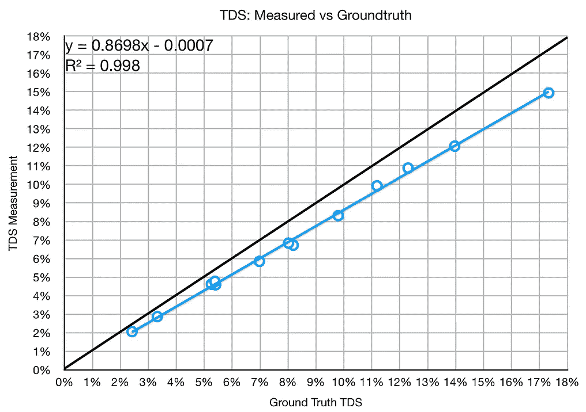
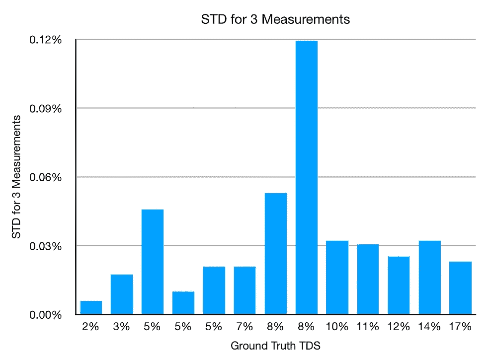
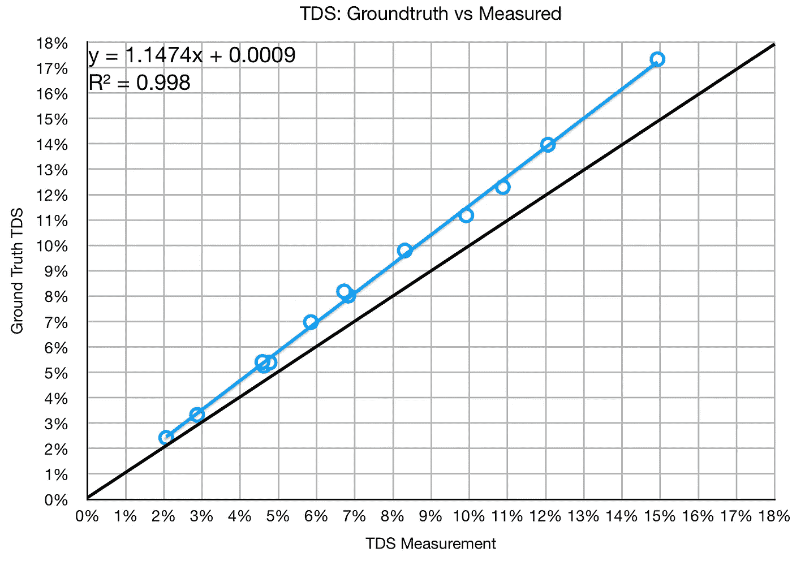

# 咖啡中总溶解固体量仪与研磨真相的比较

> 原文：<https://towardsdatascience.com/total-dissolved-solids-tds-meter-compared-to-groundtruth-in-coffee-f01efc25b7d9>

## 咖啡数据科学

## 发现未知的广度

几年来，我一直在用折光仪测量浓缩咖啡中的总溶解固体(TDS)。我一直很好奇 TDS 测量对地面真相的精确度。公开的信息不多，所以我决定收集一些。

我用了[浓缩咖啡粉](https://medium.com/geekculture/what-is-espresso-powder-608236a54c58)作为地面真相。浓缩咖啡粉是将浓缩咖啡脱水，直到只剩下溶解的固体。我的浓缩咖啡粉有点结块，所以我必须把它打碎。

所有图片由作者提供

以下是我遵循的协议:

1.  打碎一些浓缩咖啡粉，用秤测量
2.  加入热水并用秤称重(目标为某一 TDS)
3.  用三个样品测量 TDS
4.  使用中间样本

样品本身非常稳定。通常，当测量咖啡的 TDS 时，TDS 会有一些噪声。这些样本都没有经过过滤。然而，方差非常低，就好像它们被过滤了一样。

我有目的地收集样本，以达到特定的 TDS。当在相同的 TDS 下采集几个样本时，结果是相似的。最佳拟合线显示了测量中的微小误差，但是 R 值很高。如果我们使用 TDS 测量，那么地面实况测量稍高，具有非常强的线性相关性。

这些结果对我来说非常有趣，因为误差的绝对值在增加。以 15% TDS 测量的样品实际上可能接近 17%。这似乎表明，我的提取产量比我以前想象的还要高。这种差异也可以归因于不是所有的浓缩咖啡粉末都溶解在溶液中。这是许多实验中的一个，以了解我认为对咖啡来说仍然是美妙和重要的一个实验。

如果你愿意，可以在推特、 [YouTube](https://m.youtube.com/channel/UClgcmAtBMTmVVGANjtntXTw?source=post_page---------------------------) 和 [Instagram](https://www.instagram.com/espressofun/) 上关注我，我会在那里发布不同机器上的浓缩咖啡照片和浓缩咖啡相关的视频。你也可以在 [LinkedIn](https://www.linkedin.com/in/dr-robert-mckeon-aloe-01581595) 上找到我。也可以关注我在[中](https://towardsdatascience.com/@rmckeon/follow)和[订阅](https://rmckeon.medium.com/subscribe)。

# [我的进一步阅读](https://rmckeon.medium.com/story-collection-splash-page-e15025710347):

[我的书](https://www.indiegogo.com/projects/engineering-better-espresso-data-driven-coffee/)

[我的链接](https://rmckeon.medium.com/my-links-5de9eb69c26b?source=your_stories_page----------------------------------------)

[浓缩咖啡系列文章](https://rmckeon.medium.com/a-collection-of-espresso-articles-de8a3abf9917?postPublishedType=repub)

工作和学校故事集

[断奏生活方式概述](https://rmckeon.medium.com/a-summary-of-the-staccato-lifestyle-dd1dc6d4b861?source=your_stories_page-------------------------------------)