# 基本统计 R 命令的全部解释

> 原文：<https://towardsdatascience.com/total-interpretation-of-basic-statistical-r-commands-355a5f302858>

## R 系列中的统计

图片来自 [Unsplash](https://unsplash.com/photos/pb5w9WU1goA)

> **简介**

对于统计分析来说，r 是一种非常强大的编程语言。有几个用于统计分析的编程平台，但 R 在数据科学家和数据分析师中获得了真正的吸引力，因为它固有的能力比其他平台更好地执行统计任务，并且更美观地提供可视化。在本文中，我将演示在 r 中执行的非常基本的统计命令的解释。任何人都可以在其他几个平台上执行这些任务，但我们需要理解其执行背后的真正想法，因为这些统计概念是永恒的。软件、程序、版本——一切都可以更新，但统计分析背后的概念不会改变。

> **数据**

为了进行演示，我将使用 2016 年收集的综合社会调查(GSS)数据。这些数据是从宗教数据档案协会下载的，由汤姆·w·史密斯收集。该数据集收集了近 3，000 名受访者的回复，并包含与若干社会经济特征相关的数据。例如，它有与婚姻状况、教育背景、工作时间、就业状况等相关的数据。让我们深入这个数据集，我对它有了更多的了解。

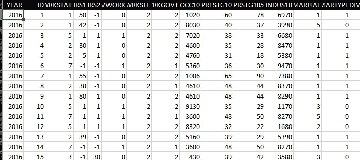

GSS 数据(2016 年)

婚姻和学位编码值的描述如下所示，因为我们将在后续分析中使用这些特征。

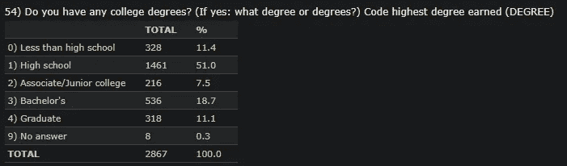

该数据集包括几个定量或分类的特征。分类数据也按顺序编码。例如，教育背景有六个不同的类别，每个类别被分配一个从 0 开始的数字。性别也是分类的，并且只为该特征分配两个值:“1”代表男性，“2”代表女性。还有几个量化数据例子年龄。要了解更多关于分配的数字，读者需要转到给定的链接，并找出哪个数字与哪个分类值相关联。我们将使用这些数据，对分类和定量数据执行以下命令，并解释输出。

这里还显示了库。我会用 Rstudio。目标是理解这些命令的输出，而不是强调语法。

> **分组依据**

group_by 是用于任何分析的最基本和最广泛使用的命令之一。它根据给定的特征变量对数据进行分组。一旦这个 group_by 命令被执行并存储在一个变量中，我们就可以汇总该变量并显示所需的统计数据。

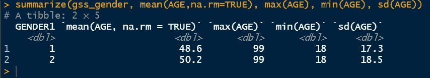

上面的命令显示了按不同性别分组的年龄的平均值、最大值、最小值和标准差，这些对于任何数据集都是非常重要的统计数据。

> **Group_by with descr**

其他重要的统计数据可以通过结合使用 descr 命令和 group_by 来确定。

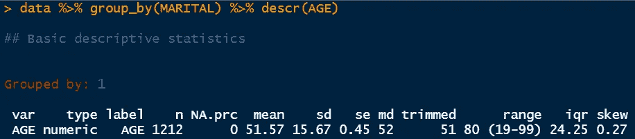

上面的快照显示数据按组 1 分组，它描述的变量是年龄。变量的类型是数字，总共有 1212 个数据点，空值的数量为 0。它的平均值为 51.57，标准偏差为 15.67。然后我们有一个标准误差，这里用 se 表示。标准误差是标准偏差除以数据点总数的平方根。在这种情况下，它是 15.67/平方根(1212)。接下来，我们得到的中值是 52。它说属于第一组的人的平均年龄是 52 岁。第一组是为已婚人士设立的小组。然后是调整后的范围，这里显示的是 51–80。它基本上消除了较低和较高数据点的百分比，但实际范围显示为 19-99。IQR 值被确定为 24.25，这是第三个四分位数和第一个四分位数之间的差值(Q3-Q1)。IQR 值非常便于确定盒状图的上限和下限，以消除异常值。最后，我们得到的偏斜值为 0.27。该值表示分布相当正常。任何大于 1 的值几乎都是右偏的，任何小于-1 的值都被认为是左偏的。

> **按所选特征统计**

我们还可以使用不同的库来确定不同参数的各种统计数据。其中一个执行如下所示。

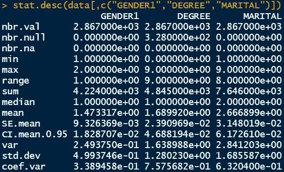

输出在第一行显示数据点的总数，在第二和第三行显示空值的总数。接下来，我们有最小值和最大值以及范围值。总和、中值、平均值和标准误差也显示在后续行中。我们还有 95%置信区间均值数据的值。然后，我们也有方差和标准偏差值，以及变异系数。方差是标准差的平方，方差系数是标准差除以平均值。标准差是确定所需参数范围的主要变量。然而，变异系数是另一种用平均值来衡量价差的方法。

> **表命令**

Table 是一个非常强大的命令，可以直观地将数据分成两个不同的组。例如，在下图中，数据被分为两组:第一组是婚姻状况，第二组是学位状况。

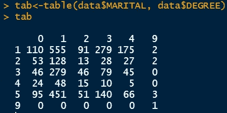

由于分类变量是编码的，我们需要参考数据集的描述来理解潜在的关系。例如，行中的 0 表示受教育程度低于高中的人，列中的 1 表示已婚的人。因此，110 人的教育背景不到高中，已婚。随着教育背景的变化有不同的数字。

> **其他杂项命令**

由 frq 表示的频率命令确定所选特征的重要统计。它还显示百分比值和累计百分比。

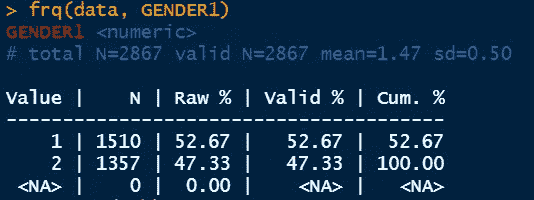

如果选择了多个因子，summary 命令会显示卡方检验输出。我们可以输入之前确定的 tab 变量。

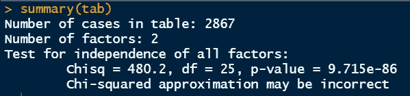

我想从卡方检验中澄清这些数字。首先，tab 变量保存来自婚姻状况和教育背景状况的表数据。卡方检验所做的是，检查一个变量与另一个变量的独立性。在这里，卡方检验是检查学历是否与婚姻状况有关。

它根据假设检验计算 p 值。这里的零假设表明，感兴趣的变量(婚姻和学位)不相互依赖。另一种假设认为变量是相关的，可能存在某种相关性。在这种情况下，p 值非常小。通常的显著性水平是 5%。由于 p 值小于 0.05，我们可以拒绝零假设，得出教育背景与婚姻状况有关的结论。

addmargins 命令提供行和列的总和。

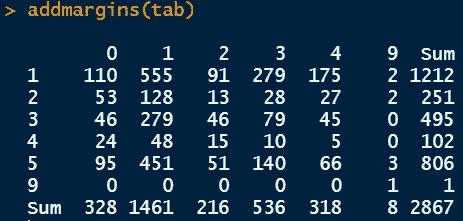

> **交叉表**

Crosstable 命令是另一个非常强大的命令，用于可视化表格输出并获得更多统计信息。

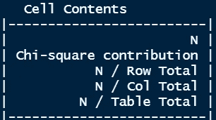

除了数量(N)之外，它还提供了卡方分布、占每行和每列总数的百分比以及占总数的百分比。

我们还可以确定卡方值和相应的 p 值，如下所示。它还提供相同的统计数据。卡方值为 480.19，自由度为 25。在 crosstable 命令的输出中，您可以看到每个段对总卡方值 480.19 的贡献。自由度值通过乘以(行数-1)和(列数-1)来计算。

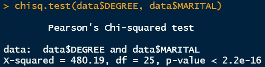

> **结论**

我们已经介绍了统计分析所需的几个重要 R 命令的最基本解释。这些对于分类和定量数据分析都是必需的，尽管随后的步骤即回归可以不同地进行。

感谢阅读。

[本文的 Youtube 演练](https://www.youtube.com/watch?v=TMh99PzrV2E)

 [## 用我的推荐链接加入媒体

### 阅读 Md Sohel Mahmood(以及媒体上成千上万的其他作家)的每一个故事。您的会员费直接…

mdsohel-mahmood.medium.com](https://mdsohel-mahmood.medium.com/membership)  [## 每当 Md Sohel Mahmood 发表文章时，都会收到一封电子邮件。

### 每当 Md Sohel Mahmood 发表文章时，都会收到一封电子邮件。通过注册，您将创建一个中型帐户，如果您还没有…

mdsohel-mahmood.medium.com](https://mdsohel-mahmood.medium.com/subscribe)