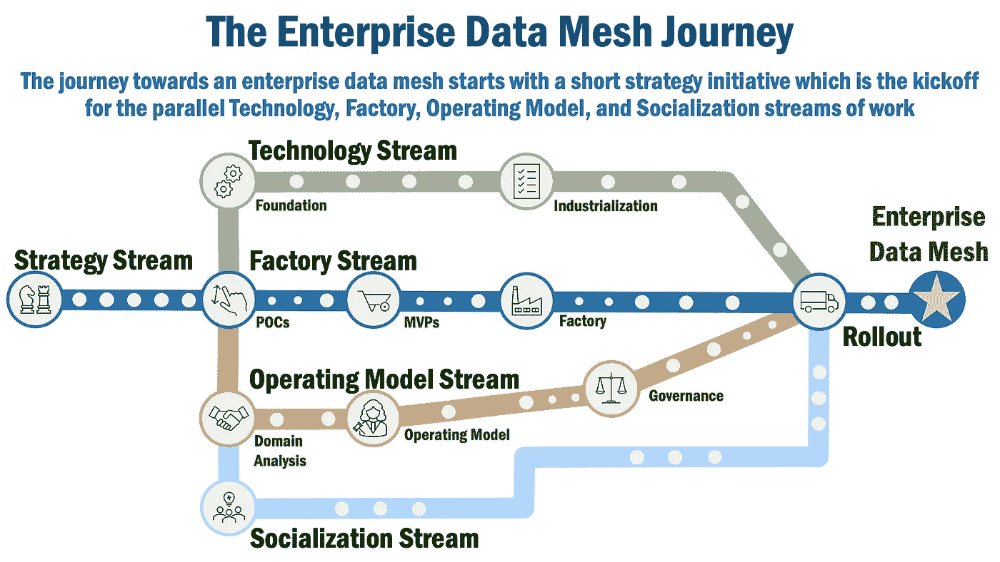
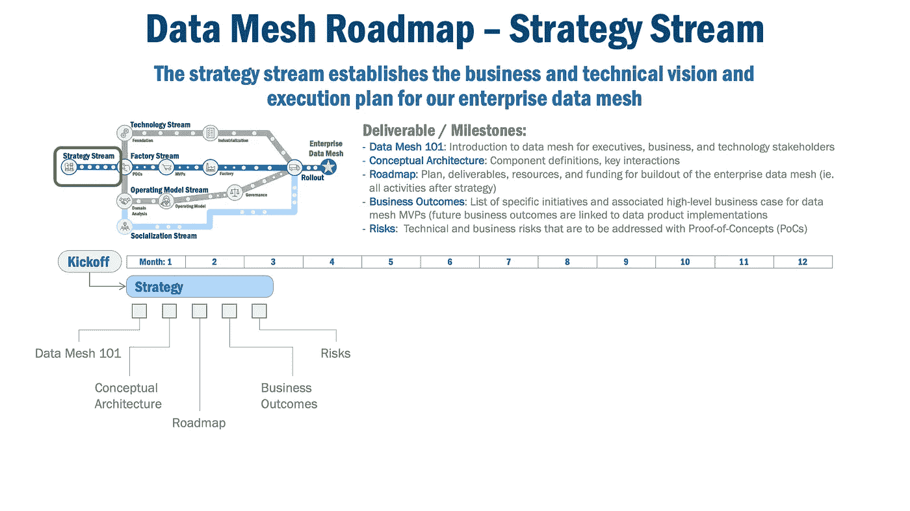
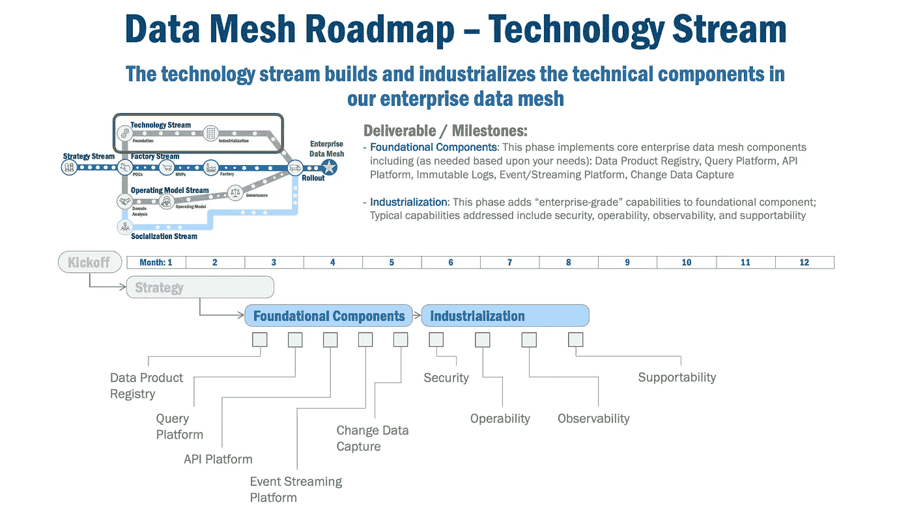
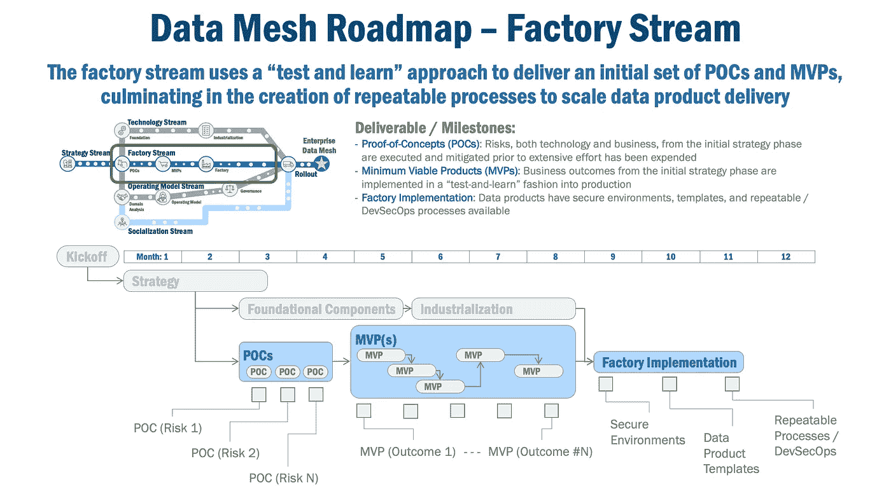
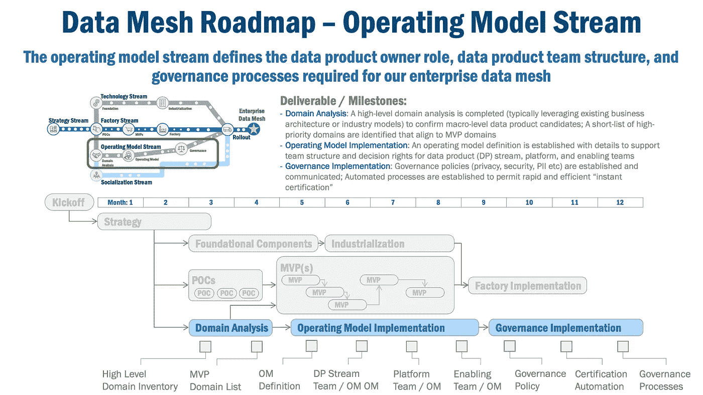
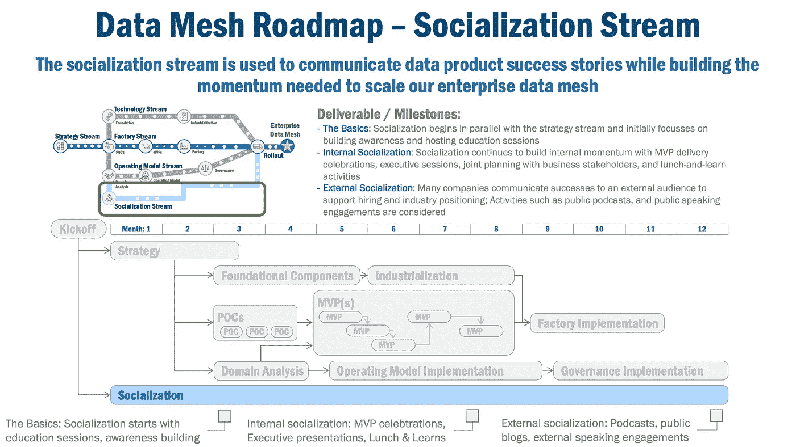
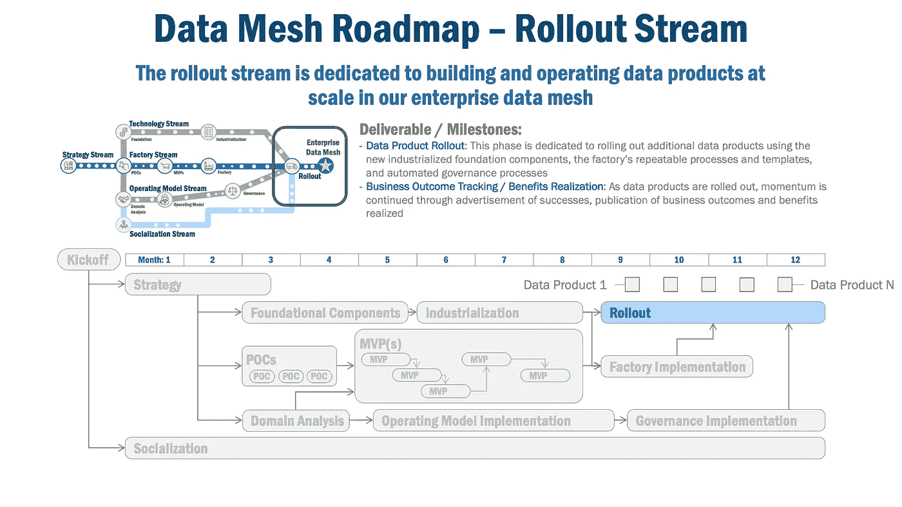
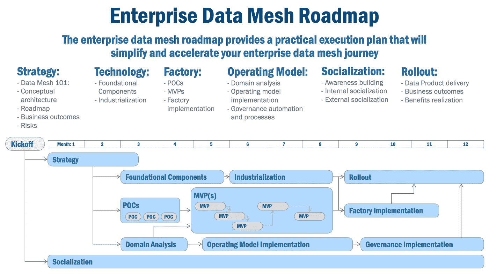

# 走向实用的数据网格路线图

> 原文：<https://towardsdatascience.com/towards-a-practical-data-mesh-roadmap-90607fb967f4>

## 通往企业数据网格的旅程可能充满挑战。但是通过使用一个实用的数据网格路线图，可以使它变得更容易和更快

苏哈什·维利在 [Unsplash](https://unsplash.com/s/photos/compass?utm_source=unsplash&utm_medium=referral&utm_content=creditCopyText) 上拍摄的照片

# 走向实用的数据网格路线图

实现企业数据网格既不简单也不直观。跨越多个维度(技术、组织和治理)的变革的深度、广度和速度使得企业的数据网格之旅既复杂又令人生畏。

然而，有了可靠的路线图，您的企业数据网格之旅可以变得更简单、更快速、成本更低。现在，不用说，每个公司的旅程都是独特的，但是在所有企业数据网格旅程中有几个共同的元素和考虑事项。

本文将阐述这些常见元素和注意事项，并提供:

*   说明建立企业数据网格的主要工作流程的路线图，
*   深入研究每个主要流程，以识别和排序可交付成果和结果

# 企业数据网格之旅

下面显示了一个让我的客户产生共鸣的企业数据网格之旅视图(图 1)。我使用“运输图”作为路线图类比，因为这可能是一种简单而直观的方式来显示关键流程和活动的宏观顺序。

*图 1，企业数据网格之旅*

如您所见，有几个工作流并行运行，以到达我们的企业数据网格目的地:

*   **策略流**，它为我们的企业数据网格提供了更广泛的业务和技术愿景以及预期结果。
*   **技术流**，它定义了我们的企业数据网格所需的技术基础和产业化活动。
*   **工厂流**，它引入了可重复的流程和模板，允许快速扩展我们的企业数据网格。
*   **运营模型流**，它定义了团队结构、交互和治理技术，以构建和运营企业数据网格。
*   **社交流**，它不仅用于交流成功经验，还用于持续推动构建我们的企业数据网络。
*   **推广流**，通过我们的企业数据网格加速数据产品的采用。

以下部分将进一步详细描述每个流。

# 战略流

我们的路线图从战略流开始，该战略流建立了关键的数据网格概念并创建了实施计划，同时描绘了我们的关键机会和风险。该流程通常可在 10–12 周内完成，在某些情况下，如果需要更多时间来获得管理层的支持，则时间会更长。

*图 2，数据网格路线图——策略流*

在这个流中创建了几个输出:

*   **数据网格简介** —“数据网格 101”宣传包——解释关键概念——数据产品、数据所有权、数据网格——这些概念构成了我们企业数据网格中实施的基本概念。
*   **架构**，它描述了数据产品以及企业数据网格中的核心组件(更多详细信息请参见[这里的](/the-anatomy-of-a-data-product-d3140f068311)、[这里的](/an-architecture-for-the-data-mesh-32ff4a15f16f)以及[这里的](/data-mesh-architecture-patterns-98cc1014f251))。
*   **路线图**，它为我们的企业数据网格定义了实现计划(可能看起来像我们在本文中讨论的路线图)。
*   **结果**，确定短期机会(在商业赞助下转化为 MVP 候选人)以及通过建立我们的企业数据网格预期的有形长期利益和结果。
*   **风险**，识别可能阻碍我们进展的技术、运营和组织风险。高优先级风险通常在未来的概念验证中解决(稍后解释)。

这一阶段的成功结果不仅取决于创建一组可交付成果(尽管它们很重要)，还取决于从不同的利益相关者那里获得认同。但是最好的方法是记住每一个策略都是在讲述一个故事。而且，就像任何好故事一样，我们的战略有一个广泛的叙事弧，它设定了舞台，确定了要克服的问题，并提供了应对我们挑战的英雄式解决方案。

然而，并不是每个人都是一个有成就的讲故事者。因此，这里有一个数据网格战略的执行摘要(简化)叙述示例，可以帮助您开始:

***

***数据是现代企业的燃料*** *。它为我们的决策提供动力，帮助我们提供卓越的客户体验，并提供缩短上市时间和进入新市场所需的敏捷性和洞察力。*

*然而，* ***今天，我们的数据很难被发现、消费、分享、治理*** *。事实上，我们的内部研究表明，数据科学家和分析师将几乎 50%的时间花在尝试查找和获取数据上，而不是创造新的见解。因此，我们看到更慢、更不准确、更昂贵的决策和见解、失去的机会以及更差的客户体验也就不足为奇了。*

*我们建议使用一种* ***现代数据网格方法，使数据更容易查找、消费、共享和管理*** *来解决这个问题。过去需要我们的数据科学家和分析师花费数天时间才能完成的工作，现在将在几分钟内完成，让我们获得更好、更快、更便宜的见解，让我们快速利用稍纵即逝的机会，并帮助我们提供卓越的客户体验。*

*凭借我们新发现的速度和敏捷性，我们的人工智能/机器学习和分析团队中的数据科学家和分析师将能够* ***提供更好、更快、更便宜的见解*** *，这些见解是提供进入新市场、利用新机遇和提供真正出色的客户体验所需的见解的基础。*

***

# 技术流

技术流在 16-24 周内开始构建我们的技术基础。现在，这似乎是一个很短的时间，但我发现大多数数据网格技术堆栈(数据库、安全基础架构，以及某些情况下的 CDC 和事件流技术)已经在许多大型企业中可用并运行。显然，如果核心基础技术尚不可用，那么这项任务可能会延长。

**技术流**的目标是建立使数据易于查找、消费、共享和管理所需的基础技术能力。为了做到这一点，这种趋势为交互数据产品的生态系统创造了工业化的基础，我们称之为企业数据网。

*图 3，数据网格路线图—技术流程*

技术流中有两组活动:(a)技术基础组件的构建和(b)这些组件的产业化。

“ **Foundation** ”活动将设置以下一个或多个组件，这些组件对于单个数据产品以及更广泛的数据网格实现是通用的:

*   **注册表**，每个数据产品中必不可少的一个组件，可以轻松地查找、发现、观察和操作数据产品
*   **联合查询平台**，使消费和共享由数据产品管理的数据变得更加容易
*   **API 平台**，这使得通过 API 消费数据变得更加容易
*   **不可变日志**，提供数据产品内活动、异常和警报的历史记录
*   **流媒体/活动平台**，通过现代流媒体技术轻松共享数据产品中的数据

一旦构建了基础功能，我们的重点就转移到将数据网格组件集成到企业运营环境中的“工业化”活动。

在工业化阶段，通常会涉及几项功能:

*   **安全性**，确保所有基础组件符合企业的安全状态；应解决的一组最低安全考虑事项包括数据加密(静态和动态)、使用身份管理的身份验证和授权、基于角色的访问控制、用于 API 访问的 OAUTH2 以及安全运行时环境；受监管行业的公司可能会选择更高等级的安全性，因为他们也会考虑更广泛的“零信任”技术。
*   **可操作性**，使所有数据网格组件和数据产品都与企业的运营环境相集成；至少考虑日志收集和警报捕获，并转发到安全和操作控制台。
*   **可观察性**，提供理解数据产品和数据网格组件的使用和内部操作所需的可见性，从而实现问题诊断和使用模式分析。
*   **支持**，建立集成到企业技术支持环境中所需的流程(和支持自动化)。

# 工厂的溪流

与技术流并行，我们的工厂流从一系列概念证明(POC)开始，这些概念证明解决了在策略流中发现的任何风险。这些概念验证不仅提供了技术信息，还提供了工作流的运营模式。事实上，我发现执行 POC 来测试重要的运营模式概念非常有用，例如，包括“数据产品所有者”角色的试运行。POC 活动通常有 8 到 10 周的时间限制，这可以确保我们尽快过渡到通过 MVP 活动交付业务价值。

*图 4，数据网格路线图—工厂流程*

认识到数据网格在大多数企业中是一个相对较新的事物，公平地说，可能应该考虑一种“测试学习”的方法。因此，我们的第一步是创建几个“概念证明”(POC)。POC 的目的是明确地解决/减轻在我们的初始策略流中识别的风险，而不是为了投入生产。典型的 POC 可能会尝试对企业来说是新的工具，或者在试验的基础上执行新的角色或运营模式原则。根据我的经验，在活动的这个阶段，完成 3-5 个 POC(基本上可以并行执行)是很常见的。

接下来，我们使用技术流中构建的一些基础设施(通过我们的一个概念验证)来交付几个“最低可行产品”，即 MVP。为了清楚起见，MVP 执行端到端的交付流程，最终实现生产部署，这与很少投入生产的 POC 不同。理想的 MVP 将数据产品交付到生产中，并具有以下几个特征:

*   **是相应的**,并提供可识别的商业利益。
*   **的风险和规模**适中，从而增加了成功交割的概率。
*   **在商业、数据和技术领域拥有广泛的赞助商**，他们可以克服任何重要交付项目中出现的不可避免的障碍。
*   **提供可应用于技术、数据和业务领域的重要知识**。

MVP 活动被确定为我们策略中的候选数据产品。每个 MVP 应选择在 5-7 周内交付，几个并行运行。由于每个 MVP 数据产品都经历了数据产品生命周期的每个阶段——从创建到交付到生产——每个 MVP 都应被视为学习和改进我们交付流程的机会。MVP 活动通常在 12–14 周内执行。

接下来，根据我们从几个 MVP 数据产品交付到生产中获得的经验，我们具备了建立工厂所需的洞察力，以及大规模交付数据产品所需的可重复流程。这一步很大程度上依赖于组织的 DevSecOps 能力，并在技术流的产业化步骤中应用于数据网格。如果这种能力成熟，那么建立一个工厂可以在 12–14 周内完成(显然，否则可能需要更长时间)。

一旦我们交付了几个 MVP，我们应该理解交付和操作一个数据产品需要什么。我们利用这些知识创建了一个“数据产品工厂”，可以大规模地构建数据产品。数据产品工厂建立:

*   **可重复的流程和模板**，使构建数据产品变得容易。
*   **DevSecOps 工具和管道**，使数据产品的部署和管理变得更加容易。
*   **安全环境**，使用“千篇一律”的流程构建，可以轻松构建安全的数据产品。

# 操作模型流

接下来，我们有**操作模型流**。在这个流程中，我们试图确定团队的类型，简化他们的交互，建立决策权，并定义高效和有效地交付数据产品所需的激励。

*图 5，数据网格路线图——运营模式流*

这一阶段的第一步是“领域分析”,确定我们将用来创建初始数据集的领域。有几个“提示”可以帮助识别重要的领域。例如，许多大公司的业务架构描述了对企业重要的领域和功能。在其他情况下，我看到企业使用行业特定的业务架构模型(金融服务的 BIAN，保险的 ACORD 等。)确定适合企业使用的关键行业功能。在这两种情况下，这些为确认您的企业数据环境提供了一个起点。最初的领域分析活动需要大约 8 周的时间。关于如何执行领域分析和识别候选数据产品的更多细节可以在我几个月前写的“[剖析数据产品](/the-anatomy-of-a-data-product-d3140f068311)”一文中找到。

一旦定义了领域模型，更有趣的练习是识别您的第一个领域，或者更具体地说，您的第一个领域的数据产品。领域模型再次提供了一些提示，但是理想的数据产品应该是有实际的和公认的好处的。因此，有了域，我们现在可以匹配一个确定的数据集、一个定义的所有者和一个有形的利益。事实上，这很可能是我们第一批 MVP 的理想候选人！

该流程中的下一组活动是定义实际的数据产品操作模型。但是，究竟什么是运营模式呢？不同的人有不同的定义，但我的简单观点是，它定义了“谁做什么，和谁一起做？”。定义您的运营模式取决于您所在组织的动态和文化，但目标应该是在大约 14-18 周内完成。有关设计您的数据产品团队的更多信息，请参见我最近的“[数据产品团队的拓扑结构](/topology-of-a-data-product-team-75dc5471fccf)”一文，有关定义您的数据产品运营模型的更多信息，请参见最近的另一篇“[数据产品的运营模型](/an-operating-model-for-data-products-fba6b268f698)”一文。

因此，在这个流中的操作模型任务中，我们定义:

*   **数据产品所有者**，负责创建数据产品，并与数据生产者和消费者以及安全和运营人员合作，以确保数据产品的安全性、高性能和可操作性。
*   **为数据产品提供服务的使能团队**，或者从数据产品接收服务的团队。
*   **所有权原则**，概述了数据产品所有者的职责，以及管理与企业中其他团队的交互的原则。
*   **关键交互**，确定管理数据产品和授权团队之间交互的方法、频率和过程；这些信息用于突出应该优化和区分优先级的重要或高频交互。

现在，有了运营模型，重点转向了数据网格治理——大致定义为“确保我们的数据产品以正确的方式做正确的事情”。不幸的是，大多数企业都有一个有些繁琐且过于手动的数据治理流程——数据网格和数据产品提供了一种新的方法和机会，可以将手动、受会议限制的官僚验证流程转变为自动化的“认证”流程。

这组活动建立了自动化和流程，支持数据产品的快速自动管理流程。大部分自动化来自于在我们的数据产品工厂中应用屡试不爽的可重复 DevSecOps 流程(如前所述)，同时利用嵌入到每个数据产品中的内置可观察性、发现和使用/警报/日志操作信息(有关更多详细信息，请参见本文[文章](/the-anatomy-of-a-data-product-d3140f068311))。这种能力还让我们有机会将数据产品治理从手动、受会议约束的官僚流程转变为自动化、仅限例外的“认证”流程。

这项任务应该计划花费大约 12-14 周。但是，请注意，这项任务会影响组织的人员和流程，并且需要大量的管理层支持(您应该相应地进行规划)。

# 社会化潮流

接下来，我们有**社会化流**。毫无疑问，我能说的最重要的一点是，它经常被忽视。但是为什么呢？嗯，可能是因为我们倾向于解决那些我们可以立即控制和改变的事情。由于许多数据网格计划始于技术，我们倾向于关注核心技术考虑。

*图 6，数据网格路线图——社会化流程*

现在，可以公平地说，成功的数据网格项目是那些平等地处理其他流，并着重强调社会化的项目。就我们的目的而言，我认为社交是使用任何可用的交流工具——文章、博客、播客、演示文稿、“办公时间”会议、“午餐和学习”会议——来:

*   **让利益相关者**参与进来，让他们不仅了解现状(所需的绝对最少沟通)，而且能够消除障碍，找到并批准资金，并向管理层传达利益。
*   **找到并签约赞助商**，因为他们听说了数据网格的好处，并内化了它如何为他们的团队或地区带来价值。
*   **建立势头**，因为每个沟通机会都变成了在整个企业中广泛“销售”的机会。

有趣的是，社交流有很多用途。早期社会化在组织中围绕数据网格建立意识，并通过执行演示、会议和项目进展交流来完成。但是，随着我们的数据网格之旅的继续，我们可以开始向更广泛的内部受众传播数据网格机会，并在整个组织内建立势头。最后，随着数据产品的构建和成功的实现，我看到组织使用公共/外部通信的增加，这主要是因为企业在数据网格方面的经验被视为在热门技术市场上招聘人才的有利工具。

# 展示流

最后，我们有展示流。一旦基本技术、工厂能力得到充分实施和稳定，允许数据产品的交付规模扩大，这一流程就开始了。这个流程的全部重点是交付数据产品，以便实现业务成果和价值。这个流没有特定的端点，而是随着新数据产品的识别和构建而不断执行。

*图 7，数据网格路线图——首次展示流*

# 企业数据网格路线图

现在，让我们将所有这些整合到一个可执行的路线图中。每个流程都有一套可交付成果和/或结果，并以合理的方式排序。在前面的章节中，每一个里程碑/可交付成果都被粗略地映射到每一个流程/阶段，再加上前面的章节，将一个广泛的企业数据网格计划放在一起应该是一个(希望)容易管理的任务。

*图 8，企业数据网格路线图*

不言而喻，但是每个企业都是不同的，都有一些独特的需求(虽然也有材料上的共性)，您需要考虑您企业的情况来创建自己的数据网格路线图。正如他们所说，你的里程可能会有所不同(但希望不会太多)。

# 总结想法

您可能知道，要让您的企业数据网格之旅顺利进行，需要处理许多任务和优先级。虽然我不能保证您的旅程没有挑战或问题，但我希望这篇文章为您提供了所需的洞察力，让您的企业的数据网格之旅变得更简单、更快、成本更低。

***

本文假设您对数据网格有很高的理解。如果您需要一些关于数据产品的背景信息，有许多文章可供参考:此处(数据产品)、此处(数据网格模式)、此处(数据网格架构)、此处(数据网格原则)和此处(经验教训)。对于感兴趣的读者，全套数据网格模式可在此处[和](/data-mesh-solution-and-accelerator-patterns-acffbf6e350)处[获得。](/data-mesh-architecture-patterns-98cc1014f251)

***

*除非另有说明，本文中的所有图片均由 Eric Broda(本文作者)创作。图像中使用的所有图标都是普通的 PowerPoint 图标和/或不受版权保护。*

*本文表达的观点仅代表我个人，不一定代表我的客户的观点。*