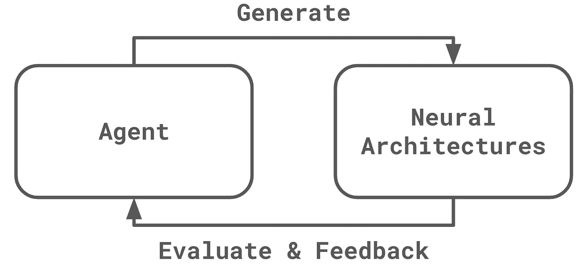

# 走向自动生成的模型

> 原文：<https://towardsdatascience.com/towards-auto-generated-models-289497c14909>

## 神经结构研究简史及其他

由 [Unsplash](https://unsplash.com/photos/PB80D_B4g7c) 上的 [Didssph](https://unsplash.com/@didsss?utm_source=unsplash&utm_medium=referral&utm_content=creditCopyText) 拍摄的照片

一篇有趣的论文于 2016 年在 arXiv 上悄然发布，作者是一群来自谷歌大脑的研究科学家，他们利用机器学习(ML)创建了新的 ML 模型。没有人预料到，它会引发关于 ML 研究的所有可能的争议，并在未来三年内将谷歌置于尴尬境地。然后，谷歌的一位图灵奖获得者又花了三年时间来全面分析这个问题，并做出正式回应。

作为一个博士，完成了这个课题的学位论文，我将用这篇文章带你走过这个领域发生的所有有趣的想法和戏剧。

## 突破:最初的论文

强化学习可以教会智能代理执行许多任务，如下棋或街机游戏。几乎任何东西，只要有一个清晰的反馈回路来评估代理人的表现，都可以被代理人学会。设计 ML 模型怎么样？我们可以很容易地评估一个机器学习模型。这就是这篇论文的想法。

论文题目为“[带强化学习的神经架构搜索](https://arxiv.org/abs/1611.01578)”，发表于 2016 年。它不是手动设计一种新型的神经网络架构，如 AlexNet、ResNet 或 DenseNet，而是使用强化学习来自动生成新的神经架构。如下图所示，一个代理，也是一个神经网络，被训练产生神经结构。每个神经架构都经过训练和评估。评估结果是对代理人的奖励函数。通过产生新的体系结构并学习每一个体系结构的性能，智能体逐渐学会如何产生好的神经体系结构。

作者图片

在该论文中，一种新型的神经网络 NasNet 是通过强化学习自动生成的，并且在图像分类任务上优于当时大多数其余的神经架构。

该论文还在 ML 中开辟了一个全新的研究领域，称为神经结构搜索(NAS)，即使用自动化方法产生新型的神经结构。

这篇论文改变了游戏规则。表面上，这只是创造更好的神经结构的又一次尝试。然而，它试图使 ML 研究者的工作自动化。许多人担心他们的工作会被曼梯·里抢走。军情六处的研究人员不知道。相反，他们一直在努力用 ML 取代自己。如果这个想法可以实现，他们将开始生产 ML 研究人员无法企及的 ML 模型。

如此伟大的尝试是有代价的。由于训练和评估大量的神经架构，Google Brain 需要 800 个 GPU 来运行实验。如此高的费用让这个领域的大多数玩家望而生畏。没有任何其他团体立即发表关于这个主题的论文。

谷歌大脑通过将这种自动化设计思想扩展到 ML 过程的其他部分来延续这一研究路线，例如[搜索激活功能](https://arxiv.org/abs/1710.05941)和[搜索数据扩充](https://arxiv.org/abs/1805.09501)。

## 突破:降低成本

为了降低 NAS 消耗的计算资源，他们在最初论文发表一年后发表了一篇新论文。这篇新论文的标题是“[通过参数共享的高效神经架构搜索](https://arxiv.org/abs/1802.03268)”(ENAS)。它将 NAS 的成本降低到接近训练单个神经网络的成本。他们是怎么做到的？

由代理生成的神经架构彼此之间可能没有太大的不同。在之前的工作中，他们必须端到端地训练每一个神经架构，即使它们彼此非常相似。我们是否可以重新使用先前训练的神经架构中的权重来加速稍后生成的神经架构的训练？这就是本文的观点。

他们仍然使用代理来生成新的神经架构。通过改变它们训练每个神经架构的方式来提高效率。每个神经架构都是使用来自先前训练的神经架构的权重热启动的。通过这种改进，训练由代理生成的所有神经架构的总成本几乎等于训练大型神经架构的成本。

## 突破:神经架构是可区分的

在上述论文发表后不久，其他一些研究小组也开始加入这场游戏。他们的目标也是让 NAS 更高效，但是是从不同的角度。他们没有改进培训和评估，而是改进了代理人。

从离散数学中，我们知道图是离散的结构。神经架构是计算图形，所以是离散的。由于它们的离散性，代理可能不容易察觉不同神经架构和它们的性能之间的相关性。如果我们能让神经结构变得可区分呢？然后，我们不再需要一个代理来生成神经架构。我们可以直接使用梯度下降来优化神经架构，就像我们如何训练神经网络一样。

这听起来像是一个疯狂的想法，但“[飞镖:可区分架构搜索](https://arxiv.org/abs/1806.09055)”和“[神经架构优化](https://arxiv.org/abs/1808.07233)”的作者找到了方法来实现它们。这里我们就不细说了，但是欢迎你自己看报纸。

## 其他尝试

随着越来越多的研究人员致力于这一主题，在最初的 NAS 问题上取得突破变得越来越困难。他们开始基于这些可区分的解决方案进行改进，或者给问题添加约束。在这些论文中，有一些高质量的值得一读，包括 [SNAS](https://arxiv.org/abs/1812.09926) 、 [ProxylessNAS](https://arxiv.org/abs/1812.00332) 、 [MnasNet](https://arxiv.org/abs/1807.11626) 。

## 争议:NAS 没有意义

当我们都认为这个话题已经到了它的顶峰，在这个领域不会发生什么大的事情时，一场巨大的争论出现了，摧毁了整个研究领域。

想象一下这种情况。如果我只允许代理生成与 ResNet 非常相似的神经架构，那么生成的神经架构肯定会执行得与 ResNet 相似。在这种情况下，我们能说智能体足够聪明来找到好的神经架构吗？不管代理人有多笨，只要研究人员足够聪明，能够将搜索空间限制在对好的神经架构的少量掌握中，结果就会很好。《国家科学院院刊》论文的作者使用了这种技巧吗？发表了一篇论文来验证这一点。

这篇论文的标题是“神经结构搜索的随机搜索和再现性”。他们用随机搜索算法取代了强化学习或 NAS 论文中使用的任何搜索算法。

结果令人震惊。随机搜索和其他搜索算法一样好，有时甚至更好。这个结论使 NAS 的整个研究领域无效。

如果论文中的结论是正确的，那么 NAS 只是人工设计神经架构的一种更奇特的方式。在 ML 模型设计中，它永远不能自给自足，因为如果没有经验丰富的 ML 研究者精心设计的搜索空间，它永远无法找到好的神经架构。

## 突破:从零开始发现模型

当我们都认为 NAS 研究已经结束时，它以另一篇改变游戏规则的论文“ [AutoML-Zero:从零开始进化机器学习算法](https://arxiv.org/abs/2003.03384)”引人注目地卷土重来，这篇论文为 ML 是否可以生成新的 ML 模型提供了新的线索。

与以前的 NAS 论文不同，神经架构不再局限于人类精心设计的搜索空间。它甚至不搜索神经结构。它从头开始构建 ML 模型。

它使用进化算法来组合基本的数学运算，如加法、乘法或均匀采样。使用这些组合作为 ML 模型，并评估它们在数据集上的性能以选择好的模型。通过这种设置，几乎所有的 ML 模型都包含在搜索空间中。

结果是惊人的。该算法产生了许多广泛使用的 ML 模型。例如，它重新发现了线性回归、随机梯度下降、ReLU 和 2 层神经网络。搜索过程就像重放 ML 的研究历史。

虽然论文没有提出更好的 ML 模型，但它证明了自动生成 ML 模型的概念。至少在基本水平上，ML 生成可用的 ML 模型是可能的。

## 争议:NAS 与环境

在之前的争议之后不久，一场更大的关于 NAS 的危机出现了，这场危机始于一篇名为“[NLP](https://arxiv.org/abs/1906.02243)中深度学习的能源和政策考虑”的论文。它被[麻省理工科技评论](https://www.technologyreview.com/2019/06/06/239031/training-a-single-ai-model-can-emit-as-much-carbon-as-five-cars-in-their-lifetimes/)重点报道，并吸引了很多关注。

该工作调查了进行深度学习研究，特别是为自然语言处理(NLP)训练大型深度学习模型的能耗和碳排放。文中提到的最大模型是基于 NAS 的变压器模型，它包含 2 亿个参数。训练这样一个模型所排放的二氧化碳相当于 300 名乘客从旧金山到纽约的往返旅程。

深度学习与环境。这是近年来深度学习以疯狂的速度前进时需要回答的一个基本问题。突然，出现了许多批评。谷歌被批评通过训练大型深度学习模型来损害环境。谷歌会成功解决这场公关危机吗？最重要的是，谷歌会承担起解决深度学习生态友好问题的责任吗？

作为回应，谷歌承诺其顶尖人才来解决这个问题。图灵奖获得者大卫·帕特森(David Patterson)带领一群天才研究科学家对这个问题进行了近三年的全面调查。最后，他们在 2022 年提出了一个有信心的回应。

论文的题目是“[机器学习训练的碳足迹将趋于平稳，然后收缩](techrxiv.org/articles/preprint/The_Carbon_Footprint_of_Machine_Learning_Training_Will_Plateau_Then_Shrink/19139645)”。他们提出了 4 种最佳实践，以减少训练深度学习模型的碳足迹和能耗。通过采用这些最佳实践，谷歌大幅减少了其深度学习相关活动的碳排放。2021 年减少的二氧化碳量相当于 2017 年训练一个变压器模型 700 次的二氧化碳排放量。

## 神经结构搜索不是自动的

在我们得出结论之前，我想解释一下 NAS 和 AutoML 之间的混淆，因为这两个术语经常一起出现。AutoML 甚至以“AutoML-Zero”的名义出现。然而，大多数 NAS 研究不是自动的。

人们称 NAS 为 AutoML，因为 NAS 是一种创建新 ML 模型的自动化方法。NAS 产生了新的 ML 模型，这些模型可以很好地推广到其他数据集和任务。然而，从从业者的角度来看，除了性能更好之外，它们与 ResNet 并没有太大的不同。如果他们想在实践中使用该模型，他们仍然必须进行数据预处理、后处理、超参数调整等等。

AutoML 不是关于生产新的 ML 模型，而是关于 ML 解决方案的易于采用。给定一个数据集和一个任务，AutoML 试图自动组装一个合适的端到端 ML 解决方案，包括数据预处理、后处理、超参数调优等等。从从业者的角度来看，采用 ML 来解决他们的问题极大地减少了知识需求和工程工作量。

## 结论

到目前为止，我们已经回顾了自动生成的 ML 模型的历史。现在我们需要回答这个问题:我们能依赖自动生成的 ML 模型吗？

从上面的讨论中，随着这个领域的发展，解决方案变得越来越好。尤其是 AutoML-Zero 出来的时候，我感觉已经走上正轨了。然而，仅仅为了找到一个简单的 2 层神经网络，它就已经耗尽了今天的计算能力。我无法想象需要多少计算资源才能生产出比当今最先进的模型更好的模型。此外，财务收益不像 GPT-3 或稳定扩散等其他 ML 研究那样明确。大公司不太可能为此投入大量资源。因此，我的回答是:短期内不可能实现。

## 更大的影响

除了上面的结论，这些努力对一般的 ML 研究有一些不可忽视的更大的影响。我们上面讨论的论文太暴力了。它们与典型的 ML 研究大相径庭。

这里的确切区别是什么？我们曾经用漂亮的数学方程和严格证明的定理建立 ML 模型。然而，NAS 算法根本不懂数学。他们将 ML 模型视为黑盒，仅通过实验对其进行评估。

ML 研究的方法论开始看起来像实验科学。就像实验物理学一样，我们基于实验发现新的发现。那么，我们应该像数学或实验科学一样进行 ML 研究吗？ML 模型背后的数学有必要吗？NAS 提出了这些问题让我们所有人来回答，这些问题将对未来的 ML 研究产生深远的影响。

在我看来，在没有强大数学支撑的情况下创建 ML 模型在未来可能是不可避免的。数学是人类建造的完美世界，每个结论都是通过严格的推导发现的。然而，随着数学世界的发展，它逐渐变得和现实世界一样复杂。最终，我们将不得不依靠实验方法来发现数学中的新发现，就像我们今天对现实世界所做的那样。