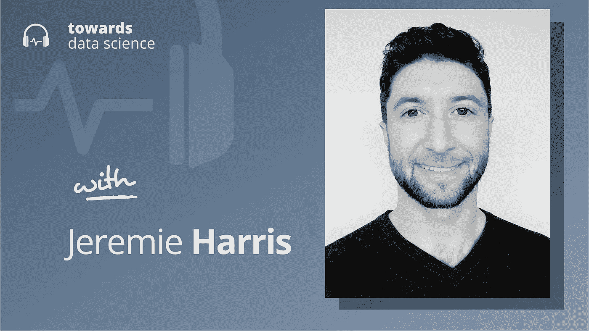

# 走向数据科学播客结局:人工智能的未来，以及随之而来的风险

> 原文：<https://towardsdatascience.com/towards-data-science-podcast-finale-the-future-of-ai-and-the-risks-that-come-with-it-db4d29e77174>

## [播客](https://towardsdatascience.com/tagged/tds-podcast)

## 杰里米·哈里斯谈建造人类级人工智能的高风险

[苹果](https://podcasts.apple.com/ca/podcast/towards-data-science/id1470952338?mt=2) | [谷歌](https://www.google.com/podcasts?feed=aHR0cHM6Ly9hbmNob3IuZm0vcy8zNmI0ODQ0L3BvZGNhc3QvcnNz) | [SPOTIFY](https://open.spotify.com/show/63diy2DtpHzQfeNVxAPZgU) | [其他](https://anchor.fm/towardsdatascience)

*编者按:TDS 播客由 Jeremie Harris 主持，他是 AI 安全初创公司*[*Gladstone*](http://gladstone.ai)*的联合创始人。每周，Jeremie 都会与该领域前沿的研究人员和商业领袖聊天，以解开围绕数据科学、机器学习和人工智能的最紧迫问题。*

两年前，我告诉数据科学社区，我们将把这个播客引向一个不同的方向。在那之前，我们的客人和我们的谈话一直专注于机器学习和数据可视化的行业应用、数据科学职业发展战略和其他相关主题。这是有道理的:当时我正在经营一家名为[sharpes minds](http://sharpestminds.com)的公司，该公司为数据科学家和机器学习工程师提供指导计划。我和我的兄弟艾德共同创立了 SharpestMinds，他在 T21 之前就已经上了播客。SharpestMinds 是我们一起建立的第三家公司，但重要的是，它是第一家真正运作的公司。我们很幸运，我们周围有一个很棒的团队，该公司成为了世界上最大的基于收入共享协议的数据科学和机器学习导师计划。

但是 2020 年初，一切都变了。那时 OpenAI 向世界宣布他们已经创造了 GPT 3 号，更重要的是，这一刻我们意识到 OpenAI 用来建造 GPT 3 号的配方很可能会被扩展得非常非常远——可能会一直扩展到建造通用人工智能，可能会在广泛的任务中满足我们超越人类的智能。

与此同时，艾德和我意识到了人工智能联盟社区的担忧，他们多年来一直认为这些广泛智能的人工智能系统最终可能变得不可控制，并带来灾难性的风险。尽管这些说法起初看起来很疯狂，但我们多年来越深入研究，就越难否认它们实际上是相当合理的。当我们开始与人工智能风险怀疑论者交谈时，我们非常失望，对他们的论点没有什么印象。

因此，一方面担心高级人工智能的潜在灾难性风险，另一方面又担心建立精确的这种系统的前景，我们觉得除了人工智能安全之外，我们没有理由做任何事情。所以我们做了一个艰难的决定，把 SharpestMinds 留给我们最早的两个员工，投入到人工智能安全的世界中，不知道从哪里开始。

大约在那个时候，我联系了《走向数据科学》的编辑团队，告诉他们我们的决定。他们提出了一个想法:也许我们可以使用 TDS 播客作为一个平台来探索人工智能的安全，并与更广泛的世界分享其中的一些想法，因为我们继续我们的人工智能校准之旅。

我喜欢这个概念。这就是为什么两年前，我们把播客推向了新的方向。从那以后，幕后发生了很多事情。例如，我和艾德与我们的一个好朋友共同创办了一家人工智能安全公司，他也一直在密切关注人工智能安全的故事，并且是美国国防界的一位高级领导人。我们将很快宣布一些令人兴奋的事情，我可以真诚地说，我从来没有想到我们能够这么快就在人工智能安全方面产生影响。

但是，让我们来到这里的担忧也变得更加突出。GPT-3 确实引发了人工智能能力的革命，该领域似乎正在形成这样的观点，即人工智能规模可能会让我们在很大程度上达到人类水平或超人的人工智能。与此同时，我们已经开始看到[的经验证据](https://arxiv.org/abs/1912.01683)，这表明我们应该预料到开发这种系统*默认*会带来灾难性的后果。

随着我们对这个领域的深入研究，我的时间越来越多地被消耗在跟上人工智能和人工智能安全的艺术状态上，这让我没有太多时间来探索播客上的其他主题。这很有挑战性，因为我知道我们的许多听众 TDS 社区——仍然希望听到其他事情。比如数据可视化、管道开发和数据科学工具。

因此，与人工智能的最新发展水平一样重要，与人工智能的安全性一样重要，我认为我必须要做的那些主题的更深层次的探索确实属于一个稍微不同的领域。因此，这将是 TDS 播客的最后一集，至少现在是这样。我将继续在新的 Gladstone AI 播客中探索这些主题，你可以在节目笔记中找到链接，我们将继续在 TDS 博客上发布这些剧集，但作为一个更适合探索这些具体想法的独立项目。如果你愿意跟我去那里，我很荣幸你能和我一起走完剩下的旅程。

在这最后一集，我将提供我对过去两年人工智能进展的看法，以及我认为这对从人工智能安全到人类未来的一切意味着什么。

你可以在下面一集找到我讨论的链接。

*   新的 [Gladstone 人工智能播客](https://anchor.fm/gladstoneai)，在这里我将每周用简单的英语谈论一个新的前沿人工智能模型(它的用例，它的潜在恶意应用，以及它与人工智能对齐风险的相关性)。
*   我即将出版的书:[量子力学让我做到了](https://www.amazon.com/Quantum-Physics-Made-Fundamental-Everything/dp/0735244138)。
*   我们的两集讨论了人工智能安全中的工具性目标:[亚历克斯·特纳](/will-powerful-ais-tend-to-seek-power-e3b6bb02f3a5)和[爱德华·哈里斯](/new-research-advanced-ai-may-tend-to-seek-power-by-default-fdc9eb0afd87)。
*   80，000 小时:[一个网站](https://80000hours.org/)，在这里你可以获得如何为解决 AI 安全和 AI 政策问题做出贡献的建议。
*   人工智能安全中的具体问题:一个老掉牙的好东西，[介绍了](https://arxiv.org/abs/1606.06565)许多至今仍未解决的人工智能校准中的核心问题。
*   看看你是否对人工智能政策感兴趣的一些剧集(按时间顺序排列):[瑞安·费达西克](/can-the-u-s-and-china-collaborate-on-ai-safety-f066731975d1)、[罗西·坎贝尔](/should-all-ai-research-be-published-5226ad5145b4)、[本·加芬克尔](/superhuman-ai-and-the-future-of-democracy-and-government-5e57d3e53d42)和[海伦·托纳](/the-strategic-and-security-implications-of-ai-329ca7d6d42e)。
*   如果你对人工智能技术对齐感兴趣，可以看看一些剧集(按时间顺序排列):[伊琳娜·里什](/out-of-distribution-generalization-66b6f8980ef3)，[亚历克斯·特纳](/will-powerful-ais-tend-to-seek-power-e3b6bb02f3a5)，[简·雷科](/ai-alignment-at-openai-a242a135d3bf)，[丹尼尔·菲兰](/peering-into-neural-nets-for-ai-safety-f91c4f1fcc9f)，[安迪·琼斯](/ai-safety-and-the-scaling-hypothesis-76bfee57f924)，[埃文·胡宾格](/the-inner-alignment-problem-9eb5f234226b)，[布莱恩·克里斯蒂安](/the-alignment-problem-2c890c47fca4)，[瑞安·凯里](/what-does-your-ai-want-4dd5a6044412)，[斯图亚特·阿姆斯特朗](/ai-humanitys-endgame-e3d93e0f9969)，[伊森·佩雷兹](/making-ai-safe-through-debate-935fe8a0ec5)，
*   我在其他播客上讨论 AI 安全的出场:[埃文·索罗门秀](https://omny.fm/shows/580-cfra/ess-understanding-ai-public-safety-concerns-and-th)、[政策选项](https://policyoptions.irpp.org/magazines/november-2021/the-public-safety-risks-of-ai/)、[超级数据科学](https://www.superdatascience.com/podcast/agi-the-apocalypse-machine)、[香蕉数据播客](https://www.youtube.com/watch?v=7Atnp-HAzQw&ab_channel=BananaDataPodcast)、[肯·吉的播客](https://www.youtube.com/watch?v=7VcdvSyoxnc&ab_channel=KenJee)、[来自未来的呼叫](https://podcasts.google.com/feed/aHR0cHM6Ly9mZWVkcy5idXp6c3Byb3V0LmNvbS8xMzc2MjI0LnJzcw/episode/QnV6enNwcm91dC02ODM3MDU1?hl=en-CA&ved=2ahUKEwiouY3rhqz6AhVkMlkFHagRChoQjrkEegQIAxAU&ep=6)和[数据字节](https://podcasts.apple.com/us/podcast/artificial-general-intelligence-agi-safety-with/id1561613959?i=1000560778302)。
*   Gladstone AI 的 AI 模型跟踪器:[aitracker.org](http://aitracker.org)。

## 章节:

*   0:00 介绍
*   6:00 惨痛的教训
*   10:00 介绍 GPT 3 号
*   16:45 AI 灾难性风险(回形针示例)
*   23:00 悬赏黑客
*   27:30 接近智能
*   32 点总结