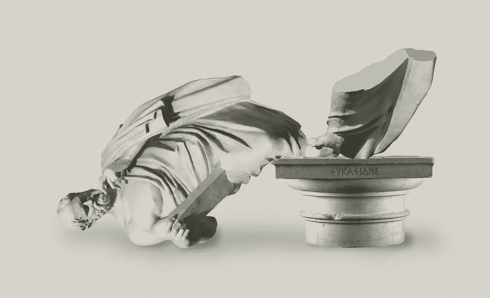
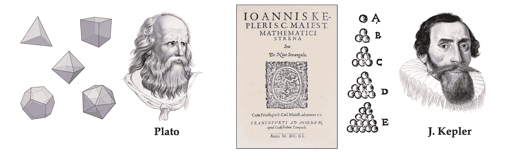
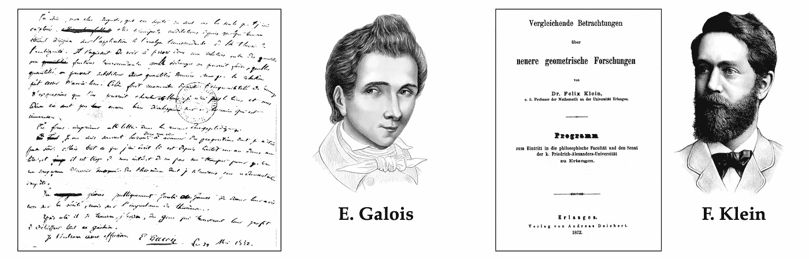
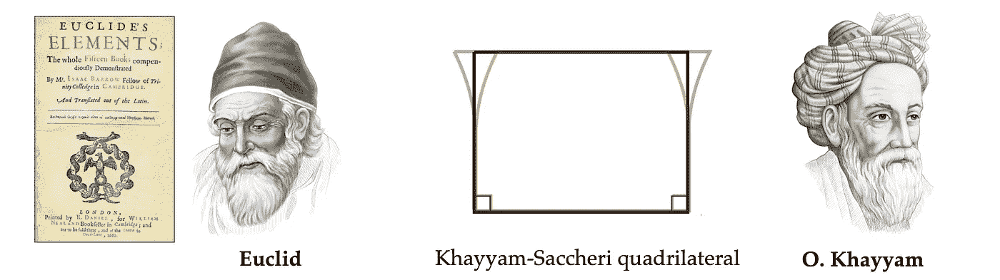
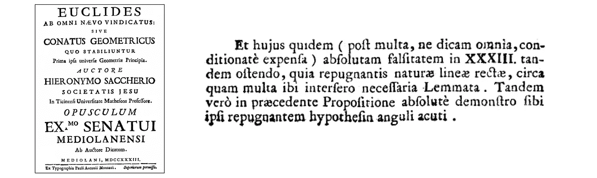
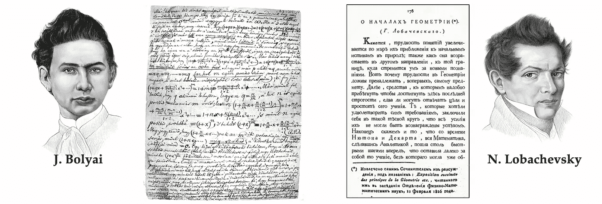
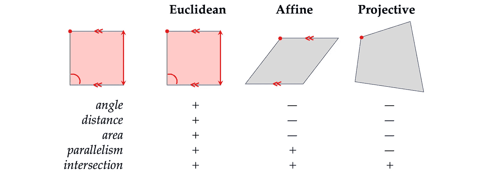
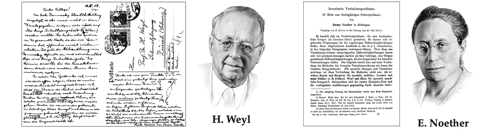

# 走向几何深度学习 I:站在巨人的肩膀上

> 原文：<https://towardsdatascience.com/towards-geometric-deep-learning-i-on-the-shoulders-of-giants-726c205860f5>

## 几何深度学习的起源

## 几何深度学习从对称性和不变性的角度处理了一大类 ML 问题，为多种多样的神经网络架构(如 CNN、gnn 和 Transformers)提供了一个通用蓝图。在一系列新的帖子中，我们研究了这些想法是如何从古希腊几何到图形神经网络的历史中出现的。

图片:基于 Shutterstock。

*雪花和标准款有什么共同点？对称。在“走向几何深度学习系列”的第一篇文章中，我们讨论了对称性的概念如何帮助组织了 19 世纪的几何动物园，并彻底改变了理论物理。这篇文章基于 M. M .布朗斯坦、j .布鲁纳、t .科恩和 p .韦利奇科维奇、* [*几何深度学习*](https://arxiv.org/abs/2104.13478) *(在麻省理工学院出版社完成后出现)一书的介绍章节，并伴随* [*我们的课程*](https://youtube.com/playlist?list=PLn2-dEmQeTfSLXW8yXP4q_Ii58wFdxb3C) *参加非洲机器智能大师赛(AMMI)。参见* [*第二部分*](/towards-geometric-deep-learning-ii-the-perceptron-affair-fafa61b5c40a?sk=7a8f4beb9bd4ed347ad01c05ea54fb2e) *关于神经网络的早期历史和第一个【艾冬】* [*第三部分*](/towards-geometric-deep-learning-iii-first-geometric-architectures-d1578f4ade1f?sk=89a4bf9164d5ef43a25ad1fc23bd1372) *研究第一个“几何”架构，* [*第四部分*](/towards-geometric-deep-learning-iv-chemical-precursors-of-gnns-11273d74125?sk=00a1aa8fb968b95245e1f2cf275198ea) *致力于早期 GNNs，以及我们的* [*以前的帖子*](/geometric-foundations-of-deep-learning-94cdd45b451d?sk=184532175cb936d7b25d9adebd512629) *总结几何深度学习的概念*

过去十年见证了数据科学和机器学习的一场实验革命，深度学习方法是这场革命的缩影。事实上，许多以前被认为遥不可及的高维学习任务——计算机视觉、下围棋或蛋白质折叠——实际上在适当的计算规模下是可行的。值得注意的是，深度学习的本质是建立在两个简单的算法原则上的:第一，表示或特征学习的概念，其中适应的，通常是分层的，特征捕捉每个任务的规律性的适当概念，第二，通过梯度下降型优化进行学习，通常作为反向传播来实现。

虽然学习高维空间中的一般函数是一个糟糕的估计问题，但大多数感兴趣的任务并不是一般的，而是带有本质的预定义规则，这些规则来自底层的低维空间和物理世界的结构。[几何深度学习](/geometric-foundations-of-deep-learning-94cdd45b451d?sk=184532175cb936d7b25d9adebd512629)关注的是通过统一的几何原理来揭示这些规律性，这些几何原理可以应用于广泛的应用领域。

利用一个大系统的已知对称性是对抗维数灾难的一种强有力的经典疗法，并且构成了大多数物理理论的基础。深度学习系统也不例外，从早期开始，研究人员就采用神经网络来利用物理测量中产生的低维几何，例如图像中的网格、时间序列中的序列或分子中的位置和动量，以及它们相关的对称性，如平移或旋转。

由于这些想法在科学中有着深厚的根基，我们将试图了解它们在历史上是如何演变的，最终形成一个可以应用于当今大多数流行的神经网络架构的通用蓝图。

# 秩序、美丽和完美

> “对称，无论你定义它的含义有多宽或多窄，都是一种观念，古往今来人类一直试图通过它来理解和创造秩序、美和完美。”—赫尔曼·韦勒(1952 年)

伟大的数学家 Hermann Weyl [1]在他从普林斯顿高等研究院退休前夕的著作中给出了对称的这个有点诗意的定义。Weyl 追溯了对称性在古代科学和艺术中占据的特殊位置，从苏美尔人的对称设计到毕达哥拉斯人，毕达哥拉斯人认为圆是完美的，因为它具有旋转对称性。柏拉图认为今天以他的名字命名的五种正多面体是如此的基本，它们一定是塑造物质世界的基本构件。

然而，尽管柏拉图被认为创造了术语 *συμμετρία* ，字面意思是“相同的度量”，但他只是模糊地使用它来传达艺术中的比例之美和音乐中的和谐之美。德国天文学家和数学家约翰尼斯·开普勒首次尝试对水晶体的对称形状进行严格分析。在他的论文《论六角雪花》[2]中，他将雪花的六重二面角结构归因于粒子的六边形堆积
——这一想法虽然先于对物质如何形成的清晰理解，但今天仍然是结晶学的基础[3]。

柏拉图(左)认为对称的多面体(“柏拉图立体”)是自然的基本构件。约翰尼斯·开普勒(右)首次将水晶体的六重对称性归因于粒子的六边形堆积，这要早于现代结晶学。肖像:伊霍尔·戈尔斯基。

在现代数学中，对称性几乎是用群论的语言来表达的。这个理论的起源通常归功于 variste Galois，他创造了这个术语，并在 19 世纪 30 年代用它来研究多项式方程的可解性[4]。与群论相关的另外两个名字是 Sophus Lie 和 Felix Klein，他们相遇并一起卓有成效地工作了一段时间[5]。前者将发展今天以他的名字命名的连续对称理论(李群)；后者在他的埃尔兰根计划中宣称群论是几何学的组织原则。鉴于 Klein 的计划是几何深度学习的灵感来源，因此值得在它的历史背景和革命性影响上花更多时间。

variste Galois(左)和他在致命决斗的前一天晚上写给朋友的描述群论的信。费利克斯·克莱因(右)和为他的教授任命准备的研究计划书的前页，该计划作为“埃尔兰根计划”进入了数学史。肖像:伊霍尔·戈尔斯基。

# 一个陌生的新世界

大约 2300 年前，古希腊的欧几里得在一篇名为《T2 元素》的论文中正式确立了现代几何的基础。欧几里得几何(在学校仍被称为“几何学”)是建立在五个直觉公理或公设上的一组结果。[第五公设](https://en.wikipedia.org/wiki/Parallel_postulate)——声明只有一条平行于给定直线的直线可能通过该直线之外的一点——似乎不太明显，自古以来一群杰出的数学家竭尽全力试图证明这一点，但毫无结果。

“几何之父”欧几里得(左)和欧玛尔·海亚姆(右)和乔瓦尼·塞开里在试图证明第五公设时使用的结构。肖像:伊霍尔·戈尔斯基。

对平行线问题的早期处理方法出现在 11 世纪的波斯论文《关于欧几里得《几何原本》公设困难的评注》中，作者是欧玛尔·海亚姆[6]。18 世纪的意大利耶稣会牧师乔瓦尼·塞开里很可能从他自己作品的标题 [*判断出他之前的作品是欧几里得 ab omni nvo providus*](http://mathematica.sns.it/media/volumi/128/Euclides%20ab%20omni%20naevo%20vindicatus_bw.pdf)(“欧几里得清除了每一个污点”)。

像海亚姆一样，他考虑了边垂直于底边的四边形的顶角。锐角导致无限多条不相交的线可以穿过不在直线上的一点，这一结论似乎是如此反直觉，以至于他拒绝了这一结论，称之为*‘repugnatis natural linrect’*(‘与直线的本质相抵触’)【7】。

乔瓦尼·塞开里的《欧几里德证明》的卷首，以及拒绝双曲几何的段落，认为这是“对自然的反驳”

19 世纪已经意识到第五公设并不重要，人们可以根据不同的平行度概念来构造替代的几何图形。一个这样的早期例子是[射影几何](https://en.wikipedia.org/wiki/Projective_geometry)，顾名思义，出现在透视图和建筑中。在这种几何学中，点和线是可以互换的，没有通常意义上的平行线:任何线都在“无穷远点”相交。虽然射影几何的结果自古以来就为人所知，但吉恩·维克托·蓬斯莱在 1812 年首次系统地研究了它[8]。

第一次建立真正的非欧几何的功劳是有争议的。卡尔·弗里德里希·高斯在 1813 年左右研究了这个问题，但是没有发表任何结果。关于非欧几里得几何的第一个出版物是俄罗斯数学家尼古拉·罗巴切夫斯基的《几何的起源》。在这部著作中，他认为第五个公设是一个任意的限制，并提出了一个替代的公设，即超过一条线可以通过一个点，该点与一个给定的点平行。这样的构造需要一个负曲率的空间——我们现在称之为双曲空间——这个概念在当时还没有完全掌握[11]。

亚诺什·波尔约【1823 年 11 月 3 日用匈牙利语写给他父亲的信(左图)，宣布他发现了双曲几何。尼古拉·罗巴切夫斯基(右)和他于 1829 年出版的著作《几何的起源》的第一页。肖像:伊霍尔·戈尔斯基。

罗巴切夫斯基的想法似乎是异端邪说，他被同事们公开嘲笑[12]。匈牙利人亚诺什·波尔约独立发现了一个类似的结构，他在 1832 年以“绝对几何”的名义发表了它在 1823 年写给他父亲的一封信中，他热情洋溢地描述了这一新发展:

> “我发现了如此奇妙的东西，以至于我感到惊讶……从无到有，我创造了一个陌生的新世界。”亚诺什·波尔约(1823 年)

与此同时，新的几何图形像聚宝盆一样不断涌现。奥古斯特·莫比乌斯[13]，以[同名曲面](https://en.wikipedia.org/wiki/M%C3%B6bius_strip)闻名，研究仿射几何。高斯的学生 Bernhardt Riemann 在他的适应讲座中引入了非常广泛的一类几何——今天称之为*Riemann*是他的荣誉——随后以标题*Uber die hypothesis en，welche der Geometrie zu Grunde liegen*(‘论几何所基于的假设’)【14】出版。黎曼几何的一个特例是球面的“椭圆”几何，这是违反欧几里德第五公设的另一种构造，因为球面上没有一点可以画出一条与给定直线不相交的直线。

十九世纪下半叶，欧几里得对几何学的垄断被完全关闭了。新的几何类型(欧几里得、仿射、射影、双曲线、球面)出现并成为独立的研究领域。然而，这些几何图形之间的关系和它们的层次并不清楚。

正是在这种令人兴奋但又混乱的情况下，费利克斯·克莱因(Felix Klein)带着天才的洞察力，利用群论作为对称的代数抽象来组织“几何动物园”克莱因在被任命为埃尔兰根大学教授时年仅 23 岁，按照德国大学的惯例，他被要求提供一个名为*Vergleichende Betrachtungenüber neuere geometricsche Forschungen*(“近期几何研究的比较综述”)的研究项目，该项目已作为“[埃尔兰根项目](https://en.wikipedia.org/wiki/Erlangen_program)”载入数学史。

克莱因的突破性见解是将几何定义作为对*不变量*的研究，或者换句话说，在某种类型的变换(*对称性*)下保留的结构。Klein 使用群论的形式来定义这种变换，并使用群及其子群的层次来分类由此产生的不同几何。

Klein 的 Erlangen 程序将几何定义为具有一组变换的空间。这允许对不同类型的几何图形进行分类。

欧几里得几何似乎是仿射几何的一个特例，而仿射几何又是射影几何的一个特例(或者，就群论而言，欧几里得群是射影群的一个子群)。Klein 的 Erlangen 程序在某种意义上是几何的“第二代代数化”(第一代是勒内·笛卡尔的解析几何和以他的拉丁名 *Cartesius* 命名的坐标方法)，它允许产生以前的方法不可能产生的结果。

更一般的黎曼几何被明确排除在克莱因的统一几何图景之外，又过了 50 年才得以整合，这在很大程度上要归功于埃利·卡坦在 20 世纪 20 年代的工作。此外，[范畴理论](https://en.wikipedia.org/wiki/Category_theory)，现在在纯数学中无处不在，用它的创造者塞缪尔·艾伦伯格和桑德斯·麦克兰恩的话来说，可以“被看作是克莱因·埃尔兰根计划的延续，在这个意义上，一个几何空间及其变换群被推广到一个范畴及其映射代数”[16]。

# 万物理论

克莱因认为射影几何是所有几何中最普遍的，他在他的《几何画卷》中抱怨道:

> “数学物理学家是多么坚持不懈地忽视在许多情况下仅仅通过适度培养射影观点给他带来的优势。”费利克斯·克莱因(1872 年)

他提倡利用几何学和物理学中的对称原理，这预示着下一个世纪将是该领域真正的革命。

在哥廷根[18]中，克莱因的同事艾米·诺特[19]证明了物理系统作用的每一个可微对称性都有相应的守恒定律[20]。无论如何，这是一个令人震惊的结果:事先，需要细致的实验观察来发现基本定律，如能量守恒，即使这样，这也是一个来自任何地方的经验结果。诺特定理——用诺贝尔奖获得者弗兰克·维尔泽克的话说，是“20 世纪和 21 世纪物理学的指路明灯”——举例来说，它表明能量守恒来自时间的平移对称性，这是一个相当直观的想法，即实验的结果不应该取决于它是在今天还是明天进行。

赫尔曼·威尔(左)和一张 1918 年爱因斯坦寄来的明信片，讨论他最初提出的规范理论。艾米·诺特(右)和同年发表的包含她著名定理的文章。肖像:伊霍尔·戈尔斯基。

另一个与电荷守恒相关的对称性，电磁场的整体规范不变性，首先出现在麦克斯韦的电动力学公式中[21]；然而，它的重要性最初并没有被注意到。同样是赫尔曼·韦勒，他对对称性写得如此摇摆不定，是他在 20 世纪初首次在物理学中引入规范不变性的概念[22]，强调它作为一个可以推导出电磁学的原理的作用。几十年后，这一基本原理(以杨和米尔斯[23]开发的概括形式)被证明成功地提供了一个统一的框架来描述电磁和强弱力的量子力学行为，最终形成了标准模型，该模型捕捉了除重力之外的所有基本自然力。正如另一位获得诺贝尔奖的物理学家菲利普·安德森[24]所言，

> “说物理学是对对称性的研究只是稍微夸大了一点。”——菲利普·安德森(1972)

一个不耐烦的读者可能会问，所有这些对几何学和物理学历史的探索，无论多么令人兴奋，与深度学习有什么关系？正如我们将在下一部分看到的，对称和不变性的几何概念甚至在早期进行“模式识别”的尝试中就已经被认为是至关重要的，公平地说，几何从一开始就伴随着人工智能的新生领域。

[1] H .韦勒，*对称性* (1952)，普林斯顿大学出版社。

[2]如题所示，开普勒于 1611 年将这本小册子作为圣诞礼物送给了他的赞助人和朋友约翰内斯·马特乌斯·瓦克尔·冯·瓦肯费尔斯。

[3] P .波尔，[回顾:在六角雪花上](https://www.nature.com/articles/480455a) (2011)，自然 480(7378):455–455。

[4]伽罗瓦著名地描述了群论的思想(他在寻找多项式方程的解的背景下考虑了群论),并在他的致命决斗前夕写给朋友的一封信中创造了术语“群”( *groupe* 法语)。他要求将他的想法传达给当时的杰出数学家，表示希望他们能够“破译所有这些混乱”。两天后，伽罗瓦因在决斗中受伤而去世，年仅 20 岁，但他的工作在数学领域产生了变革。

[5]参见 R. Tobies 的传记注释，[Felix Klein——数学家、学术组织者、教育改革家](https://link.springer.com/content/pdf/10.1007%2F978-3-319-99386-7_1.pdf) (2019)，*Felix Klein 的遗产*5–21，Springer。

[6]如今，欧玛尔·海亚姆作为一位诗人和不朽名句“一瓶酒，一本诗集，你在我身旁”的作者而被人们铭记。"

[7]欧几里得的《为自己辩护》的出版需要宗教裁判所的批准，这是在 1733 年作者去世前几个月得到的。塞开里的工作在十九世纪被意大利微分几何学家尤金尼奥·贝尔特拉米重新发现，现在被认为是构建双曲几何的早期几乎成功的尝试。

[8]庞斯列是一名军事工程师，参加了拿破仑的俄国战役，在那次战役中他被俘虏并被囚禁，直到战争结束。正是在这段被囚禁的时间里，他写了《图形的投影》( 1822 年《关于图形的投影性质的论文》),恢复了人们对射影几何的兴趣。他的同胞[热拉尔·德萨格斯](https://en.wikipedia.org/wiki/Girard_Desargues)在 1643 年完成了这个课题的早期基础工作。

[9]在他儿子的结果发表后，高斯在 1832 年写给法卡什·波尔约的信中写道:“赞美它就等于赞美我自己。因为这部作品的全部内容与我过去 30 年或 35 年来思考的问题几乎完全一致。”高斯也是第一个使用“非欧几里得几何”这个术语的人，他把严格意义上的*称为他自己构建的双曲几何。参见
R. L. Faber，*欧几里德和非欧几里德几何的基础* (1983)，德克尔和《康托的天堂》中的[博文](https://www.cantorsparadise.com/gauss-bolyai-lobachevsky-the-dawn-of-non-euclidean-geometry-38491218bc89)。*

[10] Н.И.лобачевский，началах，1829 年。

【11】Eugenio belt rami[提出了一个称为*伪球面*的双曲几何模型，这是一个具有恒定负曲率的曲面](https://en.wikipedia.org/wiki/Eugenio_Beltrami)，他还证明了双曲几何在逻辑上是一致的。“双曲几何”这个术语是费利克斯·克莱因引入的。

[12]例如，1834 年的一本小册子 T16 上只签了首字母“S.S”(有人认为这是罗巴切夫斯基的长期对手奥斯特罗格拉茨基的作品)，声称罗巴切夫斯基从“数学中最轻松、最清晰的章节——几何学”中得出“一个晦涩、沉重的理论”，不明白为什么有人会出版这样的“荒谬的幻想”，并暗示这本书是一个“笑话或讽刺”

[13] A. F .莫比乌斯，《重心计算》(1827 年)。

[14] B .黎曼，[*über die Hypothesen，welche der geometrice zu Grunde liegen*](https://www.maths.tcd.ie/pub/HistMath/People/Riemann/Geom/Geom.pdf)*(1854)。参见[英文翻译](https://www.maths.tcd.ie/pub/HistMath/People/Riemann/Geom/WKCGeom.html)。*

*[15]根据一种流行的观点，包括维基百科在内的许多来源都重复了这一观点，埃尔兰根计划是在 1872 年 10 月克莱因的就职演说中提出的。克莱因确实做过这样的演讲(虽然是在 1872 年 12 月 7 日)，但那是给非数学听众的，主要是关于他的数学教育思想；参见[5]。“课程”的名称来自于已出版的小册子[17]的副标题:*program zum ein tritt in die philosophische fakultt und den Senat der k . Friedrich-Alexanders-universit t zu Erlangen*(“进入弗里德里希-亚历山大皇帝大学 Erlangen 学院哲学系和参议院的课程”)。*

*[16] S .艾伦伯格和 s .麦克莱恩，[《自然等价通论》](https://www.ams.org/journals/tran/1945-058-00/S0002-9947-1945-0013131-6/S0002-9947-1945-0013131-6.pdf) (1945)，译。AMS 58(2):231–294。另见 J.-P. Marquis，范畴理论和 Klein 的 Erlangen 程序(2009)，*从几何的观点*9–40，Springer。*

*[17] F .克莱因，[*vergleichchende Betrachtungenüber neuere geometrische Forschungen*](https://www.gutenberg.org/files/38033/38033-h/38033-h.htm)*(1872)。参见[英文翻译](https://math.ucr.edu/home/baez/erlangen/erlangen_tex.pdf)。**

**[18]当时，哥廷根是德国乃至世界首屈一指的数学中心。尽管埃尔兰根以与克莱因的联系而自豪，但他只在那里呆了三年，于 1875 年转到慕尼黑工业大学(当时称为技术大学)，接着是莱比锡(1880 年)，最后从 1886 年到退休在哥廷根定居。**

**[19]艾米·诺特被理所当然地认为是数学界最重要的女性之一和二十世纪最伟大的数学家之一。她不幸出生并生活在一个学术界仍根深蒂固地认为女性不适合科学的中世纪时代。她是数学界为数不多的不得不克服偏见和蔑视的女性之一，她的职业生涯确实具有开拓性。应该说，她的男同事中有些人试图打破规则，这是值得称赞的。当克莱因和戴维·希尔伯特第一次试图为诺特在哥廷根获得一个教职未果时，他们遇到了学术权威的强烈反对。据报道，希尔伯特讽刺性地反驳了在一次这样的讨论中提出的问题:“我不认为候选人的性别是反对她被承认为一等兵的理由。毕竟，参议院不是澡堂”(见 C. Reid，*Courant in g ttingen and New York:一个不可思议的数学家的故事* (1976)，Springer)。尽管如此，Noether 在她的亲密合作者和学生中享有很高的声望，她在哥廷根的男性同事亲切地称她为*“Der Noether*”,男性(参见 C. Quigg，[座谈会:no ether 定理的一个世纪](https://arxiv.org/pdf/1902.01989.pdf) (2019)，arXiv:1902.01989)。**

**[20] E. Noether，不变量问题(1918 年)，nig Gesellsch。维斯博士。祖·哥廷根，数学物理 235–257。参见[英文翻译](https://neo-classical-physics.info/uploads/3/4/3/6/34363841/noether_-_invariant_variational_problems.pdf)。**

**[21] J. C. Maxwell，[电磁场的动力学理论](https://royalsocietypublishing.org/doi/pdf/10.1098/rstl.1865.0008) (1865)，伦敦皇家学会哲学汇刊 155:459–512。**

**[22] Weyl 在 1919 年首次(不正确地)推测，在标度或“规范”变化下的不变性是电磁的局部对称性。轨距这个术语，或在德语中称为 *Eich* ，是通过类比铁路的各种轨距而选择的。在量子力学发展之后，他修改了规范的选择，用 iH 中波相位的变化来代替标度因子。《电子与引力》( 1929 年),《物理学报》第 56 卷第 5-6 期:第 330-352 页。参见 N. Straumann，[规范理论和弱相互作用的早期历史](https://arxiv.org/pdf/hep-ph/9609230.pdf) (1996)，arXiv:hep-ph/9609230。**

**[23] C.-N .杨和 R. L .米尔斯，[同位素自旋守恒和同位素规范不变性](https://journals.aps.org/pr/pdf/10.1103/PhysRev.96.191) (1954)，物理评论 96 (1):191。**

**[24] P. W .安德森，[更多的是不同的](https://www.tkm.kit.edu/downloads/TKM1_2011_more_is_different_PWA.pdf) (1972)，科学 177(4047):393–396。**

***本文中的肖像是由伊霍尔·戈尔斯基手绘的。几何深度学习的详细讲座资料可在* [*项目网页*](http://www.geometricdeeplearning.com/) *获取。参见迈克尔的* [*其他帖子*](https://towardsdatascience.com/graph-deep-learning/home) *在走向数据科学，* [*订阅*](https://michael-bronstein.medium.com/subscribe) *到他的帖子和* [*YouTube 频道*](https://www.youtube.com/c/MichaelBronsteinGDL) *，获取* [*中等会员*](https://michael-bronstein.medium.com/membership) *，或者关注* [*迈克尔*](https://twitter.com/mmbronstein)**