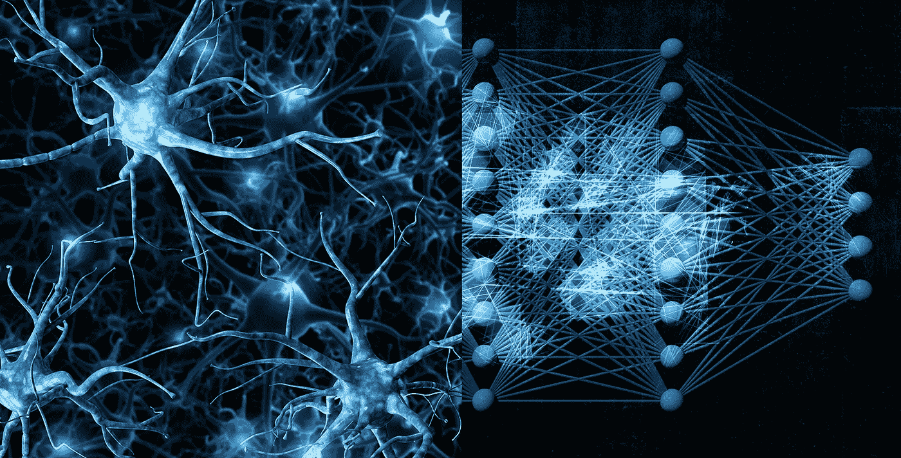
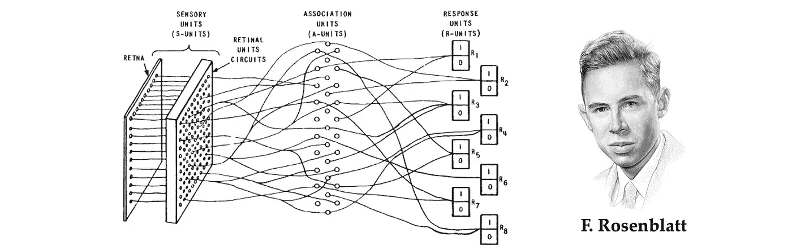
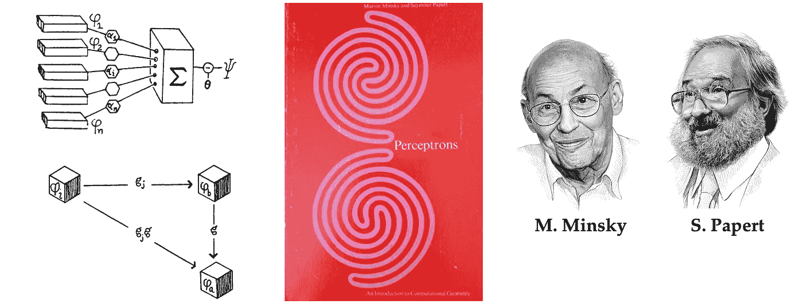
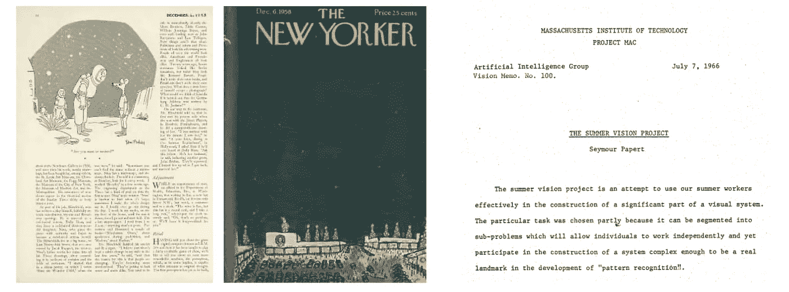
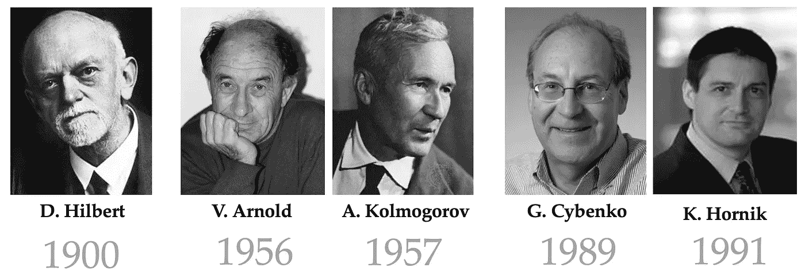
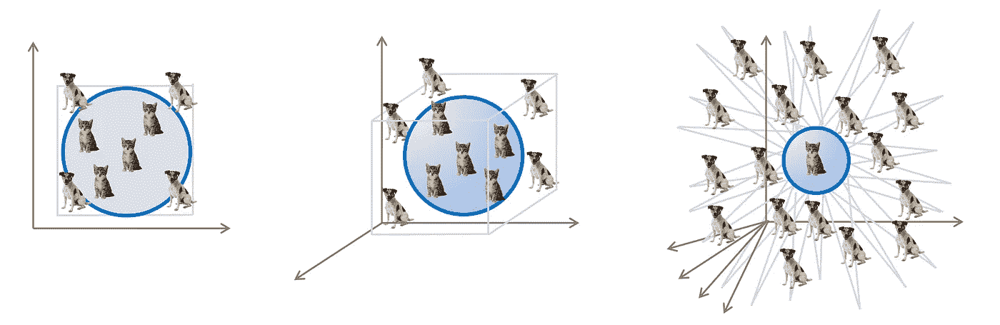

# 走向几何深度学习 II:感知机事件

> 原文：<https://towardsdatascience.com/towards-geometric-deep-learning-ii-the-perceptron-affair-fafa61b5c40a>

## 几何深度学习的起源

## 几何深度学习从对称性和不变性的角度处理了一大类 ML 问题，为多种多样的神经网络架构(如 CNN、gnn 和 Transformers)提供了一个通用蓝图。在一系列新的帖子中，我们研究了可以追溯到古希腊的几何思想如何塑造了现代深度学习。

图片:基于 Shutterstock。

在“走向几何深度学习系列”的第二篇文章中，我们讨论了早期的神经网络模型，以及它们的批评如何产生了计算几何的新领域。这篇文章基于 M. M .布朗斯坦、j .布鲁纳、t .科恩和 p .韦利奇科维奇、 [*几何深度学习*](https://arxiv.org/abs/2104.13478) *(在麻省理工学院出版社完成后出现)一书的介绍章节，并伴随* [*我们的课程*](https://youtube.com/playlist?list=PLn2-dEmQeTfSLXW8yXP4q_Ii58wFdxb3C) *参加非洲机器智能大师赛(AMMI)。参见* [*第一部分*](/towards-geometric-deep-learning-i-on-the-shoulders-of-giants-726c205860f5?sk=fd04bfaab732177ba7b4d7da90d88e9e) *讨论对称性，* [*第三部分*](/towards-geometric-deep-learning-iii-first-geometric-architectures-d1578f4ade1f?sk=89a4bf9164d5ef43a25ad1fc23bd1372) *研究第一个“几何”架构，* [*第四部分*](/towards-geometric-deep-learning-iv-chemical-precursors-of-gnns-11273d74125?sk=00a1aa8fb968b95245e1f2cf275198ea) *献给早期 GNNs，以及我们之前的* [*帖子*](/geometric-foundations-of-deep-learning-94cdd45b451d?sk=184532175cb936d7b25d9adebd512629) *总结几何深度学习的概念。*

虽然很难就“人工智能”作为一个科学领域诞生的具体时间点达成一致(最终，人类一直痴迷于理解智能并从文明的黎明开始学习)，但我们将尝试一项风险较小的任务，看看深度学习的前身——我们讨论的主要话题。这段历史可以压缩到不到一个世纪。

# **感知器的兴衰**

到了 20 世纪 30 年代，人们已经清楚意识存在于大脑中，研究工作转向从大脑网络结构的角度来解释大脑的功能，如记忆、感知和推理。麦卡洛克和皮茨[1]被认为是第一个对神经元进行数学抽象的人，展示了神经元计算逻辑功能的能力。就在创造了“人工智能”这个术语的传奇[达特茅斯学院研讨会](https://en.wikipedia.org/wiki/Dartmouth_workshop)一年后，来自康乃尔航空实验室的美国心理学家 [Frank Rosenblatt](https://en.wikipedia.org/wiki/Frank_Rosenblatt) 提出了一类他称之为“感知机”的神经网络。

Frank Rosenblatt 和他的 Mark I 感知器神经网络是在康奈尔航空实验室开发的，用于简单的视觉模式识别任务。肖像:伊霍尔·戈尔斯基。

感知机首先在数字机器上实现，然后在专用硬件上实现，设法解决简单的模式识别问题，如几何形状的分类。然而，“连接主义”(从事人工神经网络研究的人工智能研究人员如何给自己贴标签)的迅速崛起受到了一桶冷水，这就是现在已经臭名昭著的马文·明斯基和西蒙·派珀特的书 *Perceptrons* 。

在深度学习社区，人们通常会回顾性地指责明斯基和帕佩特造成了第一个“人工智能冬天”，这使得神经网络在十多年里不再流行。一个典型的叙述提到了“ [XOR 事件](https://en.wikipedia.org/wiki/Perceptrons_(book)#The_XOR_affair)”，这是一个证据，证明感知机甚至不能学习非常简单的逻辑功能，这是它们表达能力差的证据。一些消息来源甚至添加了一些戏剧性的内容，回忆起罗森布拉特和明斯基曾就读于同一所学校，甚至声称罗森布拉特在 1971 年的一次划船事故中过早死亡是在同事们批评他的工作后自杀的。

颇具影响力的著作《感知机》的作者马文·明斯基和西蒙·派珀特这本书封面上的两个形状(其中一个是相连的)暗示了“宇称问题”。这本书考虑了简单的单层感知(左上)，可能是最早的几何学习方法，包括群不变性的介绍(左下)。

现实可能更加平凡，同时也更加微妙。首先，美国“人工智能冬天”的一个更合理的原因是 1969 年的曼斯菲尔德修正案，该修正案要求军方资助“以任务为导向的直接研究，而不是基本的非直接研究”由于当时人工智能领域的许多努力，包括罗森布拉特的研究，都是由军事机构资助的，并没有显示出即时的效用，因此资金的削减产生了巨大的影响。第二，神经网络和人工智能总体上被过分夸大了:回想一下 1958 年[《纽约客》的一篇文章](https://www.newyorker.com/magazine/1958/12/06/rival-2)称感知机为

> 《纽约客》(1958 年)，“人类大脑有史以来第一个真正的对手”

和“非凡的机器”，它们“有能力思考”[5]，或者过于自信的[麻省理工学院夏季视觉项目](https://people.csail.mit.edu/brooks/idocs/AIM-100.pdf)期望“构建一个视觉系统的重要部分”，并在 1966 年的一个夏季学期中实现执行“模式识别”的能力[6]。研究界认识到，最初对“解决智力问题”的希望过于乐观，这只是一个时间问题。

早期炒作:1958 年《纽约客》的一篇文章称赞感知“能够思考”(左)，1966 年，过于乐观的“[麻省理工学院夏季视觉项目](https://people.csail.mit.edu/brooks/idocs/AIM-100.pdf)”旨在在几个月内构建一个“视觉系统的重要部分”。

然而，如果我们深入探讨这场争论的实质，很明显罗森布拉特所谓的“感知机”与明斯基和帕佩特所理解的“感知机”有很大不同。Minsky 和 Papert 将他们的分析和批评集中在他们称为“简单感知器”的一个狭窄的单层神经网络类别上(这在现代通常与该术语相关联)，其计算输入的加权线性组合，后跟非线性函数[7]。另一方面，Rosenblatt 考虑了更广泛的一类架构，这些架构早于现在被认为是“现代”深度学习的许多想法，包括具有随机和本地连接的多层网络[8]。

如果 Rosenblatt 知道 Vladimir Arnold 和安德雷·柯尔莫哥洛夫[10-11]对第十三个希尔伯特问题[9]的[证明，即一个连续的多元函数可以写成一个单变量连续函数的叠加，他可能会反驳一些关于感知器表达能力的批评。Arnold–Kolmogorov 定理是多层(或“深度”)神经网络的“通用逼近定理”的前身，它解决了这些问题。](https://en.wikipedia.org/wiki/Kolmogorov%E2%80%93Arnold_representation_theorem)

W 虽然大多数人记得明斯基和帕佩特的书，因为它在削弱早期联结主义者的翅膀和哀叹失去的机会方面发挥了作用，但一个被忽视的重要方面是，它第一次提出了学习问题的几何分析。这一事实反映在书名中，副标题为*《计算几何导论*。在当时，这是一个全新的想法，一篇对这本书的评论[12](本质上是为罗森布拉特辩护)质疑道:

> “计算几何”这门新学科是否会成长为一个活跃的数学领域；还是会在一堆死胡同里慢慢消失？”区块(1970 年)

前者发生了:计算几何现在是一个完善的领域[13]。

此外，Minsky 和 Papert 可能值得称赞的是，他们首次将群论引入了机器学习领域:他们的群不变性定理表明，如果神经网络对于某个群是不变的，那么它的输出可以表示为该群的轨道的函数。虽然他们使用这一结果来证明感知器可以学习的局限性，但类似的方法随后被 jun ' ichi Amari[14]用于模式识别问题中不变特征的构造。Terrence Sejnowski [15]和 John Shawe-Taylor[16–17]的著作中的这些思想的演变，不幸的是今天很少被引用，提供了几何深度学习蓝图的基础。

# 普适近似和维数灾难

前面提到的普遍近似的概念值得进一步讨论。该术语指的是以任何期望的精度逼近任何连续多元函数的能力；在机器学习文献中，这种类型的结果通常归功于 Cybenko [18]和 Hornik [19]。与 Minsky 和 Papert 批评的“简单”(单层)感知器不同，多层神经网络是通用的近似器，因此是学习问题的一种有吸引力的架构选择。我们可以将监督机器学习视为一个函数逼近问题:给定训练集(例如，猫和狗的图像)上某个未知函数(例如，图像分类器)的输出，我们试图从某个假设类中找到一个函数，该函数很好地符合训练数据，并允许预测以前看不见的输入的输出(“泛化”)。

走向普遍逼近:安德雷·柯尔莫哥洛夫和弗拉迪米尔·阿诺德证明的戴维·希尔伯特[第十三个问题](https://en.wikipedia.org/wiki/Hilbert%27s_thirteenth_problem)是第一批结果之一，表明多元连续函数可以表示为简单一维函数的组合和总和。George Cybenko 和 Kurt Hornik 证明了特定于神经网络的结果，表明具有一个隐藏层的感知器可以以任何期望的精度逼近任何连续函数。

通用逼近保证了我们可以通过多层神经网络来表达来自非常广泛的正则类(连续函数)的函数。换句话说，存在具有一定数量的神经元和一定权重的神经网络，其逼近从输入到输出空间(例如，从图像空间到标签空间)的给定函数映射。然而，通用逼近定理并没有告诉我们如何找到这样的权重。事实上，在早期，神经网络中的学习(即，寻找权重)一直是一个很大的挑战。

Rosenblatt 展示了一个只针对单层感知器的学习算法；为了训练多层神经网络，[阿列克谢·伊瓦赫年科](https://en.wikipedia.org/wiki/Alexey_Ivakhnenko)和瓦伦丁·帕拉【20】使用了一种叫做“数据处理分组法”的分层学习算法这使得 Ivakhnenko [21]能够钻到八层深处——这在 20 世纪 70 年代早期是一个非凡的壮举！

如何训练自己的神经网络？现在无处不在的反向传播只是在 20 世纪 80 年代大卫·鲁梅尔哈特的论文发表后才成为标准(尽管保罗·沃博斯和塞波·林奈马在更早的时候介绍过)。早在 20 世纪 70 年代初，Aleksey Ivakhnenko 的“数据处理分组方法”等早期方法就允许训练深度神经网络。

一项突破来自反向传播的发明，这是一种使用链规则计算权重相对于损失函数的梯度的算法，并允许使用基于梯度下降的优化技术来训练神经网络。截至今天，这是深度学习的标准方法。虽然反向传播的起源至少可以追溯到 1960 年[22]，但这种方法在神经网络中的首次令人信服的演示是在被广泛引用的 Rumelhart、Hinton 和 Williams 的《自然》论文中[23]。这种简单有效的学习方法的引入是神经网络在 20 世纪 80 年代和 90 年代重返人工智能领域的一个关键因素。

通过近似理论的镜头来看待神经网络，导致一些愤世嫉俗者将深度学习称为“美化的曲线拟合”。我们将让读者通过尝试回答一个重要问题来判断这条格言有多正确:需要多少样本(训练样本)来精确地逼近一个函数？近似理论家会立即反驳说，多层感知器可以表示的连续函数类显然太大了:人们可以通过有限的点集合传递无限多种不同的连续函数[24]。有必要施加额外的规律性假设，如[李普希茨连续性](https://en.wikipedia.org/wiki/Lipschitz_continuity)【25】，在这种情况下，可以提供所需样本数量的界限。

维数灾难是发生在高维空间中的一种几何现象。一种形象化的方法是查看单位超立方体中单位度量球的体积比例(后者代表特征空间，而前者可以解释为“最近邻”分类器)。体积比随尺寸成指数衰减:对于 d=2，该比值约为 0.78，对于 d=3，它下降到约 0.52，对于 d=10，它已经约为 0.01。图:改编自视觉假人。

不幸的是，这些界限随着维度呈指数级增长——这种现象俗称“维数灾难”[26]——这在机器学习问题中是不可接受的:即使是小规模的模式识别问题，如图像分类，也要处理数千维的输入空间。如果一个人必须只依赖近似理论的经典结果，机器学习将是不可能的。在我们的例子中，为了学会区分猫和狗，理论上需要的猫和狗图像的例子数量将比宇宙中的原子数量大得多[27]——周围没有足够的猫和狗来做这件事。

维数灾难:近似理论的标准结果与维数不成比例。因此，即使在简单的机器学习任务中，人们也会预测训练样本的数量远远大于实际可能的数量。

# 艾冬天来了

英国数学家詹姆斯·莱特希尔爵士(Sir James Lighthill)在一篇被人工智能历史学家称为“[莱特希尔报告](https://en.wikipedia.org/wiki/Lighthill_report)”的论文[28]中提出了机器学习方法向高维度扩展的问题，他在论文中使用了“组合爆炸”一词，并声称现有的人工智能方法只能解决玩具问题，在现实世界的应用中会变得难以处理。

> “人工智能研究和相关领域的大多数工作者承认，他们对过去 25 年取得的成就明显感到失望。[……]在这个领域的任何一个领域，迄今为止的发现都没有产生当时所承诺的重大影响。”—詹姆斯·莱特希尔爵士(1972 年)

由于莱特希尔报告是由英国科学研究委员会委托评估人工智能领域的学术研究，其悲观的结论导致了整个池塘的资金削减。加上美国资助机构的类似决定，这相当于 20 世纪 70 年代人工智能研究的一个灾难。

F 对我们来说，经典泛函分析无法提供处理学习问题的适当框架，这一认识将促使我们寻求更强的*几何*形式的规律性，这种规律性可以在神经网络的特定布线中实现——例如卷积神经网络的局部连通性。公平地说，我们十年前目睹的深度学习的胜利重现至少部分归功于这些见解。

[1] W. S .麦卡洛克和 w .皮茨，[神经活动中固有思想的逻辑演算](https://www.cs.cmu.edu/~./epxing/Class/10715/reading/McCulloch.and.Pitts.pdf) (1943)，数学生物物理学通报 5(4):115–133。

[2][达特茅斯人工智能夏季研究项目](https://en.wikipedia.org/wiki/Dartmouth_workshop)是 1956 年在达特茅斯学院举办的一个夏季研讨会，被认为是人工智能领域的创始事件。

[3] F .罗森布拉特， [*感知机，一种感知和识别自动机*](https://blogs.umass.edu/brain-wars/files/2016/03/rosenblatt-1957.pdf) (1957)，康奈尔航空实验室。这个名字是“感知”和表示乐器的希腊后缀- *的组合。*

[4] M. Minsky 和 S. A. Papert，*感知器:计算几何导论* (1969)，麻省理工学院出版社。

[5]这就是为什么我们只能对最近类似的关于深层神经网络的“意识”的说法一笑置之:אין כל חדש תחת השמש.

[6]原文引用，因为“模式识别”尚未成为正式术语。

[7]具体来说，Minsky 和 Papert 考虑了 2D 网格(他们的术语是“视网膜”)和一组线性阈值函数上的二元分类问题。虽然无法计算 XOR 函数一直是这本书的主要批评点，但大部分注意力都集中在几何谓词上，如奇偶和连通性。这个问题在书的封面上有所暗示，封面上有两个图案点缀:一个是相连的，另一个不是。即使对人类来说，也很难确定哪个是哪个。

[8] E. Kussul，T. Baidyk，L. Kasatkina 和 V. Lukovich，Rosenblatt 感知器用于手写数字识别(2001)，IJCNN 表明，Rosenblatt 在 21 世纪硬件上实现的 3 层感知器在 MNIST 数字识别任务上达到 99.2%的准确率，与现代模型相当。

[9] [希尔伯特的第十三个问题](https://en.wikipedia.org/wiki/Hilbert%27s_thirteenth_problem)是戴维·希尔伯特在 1900 年编制的 23 个问题之一，需要使用两个自变量的连续函数证明所有七次方程是否存在解。Kolmogorov 和他的学生 Arnold 展示了这个问题的一般化版本的解决方案，现在被称为[Arnold-Kolmogorov 叠加定理](https://en.wikipedia.org/wiki/Kolmogorov%E2%80%93Arnold_representation_theorem#:~:text=In%20real%20analysis%20and%20approximation,continuous%20functions%20of%20one%20variable.)。

[10]在。还有。阿诺德，《关于用较少变量的连续函数叠加来表示多个变量的连续函数》(1956 年)，苏联科学院报告 108:179–182。

[11]在。还有。阿诺德，《关于三个变量 T3 的功能》(1957 年)，苏联科学院报告 114:679–681。

[12] H. D. Block，《国际法院案例汇编:国际法院案例汇编》

[13]《化学武器公约》第一. 3.5 条。

[14] S.-I. Amari，[允许和检测不变信号变换的特征空间](https://bsi-ni.brain.riken.jp/database/file/69/055.pdf) (1978)，模式识别联合会议。

[15] T. Sejnowski 等人，学习具有隐藏单元的对称群:超越感知器(1986)，Physica D:非线性现象 22(1–3):260–275。

[16] J. Shawe-Taylor，将对称性纳入前馈网络(1989)，ICANN。

[17] J. Shawe-Taylor，前馈网络结构中的对称性和可区分性(1993)，IEEE Trans .神经网络 4(5):816–826。

[18] G. Cybenko，[通过叠加 s 形函数的近似法](https://link.springer.com/content/pdf/10.1007/BF02551274.pdf) (1989)，控制、信号和系统数学 2(4):303–314。

[19] K. Hornik，[多层前馈网络的逼近能力](http://www.vision.jhu.edu/teaching/learning/deeplearning18/assets/Hornik-91.pdf) (1991)神经网络 4(2):251–257。

[20] А.Г.Ивахненко, В.Г.кибернетическиепредсказывающие(1965 年)。

[21] A. Ivakhnenko，[复杂系统的多项式理论](http://gmdh.net/articles/history/polynomial.pdf) (1971)，IEEE Trans .系统、人和控制论 4:364–378。

[22]反向传播基于微分的链式法则，该法则本身可追溯到 1676 年微分学的共同发明者戈特弗里德·威廉·冯·莱布尼茨。H. J. Kelley 在《最佳飞行轨迹的梯度理论》( 1960 年)Ars Journal 30(10):947-954 中使用了反向传播的一个先驱，来完成复杂非线性多级系统的优化。在赫尔辛基大学 S. Linnainmaa 的芬兰硕士论文[*algorit min kumulativiinen pyoristysvirhe yksittaisten pyoristysvirheiden Taylor-kehitelmana*](https://people.idsia.ch/~juergen/linnainmaa1970thesis.pdf)(1970)中描述了今天仍在使用的有效反向传播。在神经网络中的最早使用是由于 P. J. Werbos，非线性灵敏度分析的进展的应用(1982)，*系统建模和优化*762–770，Springer，这通常被引用为该方法的起源。参见 J. Schmidhuber，[神经网络中的深度学习:概述](https://arxiv.org/pdf/1404.7828.pdf) (2015)，神经网络 61:85–117。

[23] D. E. Rumelhart 等人，[通过反向传播误差学习表征](https://www.nature.com/articles/323533a0.pdf) (1986)，自然 323(6088):533–536。

[24]甚至还有连续[无处可微函数](https://en.wikipedia.org/wiki/Weierstrass_function)的例子，如 Weierstrass (1872)的构造。

【25】粗略地说， [Lipschitz-continuous](https://en.wikipedia.org/wiki/Lipschitz_continuity) 函数不会任意缩小或扩大定义域上各点之间的距离。对于可微函数，Lipschitz 连续性可以表示为梯度范数的上界，这意味着函数不会突然“跳跃”。

[26]第一个使用这个术语的是理查德·贝尔曼，他在 1957 年出版的《T4》一书的序言中称维度是“多年来笼罩在物理学家和天文学家头上的诅咒”

[27]在可观测的宇宙中，质子的数量，即所谓的[爱丁顿数](https://en.wikipedia.org/wiki/Eddington_number)，是在 10⁸⁰.估算出来的

[28] J. Lighthill，[人工智能:一般调查](http://www.chilton-computing.org.uk/inf/literature/reports/lighthill_report/contents.htm) (1973)人工智能 1–21，伦敦科学研究委员会。

罗森布拉特、明斯基和帕佩特的肖像是由伊霍尔·戈尔斯基手绘的。几何深度学习的详细讲座资料可在 [*项目网页*](http://www.geometricdeeplearning.com/) *获取。参见迈克尔的* [*其他帖子*](https://towardsdatascience.com/graph-deep-learning/home) *在走向数据科学，* [*订阅*](https://michael-bronstein.medium.com/subscribe) *到他的帖子和* [*YouTube 频道*](https://www.youtube.com/c/MichaelBronsteinGDL) *，获得* [*中等会员资格*](https://michael-bronstein.medium.com/membership) *，或者关注* [*迈克尔*](https://twitter.com/mmbronstein) *，”*