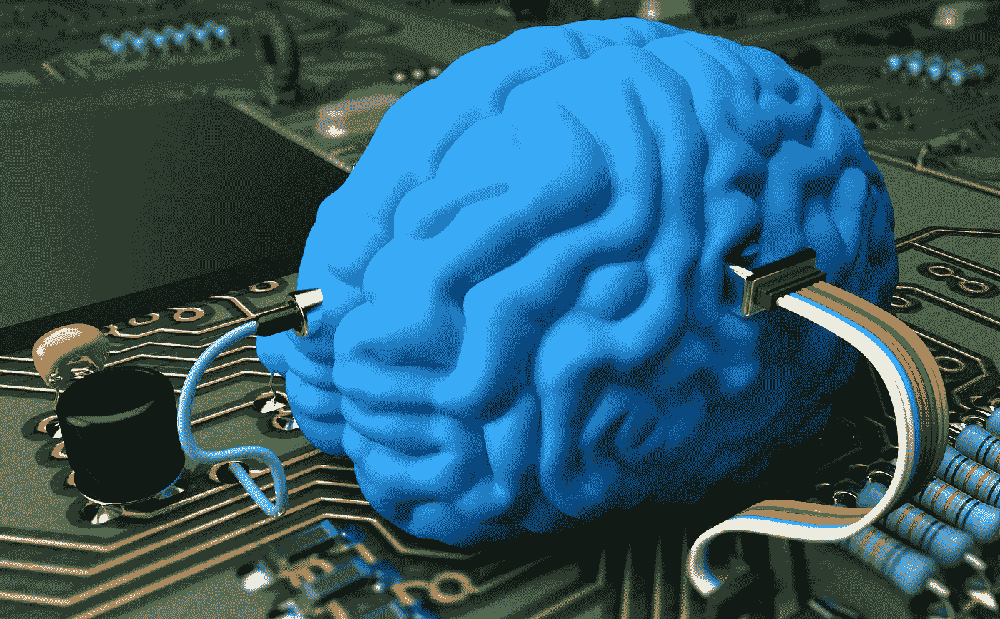
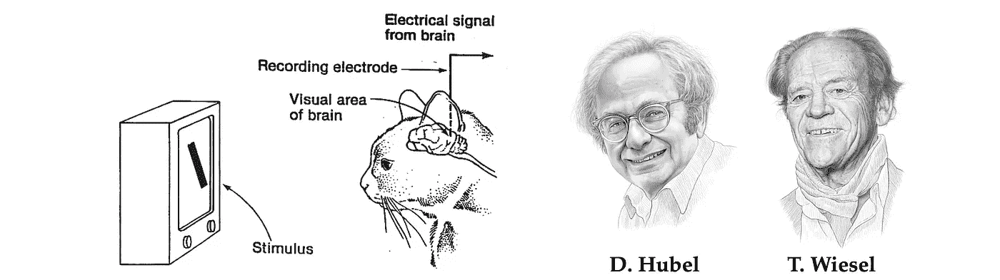
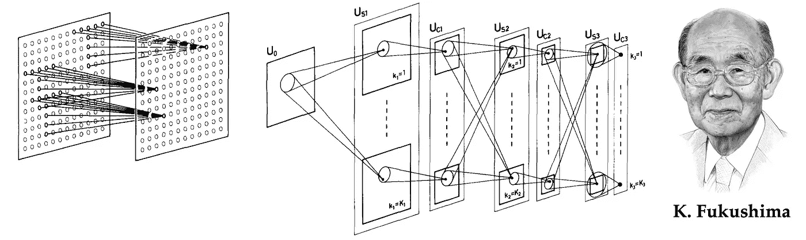
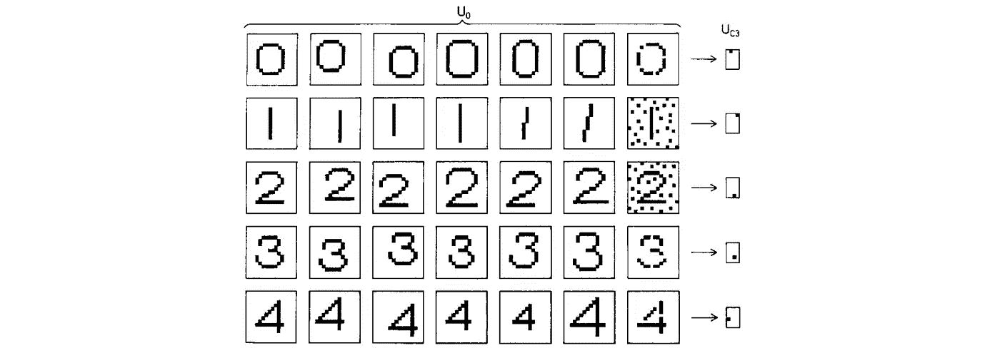
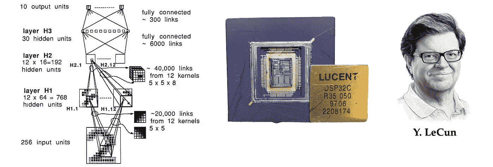
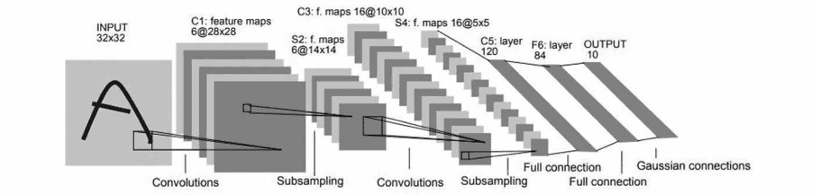
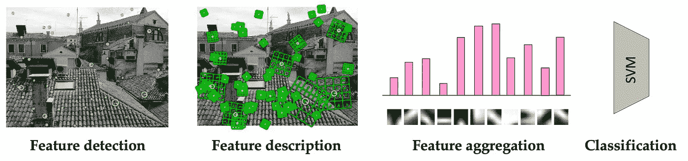
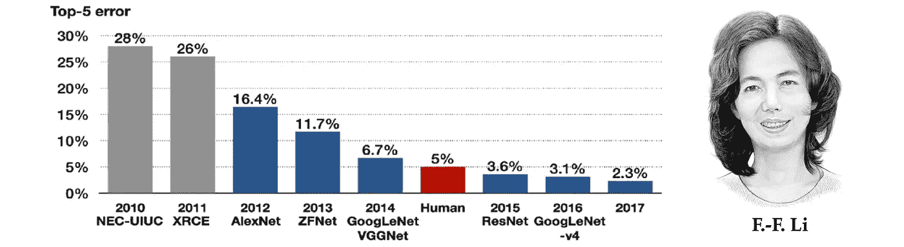
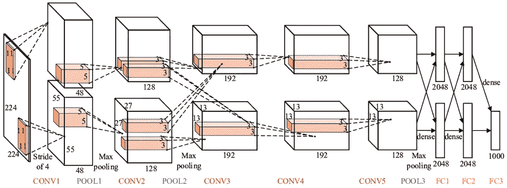

# 走向几何深度学习 III:第一几何架构

> 原文：<https://towardsdatascience.com/towards-geometric-deep-learning-iii-first-geometric-architectures-d1578f4ade1f>

## 几何深度学习的起源

## 几何深度学习从对称性和不变性的角度处理了一大类 ML 问题，为多种多样的神经网络架构(如 CNN、gnn 和 Transformers)提供了一个通用蓝图。在一系列新的帖子中，我们研究这些想法如何将我们从古希腊带到卷积神经网络。

图片:Shutterstock。

在“走向几何深度学习系列”的第三篇文章中，我们讨论了第一个“几何”神经网络:Neocognitron 和 CNN。这篇文章基于 M. M .布朗斯坦、j .布鲁纳、t .科恩和 p .韦利奇科维奇、 [*几何深度学习*](https://arxiv.org/abs/2104.13478) *(在麻省理工学院出版社完成后出现)一书的介绍章节，并伴随* [*我们的课程*](https://youtube.com/playlist?list=PLn2-dEmQeTfSLXW8yXP4q_Ii58wFdxb3C) *参加非洲机器智能大师赛(AMMI)。参见* [*第一部分*](/towards-geometric-deep-learning-i-on-the-shoulders-of-giants-726c205860f5?sk=fd04bfaab732177ba7b4d7da90d88e9e)*[*第二部分*](/towards-geometric-deep-learning-ii-the-perceptron-affair-fafa61b5c40a?sk=7a8f4beb9bd4ed347ad01c05ea54fb2e) *关于神经网络的早期历史以及第一部《艾冬》、《第四部分* *献给早期的 GNNs。**

*新“几何”类型的第一个神经网络架构的灵感来自神经科学。在一系列经典实验中，哈佛大学神经生理学家 David Hubel 和 Torsten Wiesel[1-2]揭示了大脑中负责模式识别的部分——视觉皮层——的结构和功能。通过向一只猫呈现变化的光模式，并测量其脑细胞(神经元)的反应，他们表明，视觉皮层中的神经元具有局部空间连接的多层结构:只有在其附近的细胞(“感受野”[3])被激活时，细胞才会产生反应。*

**

*获得诺贝尔奖的生理学家大卫·胡贝尔和托尔斯滕·威塞尔以及对他们经典实验的描述揭示了视觉皮层的结构。肖像:伊霍尔·高斯基。*

*此外，该组织似乎是分层的，其中'*简单细胞*对局部原始定向阶跃刺激的反应由'*复杂细胞*聚集，后者对更复杂的模式产生反应。有人假设，视觉皮层深层的细胞会对越来越复杂的由简单模式组成的模式做出反应，这半开玩笑地暗示了“T4 祖母细胞”的存在，这种细胞只有在看到祖母的脸时才会做出反应。*

# *新克隆体*

*对视觉皮层结构的理解对计算机视觉和模式识别的早期工作产生了深远的影响，人们多次试图模仿它的主要成分。Kunihiko Fukushima，当时是日本广播公司的一名研究员，开发了一种新的神经网络架构[5]“类似于 Hubel 和 Wiesel 提出的视觉神经系统的层次模型”，被命名为 *neocognitron* [6]。*

**

*Kunihiko Fukushima 和 neocognitron，一种早期的几何深度学习架构和现代卷积神经网络的前身。*

*neocognitron 由交错的神经元的 C 层组成(这一命名惯例反映了它在生物视觉皮层中的灵感)；每层中的神经元按照输入图像的结构(“视网膜主题”)排列成 2D 阵列，每层有多个“细胞平面”(现代术语中的特征图)。S 层被设计为翻译对称:它们使用共享的可学习权重聚集来自局部感受野的输入，导致单个细胞平面中的细胞具有相同功能的感受野，但位置不同。基本原理是挑选可能出现在输入中任何地方的模式。C 层是固定的，并执行局部汇集(加权平均)，对模式的特定位置不敏感:如果其输入中的任何神经元被激活，则 C 神经元将被激活。*

*因为新认知的主要应用是字符识别，所以平移不变性是至关重要的。这一特性与早期的神经网络(如 Rosenblatt 的感知器)有着根本的区别:为了可靠地使用感知器，必须首先对输入模式的位置进行归一化，而在 neocognitron 中，对模式位置的不敏感性被嵌入到架构中。Neocognitron 通过将平移等变的局部特征提取层与池交错实现，创建了多尺度表示[8]。计算实验表明，福岛的建筑能够成功地识别复杂的图案，如字母或数字，即使存在噪声和几何失真。*

**

*neocognitron 输出的例子证实了它对位移、几何失真和噪声的不敏感性。图片来自[5]。*

*从该领域四十年进展的有利角度来看，人们发现新认知体已经具有现代深度学习架构的许多惊人特征:深度(Fukishima 在他的论文中模拟了一个七层网络)、局部感受域、共享权重和池化。它甚至使用了半整流器(ReLU)激活功能，这通常被认为是在最近的深度学习架构中引入的[9]。与现代系统的主要区别在于网络的训练方式:neocognitron 是一种以无监督方式训练的“自组织”架构，因为反向传播尚未在神经网络社区中广泛使用。*

# *卷积神经网络*

*F ukushima 的设计由 Yann LeCun 进一步开发，他是巴黎大学的应届毕业生[10]，博士论文是关于使用反向传播来训练神经网络。在贝尔实验室的第一个博士后岗位上，LeCun 和他的同事们建立了一个系统来识别信封上的手写数字，以使美国邮政服务能够自动发送邮件。*

**

*Yann LeCun 和合著者[11]首次引入卷积神经网络(尽管“卷积”这个名称后来才出现)。在 DSP 上实现，它允许实时手写数字识别。*

*在一篇现在已经很经典的论文[11]中，LeCun 等人描述了第一个三层卷积神经网络(CNN) [12]。与 neocognitron 类似，LeCun 的 CNN 也使用共享权重和池的本地连接。然而，它放弃了福岛更复杂的非线性滤波(抑制连接)而支持简单的线性滤波器，这种滤波器可以在数字信号处理器(DSP)上使用[乘加](https://en.wikipedia.org/wiki/Multiply%E2%80%93accumulate_operation)运算有效地实现为*卷积*。*

*这种设计选择，脱离了神经科学的灵感和术语，进入了信号处理领域，将在深度学习的成功中发挥至关重要的作用。CNN 的另一个关键创新是使用反向传播进行训练。*

**

*LeNet-5，五层卷积架构[14]。*

*LeCun 的工作令人信服地展示了基于梯度的方法在复杂模式识别任务中的强大功能，并且是首批基于深度学习的计算机视觉实用系统之一。这种架构的一个演变，一个五层的 CNN 被命名为 LeNet-5，是作者名字的双关语[14]，被美国银行用来阅读手写支票。*

*然而，计算机视觉研究界的绝大多数人都避开了神经网络，走上了一条不同的道路。新千年第一个十年的视觉识别系统的典型架构是一个精心制作的特征提取器(通常检测图像中的兴趣点，并以一种对透视变换和对比度变化鲁棒的方式提供它们的局部描述[15])，然后是一个简单的分类器(最常见的是支持向量机(SVM)，较少见的是一个小型神经网络)[16]。*

**

*2000 年代的典型“单词袋”图像识别系统[16]，由一个局部特征检测器和描述符组成，后跟一个简单的分类器。*

# *深度学习的胜利*

*然而，计算能力的快速增长和可用的带注释的可视数据的数量改变了力量的平衡。实现和训练越来越大和越来越复杂的 CNN 成为可能，这允许处理越来越具有挑战性的视觉模式识别任务[17]，最终成为当时计算机视觉的圣杯:ImageNet 大规模视觉识别挑战。ImageNet 由美籍华人研究员费于 2009 年建立，是一项年度挑战，包括将数百万张人类标记的图像分类到 1000 个不同的类别。*

**

*ImageNet 大规模视觉识别挑战的结果。AlexNet 在 2012 年成为第一个击败“手工制作”方法的深度学习架构；从那以后，所有的获胜方法都是基于深度学习的。*

*Krizhevsky、Sutskever 和 Hinton [18]在多伦多大学开发的 CNN 架构成功地以较大优势击败了所有竞争方法，如基于该领域数十年研究的智能设计的特征检测器。AlexNet(这种架构是为了纪念其开发者 Alex Krizhevsky 而命名的)在参数和层数方面比它的老兄弟 LeNet-5 大得多[20]，但在概念上是相同的。关键的区别是使用图形处理器(GPU)进行训练[21]，这是现在深度学习的主流硬件平台[22]。*

**

*AlexNet 架构。图片:[巴维什·辛格·毕斯特](https://medium.com/analytics-vidhya/types-of-convolutional-neural-networks-lenet-alexnet-vgg-16-net-resnet-and-inception-net-759e5f197580)。*

*TCNN 在 ImageNet 上的成功成为深度学习的转折点，并预示着它在接下来的十年中被广泛接受。数十亿美元的产业应运而生，深度学习成功用于商业系统，从苹果 iPhone 的语音识别到特斯拉的自动驾驶汽车。在对[罗森布拉特的作品](/towards-geometric-deep-learning-ii-the-perceptron-affair-fafa61b5c40a?sk=7a8f4beb9bd4ed347ad01c05ea54fb2e)进行严厉评论四十多年后，联结主义者终于被证明是正确的。*

*[1] D. H. Hubel 和 T. N. Wiesel，猫的纹状皮层中单个神经元的感受野(1959)，生理学杂志 148(3):574。*

*[2] D. H. Hubel 和 T. N. Wiesel，猫的视觉皮层中的感受野、双眼互动和功能性结构(1962)，生理学杂志 160(1):106。*

*[3]术语“感受野”出现在 Hubel 和 Wiesel 之前，并且从二十世纪早期就被神经生理学家使用，参见 c .谢灵顿，*神经系统的整合作用* (1906)，耶鲁大学出版社。*

*[4]“祖母细胞”这个术语很可能第一次出现在杰里·莱特文于 1969 年在麻省理工学院讲授的“感知和知识的生物学基础”课程中。类似的“诺斯替神经元”的概念在两年前由波兰神经科学家 J. Konorski 所著的《大脑的整合活动》一书中提出；跨学科方法 (1967)。参见 C. G. Gross，[“祖母细胞”的谱系学](https://www.researchgate.net/profile/Charles-Gross-3/publication/11086433_Genealogy_of_the_Grandmother_Cell/links/00463527ab1971d96e000000/Genealogy-of-the-Grandmother-Cell.pdf) (2002)，《神经科学家》8(5):512–518。*

*[5] K. Fukushima， [Neocognitron:不受位置变化影响的模式识别机制的自组织神经网络模型](https://www.rctn.org/bruno/public/papers/Fukushima1980.pdf) (1980)，生物控制论 36:196–202。标题中提到了平移不变性。*

*[6]经常被拼错为“ *neuro* cognitron”，名称“neocognitron”表明它是 K. Fukushima 的早期架构的改进版本，Cognitron: a self-organizing 多层神经网络(1975)，生物控制论 20:121–136。*

*[7]用作者自己的话来说，具有“仅取决于刺激模式的形状，而不受模式呈现位置的影响”的输出*

*[8]我们称这个原理为*尺度分离*，它和对称性一样，是许多物理系统的基本属性*。*在卷积架构中，除了平移之外，尺度分离还允许处理更广泛的几何变换。*

*[9] ReLU 型激活至少可以追溯到 20 世纪 60 年代，之前已经在 K. Fukushima 的模拟阈值元件多层网络的视觉特征提取(1969)中使用过。系统科学和控制论 5(4):322–333。*

*[10]皮埃尔-玛丽-居里大学，现为索邦大学的一部分。*

*[11] Y. LeCun 等人，应用于手写邮政编码识别的反向传播(1989)神经计算 1(4):541–551。*

*[12]在 le Cun 1989 年的论文中，架构没有被命名；术语“卷积神经网络”或“convnet”将出现在 1998 年的一篇论文中[14]。*

*[13] LeCun 的第一个 CNN 是在一个 CPU(一个 SUN-4/250 机器)上训练出来的。然而，使用经过训练的 CNN 的图像识别系统在美国电话电报公司 DSP-32C(具有 256KB 存储器的第二代数字信号处理器，能够以 32 位精度每秒执行 125m 浮点乘加运算)上运行，每秒实现 30 次以上的分类。*

*[14] Y. LeCun 等人，基于梯度的学习应用于文档识别(1998)，Proc .IEEE 86(11):2278–2324。*

*[15]最流行的特征描述符之一是由 David Lowe 于 1999 年提出的[尺度不变特征变换](https://en.wikipedia.org/wiki/Scale-invariant_feature_transform) (SIFT)。这篇论文被多次拒绝，仅在五年后发表，D. G. Lowe，比例不变关键点的独特图像特征，(2004)IJCV 60(2):91–110。这是被引用最多的计算机视觉论文之一。*

*[16]一种典型的方法是“单词袋”,将图像表示为矢量量化的局部描述符的直方图。例如，参见 J. Sivic 和 A. Zisserman，视频谷歌:视频中对象匹配的文本检索方法(2003)，ICCV。*

*[17]特别是，Jürgen Schmidhuber 的[小组开发的深度大规模 CNN 模型赢得了多个视觉比赛，包括汉字识别(D. C. Ciresan 等人，用于手写数字识别的深度大简单神经网络(2010)，神经计算 22(12):3207–3220)和交通标志识别(D. C. Ciresan 等人，用于交通标志分类的多列深度神经网络。*神经网络*32:333–338，2012)。](https://people.idsia.ch/~juergen/DanNet-triggers-deep-CNN-revolution-2011.html)*

*[18] A. Krizhevsky、I. Sutskever 和 G. E. Hinton，使用深度卷积神经网络的 ImageNet 分类(2012 年)，NIPS。*

*[19] AlexNet 取得了比亚军小 10.8%以上的误差。*

*[20] AlexNet 有 11 层，在来自 ImageNet 的 1.2M 图像上进行训练(作为比较，LeNet-5 有 5 层，在 60K MNIST 数字上进行训练)。与 LeNet-5 相比，其他重要变化包括使用 ReLU 激活(代替 tanh)、最大汇集、退出规则和数据扩充。*

*[21]在一对 Nvidia GTX 580 图形处理器上训练 AlexNet 花了将近一周的时间，每秒能够进行大约 200G 的浮点运算。*

*[22]尽管 GPU 最初是为图形应用程序设计的，但它们最终成为了一个方便的硬件平台，用于[通用计算](https://en.wikipedia.org/wiki/General-purpose_computing_on_graphics_processing_units#History)(“gp GPU”)。第一个这样的作品展示了线性代数算法，例如参见 J. Krüger 和 R. Westermann 的《用于数值算法的 GPU 实现的线性代数算子》(2003)，ACM Trans。图形 22(3):908–916。GPU 首次用于神经网络是由 K.-S. Oh 和 K. Jung，神经网络的 GPU 实现(2004)，模式识别 37(6):1311–1314，比 AlexNet 早了近十年。*

**福岛的肖像是由伊霍尔·戈尔斯基手绘的。几何深度学习的详细讲座资料可在* [*项目网页*](http://www.geometricdeeplearning.com/) *获取。参见迈克尔的* [*其他帖子*](https://towardsdatascience.com/graph-deep-learning/home) *在走向数据科学，* [*订阅*](https://michael-bronstein.medium.com/subscribe) *到他的帖子和* [*YouTube 频道*](https://www.youtube.com/c/MichaelBronsteinGDL) *，获取* [*中等会员*](https://michael-bronstein.medium.com/membership) *，或者关注* [*迈克尔*](https://twitter.com/mmbronstein)*