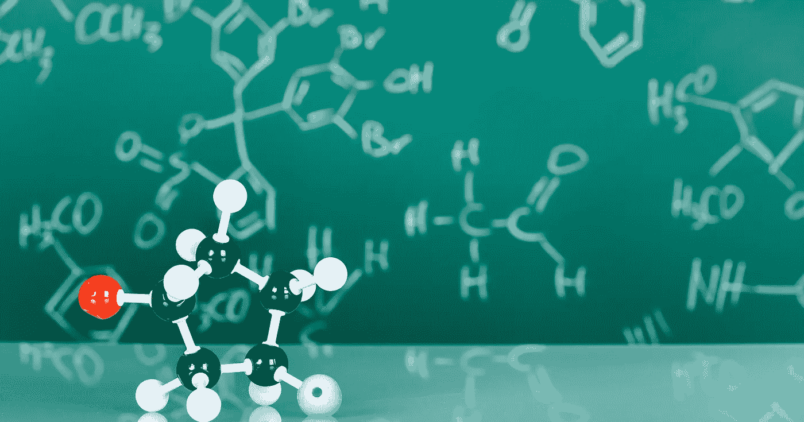
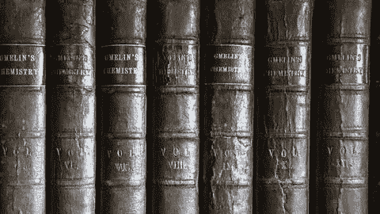
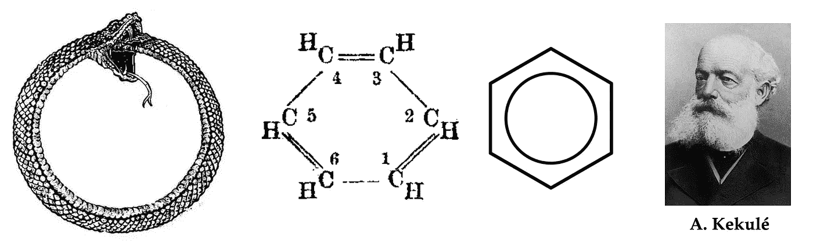
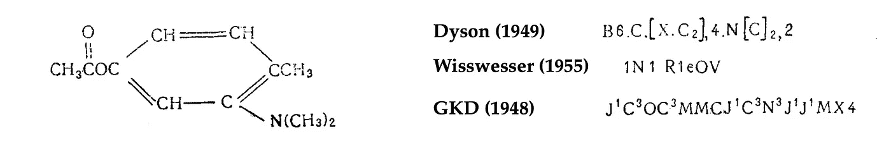
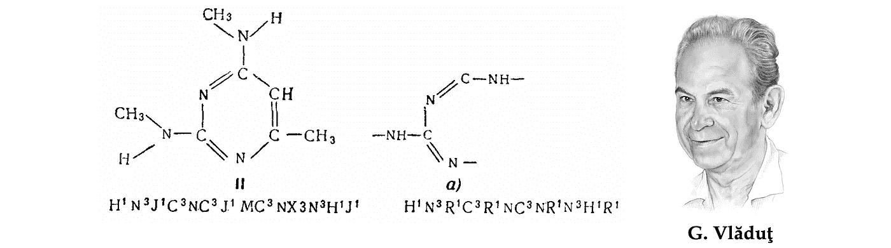
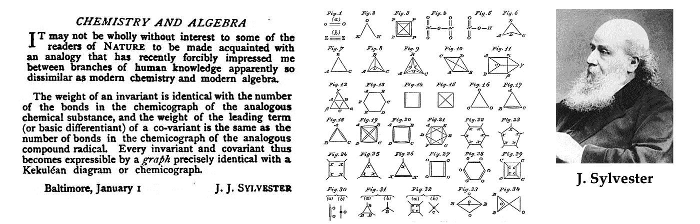
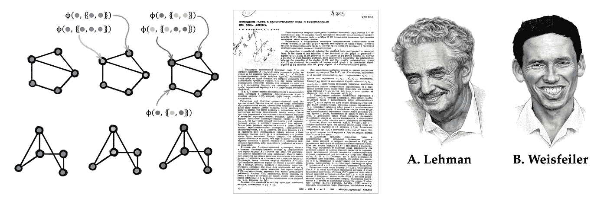
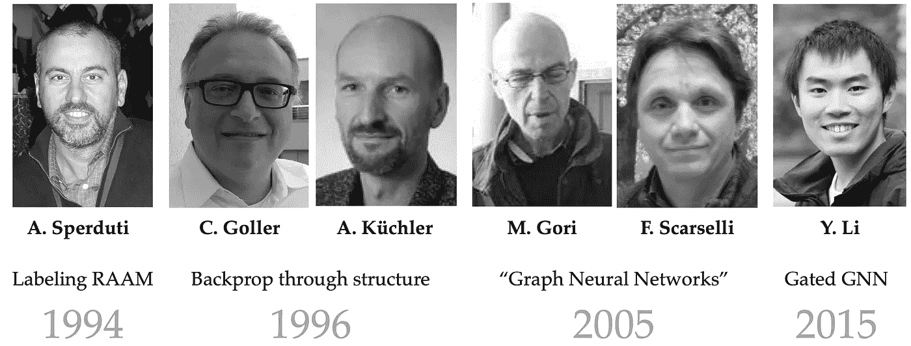
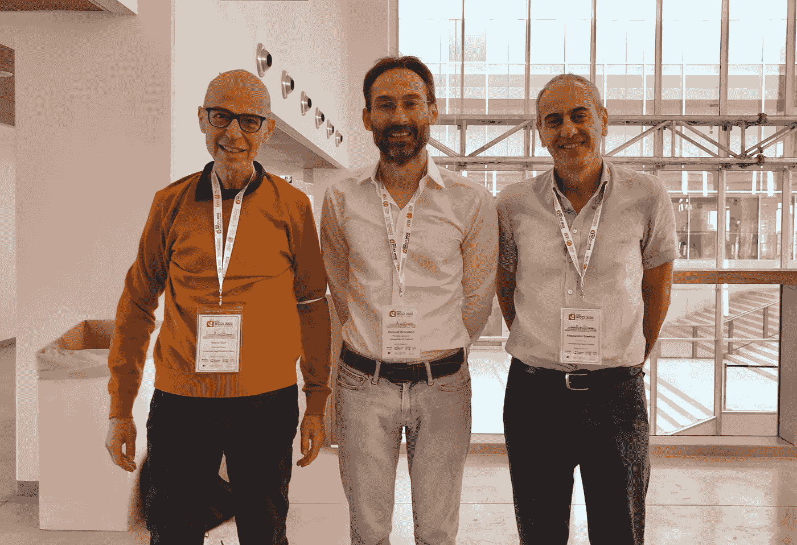
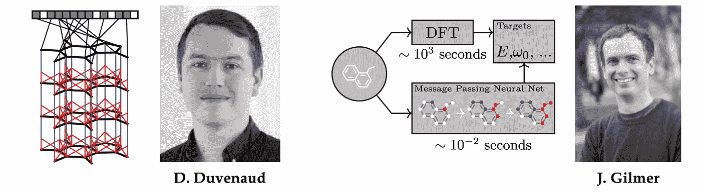

# 走向几何深度学习 IV:GNNs 的化学前体

> 原文：<https://towardsdatascience.com/towards-geometric-deep-learning-iv-chemical-precursors-of-gnns-11273d74125>

## 几何深度学习的起源

## 几何深度学习从对称性和不变性的角度处理一大类 ML 问题，为神经网络体系结构的“动物园”提供了一个公共蓝图。在我们关于几何深度学习起源系列的最后一篇文章中，我们看了图形神经网络的前身。

图片:Shutterstock。

在“走向几何深度学习”系列的最后一篇文章中，我们讨论了 20 世纪 60 年代化学领域中 gnn 的早期原型是如何出现的。这篇文章基于 M. M .布朗斯坦、j .布鲁纳、t .科恩和 p .韦利奇科维奇、 [*几何深度学习*](https://arxiv.org/abs/2104.13478) *(在麻省理工学院出版社完成后出现)一书的介绍章节，并伴随* [*我们的课程*](https://youtube.com/playlist?list=PLn2-dEmQeTfSLXW8yXP4q_Ii58wFdxb3C) *参加非洲机器智能大师赛(AMMI)。参见* [*第一部分*](/towards-geometric-deep-learning-i-on-the-shoulders-of-giants-726c205860f5?sk=fd04bfaab732177ba7b4d7da90d88e9e) *讨论对称性，* [*第二部分*](/towards-geometric-deep-learning-ii-the-perceptron-affair-fafa61b5c40a?sk=7a8f4beb9bd4ed347ad01c05ea54fb2e) *关于神经网络的早期历史和第一个“艾冬”，以及* [*第三部分*](/towards-geometric-deep-learning-iii-first-geometric-architectures-d1578f4ade1f?sk=89a4bf9164d5ef43a25ad1fc23bd1372) *研究第一个“几何”架构。*

如果说[对称的历史](/towards-geometric-deep-learning-i-on-the-shoulders-of-giants-726c205860f5?sk=fd04bfaab732177ba7b4d7da90d88e9e)与物理学紧密交织在一起，那么图形神经网络的历史，几何深度学习的“海报儿童”，则植根于自然科学的另一个分支:化学。

化学在历史上一直是(现在仍然是)数据最密集的学科之一。18 世纪现代化学的出现导致了已知化合物的快速增长和对其组织的早期需求。这一角色最初是由期刊扮演的，如《化学文摘》(Chemisches zentral blatt)[1]和《化学词典》(chemical dictionaries)，如*Gmelins Handbuch der anorganischen Chemie*(1817 年首次出版的无机化合物早期简编[2])和*Beilsteins Handbuch der organischen Chemie*(有机化学的类似努力)，所有这些最初都以德语出版，直到 20 世纪初，德语一直是科学界的主导语言。

在英语世界中，化学文摘社(CAS)创建于 1907 年，并逐渐成为世界上已发表的化学信息的中心储存库[3]。然而，庞大的数据量(仅 beil stein 一项就增长到 500 多卷，近 50 万页)很快就使得打印和使用这样的化学数据库变得不切实际。

格林无机化学手册卷，一个两个世纪前首次出版的早期化学数据库。在数字计算机开发之前，化学家必须手工搜索这种数据库，这个过程可能需要几个小时甚至几天。

# 落进草垛里的一根针(指：几乎不可能找到的东西)

自十九世纪中期以来，化学家们已经建立了一种普遍理解的方法，通过*结构式*来指代化合物，表示化合物的原子、原子间的键，甚至它们的三维几何结构。但是这种结构不容易恢复。

19 世纪德国化学家奥古斯特·凯库勒提出苯(C₆H₆)的结构式，以及苯环的现代描述。根据一个传说，凯库勒的洞察力来自于一个梦，他在梦里看到一条蛇在咬自己的尾巴。

在 20 世纪上半叶，随着新发现的化合物及其商业用途的快速增长，组织、搜索和比较分子的问题变得至关重要:例如，当一家制药公司试图为一种新药申请专利时，专利局必须验证以前是否存在类似的化合物。

为了应对这一挑战，20 世纪 40 年代引入了几种分子索引系统，为后来被称为*化学信息学*的新学科奠定了基础。一个这样的系统，以作者 Gordon、Kendall 和 Davison [4]的名字命名为“GKD 化学密码”，由英国轮胎公司 Dunlop 开发，用于早期基于穿孔卡的计算机[5]。本质上，GKD 密码是一种将分子结构解析成字符串的算法，这种算法更容易被人类或计算机查找到。

根据不同的系统，化合物及其密码的例子。图片来自[13]。

T2:然而，GKD 密码和其他相关的方法远不能令人满意。在化合物中，相似的结构往往导致相似的性质。化学家被训练发展直觉来发现这种相似性，并在比较化合物时寻找它们。例如，在 19 世纪，苯环与散发气味的特性的联系是“芳香化合物”这一化学类别命名的原因。

另一方面，当一个分子被表示为一个字符串时(例如在 GKD 密码中)，一个单一化学结构的成分可以被映射到密码的不同位置。因此，两个含有相似子结构的分子(因此可能具有相似的特性)可能以非常不同的方式编码。

乔治·vlăduţ's 1959 年论文[13]中的一张图，显示了一个化学分子及其片段以及相应的 gkd-密码。请注意，这种编码系统破坏了分子中相连原子的空间局域性，因此无法通过简单的子串匹配在完整分子中找到片段密码。早期化学表示方法的这一缺点是寻找以图形表示分子结构的动机之一。

T 他的认识鼓励了“拓扑密码”的发展，试图捕捉分子的结构。陶氏化学公司[7]和美国专利局[8]首先完成了这类工作，这两家公司都大量使用化学数据库。其中最著名的一个描述符，被称为“摩根指纹”[9]，是由化学文摘社的哈里·摩根[10]开发的，并一直使用到今天。

# 化学遇上图论

出生于罗马尼亚的苏联研究员乔治·vlăduţ[11]在开发搜索化学数据库的早期“结构”方法中发挥了关键作用。作为一名训练有素的化学家(他于 1952 年在莫斯科门捷列夫研究所捍卫了有机化学博士学位)，他在大学一年级时经历了一次与庞大的《贝尔斯坦手册》的创伤性接触[12]。这将他的研究兴趣引向了化学信息学[13]，这是一个他终生从事的领域。

Vlăduţ被认为是使用图论来模拟化合物的结构和反应的先驱之一。从某种意义上说，这并不令人惊讶:图论在历史上一直与化学联系在一起，甚至“图”这个术语(指的是一组节点和边，而不是一个函数的曲线)也是由数学家詹姆斯·西尔维斯特在 1878 年作为化学分子的数学抽象引入的[14]。

术语“图”(在图论中使用的意义)是由詹姆斯·西尔威斯特在 1878 年*自然*笔记【14】中首次作为分子模型引入的。

特别是，Vlăduţ主张把分子结构比较公式化为图形同构问题；他最著名的工作是将化学反应归类为反应物和产物分子的部分同构(最大公共子图)[15]。

Vlăduţ's 的工作启发了一对年轻的研究人员，Boris Weisfeiler(代数几何学家)和 Andrey Lehman [17](自称为“程序员”[18])。在一篇经典的联合论文[19]中，两人引入了一种迭代算法来测试一对图是否同构(即，这些图在节点重新排序之前具有相同的结构)，这被称为[魏斯费勒-雷曼(WL)测试](/expressive-power-of-graph-neural-networks-and-the-weisefeiler-lehman-test-b883db3c7c49?sk=5c2a28ccd38db3a7b6f80f161e825a5a) [20]。尽管两人从上学时就认识了，但他们在出版后不久就分道扬镳，并在各自的领域取得了成就[21]。

Weisfeiler 和 Lehman 最初猜想他们的算法解决了图同构问题(并在多项式时间内解决了这个问题)，但这是不正确的:虽然 Lehman 通过计算证明了至多有 9 个节点的图[22]，但一年后发现了一个更大的反例[23](事实上，一个未能通过 WL 测试的强正则图称为 [*Shrinkhande 图*](https://en.wikipedia.org/wiki/Shrikhande_graph) 甚至更早就为人所知[24])。

图同构检验是由 Andrei Lehman 和 Boris Weisfeiler 在 1968 年提出的。

Weisfeiler 和 Lehman 的论文已经成为理解图同构的基础。从历史的角度来看他们的工作，人们应该记得在 20 世纪 60 年代，复杂性理论仍然处于萌芽状态，算法图论才刚刚起步。正如雷曼在 20 世纪 90 年代末回忆的那样，

> “在 60 年代，人们可以在几天内重新发现图形同构理论中的所有事实、思想和技术。我怀疑，“理论”这个词是适用的；一切都处于这样一个基本水平。”安德烈·雷曼，1999 年

他们的结果激发了许多后续工作，包括高维图形同构测试[25]。在图神经网络的背景下，Weisfeiler 和 Lehman 最近成为家喻户晓的名字，证明了他们的图同构测试等价于消息传递[26–27]。

# 早期图形神经网络

尽管化学家们已经使用类似 GNN 的算法几十年了，但很可能他们在分子表示方面的工作在机器学习社区中仍然几乎不为人知[28]。我们发现很难准确指出图形神经网络的概念是何时开始出现的:部分原因是大多数早期工作没有将图形作为一等公民，部分原因是图形神经网络只是在 2010 年代后期才变得实用，部分原因是该领域是从几个相邻研究领域的融合中出现的。

图形神经网络的早期形式至少可以追溯到 20 世纪 90 年代，例子包括亚历桑德罗·斯佩尔杜蒂的“标记 RAAM”[29]，克里斯托弗·戈勒和安德烈亚斯·屈希勒尔的“通过结构的反向传播”[30]，以及数据结构的自适应处理[31–32]。虽然这些工作主要关注的是对“结构”(通常是树或有向无环图)的操作，但在它们的架构中保留的许多不变性让人想起了今天更常用的 gnn。

走向图神经网络:从 20 世纪 90 年代开始的早期工作集中在一般结构的学习上，例如树或有向无环图。术语“图形神经网络”是在 Marco Gori 和 Franco Scarselli 的经典论文中引入的。

T 在 21 世纪之交，第一次对一般图形结构的处理进行了适当的处理(并创造了术语“图形神经网络”)。由 Marco Gori [33]和 Franco Scarselli [34]领导的锡耶纳大学团队提出了第一个“GNN”他们依赖于递归机制，需要神经网络参数来指定收缩映射，从而通过搜索固定点来计算节点表示——这本身就需要一种特殊形式的反向传播，并且完全不依赖于节点特征。所有上述问题都通过李[35]的门控 GNN (GGNN)模型进行了纠正，该模型带来了现代 RNNs 的许多好处，例如门控机制[36]和通过时间的反向传播。

Alessio Micheli 在同一时间提出的图形神经网络(NN4G)使用前馈而不是递归架构，实际上更像现代的 GNNs。

作者与 GNN 先锋马可·哥里和亚历桑德罗·斯佩尔杜蒂在 WCCI 2022。

另一类重要的图形神经网络，通常被称为“谱神经网络”，是由琼·布鲁纳和合著者[38]使用图形傅立叶变换的概念而产生的。这种结构的根源在于信号处理和计算谐波分析社区，在 2000 年代末和 2010 年代初，处理非欧几里德信号变得非常重要[39]。

来自 Pierre Vandergheynst [40]和 José Moura [41]团队的有影响力的论文普及了“图形信号处理”(GSP)的概念，以及基于图形邻接和拉普拉斯矩阵的特征向量的傅立叶变换的一般化。Michal Defferrard[42]和 Thomas Kipf 和 Max Welling [43]提出的依赖于光谱滤波器的图形卷积神经网络是该领域引用最多的网络。

# 回到原点

在一个有点讽刺意味的命运转折中，现代 gnn 被 David Duvenaud [44]作为手工制作的 Morgan 分子指纹的替代物，被 Justin Gilmer [45]以相当于 Weisfeiler-Lehman 测试[26–27]的信息传递神经网络的形式，成功地重新引入了它们起源的化学领域。五十年后，圆圈终于闭合。

随着大卫·杜文瑙德和贾斯汀·吉尔默的工作，现代版的图形神经网络成功地回到了化学领域。

图形神经网络现在是化学领域的标准工具，[已经看到了](/geometric-ml-becomes-real-in-fundamental-sciences-3b0d109883b5?sk=71edf33c88320cca6165fe6cde239f8c)在药物发现和设计管道中的应用。2020 年，GNN 发现了新的抗生素化合物[46],赢得了一项引人注目的荣誉。DeepMind 的 AlphaFold 2 [47]使用等变注意力(一种 GNN 形式，用于解释原子坐标的连续对称性)来解决结构生物学的“圣杯”——蛋白质折叠的问题。

1999 年，安德烈·雷曼[写信给一位数学家同事](https://www.iti.zcu.cz/wl2018/pdf/leman.pdf)说，他“很高兴得知‘魏斯费勒-莱曼’已经出名，并且仍然引起人们的兴趣。”基于他 50 年前的工作，他没能活着看到 GNNs 的崛起。乔治 Vlăduţ也没有看到他的想法的实现，在他有生之年，许多想法还停留在纸上。我们确信他们会为站在这个令人兴奋的新领域的起点而感到自豪。

[1]最初是*Pharmaceutisches Central-Blatt*，是 1830 年至 1969 年间出版的最古老的德国化学文摘期刊。

[2]以 1817 年出版第一版的利奥波德·格麦林命名的,*格林斯手册*最后一版出现在 20 世纪 90 年代。该数据库目前包含 1772 年至 1995 年间发现的 150 万种化合物和 130 万种不同的反应。

[3]1906 年，美国化学学会授权出版《化学文摘》,赋予它摘录世界化学文献的使命，并分配了一万五千美元的初期预算。在威廉·诺伊斯的指导下，第一份出版物于 1907 年出版。自成立以来的一个多世纪里，化学文摘社收录了自 19 世纪初以来出版物中披露的近 2 亿种有机和无机物质。

[4] M. Gordon，C. E. Kendall 和 W. H. T. Davison，*化学加密:作为化学系统学辅助的通用代码* (1948)，皇家化学研究所。

[5]Gordon-Kendall-Davison 小组结合他们的化学加密系统，提出了一种与穿孔卡片分类器一起使用的专用计算机(“电子结构相关器”)，但从未建成。

[6]有几个同时代的系统相互竞争，参见 W. J. Wisswesser， [107 年的线公式符号](https://apps.dtic.mil/sti/pdfs/AD0685902.pdf) (1968)，j . Chemical Documentation 8(3):146–150。

[7] A. Opler 和 T. R. Norton，*一本为用于搜索有机化合物的机械化系统的计算机编程的手册* (1956)，陶氏化学公司。

[8] L. C. Ray 和 R. A. Kirsch，通过数字计算机发现化学记录(1957 年)，《科学》126 期(3278):814-819。

H. L .摩根。化学结构的独特机器描述的生成——化学文摘服务(1965)开发的技术，化学文献 5(2):107–113。

[10]关于哈里·摩根的传记资料不多。根据一则讣告，在发表了他著名的分子指纹论文后，他进入了 IBM 的管理层，并在那里一直呆到 1993 年退休。他于 2007 年去世。

[11]在俄文出版物中，Vlăduţ's 的名字以*георгийэмильевичвлэдуц*出现，音译为 *Vleduts* 或 *Vladutz* 。我们坚持使用原始的罗马尼亚语拼写。

[12]据弗拉迪米尔·乌斯彭斯基说，Vlăduţ在美国化学学会接受帕特森-克莱恩奖的演讲中，讲述了他在大学有机化学的第一堂课上与贝尔斯坦相遇的轶事。参见в。А.труды(2002 年)。

[13] Г.Э.Влэдуц, В.В.Налимов, Н.И.стяжкин，[научнаятехническаяинформациякакоднаиззадачкибеиинетикии](http://www.mathnet.ru/links/0e37a5f19c15ebd98977f151140838e2/ufn12488.pdf)(1959)，уппехифизическихнаук69:1。

[14] J. J. Sylvester，化学和代数(1878)，自然 17:284。

[15] G. E. Vleduts，关于有机反应的一个分类和编码系统(1963)，信息存储和检索 1:117-146。

[16]我们找不到确凿的证据证明魏斯费勒和雷曼兄弟是否以及如何与 Vlăduţ有过互动，因为大多数认识他们的人都已经去世了。最有力的证据是他们的经典论文[19]中的一个评论，承认 Vlăduţ“阐明了问题”(“авторывыражаютблагодарностьв。Э.Влэдуцу за постановку задачи").还可以肯定的是，Weisfeiler 和 Lehman 知道化学社区开发的方法，特别是 Morgan 的方法[9]，他们在论文中称 mor gan 为“类似的程序”。

[17]安德烈·雷曼的姓也经常被拼成*雷曼*，这是他自己更喜欢的一个变体，他在一封电子邮件中说[前一种拼法来自德国出版商斯普林格的一本书，他认为“每个雷曼都是一个隐藏的雷曼”。因为雷曼自己承认他的家族有日耳曼血统，所以我们坚持用德语拼写。](https://www.iti.zcu.cz/wl2018/pdf/leman.pdf)

[18]1971 年，Lehman 试图为一篇基于他在图形同构方面的工作的论文进行辩护，但没有成功，该论文由于论文委员会主席的个人敌意而被拒绝，并被裁定“它不是数学”对此，雷曼苦涩地回应道:“我不是数学家，我是程序员。”他最终在 1973 年为另一篇关于数据库主题的论文进行了答辩。

[19] Б.Вейсфейлер, А.каноническому、возникающая、этом(1968 年)информ.Сб.винити2(9):12–16(见[英译本](https://www.iti.zcu.cz/wl2018/pdf/wl_paper_translation.pdf))。

[20]事实上，Weisfeiler-Lehman 测试有多种版本。最初的论文[19]描述了现在所谓的“2-WL 测试”，但它相当于 1-WL 或节点颜色细化算法。参见我们[之前关于韦斯费勒-雷曼测试的博文](/expressive-power-of-graph-neural-networks-and-the-weisefeiler-lehman-test-b883db3c7c49?sk=5c2a28ccd38db3a7b6f80f161e825a5a)。

[21]由于关于我们昔日英雄的英文传记资料很少，我们将用这篇笔记来概述他们余下的职业生涯。这三个人最后都去了美国。乔治·vlăduţ在 1974 年申请移民，这让他的老板们感到震惊，并导致他从实验室负责人的职位上被降级(在苏联，移民被认为是“不可饶恕的大罪”——对于西方人来说，现在很难想象这对苏联公民来说曾经是多么伟大的努力)。Vlăduţ离开了家庭，在费城的科学信息研究所工作，直到 1990 年去世。作为犹太裔，鲍里斯·魏斯费勒(Boris Weisfeiler)在 1975 年决定移民，因为苏联官方的反犹主义日益严重——最后一步是拒绝出版他广泛研究的专著，因为太多作者有“非俄罗斯姓氏”。在普林斯顿高等研究院短暂停留后，他成为宾夕法尼亚州立大学的教授，从事代数几何的研究。作为一名狂热的登山爱好者，他于 1985 年在智利的一次徒步旅行中失踪。安德烈·雷曼于 1990 年离开苏联，随后在多家美国初创公司担任程序员。他于 2012 年去世(见谢尔盖·伊万诺夫的[帖子](/a-forgotten-story-of-soviet-ai-4af5daaf9cdf))。

[22] А.некоторых(1970 年)

[23] G. M. Adelson-Velski 等人，没有自同构的传递群的图的例子(1969)，Dokl。阿卡德。瑙克 185:975–976。

[24] S. S. Shrikhande，L₂协会方案的独特性(1959)，数理统计年鉴 30:781-798。

[25] L. Babai，[拟多项式时间内的图同构](https://arxiv.org/abs/1512.03547) (2015)，arXiv:1512.03547。

[26]徐国光等，[图神经网络有多强大？](https://arxiv.org/abs/1810.00826) (2019)，ICLR。

[27] C. Morris 等人， [Weisfeiler 和 Leman go neural:高阶图神经网络](https://aaai.org/ojs/index.php/AAAI/article/view/4384/4262) (2019)，AAAI。

[28]在化学团体中，许多工作提出了类似 GNN 的模型，包括 D. B .基列耶夫，化学网络:一种新的基于神经网络的图形/属性映射方法(1995)，化学信息和计算机科学杂志 35(2):175-180；巴斯金、帕尤林和泽菲洛夫。用于搜索化合物的结构和性质之间的直接相关性的神经装置(1997)，化学信息和计算机科学杂志 37(4):715–721；以及 C. Merkwirth 和 T. Lengauer。用分子图网络自动生成互补描述符(2005)，化学信息与建模杂志，45(5):1159–1168。

[29] A. Sperduti，通过标记 RAAM 编码标记图(1994)，NIPS。

[30] C. Goller 和 A. Kuchler，通过结构反向传播学习任务相关的分布式表示(1996)，ICNN。

31 a . sper duti 和 A. Starita。用于结构分类的监督神经网络(1997)，IEEE Trans。神经网络 8(3):714–735。

[32] P. Frasconi、M. Gori 和 A. Sperduti,《数据结构自适应处理的一般框架》( 1998 年), IEEE Trans .神经网络 9(5):768–786。

[33] M. Gori、G. Monfardini 和 F. Scarselli，[一种在图域中学习的新模型](https://www.researchgate.net/profile/Franco-Scarselli/publication/4202380_A_new_model_for_earning_in_raph_domains/links/0c9605188cd580504f000000/A-new-model-for-earning-in-raph-domains.pdf) (2005)，IJCNN。

[34] F. Scarselli 等，[图神经网络模型](https://ro.uow.edu.au/cgi/viewcontent.cgi?article=10501&context=infopapers) (2008)，IEEE Trans .神经网络 20(1):61–80。

[35] Y. Li 等，[门控图序列神经网络](https://arxiv.org/pdf/1511.05493.pdf) (2016).

[36] K. Cho 等人，使用用于统计机器翻译的 RNN 编码器-解码器学习短语表示(2014)，arXiv:1406.1078。

[37] A. Micheli，[图的神经网络:一种上下文构建方法](https://ieeexplore.ieee.org/stamp/stamp.jsp?arnumber=4773279&casa_token=wl9QN_zy0S0AAAAA:d_j0FOylcnDRgZoBnuQPUyVsxz-6Z8PuYJsUhA73N3de-tQhMYrJppe_qm3bZ5WpBaBt4BYtBw&tag=1) (2009)，IEEE Trans .神经网络 20(3):498–511。

[38] J .布鲁纳等人，[图的谱网络和局部连接网络](https://arxiv.org/pdf/1312.6203.pdf) (2014)，ICLR。

[39]值得注意的是，在计算机图形和几何处理领域，非欧几里得调和分析比图形信号处理至少早了十年。我们可以将流形和网格上的谱滤波器追溯到 G. Taubin、T. Zhang 和 G. Golub 的工作，(1996)，ECCV。在 Z. Karni 和 C. Gotsman 的有影响力的论文[网格几何图形的光谱压缩](https://citeseerx.ist.psu.edu/viewdoc/download?doi=10.1.1.24.1185&rep=rep1&type=pdf) (2000 年)、计算机图形和交互技术以及 B. Lévy 的[拉普拉斯-贝尔特拉米本征函数朝向“理解”几何图形的算法](https://members.loria.fr/Bruno.Levy/papers/Laplacian_SMI_2006.pdf) (2006 年)、形状建模和应用之后，这些方法在 21 世纪成为主流。

[40] D. I .舒曼等人，[图中信号处理的新兴领域:将高维数据分析扩展到网络和其他不规则领域](https://arxiv.org/pdf/1211.0053.pdf) (2013)，IEEE 信号处理杂志 30(3):83–98。

[41] A. Sandryhaila 和 J. M. F. Moura，[图形上的离散信号处理](https://arxiv.org/pdf/1210.4752.pdf) (2013)，IEEE Trans .信号处理 61(7):1644–1656。

[42] M. Defferrard、X. Bresson 和 P. Vandergheynst，[具有快速局部频谱过滤的图上的卷积神经网络](https://proceedings.neurips.cc/paper/2016/file/04df4d434d481c5bb723be1b6df1ee65-Paper.pdf) (2016)，NIPS。

[43] T. Kipf 和 M. Welling，[使用图卷积网络的半监督分类](https://openreview.net/pdf?id=SJU4ayYgl) (2017)，ICLR。

[44] D. K. Duvenaud 等人，[用于学习分子指纹的图上的卷积网络](https://papers.nips.cc/paper/2015/file/f9be311e65d81a9ad8150a60844bb94c-Paper.pdf) (2015)，NIPS。

[45] J. Gilmer 等人，[量子化学的神经信息传递](https://arxiv.org/abs/1704.01212) (2017)，ICML。

[46] J. M. Stokes 等人，[抗生素发现的深度学习方法](https://www.cell.com/cell/fulltext/S0092-8674(20)30102-1?_returnURL=https%3A%2F%2Flinkinghub.elsevier.com%2Fretrieve%2Fpii%2FS0092867420301021%3Fshowall%3Dtrue) (2020)《细胞》180(4):688–702。

[47] J. Jumper 等人，[用 AlphaFold](https://www.nature.com/articles/s41586-021-03819-2) 进行高度精确的蛋白质结构预测，Nature 596:583–589，2021。

这些肖像是由 Ihor Gorskiy 手绘的。我们感谢米哈伊尔·克林的历史评论，也感谢塞尔日·vlăduţ提供了他父亲的照片。*几何深度学习的详细讲座资料可在* [*项目网页*](http://www.geometricdeeplearning.com/) *上获取。参见迈克尔的* [*其他帖子*](https://towardsdatascience.com/graph-deep-learning/home) *在走向数据科学，* [*订阅*](https://michael-bronstein.medium.com/subscribe) *到他的帖子和* [*YouTube 频道*](https://www.youtube.com/c/MichaelBronsteinGDL) *，获取* [*中等会员*](https://michael-bronstein.medium.com/membership) *，或者关注* [*迈克尔*](https://twitter.com/mmbronstein)