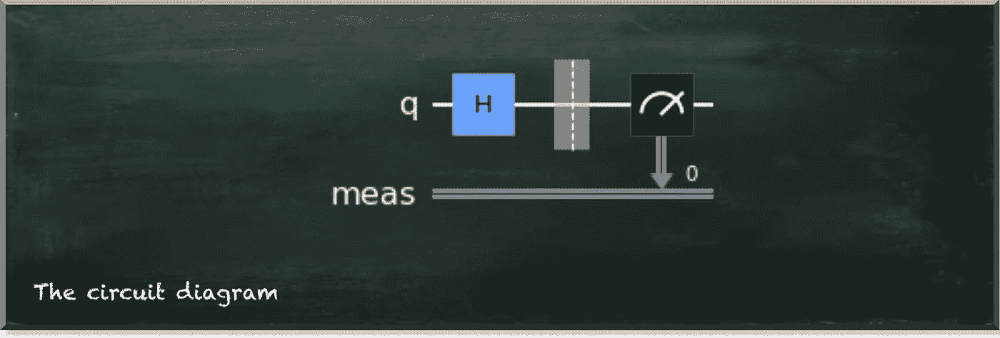

# 朝向量子测量误差减轻

> 原文：<https://towardsdatascience.com/towards-quantum-measurement-error-mitigation-e6f134883f34>

## 如何将 CDR 与量子态层析连接起来

量子机器学习要不要入门？看看 [**动手量子机器学习用 Python**](https://www.pyqml.com/page?ref=medium_towmitig&dest=/) **。**

量子计算机是惊人的设备。然而，它们也容易出错。因此，我们需要实现量子误差缓解方法来减少误差对我们的计算结果的负面影响。

在之前的一系列帖子中，我们[学习了 Clifford 数据回归方法](https://pyqml.medium.com/mitigating-quantum-errors-using-clifford-data-regression-98ab663bf4c6)，并在[模拟环境](/how-to-implement-quantum-error-mitigation-with-qiskit-and-mitiq-e2f6a933619c)和[真实量子计算机](/practical-error-mitigation-on-a-real-quantum-computer-41a99dddf740)上减少了错误。

结果令人鼓舞。然而，当我试图用它参加 IBM 的量子开放科学奖时，出现了一个意想不到的障碍。

IBM 要求我们使用 Trotterization 模拟一个三粒子海森堡哈密顿量。不，这不是问题。问题是，他们通过量子态断层扫描来评估任何提交物。这是一种通过测量重建量子态的方法。更具体地说，问题是他们在 Qiksit 内部使用了`StateTomographyFitter`。这种实现建立在实验计数的基础上。但是 CDR 方法适用于期望值。

让我稍微说明一下这个问题。下图描述了一个 1 量子位量子电路的简单情况。


作者图片

每当我们看一个量子位，它不是 0 就是 1。就是这样。哪一个取决于几率和内部量子态。假设量子位在|+⟩.状态在这种状态下，测量 0 和 1 具有相同的概率。但是，当量子电路只运行一次时，我们不能对概率下结论。

但是当我们重复运行它，比如说 1000 次，我们会看到 0 次和 1500 次，除了微小的统计差异。

不幸的是，目前的量子计算机是嘈杂的设备。我们有时用零来衡量一，反之亦然。所以，结果变得模糊。例如，我们将测量 0 412 次，而不是 500 次。

运行量子电路的原始结果是测量。因为我们几乎总是多次执行电路，所以我们对测量进行计数。

那么，我们来看看这样一个电路的 Qiskit 中的源代码。

我们定义了一个具有单个量子位的量子电路，并将哈达玛门应用于它。这个转换门将量子位(从初始状态|0⟩)放入状态|+⟩.在电路的末端，我们测量量子位。下图显示了电路图。



作者图片

让我们运行这个电路 1000 次。我们通过获取一个`backend`(这里是一个无噪声的统计模拟器)并调用`execute`函数来实现这一点。

我们得到一个 Qiskit 结果对象( [Qiskit 引用](https://qiskit.org/documentation/stubs/qiskit.result.Result.html))。这个物体的基本功能是`get_counts`，因为它告诉我们在观察量子位时看到了什么。

```
{'1': 499, '0': 501}
```

这是一个简单的 Python 字典，将测量结果作为键，将我们观察到这个结果的次数作为值。现在轮到我们来解释这些数字并做一些有意义的事情了。从这里看，这些结果和其他统计数据一样好。我们可以用它们来计算进一步的值，比如期望值。这是实验测量的概率期望值。它类似于经典的期望值。例如，考虑投掷一枚公平的硬币，正面和反面着地的概率相等。如果将值 1 赋给正面，0 赋给反面，则期望值为 0.5∫1+0.5∫0 = 0.5。这对于|+⟩.的量子位也是一样的

通常，当你看到量子计算中期望值的计算时，它看起来像这个⟨𝜓|𝑍|𝜓⟩.字母“psi”(𝜓)表示量子态，中间的 z 象征可观测。在这种情况下，它是 Z 轴。

这里重要的是，这个符号引入了可观测的概念。当我们之前在 Qiskit 中测量我们的量子位时，我们隐含地选择了 Z-observable，因为这是 Qiskit 中量子位的默认测量基础。所以，我们本质上谈论的是同一个概念。在[这篇文章](/how-to-implement-quantum-error-mitigation-with-qiskit-and-mitiq-e2f6a933619c)中，我们更详细地观察了可观察到的现象。我们需要知道的一件事是，不只有一个可观测的，而是很多个。想象一个像地球一样的球体。可观察点是你观察地球的特定点。从不同的角度看世界是不同的，然而，这是同一个世界。


作者图片

本质上，计数和期望值是紧密联系在一起的。他们都有他们的用途。虽然计数包含有关不同测量的更多信息，但是期望值更适合使用，因为它是一个单一的数字。

这是我在之前的帖子中描述的奋斗点。虽然量子错误缓解方法 CDR 使用了期望值的简单性，但是 IBM 用来评估错误缓解性能的量子状态层析成像与计数一起工作。

为了参与 IBM 的挑战，现在我们的工作是将两者整合起来。

我选择让 CDR 适应不变状态层析，因为后者是 IBM 的评估方法。我相信乱用他们的评估工具可能会取消我的参赛资格。

因此，我们需要更改 CDR 方法来更改计数字典，而不是单个数字。

让我们简单回顾一下 CDR。


作者图片

CDR 方法有三个步骤。首先，我们生成训练数据。然后，在这一步，我们运行我们的量子电路两次。一旦在经典计算机上获得可观察的期望值的精确值。一次是在真实的量子计算机上产生噪声值。

在第二步中，我们创建噪声值和精确值之间关系的线性模型。从一组数据点构建线性模型称为回归。因此得名 CDR —克利福德数据回归。

最后，我们使用该模型，通过预测无噪声值，将有噪声的期望值转化为减轻的期望值。

所有这些步骤都需要配合 Qiskit [的实验结果](https://qiskit.org/documentation/stubs/qiskit.result.Result.html)。但是，问题是这是 Qiskit `execute`函数创建的对象。它以只读方式存储大部分数据，我们无法再对其进行更改。

但是，我们可以运用一个小技巧。我们编写自己的`Result`类，允许我们在以后更改计数。

从概念上讲，我们创建了一个新的 Python 类，它服务于状态层析使用的一个函数。这是`get_counts`功能。因此，当状态层析函数查询计数时，它会得到一个响应。但是由于我们实现了这个新类，我们也可以提供一个覆盖计数的函数。

下面的清单描述了我们的`OwnResult`类的源代码。

该类将现有的 Qiskit 结果作为初始化参数。此外，我们将`_counts`指定为一个成员变量，用一个空字典对其进行初始化。这将保存我们更改的计数。功能代码除了两个小东西，都是从原源代码复制的。首先，每当我们引用结果的属性时，比如`data`，我们需要查看`self._result.data`而不是`self.data`。第二，在第 41-45 行，我们研究了实际计数的自定义成员函数。如果它们存在(`if str(key) in self._counts.keys()if str(key) in self._counts.keys()`)，我们返回改变的计数(`self._counts[str(key)]self._counts[str(key)]`)。如果它们不存在，我们返回原始计数(`self._result.data(key)["counts"]`)

让我们来看看它是如何工作的。

```
original result:  {'1': 499, '0': 501}
Changed counts:   {'0': 100, '1': 900}
```

所以，让我们看看是否可以在状态层析成像中使用我们的`OwnResult`。

在下面的代码片段中，我们创建了与之前使用的电路相同的简单电路。唯一的区别是我们省略了测量，因为我们需要从中创建`state_tomography_circuits`。然后，我们在无噪声的`Qasm-Simulator`上运行这些电路，并存储其结果。

所以，现在我们准备好了激动人心的部分。我们循环通过实验列表中的电路(`st_qcs`)。对于每个电路，我们将计数设置为具有任意值的固定字典。我们现在不关心这些值，因为我们只想验证`StateTomographyFitter`是否与我们的`OwnResult`一起工作。

最后，我们根据原始结果和更改后的结果计算保真度。

```
original fidelity: 0.49800015998080377
changed fidelity:  0.7886751345948128
```

输出显示，我们根据更改的计数计算的保真度与我们根据原始计数计算的保真度有很大不同。显然，`StateTomographyFitter`与我们的自定义计数一起工作。这为在下一步中减少错误创造了先决条件。

量子机器学习要不要入门？看看 [**动手用 Python 学习量子机器**](https://www.pyqml.com/page?ref=medium_towmitig&dest=/) **。**


在这里可以免费获得前三章。