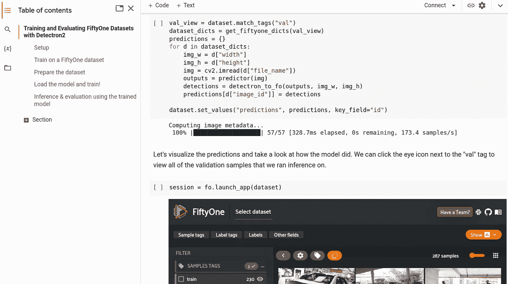
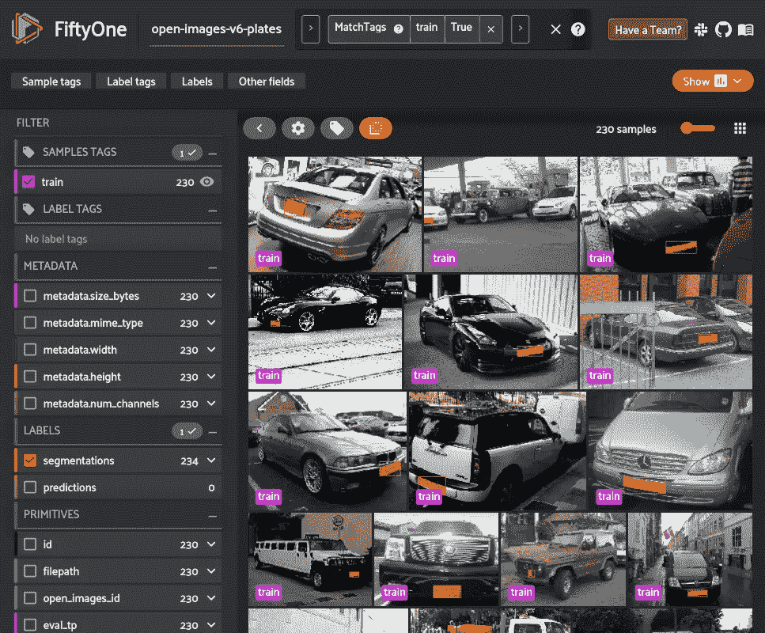
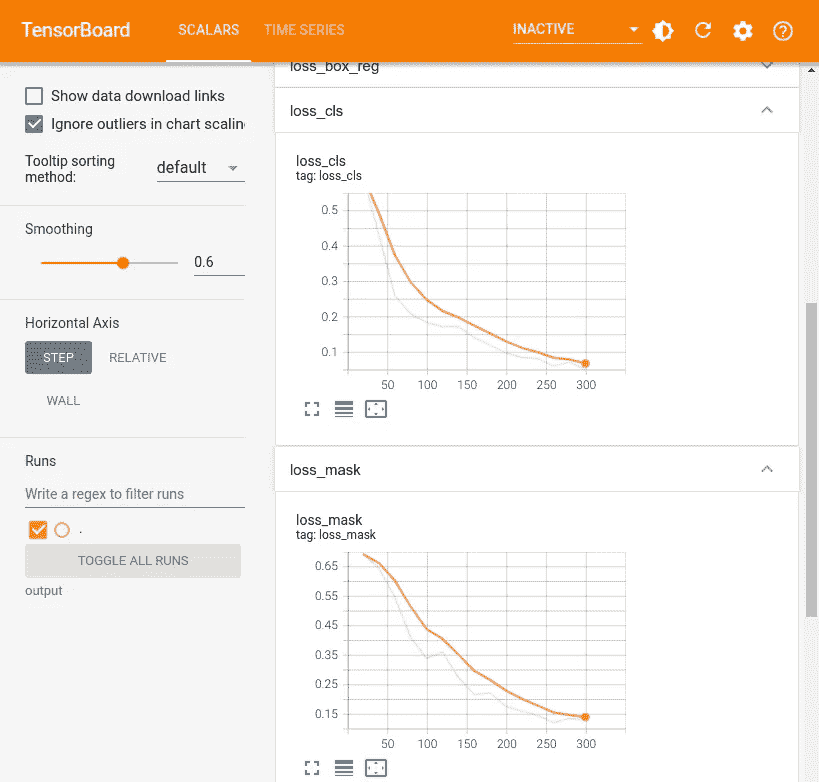
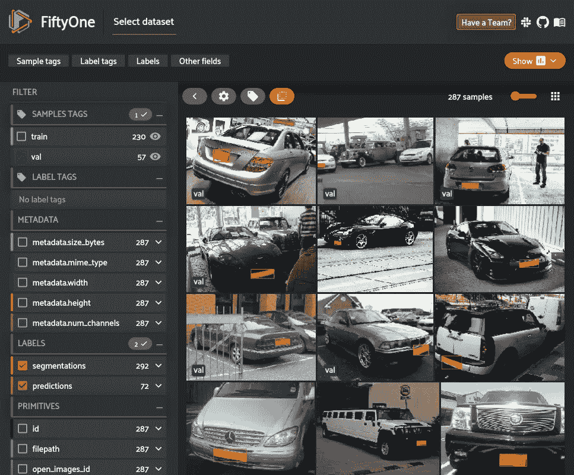
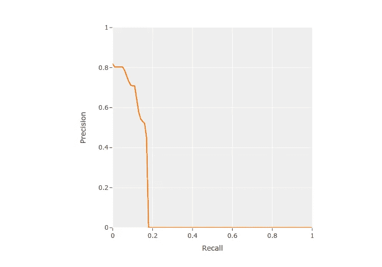
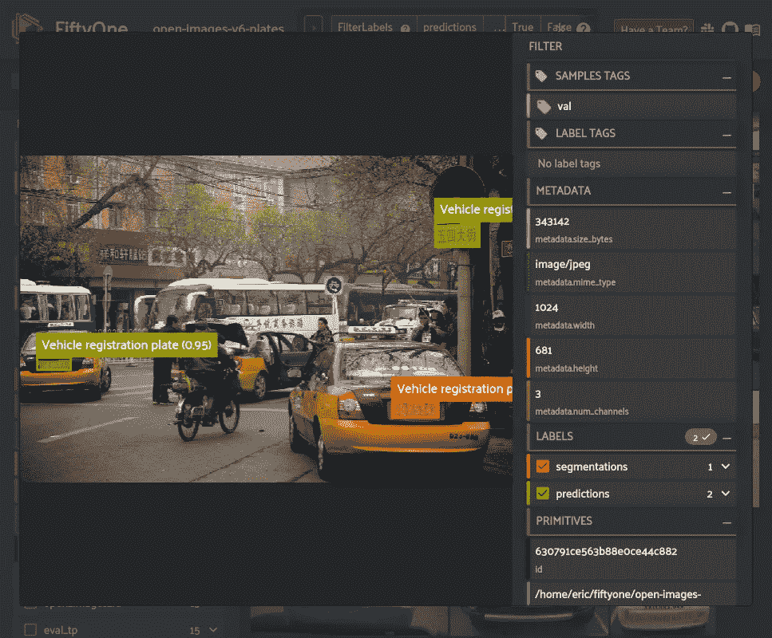

# 用探测器 2 和 51 训练一个自定义物体探测器

> 原文：<https://towardsdatascience.com/train-a-custom-object-detector-with-detectron2-and-fiftyone-4dc451839958>

## 将 FiftyOne 的数据集管理与 Detectron2 的模型训练相结合，轻松训练自定义检测模型

[](https://fiftyone.ai)

图像 **71df582bfb39b541** 来自开放图像 V6 数据集( [CC-BY 2.0](https://creativecommons.org/licenses/by/2.0/) )在第五十一次可视化

近年来，[机器学习(ML)生命周期](/the-machine-learning-lifecycle-in-2021-473717c633bc)的每个方面都有工具开发，使定制模型更容易从想法变为现实。最令人兴奋的部分是社区倾向于开源工具，如 [Pytorch](https://pytorch.org/) 和 [Tensorflow](https://www.tensorflow.org/) ，允许模型开发过程更加透明和可复制。

在这篇文章中，我们来看看如何集成两个开源工具来处理一个 ML 项目的不同部分: [**第五十一个**](http://fiftyone.ai/) 和[**检测器 2**](https://github.com/facebookresearch/detectron2) **。** Detectron2 是由脸书人工智能研究所开发的一个库，旨在让您轻松地在自己的数据上训练最先进的检测和分割算法。FiftyOne 是一个工具包，旨在让您轻松地可视化您的数据，管理高质量的数据集，并分析您的模型结果。

总之，您可以使用 fiftone 来管理您的自定义数据集，使用 Detectron2 在您的 fiftone 数据集上训练模型，然后在 fiftone 中评估 Detectron2 模型结果，以了解如何改进您的数据集，继续循环，直到您有一个高性能的模型。这篇文章紧跟[官方检测器 2 教程](https://colab.research.google.com/drive/16jcaJoc6bCFAQ96jDe2HwtXj7BMD_-m5)，对其进行扩充以展示如何使用 51 个[数据集](https://voxel51.com/docs/fiftyone/user_guide/using_datasets.html)和[评估](https://voxel51.com/docs/fiftyone/user_guide/evaluation.html)。

# 跟随 Colab！

请在你的浏览器中查看[这本笔记本](https://colab.research.google.com/github/voxel51/fiftyone/blob/v0.17.2/docs/source/tutorials/detectron2.ipynb)并关注这篇文章。



Colab 笔记本截图(图片由作者提供)

# 设置

首先，我们需要安装[51 个](https://voxel51.com/docs/fiftyone/getting_started/install.html)和[探测器 2](https://detectron2.readthedocs.io/en/latest/tutorials/install.html) 。

```
# Install FiftyOne
pip install fiftyone # Install Detectron2 from Source (Other options available)python -m pip install 'git+https://github.com/facebookresearch/detectron2.git'
*# (add --user if you don't have permission)*

*# Or, to install it from a local clone:*
git clone https://github.com/facebookresearch/detectron2.git
python -m pip install -e detectron2

*# On macOS, you may need to prepend the above commands with a few environment variables:*
CC=clang CXX=clang++ ARCHFLAGS="-arch x86_64" python -m pip install ...
```

现在让我们用 Python 导入 FiftyOne 和 Detectron2。

# 准备数据集

在本帖中，我们展示了如何使用自定义的 51 数据集来训练 Detectron2 模型。我们将从 COCO 数据集上预先训练的现有模型中训练一个车牌分割模型，该数据集可在 [Detectron2 的模型动物园](https://github.com/facebookresearch/detectron2/blob/main/MODEL_ZOO.md)中获得。

由于 COCO 数据集没有“车辆登记牌照”类别，我们将使用来自[51 数据集 Zoo](https://voxel51.com/docs/fiftyone/user_guide/dataset_zoo/datasets.html#open-images-v6) 中[开放图像 v6](https://voxel51.com/docs/fiftyone/integrations/open_images.html) 数据集的车牌分割来训练模型识别这一新类别。

> 注意:[开放图像 v6 数据集](https://storage.googleapis.com/openimages/web/factsfigures.html)中的图像受 [CC-BY 2.0](https://creativecommons.org/licenses/by/2.0/) 许可。

对于这个例子，我们将只使用数据集的官方“验证”分割的一些样本。为了提高模型性能，我们也可以从官方的“训练”分割中添加更多的数据，但这将花费更长的时间来训练，因此在本演练中我们将只坚持“验证”分割。

当从动物园下载数据集时，指定一个`classes`将确保只存在具有给定类之一的样本。然而，这些样本可能仍然包含其他标签，因此我们可以使用 FiftyOne 强大的[过滤功能](https://voxel51.com/docs/fiftyone/user_guide/using_views.html#filtering)轻松地仅保留“车辆牌照”标签。我们还将取消这些样本的“验证”标签，并从中创建我们自己的拆分。

接下来，我们需要将数据集从 51 的格式解析为[探测器 2 的格式](https://detectron2.readthedocs.io/tutorials/datasets.html)，以便我们可以将其注册到相关的探测器 2 目录中进行训练。这是集成 51 和 Detectron2 最重要的代码片段。

注意:在这个例子中，我们特别将分割解析成边界框和折线。此函数可能需要根据被定型的模型及其预期的数据进行调整。

让我们来看一些示例，以确保所有内容都被正确加载:



在 51 中可视化 Open Images V6 训练数据集(图片由作者提供)

# 加载模型并训练！

在[官方探测器 2 教程](https://colab.research.google.com/drive/16jcaJoc6bCFAQ96jDe2HwtXj7BMD_-m5#scrollTo=0d288Z2mF5dC)之后，我们现在在 51 数据集上微调 COCO 预训练的 R50-FPN 掩模 R-CNN 模型。如果使用[链接的 Colab 笔记本](https://voxel51.com/docs/fiftyone/tutorials/detectron2.html)，这将需要几分钟的时间。

```
*# Look at training curves in tensorboard:*
**tensorboard** --logdir output
```



Tensorboard 训练指标可视化(图片由作者提供)

# 使用训练好的模型进行推理和评估

既然模型已经训练好了，我们可以在数据集的验证分割上运行它，看看它的表现如何！首先，我们需要将训练好的模型权重加载到检测器 2 预测器中。

然后，我们对验证集中的每个样本生成预测，并将 Detectron2 的输出转换为 fiftone 格式，然后将它们添加到我们的 fiftone 数据集。

让我们把预测形象化，看看这个模型做得怎么样。我们可以单击“val”标签旁边的眼睛图标，查看我们运行推理的所有验证样本。



探测器 2 的预测在 51 年显现。所示图片授权为 [CC-BY 2.0](https://creativecommons.org/licenses/by/2.0/) (图片由作者提供)

从这里开始，我们可以使用 FiftyOne 提供的内置[评测方法](https://voxel51.com/docs/fiftyone/user_guide/evaluation.html#detections)。使用`use_masks=True`参数，`evaluate_detections()`方法可用于评估实例分段。我们也可以用它来计算 mAP，选项有 [COCO 风格的](https://voxel51.com/docs/fiftyone/integrations/coco.html#map-protocol)(默认)或[开放图像风格的](https://voxel51.com/docs/fiftyone/integrations/open_images.html#map-protocol) mAP 协议。

我们可以使用这个`results`对象来查看[地图](https://voxel51.com/docs/fiftyone/user_guide/evaluation.html#map-and-pr-curves)，[打印评估报告](https://voxel51.com/docs/fiftyone/user_guide/evaluation.html#aggregate-metrics)，[绘制 PR 曲线](https://voxel51.com/docs/fiftyone/user_guide/evaluation.html#map-and-pr-curves)，[绘制混淆矩阵](https://voxel51.com/docs/fiftyone/user_guide/evaluation.html#id5)等等。

```
 precision    recall  f1-score   support

Vehicle registration plate       0.72      0.18      0.29       292

                 micro avg       0.72      0.18      0.29       292
                 macro avg       0.72      0.18      0.29       292
              weighted avg       0.72      0.18      0.29       292
```



51 中生成的精确召回曲线(图片由作者提供)

从 PR 曲线中，我们可以看到该模型没有生成很多预测，从而导致很多假阴性，但生成的预测通常相当准确。

我们还可以创建一个数据集视图来查看高可信度的假阳性预测，以了解模型哪里出错了，以及如何在未来潜在地改进它。



在 51 中发现不正确的预测，显示的图片由 2.0 授权 [CC-BY(图片由作者提供)](https://creativecommons.org/licenses/by/2.0/)

有几个样本出现了像这样的假阳性，这些样本中含有非拉丁字母的字符。这表明我们可能希望将更多国家的图像引入训练集。

从这里，我们可以利用这些发现迭代数据集，改进样本和注释，然后重新训练模型。这种管理、训练和评估的循环需要反复进行，直到模型对于您的任务来说具有足够的质量。

# 摘要

[Detectron2](https://github.com/facebookresearch/detectron2) 和 [FiftyOne](http://fiftyone.ai/) 是两个流行的开源工具，分别用于帮助 ML 模型开发的模型和数据集方面。只需几个自定义 Python 函数，您就可以使用 51 个精选数据集来训练 Detectron2 模型，并在 51 个中评估结果，从而让您比以往任何时候都更容易地为计算机视觉任务开发模型！

# 关于体素 51

*披露:我在 Voxel51 工作，是* [*五十一*](http://fiftyone.ai/) 的开发者

总部位于密歇根州安阿伯市，由密歇根大学教授杰森·科尔索博士和布莱恩·摩尔博士于 2016 年创立， [Voxel51](https://voxel51.com/) 是 FiftyOne 背后的人工智能软件公司，fifty one 是一个用于构建高质量数据集和计算机视觉模型的开源工具包。

在 [fiftyone.ai](http://fiftyone.ai/) 了解更多！