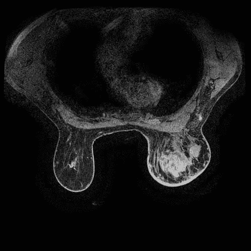
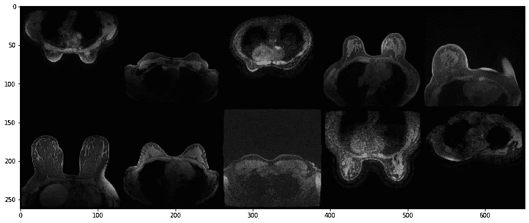

# 用 PyTorch 训练神经网络检测乳腺 MRI 肿瘤

> 原文：<https://towardsdatascience.com/train-a-neural-network-to-detect-breast-mri-tumors-with-pytorch-250a02be7777>

## 医学图像分析实用教程



来自我们数据集的乳腺 MRI 扫描示例。

大多数具有深度学习的计算机视觉研究都是在常见的自然图像数据集上进行的，如 [MNIST](http://yann.lecun.com/exdb/mnist/) 、 [CIFAR-10](https://www.cs.toronto.edu/~kriz/cifar.html) 和 [ImageNet](https://www.image-net.org/) 。然而，计算机视觉的一个重要应用领域是医学图像分析，其中深度学习已用于癌症检测、器官分割、数据协调和许多其他示例等任务。然而，与自然图像数据集相比，医学图像数据集通常更容易“插入”深度学习系统。在这里，我提供了一个实用的分步指南，介绍如何使用深度学习来完成一个简单的医学图像分析任务，从数据采集一直到模型测试。

在这篇文章中，我将展示如何使用 PyTorch 训练一个神经网络分类器来检测乳腺 MRI 图像中的肿瘤。在我之前的文章中(在我实验室的博客上找到了[,我介绍了我实验室公开的乳腺 MRI 数据集，以及如何使用 Python 与原始医学成像数据进行交互。我演示了如何以一种格式和标签提取和排序图像文件，这将有助于用 PyTorch 训练和测试我们的模型。该数据集最初出现在论文中:](https://sites.duke.edu/mazurowski/2022/07/13/breast-mri-cancer-detect-tutorial-part1/)

*Saha，a .，Harowicz，M.R .，Grimm，L.J .，Kim，C.E .，Ghate，S.V .，Walsh，r .和 Mazurowski，M.A .，2018。* ***乳腺癌放射基因组学的机器学习方法:对 922 名受试者和 529 个 DCE-MRI 特征的研究。*** *《英国癌症杂志》，第 119 卷第 4 期，第 508–516 页。(这篇论文的免费版本可以在这里找到:*[*PMC 6134102*](https://www.ncbi.nlm.nih.gov/pmc/articles/PMC6134102/)*)*

有了我们的数据，我们可以继续构建、训练和测试我们的深度分类器。除了在计算机视觉中测量分类器性能(总预测精度)的典型方法之外，我还将展示如何使用医学图像分析常用的度量来进一步分析我们的模型的性能。

本教程的所有代码可以在这里找到；需要一些 Python 方面的经验，PyTorch 知识是有帮助的，但不是必需的。

# (1)建立数据加载管道

深度学习是数据驱动的，因此拥有一个可靠的框架来处理(图像)数据至关重要。py torch(Python 中的`torch`和`torchvision`库)允许对数字矩阵进行有效的操作和管理，是最流行的深度学习框架之一(因为神经网络通过许多矩阵乘法和加法进行操作和学习)。图像也可以用大的数字矩阵来描述，其中矩阵的维数对应于图像的大小，矩阵的每个元素是一个像素强度值。因此，使用 PyTorch 对所有图像数据加载/处理和神经网络操作进行抽象是非常有帮助的，py torch 附带了无数方便的模块和工具来实现这些功能。

我们将使用的中心对象是`torch.utils.data`的`Dataset`和`DataLoader`。虽然`Dataset`允许轻松存储和索引数据样本和标签，但`DataLoader`使我们能够以一种与我们将如何训练和测试神经网络非常好地集成的方式轻松访问这些样本。详情请见 PyTorch 的[教程](https://pytorch.org/tutorials/beginner/basics/data_tutorial.html)。首先，让我们导入所需的库和对象:

接下来，让我们定义一些常数:

# 数据集

首先，我们必须为 DBC 数据集定义我们自己的`Dataset`，称为`DBCDataset`。总之，`DBCDataset`中定义的重要方法有:

1.  `create_labels()`方法为数据集中的每个图像分配一个易于访问的标签，
2.  `normalize()`方法将图像标准化到像素值范围`[0,255]`，因为标准化数据对于深度学习很重要，
3.  `__getitem__()`方法是`Dataset`所必需的，它描述了如何从带有一个(或多个)索引的数据集中获取数据

查看下面的代码块，我在其中添加了注释来解释每一步。

从这里，我们可以简单地创建一个数据集实例:

输出:

```
building DBC dataset labels. 
5200
```

# 训练集、验证集和测试集:区别是什么？

为了开发我们的分类模型，我们需要将数据集分成训练集、验证集和测试集。对于数据点中的每个图像，都有一个我们希望分类模型预测的关联标签。但是这些数据子集之间有什么区别呢？

1.  定型集用于为模型提供如何进行预测的示例；这就是模型“学习”的内容。学习算法只是修改神经网络参数，以最小化训练集的平均预测误差。
2.  验证集用于评估模型在预测未学习的新数据标签方面的表现(开发该模型的最终目标，也称为*泛化*)。此验证预测误差用于选择我们希望在训练中的哪一点保存模型:我们希望在验证误差最低时保存模型。您也可以使用验证集来选择*超参数*或不是从训练集中学习的训练算法设置。
3.  测试集和验证集一样，也用于估计神经网络对新数据的*泛化能力*；但是，这必须与验证集分开，因为验证集本身是用来选择最终模型的，我们需要对泛化能力的无偏估计

对于 2600 + 2600 = 5200 的数据集大小，用于将数据集划分为训练/验证/测试的一组典型百分比可能是 80%/10%/10%，这导致训练集大小为 4160，验证和测试集大小分别为 520。实际上，我们可以使用有用的函数`torch.utils.data.random_split()`从我们的数据集中提取这些子集，该函数随机地将整个数据集分成子集:

输出:

```
5200 
4160 520 520
```

# 数据加载器

我们已经创建了 PyTorch `Dataset`用于模型训练、验证和测试，这是我们数据加载管道的大部分工作。最后，我们需要创建 PyTorch `Dataloader`来方便地访问数据集中的图像。但是首先，快速注意一下*批次大小*。

## 批量大小和计算设备

虽然我们可以一次对一张图像训练神经网络，但这将非常慢，因为它们通常需要多次从数百或数千张图像中学习。相反，我们可以同时对*批*多幅图像进行训练，受限于我们计算处理设备的存储容量；例如，GPU(图形处理单元)，它是专门为图像处理而设计的。

下面，我们将为三个数据子集分别创建`Dataloaders`。对于训练集，我们将使用 200 的批量大小，但这在很大程度上取决于您用于计算的 CPU 或 GPU 硬件。对于大多数现实的计算机视觉应用程序来说，GPU 是必需的，因为 CPU 非常慢；因此，我们将使用 8 GB 的英伟达 GTX 1070。我们将在其上加载数据的设备可以通过以下方式指定:

输出:

```
running on cuda
```

现在，让我们创建我们的数据加载器:

接下来，为了确保我们的结果具有可重复性，我们将使用以下方法修复所有随机种子:

有了这些，我们就可以开始介绍和构建我们的分类神经网络了！

# (2)加载神经网络

神经网络实际上只是具有许多许多参数的函数(也就是拨号调谐)。这些参数是*从大量数据中学习到的*来调整网络，以最佳地逼近我们试图模拟的功能。例如，像我们将使用的图像分类神经网络，被训练以图像作为输入，并输出图像的正确类别身份，例如，乳房图像是否是癌性的。神经网络的许多连续计算*层*允许它们学习非常复杂的功能，这实际上是不可能手工设计的。

卷积神经网络是专门为学习检测图像中的空间模式而设计的，因此特别适合我们的任务。今天，我们将使用一种非常流行的现代神经网络架构，称为残差网络，简称为 *ResNet* 。事实上，根据谷歌学术的说法，最初的 [ResNet 论文](https://arxiv.org/abs/1512.03385)是有史以来被引用最多的论文之一，截至 2022 年 6 月已被引用超过 120，000 次。我们将使用 ResNet *模型*的一个特定版本，称为 ResNet-18，其细节超出了本教程的范围。ResNet-18 和类似的模型可以很容易地用 PyTorch 的`torchvision.models`库加载(未经训练),如下所示:

这里我们也导入了 PyTorch 的神经网络库`torch.nn`。接下来，我们将加载一个 ResNet-18 来使用(因为`resnet18`是一个类):

ResNets 设计用于处理彩色三通道图像。然而，我们的 MRI 切片是单通道的，所以我们需要修改我们的`net`来接受单通道输入。这可以通过将`net`的*输入层*修改为:

最后，我们需要将网络加载到我们的计算设备上:

这样，我们的网络就可以接受训练，对我们的图像进行分类。让我们建立一个培训管道！

# (3)为培训做准备

神经网络通过最小化对整个训练集进行预测的平均误差来“学习”。在训练集上的每次迭代，或*时期*，调整参数以便在下一次迭代中表现得更好。每个参数的变化由*反向传播*算法决定，该算法调整每个参数，使给定迭代的误差在平均值上最大程度地降低(该过程被称为*随机梯度下降*或“SGD”)。

为了实现这一点，我们需要定义几件事情。首先，我们必须定义这个预测误差，也称为*损失*。对于分类的任务，我们需要的损失是`nn.CrossEntropyLoss()`，随着网络预测训练集中更多不正确的图像分类，损失增加。这是我们在训练中要尽量减少的；我们可以将其定义为:

接下来，我们要定义我们将使用的*误差最小化*算法；同样，这个*是随机梯度下降*，或 SGD 当然还有其他的，但是 SGD 是最基本的，也很好。当创建一个 SGD 实例时，我们需要告诉它我们将最小化哪些参数(参数`net`，和*学习率*)。学习率(`lr`)是一个固定的常数，它基本上决定了在学习过程中对参数进行调整的大致大小。根据任务、数据、网络和其他因素，可以选择不同的学习速率，但现在，我们将选择`lr=0.001`。

最后，让我们将训练时期的数量(通过整个训练集)设置为 100:

# (4)训练和验证你的模型！

我们现在拥有了训练分类模型所需的一切。如前所述，在每个训练时期，我们可以评估验证数据集上的模型，以估计它在看不见的数据上的表现如何。然后，我们将最终训练的模型保存为在训练期间在验证集上发现具有最佳性能/分类准确性的模型。

为了在实践中做到这一点，我们可以创建我们的培训模型`net`的副本，并将其保存为一个单独的网络`net_final`。让我们继续初始化它:

最后，我们可以用下面的代码(每一步都有注释)创建并运行我们的训练循环。在实践中，我们将使用分类准确度作为预测误差的度量，即给定数据集中被网络正确分类的图像的百分比。需要处理的一个微妙之处是，网络实际上输出了输入图像在每个类别中的概率*。同样地，单个预测类仅由最高概率类给出。*

我们还可以为训练集和验证集存储我们的精度与时期数据，以便观察模型如何通过训练演变。

好吧，让我们开始训练我们的模型吧！这可能需要一些时间，取决于您的计算设备的强度。我还包含了一些代码来记录训练的每一步。

输出:

```
### Epoch 0:
21it [00:16,  1.30it/s]
Training accuracy: 0.23557692307692307
100%|████████████████████████████████████████████████████████████████| 52/52 [00:01<00:00, 29.09it/s]Validation accuracy: 0.5153846153846153
Validation accuracy improved; saving model.### Epoch 1:
21it [00:15,  1.37it/s]
Training accuracy: 0.5454326923076923
100%|████████████████████████████████████████████████████████████████| 52/52 [00:01<00:00, 28.46it/s]Validation accuracy: 0.551923076923077
Validation accuracy improved; saving model.
```

…(未显示线路)…

```
### Epoch 98:
21it [00:14,  1.40it/s]
Training accuracy: 0.9992788461538461
100%|████████████████████████████████████████████████████████████████| 52/52 [00:01<00:00, 29.27it/s]Validation accuracy: 0.925
Validation accuracy improved; saving model.### Epoch 99:
21it [00:15,  1.39it/s]
Training accuracy: 0.9992788461538461
100%|████████████████████████████████████████████████████████████████| 52/52 [00:01<00:00, 28.57it/s]Validation accuracy: 0.9230769230769231
```

让我们通过`matplotlib`用一个简单的图表来看看我们的模型的性能是如何随着时间的推移而发展的:

输出:


一旦完全训练，该模型获得了 92.5%的验证准确性，这意味着在 520 个图像的验证集中，它正确地将其中的大约 480 个分类为癌症或非癌症。

您可能还会注意到模型过度适应了训练集。这可以通过某种正则化来缓解，但是这超出了本入门教程的范围。

这种性能很好，但是我们只有通过在测试集上对模型进行评估，才能知道模型对新数据进行分类的真正能力，如下所示。

# (5)测试你的最佳模型

现在我们的模型已经训练好了，它在测试集上表现如何？我们可以用下面的代码来测试这一点，这里我还展示了一些分类的例子；这与我们在验证集上的评估非常相似。

## 医学图像分析中分类器性能的度量

在医学图像分析中，为了更好地分析分类器的表现，除了单独的分类精度之外，通常还要报告更多的性能指标。*假阳性* (FP)是当分类器将阴性(无癌症)图像错误分类为阳性时，而*真阳性* (TP)是当阳性图像被正确分类时。让我们在代码中也估算一下:

输出:

```
Example Images: 
Target labels: [0, 0, 0, 1, 1, 1, 0, 0, 1, 0] 
Classifier predictions: [0, 0, 0, 1, 1, 1, 0, 0, 1, 0] 
Test set accuracy: 0.9442307692307692
238 true positive classifications, 19 false positive classifications
```



在我们的 520 个未知样本的测试集上，我们得到了癌症检测任务的 94.4%的预测准确率，或者只有大约 30 个错误分类！在 257 个阳性(癌症)检测中，238 个或约 93%是真阳性(正确)，而 19 个(约 7%)是假阳性(不正确)。

# 讨论

为医疗成像等安全关键型应用设计自动化方法时，检查可能的风险和限制至关重要。这方面的一个例子是假阳性的可能性:如果像这样的癌症检测模型被用于临床，阳性检测将立即保证对患者的进一步研究，因此假阳性可能是误导的。一个相关的可能性是假的*阴性*:肿瘤被检测模型完全遗漏。虽然我们的模型总体上具有很高的预测准确性，但它并不完美，因此不应该完全信任所有的诊断决策。这就是为什么计算机辅助诊断(CAD)设备的开发目标的常见范例是帮助而不是取代放射科医师。

同样重要的是要记住，用深度学习训练的模型完全是数据驱动的:它们完全根据训练集的标签进行学习。例如，在本教程中，我选择通过将 3D MRI 扫描的每个 2D 切片分配到阳性(包含乳腺肿瘤注释)或阴性类别来标记数据集。然而，即使来自 3D 扫描的一些切片被发现是阴性的，这并不*而不是*表明整个扫描/患者的癌症是阴性的:扫描中可能有其他切片是*阳性的*。这是一个例子，说明计算机辅助设计系统所做的所有预测都应该清楚地、可量化地表述出来。

有许多可能的补充可以用来改进这个检测模型。正如我们在第(4)节的训练演化图中看到的，我们的模型似乎过度适应训练集(由训练准确性和验证准确性之间的差距来指示)。这可以通过一些技术来减轻或防止；参见[这篇教程](https://atcold.github.io/pytorch-Deep-Learning/en/week14/14-3/)，它很好地介绍了如何在 PyTorch 中做到这一点。我们可以做的另一个改进是训练我们的模型，不要将每个 2D MRI 切片分类为在某处有肿瘤*，而是精确地*定位*切片内任何可能的肿瘤；在计算机视觉中被称为*物体检测*的任务。我在这篇文章中没有探讨这个问题，因为对象检测是一个比分类更微妙的问题，但它肯定可以用我们的数据集来实现，因为它包含肿瘤位置标签/边界框。快速 R-CNN 对象检测模型的 PyTorch 实现可能是一个很好的起点。*

# *结论*

*在本教程中，我展示了如何在我们的 DBC-MRI 数据集上使用 PyTorch 通过深度学习来训练乳房 MRI 分类模型。*

*在我的实验室博客上的前一篇文章中，我介绍了 DICOM 医学成像数据类型，展示了如何从癌症成像档案中获取数据，以及如何从数据中提取对 PyTorch 有用的图像。*

*在这篇文章中，我展示了如何在真实的乳腺 MRI 数据上加载、训练和测试分类神经网络。*

*我写这些博客文章是为了提供一个介绍性的例子，说明如何将神经网络用于医学图像分析的实际应用。这仅仅触及了深度学习的广泛医学图像分析(MIA)应用的表面。对于有兴趣了解更多信息的人，请查看:*

1.  *MICCAI 会议的最新会议记录。*
2.  *[医学影像分析](https://www.journals.elsevier.com/medical-image-analysis)和[医学影像汇刊](https://ieeexplore.ieee.org/xpl/RecentIssue.jsp?punumber=42)期刊。*
3.  *我实验室的[网站](https://sites.duke.edu/mazurowski/)，以及[我实验室的导师](https://scholar.google.com/citations?user=HlxjJPQAAAAJ&hl=en)和[本人](https://scholar.google.com/citations?user=a9rXidMAAAAJ&hl=en)的学术出版物。*
4.  *我的[推特](https://twitter.com/KickNonz)和[我实验室的推特](https://twitter.com/MazurowskiLab)。*

*感谢阅读！*