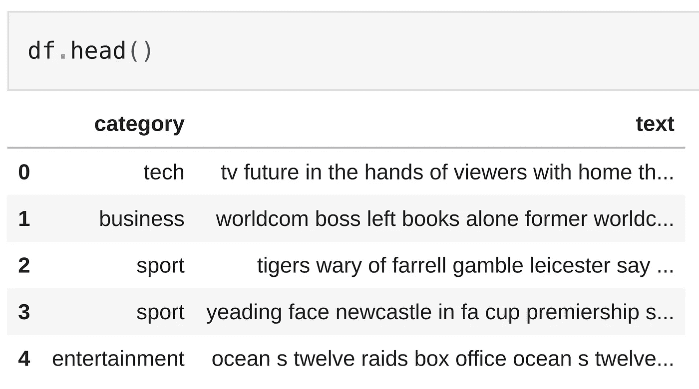
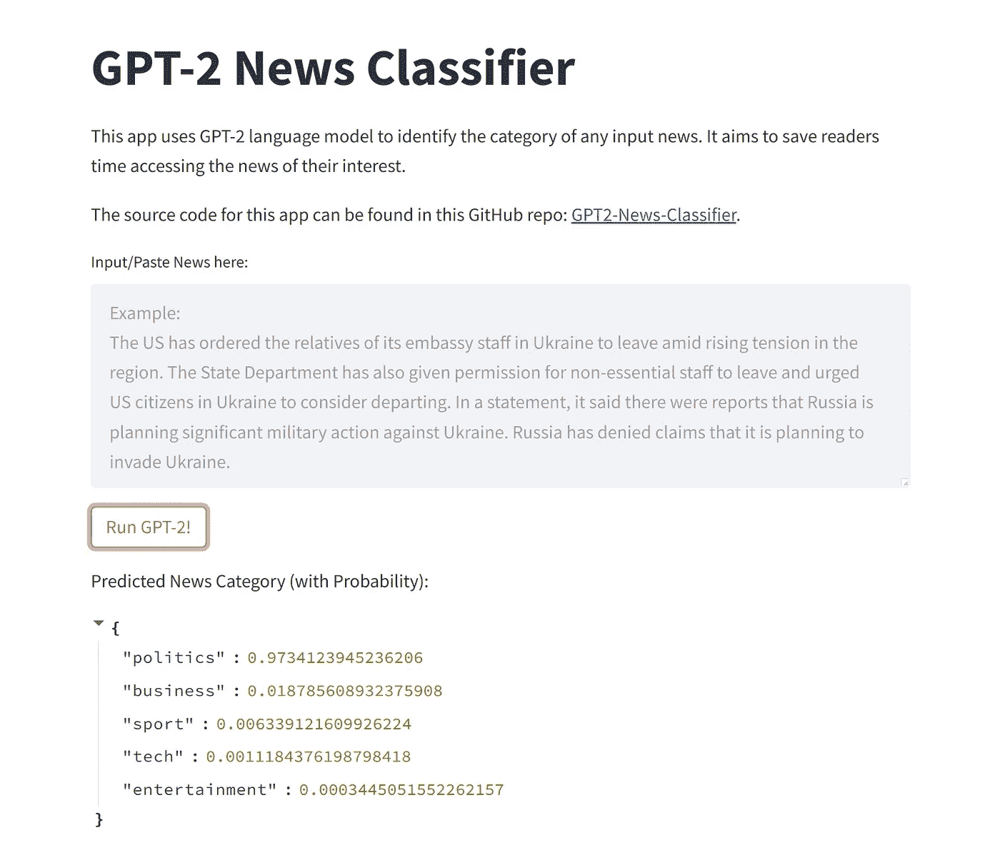
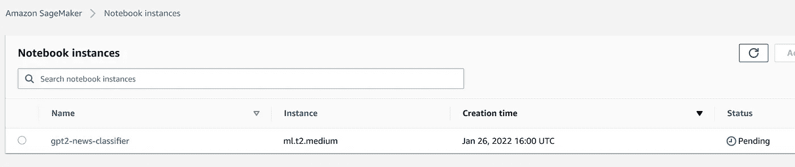

# 使用亚马逊 SageMaker 上的 PyTorch 训练和部署微调的 GPT-2 模型，以对新闻文章进行分类

> 原文：<https://towardsdatascience.com/train-and-deploy-fine-tuned-gpt-2-model-using-pytorch-on-amazon-sagemaker-to-classify-news-articles-612f9957c7b>

## 亚马逊 SageMaker 上使用 GPT-2 进行文本分类的教程


*照片由* [*帕特里克·托马索*](https://unsplash.com/@impatrickt?utm_source=unsplash&utm_medium=referral&utm_content=creditCopyText) *上* [*下*](https://unsplash.com/s/photos/machine-learning-news?utm_source=unsplash&utm_medium=referral&utm_content=creditCopyText)

文本分类是自然语言处理中非常常见的任务。它可以用于许多应用，从垃圾邮件过滤、情感分析到客户支持自动化和新闻分类。使用深度学习语言模型进行大规模文本分类任务最近在业界变得相当流行，尤其是近年来随着[变形金刚](https://en.wikipedia.org/wiki/Transformer_(machine_learning_model))的出现。因为这些变压器模型的规模往往太大，无法在本地机器上训练，所以通常使用云计算平台(例如 [GCP](https://cloud.google.com/) 、 [AWS](https://aws.amazon.com/) 、 [Azure](https://azure.microsoft.com/) 、 [Alibabacloud](https://us.alibabacloud.com/) )。因此，在这篇博客中，我想展示如何使用 Amazon SageMaker 来训练和部署一个用于文本分类任务的微调的 GPT-2 模型。

# 1.介绍

## 1.1 变形金刚:GPT-2 vs 伯特

[GPT-2](https://en.wikipedia.org/wiki/GPT-2) 属于深度学习模型家族，名为“[变形金刚](https://en.wikipedia.org/wiki/Transformer_(machine_learning_model))”。变压器是当前最先进的 NLP 架构的构建模块。在这里不可能用一段话来解释变形金刚是如何工作的，但总结一下，变形金刚使用了一种“自我关注”机制，通过“学习”句子中不同位置的单词之间的关系来计算序列的表示。典型的变压器设计包含两个部分，**编码器**和**解码器**，两者都作为单词关系的矢量化表示。

[GPT-2](https://en.wikipedia.org/wiki/GPT-2) 和[伯特](https://en.wikipedia.org/wiki/BERT_(language_model))分别是 2018 年和 2019 年发布的两款知名变形金刚型号。从那时起，有更新更好的模型发布(例如，2019 年的[罗伯塔](https://arxiv.org/abs/1907.11692)和 2020 年的 [GPT-3](https://en.wikipedia.org/wiki/GPT-3) )，然而，这两个仍然非常受许多工业应用的欢迎，直到现在，由于它们伟大的可用性和性能。GPT-2 和伯特之间的关键区别在于，GPT-2 本质上是一个生成模型，而伯特不是。这就是为什么你可以发现很多技术博客使用 BERT 进行文本分类任务，使用 GPT-2 进行文本生成任务，但是很少使用 GPT-2 进行文本分类任务。这就是我决定在这里使用 GPT-2 的原因——它更具挑战性！

## 1.2 亚马逊 SageMaker

[Amazon SageMaker](https://aws.amazon.com/sagemaker/) 是一个很好的工具，可以通过 AWS 提供的完全托管的基础设施，在云实例上训练和部署深度学习模型。几分钟内，您就可以在 Jupyter 笔记本中构建、训练和部署模型，而不必担心环境设置，因为它附带了许多预构建的 Conda 环境和 Docker 容器。对于像我这样的数据科学家来说，这是一个巨大的救命稻草。

值得一提的是，SageMaker 还可以用于 [Streamlit](https://streamlit.io/) app 开发。这对于产品原型非常有用，因为在模型训练之后，您可以直接在同一个实例上构建应用程序。您将在本文中看到这一点。

# 2.系统需求

由于大多数模型培训和部署都将在 AWS 上进行，因此对您的本地机器没有任何系统要求。这是你需要的一切:

*   AWS 帐户([在此注册](https://aws.amazon.com/resources/create-account/))
*   一个 [Google Drive](https://drive.google.com/) 帐户(可选，用于 Colab 笔记本培训)
*   本地 bash/zsh 终端(可选，用于 Streamlit 应用程序部署)

# 3.资料组

我们将在这个项目中使用的数据集是带有公共许可证的 [*BBC 新闻分类数据集*](http://mlg.ucd.ie/datasets/bbc.html) 。你可以从 [Kaggle](https://www.kaggle.com/) 下载[数据集](https://www.kaggle.com/c/learn-ai-bbc/data)。

这个数据集是 CSV 格式的，它有两列:**文本**和**类别**。它包含了 2226 个不同的文本，每个文本都被归入 5 个类别之一:**娱乐**、**体育**、**科技**、**商业**或**政治**。



*作者图片*

# 4.演示

我使用运行训练好的模型的 Streamlit 构建了一个在线新闻分类器。您可以在这里输入或粘贴任何新闻，它将非常准确地生成新闻类别的预测。这个应用程序看起来很简单，但它运行着一个非常强大的深度学习模型！

看看这里: [GPT-2 新闻分类器](https://youtu.be/7rg8umeAtts)。

(更新 2022.11.11:由于服务器成本，我关闭了这个应用的 AWS 服务器，并录制了[一段 YouTube 视频](https://youtu.be/7rg8umeAtts)作为这个应用的演示。不好意思！)



*作者图片*

# 5.在 SageMaker 上训练和部署 GPT-2

## 5.1.创建一个 Amazon SageMaker 笔记本实例

按照 AWS 的这个[实践教程](https://aws.amazon.com/getting-started/hands-on/build-train-deploy-machine-learning-model-sagemaker/)创建一个 Amazon SageMaker 笔记本实例。使用“*gp T2-新闻分类器*作为**实例名**，使用“ *ml.t2.medium* 作为**实例类型**。



*作者图片*

## 5.2.培训和部署

当笔记本状态变为*在用*时，选择**打开 Jupyter**,**上传**该 Git 文件夹中的所有文件，结构如下:

```
├── gpt2-news-classifier-sagemaker-train-deploy.ipynb #main notebook
├── utils.py               # utility functions used by main notebook
├── code                   # separate PyTorch script folder
│   ├── requirements.txt   # libraries used by train_deploy.py
│   └── train_deploy.py    # PyTorch training/deployment script
├── data                   # data folder to be uploaded to S3 bucket
│   ├── test               # test data
│   │   └── test.csv
│   ├── train              # train data
│   │   └── train.csv
│   └── val                # validation data
│       └── val.csv
└── streamlit_app          # Streamlit app folder
    ├── Dockerfile         # Dockerfile for the app (container)
    ├── requirements.txt   # libraries used by app.py
    └── src                
        └── app.py         # main code for the Streamlit app
```

在 SageMaker 上运行[这个笔记本](https://github.com/haocai1992/GPT2-News-Classifier/blob/main/sagemaker-train-deploy/gpt2-news-classifier-sagemaker-train-deploy.ipynb)来训练和部署 GPT-2 模型。通读它以获得关于实现的更多细节。

## 5.3.培训 _ 部署. py

由于我们在这个项目中构建和训练的是 PyTorch 模型，所以[**SageMaker Python SDK**](https://sagemaker.readthedocs.io/en/stable/frameworks/pytorch/using_pytorch.html#train-a-model-with-pytorch)建议准备一个单独的`train_deploy.py`脚本来构建和存储 SageMaker 使用的模型函数。有两个基本功能，`SimpleGPT2SequenceClassifier`和`train`。

*train_deploy.py* 中的`SimpleGPT2SequenceClassifier`类负责在预训练的 GPT-2 模型之上构建一个分类器。这里的技巧是在 GPT-2 的 12 层解码器上添加一个线性层，其输出维度等于我们的标签数量。这样，我们可以使用 GPT-2 来输出 5 个数字，这 5 个数字对应于我们的 5 个新闻类别！

*train_deploy.py* 中的`train`函数在给定输入数据的情况下构建分类器的训练循环。

一个重要的注意事项:GPT-2 是一个文本生成模型，它的最后一个标记嵌入预测后续标记。因此，与使用第一个标记嵌入的 BERT 不同，在输入文本的标记化步骤中，我们应该使用最后一个标记，如下所示。( [George Mihaila](https://gmihaila.medium.com/) 在他的文章[“使用拥抱脸变形金刚进行文本分类的 gp T2”](https://gmihaila.medium.com/gpt2-for-text-classification-using-hugging-face-transformers-574555451832)中提供了一种优雅的方法，这就是我在这里使用的方法。)

# 6.Colab 笔记本培训

当谈到在云笔记本上训练深度学习模型时，亚马逊 SageMaker 的一个方便的替代品是谷歌的 [Colab 笔记本](https://colab.research.google.com/?utm_source=scs-index#)。它在 AWS 中跳过所有你需要的云服务设置，最重要的是，它为模型训练提供免费的 CPU/GPU 实例(尽管有 12 小时的限制)！要使用它，只需打开你的 [Google Drive](https://drive.google.com) ，选择**新建- >更多- > Google 协同实验室**。如果想用 GPU 加速训练，选择**运行时- >改变运行时类型- > GPU** ，就可以在那里写你的代码了！

我的 [**Colab 笔记本**](https://colab.research.google.com/drive/1dMTdO5vxdVX0NA2Qe7AV9WGEy8ZH67Xn?usp=sharing) 以及资料可以在这里 找到[。](https://drive.google.com/drive/folders/1q_4pJKDAv21vpO232ZEyxedfpWWVx7wu?usp=sharing)

# 7.使用 Amazon EC2 和 Docker 进行部署

尽管模型部署可以在 SageMaker Notebook 实例中完成，正如我刚才所展示的，但是在实际的应用程序开发实践中，为了简单性和可再现性，通常建议将培训和部署分离。因此，我还使用 Docker 在 Amazon EC2 实例上部署了我们训练过的 GPT-2 模型。

## 7.1.创建 Amazon EC2 实例

按照 AWS 的教程[创建并启动 Amazon EC2 实例。此项目的一些自定义设置:](https://docs.aws.amazon.com/efs/latest/ug/gs-step-one-create-ec2-resources.html)

*   在**步骤 1:选择一个亚马逊机器映像(AMI)** 中，选择**深度学习 AMI (Ubuntu) AMI** 。使用这个映像确实会引入一些额外的开销，但是，它保证我们会预装 git 和 Docker，这就省去了很多麻烦。
*   在**步骤 2:选择实例类型**中，选择 **t2.large** 以确保我们有足够的空间来构建和运行我们的 Docker 映像。
*   在**步骤 6:配置安全组**中，选择**添加规则**并为端口 **8501** 创建自定义 tcp 规则，以使我们的 streamlit 应用程序公开可用。
*   点击**启动**后，选择**创建新的密钥对**，输入“ **ec2-gpt2-streamlit-app** ，点击“**下载密钥对**”将`ec2-gpt2-streamlit-app.pem`密钥对保存到本地。

## 7.2.在云中运行 Docker 容器

启动 EC2 实例后，使用 SSH 连接到该实例:

```
ssh -i ec2-gpt2-streamlit-app.pem ubuntu@your-instance-DNS-address.us-east-1.compute.amazonaws.com
```

然后，使用`git`将我的代码复制到云中:

```
git clone [https://github.com/haocai1992/GPT2-News-Classifier.git](https://github.com/haocai1992/GPT2-News-Classifier.git)
```

然后，进入`ec2-docker-deploy`文件夹构建并运行映像:

```
cd ec2-docker-deploy/
docker image build -t streamlit:gpt2-news-classifier-app .
docker container run -p 8501:8501 -d streamlit:gpt2-news-classifier-app
```

现在，您可以在`http://<EC2 public IP address>:8501`访问 Streamlit 应用程序(EC2 公共 IP 地址可以在 AWS 控制台的“IPv4 公共 IP”下找到)！

# 8.摘要

我希望你能从这篇文章中了解到，使用亚马逊 SageMaker 训练和部署一个深度学习模型一点也不复杂。无论如何，还有更简单的替代方案，比如 Google Colab 培训和 Amazon EC2 部署。希望这篇文章对你有用。

所有的源代码都可以在这个 Github 回购中找到:[https://github.com/haocai1992/GPT2-News-Classifier](https://github.com/haocai1992/GPT2-News-Classifier)

[](https://github.com/haocai1992/GPT2-News-Classifier)  

# 9.参考

*   **特征图**:帕特里克·托马索[在](https://unsplash.com/@impatrickt?utm_source=unsplash&utm_medium=referral&utm_content=creditCopyText) [Unsplash](https://unsplash.com/s/photos/machine-learning-news?utm_source=unsplash&utm_medium=referral&utm_content=creditCopyText) 上拍摄的照片。[https://unsplash.com/photos/BQTHOGNHo08](https://unsplash.com/photos/BQTHOGNHo08)。
*   **GPT-2 vs 伯特**:[https://judithvanstegeren . com/blog/2020/gp T2-and-BERT-a-comparison . html](https://judithvanstegeren.com/blog/2020/GPT2-and-BERT-a-comparison.html)
*   英国广播公司新闻分类数据集:d .格林和 p .坎宁安。核心文档聚类中对角优势问题的实际解决方案。ICML 2006。
*   **用于文本分类的 GPT-2**:https://github.com/huggingface/transformers/issues/3168
*   **GPT2 用于使用拥抱脸的文本分类🤗变形金刚**(作者[乔治·米海拉](https://gmihaila.medium.com/)):[https://gmi haila . medium . com/gp T2-for-text-class ification-using-hugging-face-transformers-574555451832](https://gmihaila.medium.com/gpt2-for-text-classification-using-hugging-face-transformers-574555451832)
*   **在 AWS sage maker**:[https://medium . com/@ thom . e . lane/streamlit-on-AWS-a-full-featured-solution-for-streamlit-deployments-ba 32 a 81 c 7460](https://medium.com/@thom.e.lane/streamlit-on-aws-a-fully-featured-solution-for-streamlit-deployments-ba32a81c7460)
*   **在 AWS EC2 上部署 Streamlit app**:[https://medium . com/usf-MSDS/deploying-web-app-with-Streamlit-docker-and-AWS-72 b 0 D4 dbcf 77](https://medium.com/usf-msds/deploying-web-app-with-streamlit-docker-and-aws-72b0d4dbcf77)

# 接触

*   **作者**:蔡皋
*   **电子邮件**:[haocai3@gmail.com](https://haocai1992.github.io/data/science/2022/01/29/haocai3@gmail.com)
*   **Github**:[https://github.com/haocai1992](https://github.com/haocai1992)
*   **领英**:[https://www.linkedin.com/in/haocai1992/](https://www.linkedin.com/in/haocai1992/)