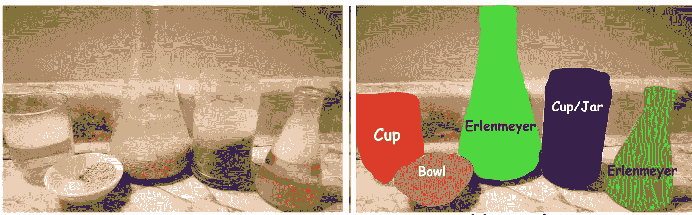
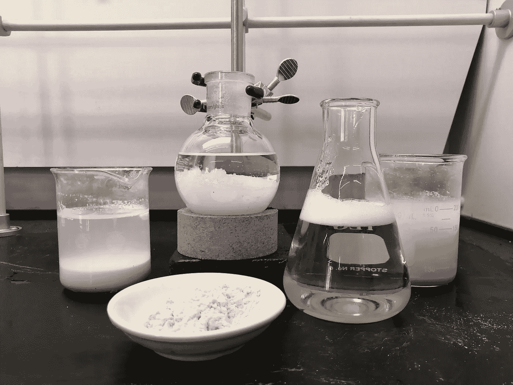
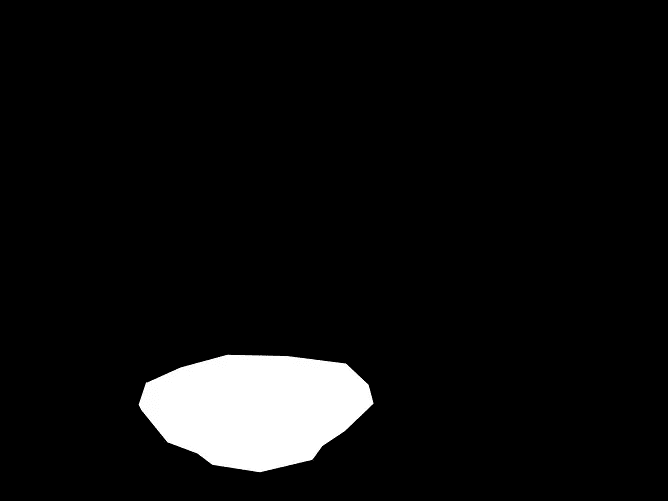
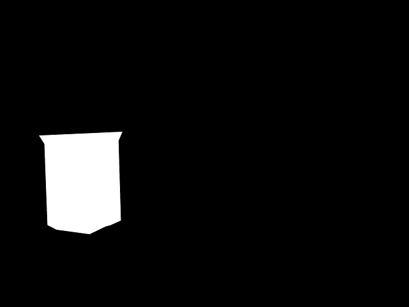
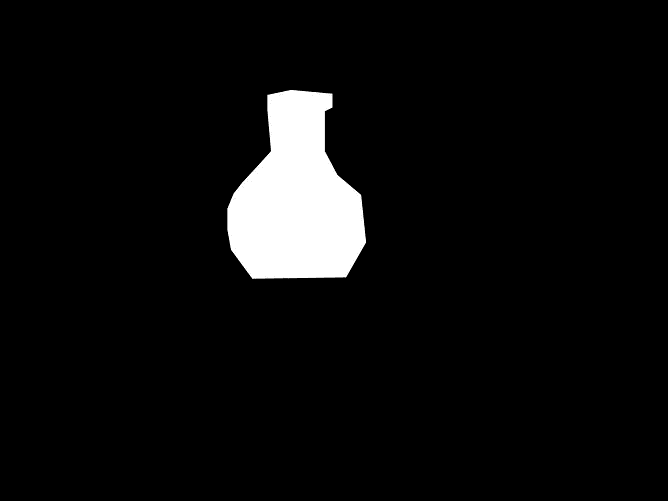
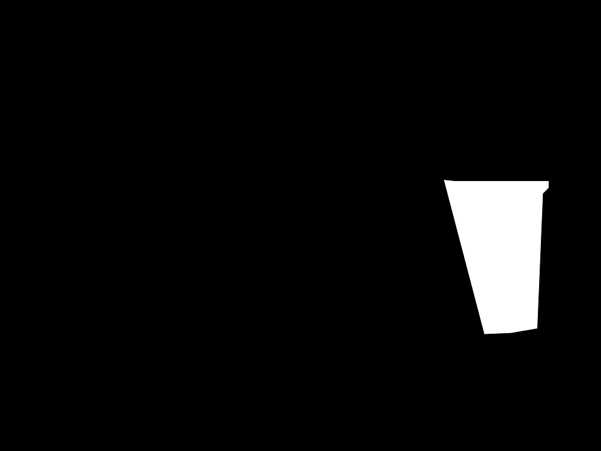
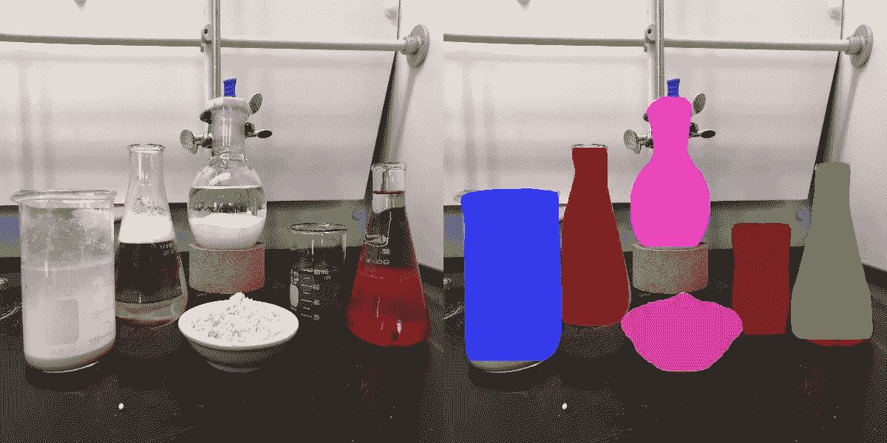

# 用 60 行代码训练用于目标检测的掩模 R-CNN 网络

> 原文：<https://towardsdatascience.com/train-mask-rcnn-net-for-object-detection-in-60-lines-of-code-9b6bbff292c3>

## 使用最少代码的循序渐进教程

对象检测和实例分割是识别和分割图像中的对象的任务。这包括为每个对象找到边界框、覆盖确切对象的遮罩和对象类。[屏蔽 R-CNN](https://arxiv.org/abs/1703.06870) 是实现这一点最常见的方法之一。

本教程旨在解释如何用最少的代码(60 行，不包括空格)训练这样一个网络。



对象检测/实例分割的例子。图像出现在左侧，对象及其类出现在右侧。

代码可在:[https://github . com/sagieppel/Train _ Mask-RCNN-for-object-detection-In _ In _ 60 _ Lines-of-Code](https://github.com/sagieppel/Train_Mask-RCNN-for-object-detection-in_In_60_Lines-of-Code)

该项目将使用 Pytorch 1.1 和 OpenCV 包。

请注意，PyTorch MaskRCNN 的实现可能与较新的 PyTorch 版本有一些问题，因此 PyTorch 1.1 是一个安全的选择。

Pytorch 安装说明可从以下网址获得:

【https://pytorch.org/get-started/locally/ 

OpenCV 可以通过以下方式安装:

```
pip install opencv-python
```

接下来，我们需要一个数据集进行训练。我们将使用可以从这里下载的 [LabPics V2](https://www.cs.toronto.edu/chemselfies/) 数据集:

[https://Zeno do . org/record/4736111/files/labpicschemistry . zip？下载=1](https://zenodo.org/record/4736111/files/LabPicsChemistry.zip?download=1)

该数据集在麻省理工学院的许可下可以免费使用。

我们将训练网络来检测图像中的所有血管。

现在我们可以开始写代码了。

首先，让我们导入包并定义主要的训练参数:

```
import random
from torchvision.models.detection.faster_rcnn import FastRCNNPredictor
import numpy as np
import torch.utils.data
import cv2
import torchvision.models.segmentation
import torch
import osbatchSize=2
imageSize=[600,600]device = torch.device('cuda') if torch.cuda.is_available() else torch.device('cpu')
```

*imageSize=[Width，height]* 是用于训练的图像的尺寸。训练过程中的所有图像都将调整到这个大小。

*batchSize: i* s 将用于每次训练迭代的图像数量。

*批次大小*宽度*高度*将与训练的内存需求成比例。根据您的硬件，可能有必要使用较小的批处理大小或图像大小来避免内存不足的问题。

请注意，由于我们只使用单一的图像大小进行训练，因此训练后的网络很可能仅限于使用这种大小的图像。在大多数情况下，您想要做的是改变每个训练批次的大小。

*设备:*自动设置网将要运行的设备(GPU 或 CPU)，在实践训练中没有强大的 GPU 是极其缓慢的。

接下来，我们创建数据集中所有图像的列表:

```
trainDir="LabPicsChemistry/Train"

imgs=[]
for pth in os.listdir(trainDir):
    imgs.append(trainDir+"/"+pth +"//")
```

*TrainDir:* 是 LabPics V2 数据集训练文件夹。

是训练集中所有图像的列表

接下来，我们创建一个数据加载器函数，它允许我们加载一批随机图像及其数据用于训练。数据将包含图像:



图像

和图像中所有对象的遮罩。每个蒙版将被保存为黑白(0/1)图像:



图像中不同血管的遮罩。

完整的数据加载器功能代码是:

```
def loadData():
  batch_Imgs=[]
  batch_Data=[]
  for i in range(batchSize): idx=random.randint(0,len(imgs)-1)
        img = cv2.imread(os.path.join(imgs[idx], "Image.jpg"))
        img = cv2.resize(img, imageSize, cv2.INTER_LINEAR) maskDir=os.path.join(imgs[idx], "Vessels")
        masks=[]
        for mskName in os.listdir(maskDir):
            vesMask = cv2.imread(maskDir+'/'+mskName, 0)
            vesMask = (vesMask > 0).astype(np.uint8) 
            vesMask=cv2.resize(vesMask,imageSize,cv2.INTER_NEAREST)
            masks.append(vesMask) num_objs = len(masks)
        if num_objs==0: return loadData() boxes = torch.zeros([num_objs,4], dtype=torch.float32)
        for i in range(num_objs):
            x,y,w,h = cv2.boundingRect(masks[i])
            boxes[i] = torch.tensor([x, y, x+w, y+h])
        masks = torch.as_tensor(masks, dtype=torch.uint8)
        img = torch.as_tensor(img, dtype=torch.float32) data = {}
        data["boxes"] =  boxes
        data["labels"] =  torch.ones((num_objs,), dtype=torch.int64)   
        data["masks"] = masks batch_Imgs.append(img)
        batch_Data.append(data)  

  batch_Imgs=torch.stack([torch.as_tensor(d) for d in batch_Imgs],0)
  batch_Imgs = batch_Imgs.swapaxes(1, 3).swapaxes(2, 3)
  return batch_Imags, batch_Data
```

这个函数的作用是加载一组图像，对于每一幅图像，它加载一组图像中血管的掩模。然后，它为每个对象生成边界框和类。

让我们一行一行地看看这个函数:

```
idx=random.randint(0,len(imgs)-1)
img = cv2.imread(os.path.join(imgs[idx], "Image.jpg"))
img = cv2.resize(img, imageSize, cv2.INTER_LINEAR)
```

首先，我们从列表中选择一个随机图像( *idx)，*加载图像，并将其调整到标准大小( *imageSize* )。

接下来，我们加载对象的遮罩。这些遮罩是与 RGB 图像大小相同的图像，其中对象实例的区域标记为 1，其余标记为 0。

```
maskDir=os.path.join(imgs[idx], "Vessels")
masks=[] # list of all object mask in the image
for mskName in os.listdir(maskDir):
            vesMask = cv2.imread(maskDir+'/'+mskName, 0) # Read mask
            vesMask = (vesMask > 0).astype(np.uint8) #convert to 0-1
            vesMask=cv2.resize(vesMask,imageSize,cv2.INTER_NEAREST)
            masks.append(vesMask) # add to the mask list
```

*maskDir:* 是储存血管实例贴图的子文件夹。

我们首先阅读面具。

```
vesMask = cv2.imread(maskDir+'/'+mskName, 0)
```

遮罩图像以 0–255 格式存储，并转换为 0–1 格式:

```
vesMask = (vesMask > 0).astype(np.uint8)
```

最后，遮罩被调整到标准图像大小，并被添加到遮罩列表中。

```
vesMask=cv2.resize(vesMask,imageSize,cv2.INTER_NEAREST)
masks.append(vesMask) 
```

接下来，我们使用遮罩为每个对象生成一个边界框。

```
 boxes = torch.zeros([num_objs,4], dtype=torch.float32)
for i in range(num_objs):
            x,y,w,h = cv2.boundingRect(masks[i])
            boxes[i] = torch.tensor([x, y, x+w, y+h])
```

幸运的是，OpenCV 具有从遮罩生成边界框的功能:

```
x,y,w,h = cv2.boundingRect(masks[i])
```

*x，y:* 是包围盒的顶部坐标。

*w，h:* 是边框的宽度和高度。

掩模 RCNN 边界框格式需要该框的左上和右下坐标，由: *[x，y，x+w，y+h]给出。*

```
boxes[i] = torch.tensor([x, y, x+w, y+h])
```

最后，我们将关于图像的所有信息堆叠到一个字典中。

```
 data = {}
data["boxes"] =  boxes
data["labels"] =  torch.ones((num_objs,), dtype=torch.int64)   
data["masks"] = masks
```

请注意，对于标签，我们只是为所有内容选择一个。这意味着我们只是把所有对象的类都看作是相同的(1)。

我们结束了。我们只需要将图像数据加载到训练批次中，并将其转换为 PyTorch 格式。

```
 batch_Imgs.append(img)
        batch_Data.append(data)  
batch_Imgs= torch.stack([torch.as_tensor(d) for d in batch_Imgs], 0)
batch_Imgs = batch_Imgs.swapaxes(1, 3).swapaxes(2, 3)
feturn batch_Imags, batch_Data
```

*batch_Imgs，batch_Imgs:* 是用于训练的图像批次(列表)及其数据。

现在我们有了数据加载器，我们可以开始构建网络了。首先，我们加载一个已经在 COCO 数据集上进行了预训练的掩模 RCNN 模型:

```
model=torchvision.models.detection.maskrcnn_resnet50_fpn(pretrained=True) 
```

使用现有知识的预训练模型可以比之前未训练的模型更快地学习新任务和数据集。

COCO 数据集包含 100 多个类。在我们的例子中，我们只需要两个类。因此，我们将改变网络的最终层，以预测两个类别:

```
in_features = model.roi_heads.box_predictor.cls_score.in_features 
model.roi_heads.box_predictor=FastRCNNPredictor(in_features,num_classes=2)
```

最后，我们将模型加载到训练设备 GPU 或 CPU:

```
model.to(device)
```

我们现在可以定义优化器，它将决定净重在训练期间的变化方式:

```
optimizer = torch.optim.AdamW(params=model.parameters(), lr=1e-5)
```

我们使用 AdamW，它是最新的优化器，具有标准的学习速率 *lr=1e-5*

我们将模型设置为训练模式:

```
model.train()
```

我们已经准备好编写主要的训练循环:

```
for i in range(10001):
   images, targets = loadData()
   images = list(image.to(device) for image in images)
   targets=[{k: v.to(device) for k,v in t.items()} for t in targets]

   optimizer.zero_grad()
   loss_dict = model(images, targets)
   losses = sum(loss for loss in loss_dict.values())

   losses.backward()
   optimizer.step()

   print(i,'loss:', losses.item())
   if i%200==0:
           torch.save(model.state_dict(), str(i)+".torch")
           print("Save model to:",str(i)+".torch")
```

我们正在为 10001 次迭代进行训练。

第一部分是使用我们刚刚定义的数据加载器函数加载数据:

```
images, targets = loadData()
```

接下来，我们将数据加载到训练设备(CPU/GPU)中

```
images = list(image.to(device) for image in images)
targets=[{k: v.to(device) for k,v in t.items()} for t in targets]
```

我们获取图像和数据，并通过我们的神经网络来计算损失:

```
loss_dict = model(images, targets)
```

损失由几个部分组成:类损失、边界框损失和遮罩损失。我们将所有这些部分相加，得出一个单一数字的总损耗:

```
losses = sum(loss for loss in loss_dict.values())
```

一旦我们有了损失，我们可以使用反向传播来更新神经网络的权重。

```
losses.backward()
optimizer.step()
```

我们希望每 500 步保存一次训练好的模型，以便以后使用。

```
if i%500==0:
    torch.save(model.state_dict(), str(i)+".torch")
```

仅此而已。经过 4-10k 的训练迭代，应该开始有不错的效果了。

完整代码可以在这里找到:[https://github . com/sagieppel/Train _ Mask-RCNN-for-object-detection-In _ In _ 60 _ Lines-of-Code/blob/main/Train . py](https://github.com/sagieppel/Train_Mask-RCNN-for-object-detection-in_In_60_Lines-of-Code/blob/main/train.py)

一旦我们完成培训，我们想测试我们的模型。

为此，我们将使用此处提供的评估脚本:[https://github . com/sagieppel/Train _ Mask-RCNN-for-object-detection-In _ In _ 60 _ Lines-of-Code/blob/main/test . py](https://github.com/sagieppel/Train_Mask-RCNN-for-object-detection-in_In_60_Lines-of-Code/blob/main/test.py)

该脚本类似于培训脚本。第一部分只是像以前一样加载网络。

```
device = torch.device('cuda') if torch.cuda.is_available() else torch.device('cpu')  
model=torchvision.models.detection.maskrcnn_resnet50_fpn(pretrained=True) 
in_features = model.roi_heads.box_predictor.cls_score.in_features 
model.roi_heads.box_predictor=FastRCNNPredictor(in_features,num_classes=2)model.load_state_dict(torch.load("10000.torch"))
model.to(device)# move model to the right devic
model.eval()
```

唯一的区别是我们还添加了一行来加载保存的模型，并将模型设置为评估状态而不是训练状态:

```
model.load_state_dict(torch.load("10000.torch"))
model.eval()
```

接下来，我们加载一个图像，将其调整为标准大小，并将其转换为 PyTorch 格式:

```
images = cv2.imread(imgPath)
images = cv2.resize(images, imageSize, cv2.INTER_LINEAR)
images = torch.as_tensor(images, dtype=torch.float32).unsqueeze(0)
images=images.swapaxes(1, 3).swapaxes(2, 3)
images = list(image.to(device) for image in images)
```

我们在网上运行图像:

```
with torch.no_grad():
    pred = model(images)
```

这将通过网络运行图像，并获得图像中对象的预测。注意，我们不是在训练网络，所以我们不需要收集梯度(no_grad ),这使得网络运行得更快。

预测由几个部分组成:“掩模”，对应于图像中每个对象的掩模(区域)。“分数”对应于预测的掩码正确的可能性。此外，我们有预测的边界框和类，但我们不会使用它们。

我们将检查所有的预测，并且只显示那些“分数”大于 0.8 的对象:

```
im= images[0].swapaxes(0, 2).swapaxes(0, 1).detach().cpu().numpy().astype(np.uint8)im2 = im.copy()for i in range(len(pred[0]['masks'])):
    msk=pred[0]['masks'][i,0].detach().cpu().numpy()
    scr=pred[0]['scores'][i].detach().cpu().numpy()
    if scr>0.8 :
        im2[:,:,0][msk>0.5] = random.randint(0,255)
        im2[:, :, 1][msk > 0.5] = random.randint(0,255)
        im2[:, :, 2][msk > 0.5] = random.randint(0, 255)
cv2.imshow(str(scr), np.hstack([im,im2]))
cv2.waitKey()
```

请注意，预测的对象“遮罩”以与图像相同的大小保存为矩阵，每个像素具有与它是对象的一部分的可能性相对应的值。

我们可以假设只有值大于 0.5 的像素可能是物体的一部分。我们通过为每个对象用不同的随机颜色标记这些像素来显示这一点:

```
im2[:,:,0][msk>0.5] = random.randint(0,255)
im2[:, :, 1][msk > 0.5] = random.randint(0,255)
im2[:, :, 2][msk > 0.5] = random.randint(0, 255)
```

结果可以在这里看到:



左边是原始图像，右边是预测对象区域。

完整的测试代码可以在这里找到:

[](https://github.com/sagieppel/Train_Mask-RCNN-for-object-detection-in_In_60_Lines-of-Code/blob/main/test.py)  

使用 PyTorch 屏蔽 RCNN 的教程:

[https://py torch . org/tutorials/intermediate/torch vision _ tutorial . html](https://pytorch.org/tutorials/intermediate/torchvision_tutorial.html)

原版掩模 RCNN 论文可从这里下载: