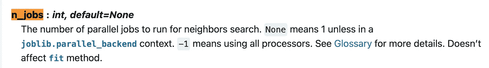
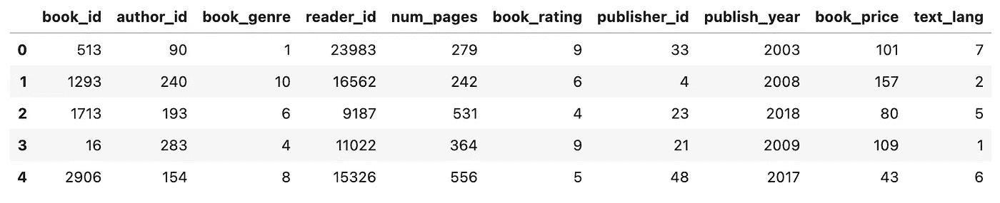
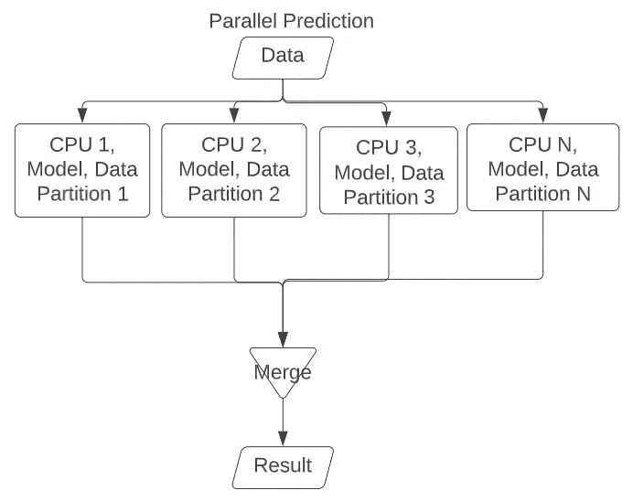
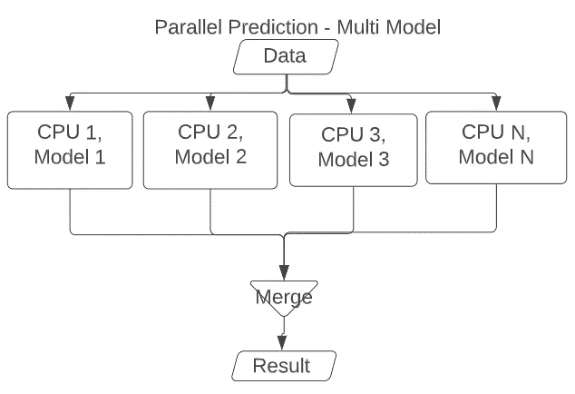

# 并行训练和预测 Sci-Kit 学习模型

> 原文：<https://towardsdatascience.com/train-predict-sci-kit-learn-models-in-parallel-510aee478426>

## 在 Sci-Kit Learn 上并行化您的模型训练和预测


图片由马克·卡吉尔从 [Unsplash](https://unsplash.com/photos/Zg9Jwm86LRw) 拍摄

本文将概述如何在 sci-kit learn 上并行训练和调优某些模型，以优化时间。我还将概述如何并行化这些模型的预测过程。我将介绍如何将数据划分为多个部分，并为每个部分生成预测，以及如何将整个数据集传递到多个模型中。我以前写过一篇关于多重处理以及如何将它用于单参数和多参数函数的文章。你可以在这里阅读它[，因为我们将为这篇文章的内容使用多重处理模块。以下是这篇文章的提纲:](/parallelization-w-multiprocessing-in-python-bd2fc234f516)

## 目录

*   Sci-Kit 学习并行化
*   数据
    -需求
    -生成数据
*   训练模式
    -正常训练
    -平行训练
*   并行模型评估(交叉验证)
    -正常实施
    -并行实施
*   并行模型预测—单一模型
    —架构
    —正常实现
    —并行实现
*   并行模型预测—多模型
    —架构
    —正常实现
    —并行实现
*   结束语
*   资源

# Sci-Kit 学习并行化

大多数机器学习项目有 4 个主要部分，需要大量的计算能力和时间。

1.  模型训练
    -在各种列车测试分段上训练多个 ML 模型
2.  模型的超参数调整
    -调整与模型相关的各种超参数，以最大化模型性能，而不过度拟合原始数据
3.  模型评估
    -通过各种评估方法评估模型，如交叉验证、准确性、分类报告等。
4.  模型预测
    ——为模型生成预测，使得推理时间很短。
    -与机器学习模型相关的推理时间是指模型处理输入数据并生成预测所需的时间。
    -您希望在最小化推理时间的同时最大化模型性能。推理时间短有助于生产环境中的可扩展机器学习。

这 4 个组件对于数据科学管道至关重要，每个组件都扮演着重要角色，并且每个组件都需要大量时间。令人欣慰的是，当通过 sci-kit learn(一个用于模型开发的开源库)进行机器学习建模时，大量的并行化已经内置于您训练的许多常见函数和模型中。sklearn 中函数的`n_jobs`参数指定了运行该函数时要使用的内核数量。

> `n_jobs`是一个整数，指定并发运行的工作线程的最大数量。如果给定 1，则根本不使用 joblib 并行，这对调试很有用。如果设置为-1，则使用所有 CPU。对于低于-1 的`n_jobs`，使用(n _ CPU+1+n _ jobs)。例如使用`n_jobs=-2`，除了一个 CPU 之外，所有的 CPU 都被使用。
> `n_jobs`默认为`None`，表示*未置位*；一般会解释为`n_jobs=1`
> *【1】*[https://scikit-learn.org/stable/glossary.html#term-n-jobs](https://scikit-learn.org/stable/glossary.html#term-n-jobs)

请注意，并非所有的函数和模型都可以使用该参数，这意味着并非 sklearn 模块的所有特性都是并行的。例如，[随机森林](https://scikit-learn.org/stable/modules/generated/sklearn.ensemble.RandomForestClassifier.html#sklearn.ensemble.RandomForestClassifier)和 [K 近邻](https://scikit-learn.org/stable/modules/generated/sklearn.neighbors.KNeighborsClassifier.html)等模型具有 n_jobs 参数，而[弹性网](https://scikit-learn.org/stable/modules/generated/sklearn.linear_model.ElasticNet.html)和[梯度提升](https://scikit-learn.org/stable/modules/generated/sklearn.ensemble.GradientBoostingClassifier.html)等模型则没有。要确定该参数是否可用于您正在使用的 sklearn 中的功能，您可以查阅与该功能相关的文档，并检查`n_jobs`是否在该功能的参数部分。



来自[knighborsclassifier](https://scikit-learn.org/stable/modules/generated/sklearn.neighbors.KNeighborsClassifier.html)的 n_jobs 参数。图片由作者提供。

# 数据

我们将为下面的教程合成数据。我将强调如何生成一些假数据，以常规方式并通过并行化来训练、调整、评估和预测机器学习模型。在本教程中，我们将引用的主要模块是`sklearn`、`multiprocessing`、`pandas`和`numpy`。以下是本教程中必须遵循的版本和要求。如果只是想参考与本教程相关的 Jupyter 笔记本，可以在我的 GitHub [这里](https://github.com/vatsal220/medium_articles/blob/main/parallel/sklearn_parallel.ipynb)找到。

## 要求

```
Python>=3.8.8
pandas>=1.2.4
numpy>=1.20.1
sklearn=0.24.1
```

我们也将依赖于`multiprocessing`、`random`和`itertools`库。不要担心，因为这些库已经预装了 Python。

## 生成数据

上面的函数将随机生成一个与图书相关数据相关的 CSV。数据将用于生成两个模型，一个通常没有并行化，另一个通过并行化。不会对数据进行任何特征工程或预处理，因为本文的范围是强调如何在 sklearn 模型上进行训练和预测。上面的函数应该产生如下所示的样本数据帧:



生成样本书数据。图片由作者提供。

# 培训模型

## 正常训练

梯度推进分类器没有`n_jobs`参数，因此您无法并行化该模型的模型训练过程。

## 平行训练

随机森林分类器有`n_jobs`参数，因此您可以将它指定为您想要使用的内核数量。

# 并行模型评估(交叉验证)

## 正常交叉验证

## 平行交叉验证

# 并行模型预测—单一模型

我们将把传递给模型的输入数据分成多个批次。这些批处理的大小相同，对应于您要用于并行化预测的内核数量。

## **架构**



模型架构，用于将输入数据并行化为多个分区，并将每个分区并行传递给模型。图片由作者提供。

## **正常执行**

## 并行实现

对于并行实现，我们将利用我们在正常实现期间创建的函数，并进行优化，以便使用 numpy 提供的`array_split`函数将 1 个参数分成 n 个分区。

# 并行模型预测—多个模型

现在，我们的目标是将两个单独的模型传递到两个不同的核心中，第一个模型将是我们上面生成的体裁模型，第二个将是语言模型。我们将把相同的数据传递到这些模型中的每一个，并并行地为这两个模型生成预测。

## **架构**



将相同的数据并行传递给多个模型的架构。每个模型将属于它自己的核心。图片由作者提供。

## **正常执行**

我们将从创建`model_data`开始，这是一个包含模型、特性列和目标名称的嵌套列表。我们可以迭代地传递输入数据和相关特征来生成预测。

## 并行实现

我们可以再次利用来自`numpy`的`array_split`函数来分割我们上面创建的`model_data`，并将每个模型数据传递到一个核心中。每个内核本质上都将运行上述正常实现中概述的`multi_prediction`功能。

# 结束语

本文概述了如何通过并行处理将 sci-kit learn 中花费在训练、调整和预测模型上的时间减到最少。sci-kit learn 已经在内部完成了并行训练模型的大部分繁重工作。

我提供了一个深入的教程，展示了并行生成预测的不同方法。概述的一种方法是，当您有多个模型时，您希望将数据传递给每个模型以生成预测。您试图预测的每个模型都将作为独立的进程并行运行。概述的另一种方法是当您有一个大型数据集，您想要更快地生成预测。在这种方法中，您可以将数据集划分为多个较小的段(您应该拥有的最大段数相当于您想要使用的最大内核数)。您可以将每个部分与模型一起传递，以并行生成预测，并将结果合并在一起。

请注意，这在您拥有大量内核和大型数据集时非常有用。当在少量数据上运行该过程时，正常(非并行)实现将在与并行实现相似的时间内运行。与该存储库相关的笔记本运行在少量数据上以提高效率，因为我没有太多可用的内存或内核。但是，您可以轻松地增加生成的数据量，从而增加为训练、评估和预测组件传递的数据量。

另一种优化模型预测时间的方法是通过稀疏矩阵。这个概念超出了本文的范围，但是如果您感兴趣，您可以在这里阅读相关内容。

如果你想了解与本文相关的代码，你可以查看我的 GitHub，我把笔记本[放在这里](https://github.com/vatsal220/medium_articles/blob/main/parallel/sklearn_parallel.ipynb)。

如果你想转型进入数据行业，并希望得到经验丰富的导师的指导和指引，那么你可能想看看最敏锐的头脑。Sharpest Minds 是一个导师平台，导师(他们是经验丰富的实践数据科学家、机器学习工程师、研究科学家、首席技术官等。)将有助于你的发展和学习在数据领域找到一份工作。点击这里查看。

# 资源

*   [1][https://scikit-learn.org/stable/glossary.html#term-n-jobs](https://scikit-learn.org/stable/glossary.html#term-n-jobs)

如果你喜欢读这篇文章，你可能会发现我写的关于数据科学和机器学习的其他文章也很有趣。下面来看看吧。

[](/recommendation-system-matrix-factorization-svd-explained-c9a50d93e488)  [](/link-prediction-recommendation-engines-with-node2vec-c97c429351a8)  [](/recommendation-systems-explained-a42fc60591ed) 