# 用 4 个简单的步骤在 Amazon SageMaker 中训练 XGBoost 模型

> 原文：<https://towardsdatascience.com/train-xgboost-models-in-amazon-sagemaker-in-4-simple-steps-4eb3e104ee61>

## 如何使用 SageMaker 训练和部署 XGBoost 模型作为端点


[拉拉·阿兹利](https://unsplash.com/@lazizli?utm_source=medium&utm_medium=referral)在 [Unsplash](https://unsplash.com?utm_source=medium&utm_medium=referral) 上的照片

开始使用 Amazon SageMaker 可能具有挑战性，因为 AWS 希望您知道许多技巧……反过来，一旦您掌握了这些技巧，您就可以显著加快 ML 模型的部署，而不必担心 Docker 和设置计算资源。

这篇文章的目标是尽可能简化 SageMaker 的入门，并向您快速展示部署 XGBoost 分类器需要什么，就像您在行业设置中通常会做的那样。大多数教程都是对 AWS 文档的直接背诵，如果您想根据实际问题定制模型，这些教程并不太适用。例如，使用样本 [XGBoost 客户流失笔记本](https://sagemaker-examples.readthedocs.io/en/latest/introduction_to_applying_machine_learning/xgboost_customer_churn/xgboost_customer_churn.html)只能预测一个类别的概率，而不能预测单个类别(0 或 1)本身。

## 我们要建造什么

如果你像我一样，想要一只小狗，但由于空间的限制，现在还不能，我们至少可以做一些有它们参与的项目，对吗？让我们构建一个简单的 XGBoost 模型，告诉人们应该根据他们的家有多大来选择小猎犬还是德国牧羊犬。

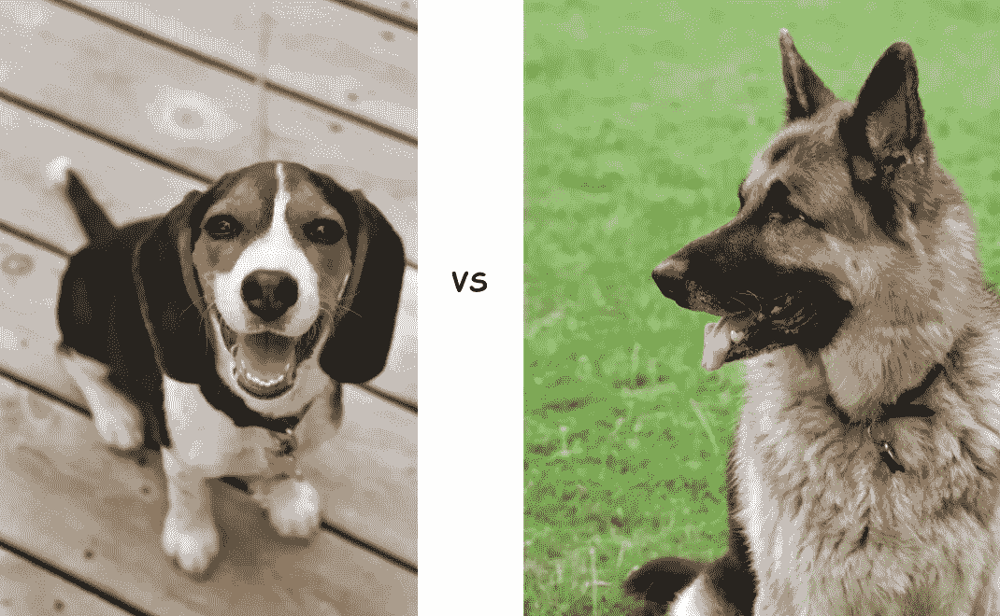

来源:左[1]和右[2]

更具体地说，我们将使用一个虚拟数据集，它由代表**房屋面积**平方英尺的 **X** 变量和为 0(小猎犬)或 1(德国牧羊犬)的 **y** 目标变量组成。为简单起见，我们将 Beagle 设定为最适合小于 500 平方英尺的住宅，将德国牧羊犬设定为最适合大于 500 平方英尺的住宅

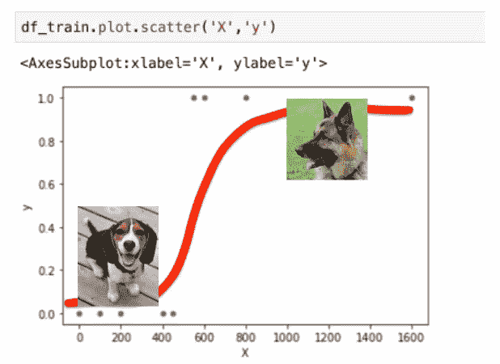

来源:左[1]和右[2]

在我们开始之前，你可能想知道这个 SageMaker 学习要花我多少钱？根据 [AWS 定价页面](https://aws.amazon.com/sagemaker/pricing/?nc=sn&loc=3)，假设您将在美国东部 1 区工作，编写培训脚本需要大约**4 小时**，模型培训需要**0.5 小时**，测试终端需要**1 小时**，那么最终花费将少于 **$1** ！

```
**On-demand Notebook Instance**
(ml.t2.medium): $0.0464/hr * 4hr  = $0.2**Training Instance**
(ml.m4.xlarge): $0.24/hr * 0.5hr  = $0.12**Real-time Inference**
(ml.m4.xlarge): $0.24/hr * 1hr    = $0.24**Total**                               **<$1**
```

另一件有趣的事情是，大多数 SageMaker 教程希望您神奇地知道他们的基础设施是如何建立的。为了减轻这种情况，这里有一个简化版的[一般工作流程](https://docs.aws.amazon.com/sagemaker/latest/dg/how-it-works-training.html)，以及它将如何应用到我们的项目中:

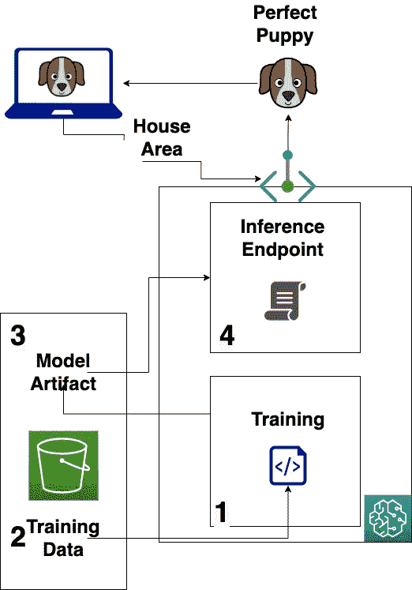

作者图片

## 👉步伐

1.  需要供应笔记本电脑实例
2.  将培训/验证数据存储在 S3 存储桶中
3.  训练和输出 ML 模型工件到 S3 桶
4.  部署和测试 SageMaker 推理端点

## 1.创建 SageMaker (SM) Jupyter 笔记本实例

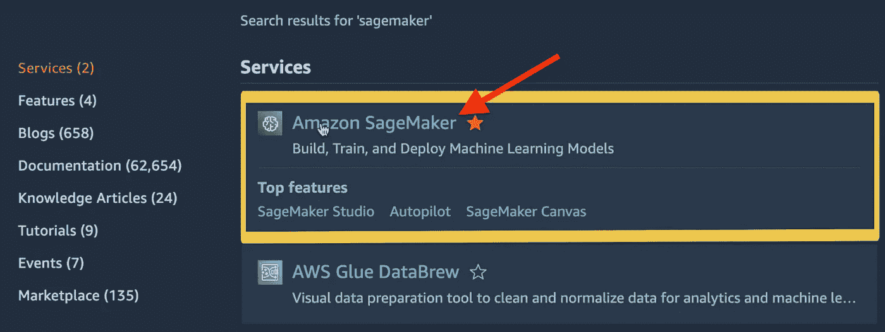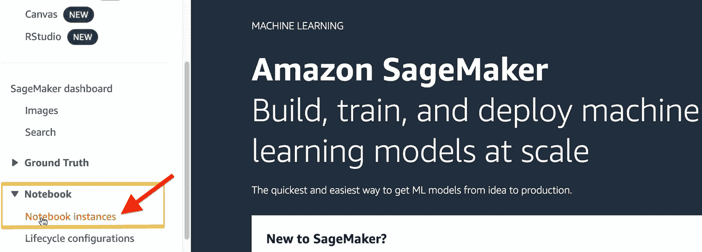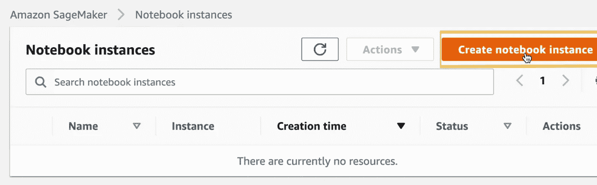

给它起个名字:

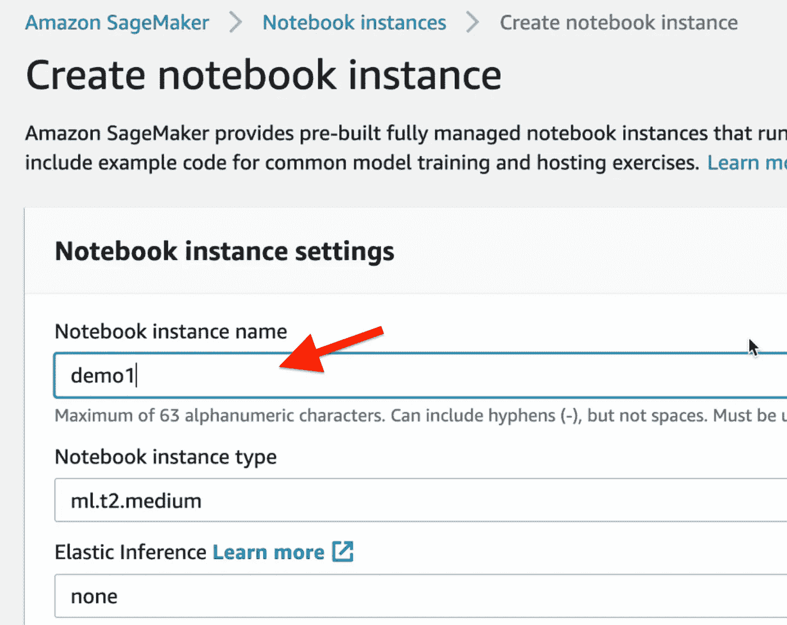

您可以保留默认的 IAM 角色，以允许 SM 访问您的 S3 存储桶:

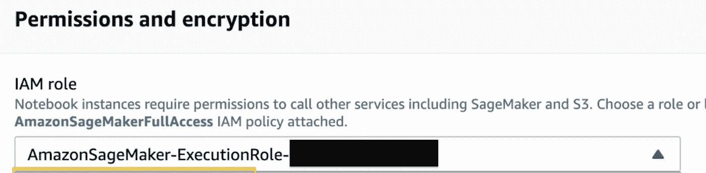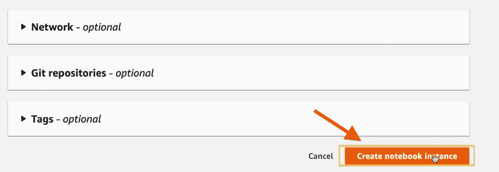

一旦提供了笔记本实例，您就可以启动 Jupyter 实验室并启动一个 **Conda Python 3** 环境。

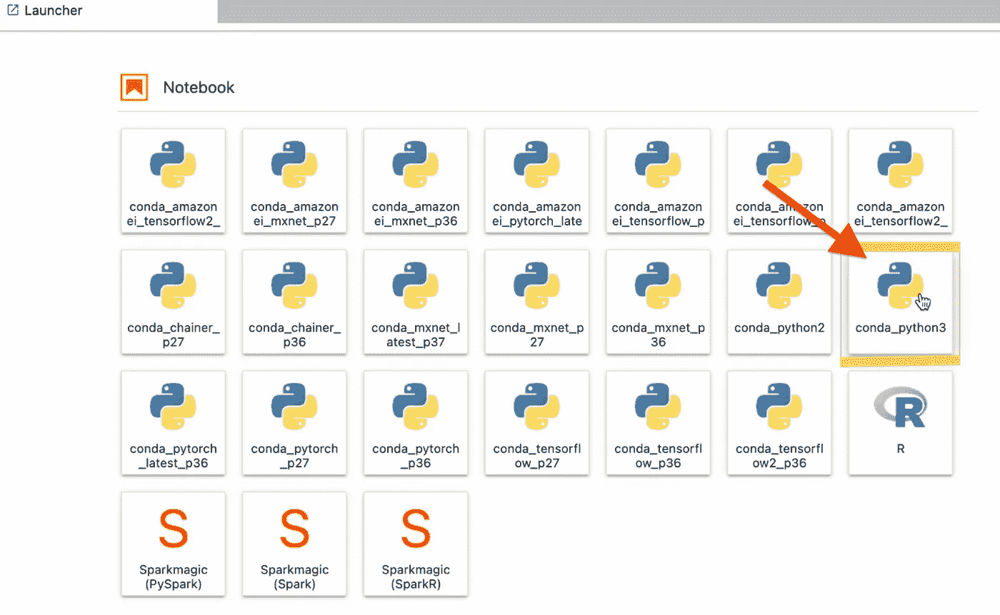

## 旁注(如果生活只有这么简单)

我们通常如何在本地训练 XGBoost

> 然而，这在 SageMaker 中不起作用，因为他们希望我们使用他们自己的估计器类，而不是直接导入 XGBoost 库，并且必须将我们的训练和测试数据集存储在 S3 中，作为 SageMaker 工作流的一部分。但是一定要在笔记本内部运行上面的代码片段来查看输出。

## 2.在 S3 存储数据

对于这一步，我们将重用我们的**df _ train**&**df _ test**(来自上面)并将其存储在默认的 S3 桶中，该桶将与我们的笔记本实例相关联。

让我们转到 S3 存储区，以确保我们的培训和验证数据集已正确存储:

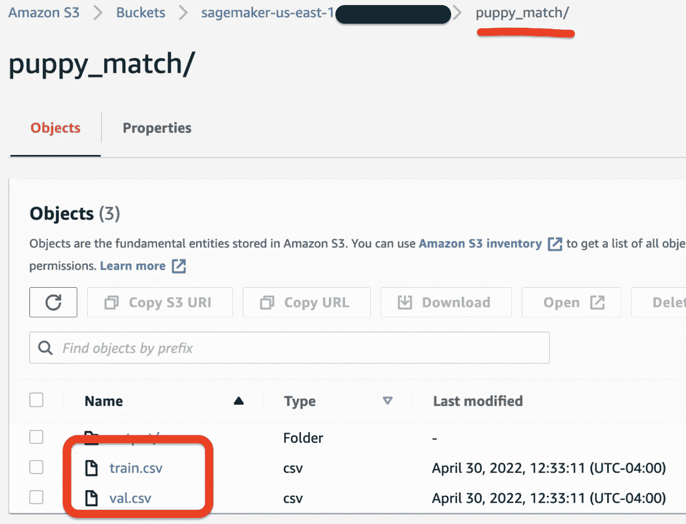

太棒了，数据集已经成功加载到 S3，我们已经为下一步做好了准备。

## 3.训练和存储 ML 模型工件

我们可以检索预配置的 SageMaker 容器，其中包含 XGBoost(而不是直接导入 XGBoost ),并使用 **TrainingInput** 类加载数据集。

在超参数中，我们必须使用目标函数**“multi:soft max”**而不是“binary:logistic”，因为它只产生概率，而不是二进制值本身(0 或 1)。

## 4.部署和测试端点

我们准备将 XGBoost 模型部署为一个端点，然后它可以进行预测。

如果一切顺利，应该会看到这样的输出:

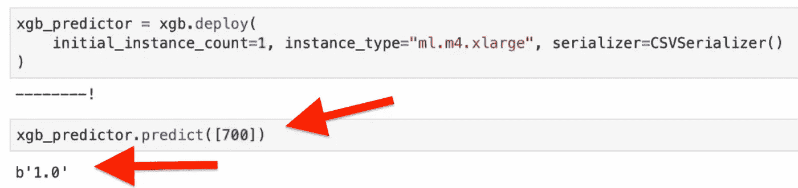

你可以在这里找到完整的 Jupyter 笔记本代码。

## 最后的话

像这样部署 ML 模型是非常好的，但是我们现在如何让互联网上的每个人都能够调用该端点，并找出适合他们特定房子的完美小狗呢？

**简答:**使用 Lambda & API 网关。

如果您想了解更多信息，请阅读我的下一篇文章，我们将详细介绍如何编写 Lambda 函数来处理输入请求(即房屋面积)并使用 API Gateway 创建一个 REST API 来接受来自客户端的请求。

但是如果你只是想测试 SageMaker，请遵循下面的清理步骤。

## **清理以停止产生费用！**

> **1。通过运行**删除已部署的端点

```
xgb_predictor.delete_endpoint()
```

> **2。停止 SageMaker 笔记本实例**

> 感谢您的阅读，如果这篇文章帮助您节省了时间或解决了问题，请务必点击下面的按钮！总是非常感谢。

## 图像来源

[1][https://commons . wikimedia . org/wiki/File:Beagle _ puppy _ cadet . jpg](https://commons.wikimedia.org/wiki/File:Beagle_puppy_Cadet.jpg)

[2][https://pxhere.com/en/photo/1003603](https://pxhere.com/en/photo/1003603)