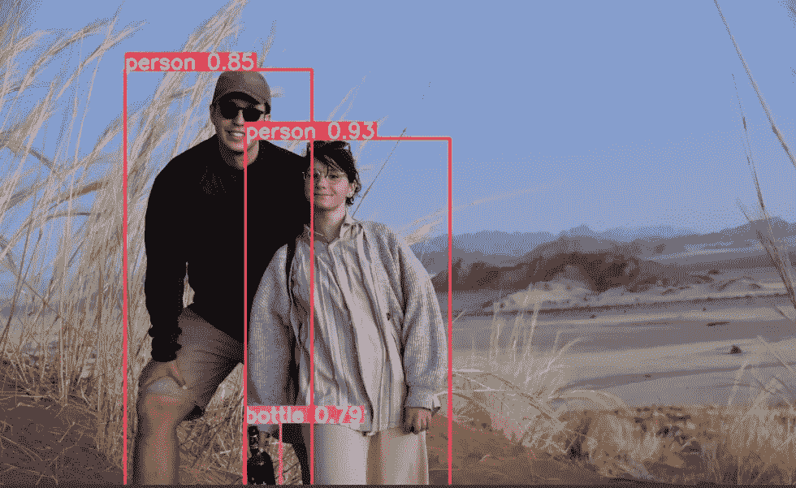
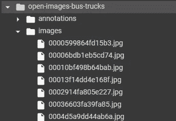
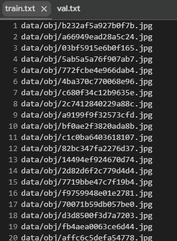
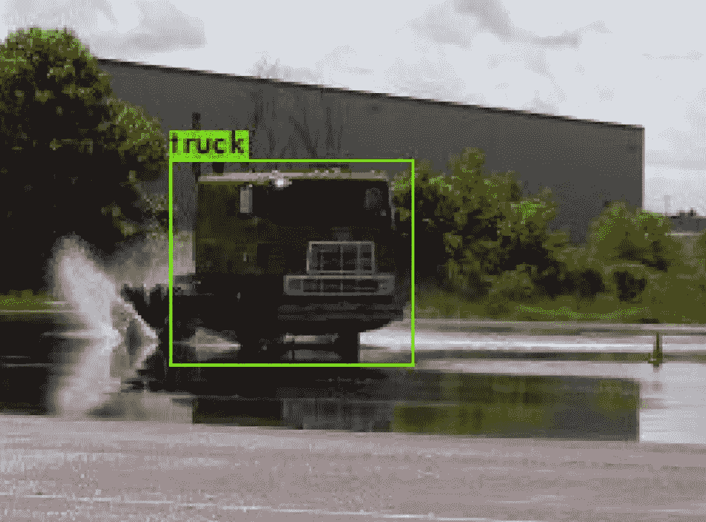

# 使用 Python 训练 YOLO 在自定义数据集上进行对象检测

> 原文：<https://towardsdatascience.com/train-yolo-for-object-detection-on-a-custom-dataset-using-python-e4fe5eb94673>



非洲的野生马赛洛(图片由作者提供)

## 了解 Yolov4 和 Darknet 来训练自定义对象检测器

## 介绍

我最近开始从事计算机视觉领域的工作。在这些早期，我正在研究物体检测的各种算法如何工作。其中最知名的有 **R-CNN** 、**快 R-CNN** 、**快 R-CNN** 当然还有 **YOLO** 。

在本文中，我想重点讨论最后提到的算法。YOLO 是物体探测领域的尖端技术，YOLO 有无数的应用案例。然而，今天我不想告诉你 YOLO 是如何工作的，也不想告诉你它的架构，但是我想简单地向你展示如何启动这个算法，并做出你的预测。此外，我们还将了解如何在自定义数据集上对其进行**训练，从而使其适应您的数据。如果你也想看我写的一篇关于 YOLO 内部运作的文章，请跟我来，因为我打算在未来几天内写这篇文章。**

## 黑暗网络

我不认为有比你在他们的网站上找到的定义更好的方式来描述 Darknet。

> Darknet 是用 C 和 CUDA 编写的开源神经网络框架。速度快，安装方便，支持 CPU 和 GPU
> 计算。你可以在 GitHub 上找到源代码，或者你可以在这里阅读更多关于 Darknet 可以做什么的内容。

所以我们要做的就是学习如何使用这个开源项目。

你可以在 github 上找到暗网代码。看一看它，因为我们将使用它在我们的自定义数据集上训练 YOLO。

## 克隆暗网

我将在下面这篇文章中展示的代码是要在 Colab 上运行的，因为我没有带 GPU 当然你也可以在笔记本上重复这段代码。偶尔会改变的是路径。

所以首先我们去克隆 darknet GitHub 库。如果我们使用 ***%%bash*** *命令，Colab 允许我们编写 bash 命令。*

```
%%bash
git clone https://github.com/AlexeyAB/darknet
```

一旦你克隆了 repo，你会在你的工作目录中看到很多文件，放松，它看起来比实际上更复杂。
现在我们需要**重新配置 makefile** 。不知道 makefile 是什么？简而言之，它是一个使你的代码编译变得容易的文件。

如果你曾经用 C 语言编写过代码，你会知道实际的做法是写一个文件 *file.c* ，然后你用一个命令来编译它，比如 *g++ etc…*
这个命令用来编译在大型项目中可能会很长，因为它必须考虑依赖关系等等。

因此，每次通过重写 *g++ etc…*
进行编译都会非常费力，然后我们要做的是创建一个 makefile，其中已经包含了这个写好的命令，我们要做的就是**启动 makefile 来编译代码**。
**makefile 通常包含用户可以根据需要设置的配置变量**。

也就是说，我们要做的是设置一些在暗网 makefile 中找到的变量。
因此，请确保您有可用的 GPU，并运行以下单元。

```
%%bash
cd darknet
sed -i 's/OPENCV=0/OPENCV=1/' Makefile
# In case you dont have a GPU, make sure to comment out the
# below 3 lines
sed -i 's/GPU=0/GPU=1/' Makefile
sed -i 's/CUDNN=0/CUDNN=1/' Makefile
sed -i 's/CUDNN_HALF=0/CUDNN_HALF=1/' Makefile
```

在这个单元中，例如第一行中的命令 *sed -i* 允许您将 OPENCV 变量从 0 更改为 1。

我们在前一个单元格中设置的设置允许我们在 GPU 而不是 CPU 上启动 YOLO。
现在我们将使用 make 命令启动 makefile。

```
%%bash
#compile darkent source code
cd darknet
```

现在我们安装了一个库，它将在 YOLO 探测到的物体周围绘制边界框。

```
%%capture
!pip install -q torch_snippets
```

## 下载数据集

我将使用包含卡车和公共汽车图像的对象检测数据集。Kaggle 上有很多物体检测数据集，你可以从那里下载一个。

如果你不知道如何直接从 Colab 下载 Kaggle 数据集，你可以去看看我以前的一些文章。

所以我下载并解压数据集。

```
!wget - quiet link_to_dataset
!tar -xf open-images-bus-trucks.tar.xz
!rm open-images-bus-trucks.tar.xz
```

下图描述了下载的数据集的结构。



作者图片

## 下载 YOLO

显然，你不必从头开始做 YOLO 训练，而是直接从网上下载重量。
使用以下命令从 **YOLO4** 下载权重。

```
!wget - quiet https://github.com/AlexeyAB/darknet/releases/download/darknet_yolo_v3_optimal/yolov4.weights
```

要查看一切是否正常，请运行以下命令。

```
%%bash
#I had to use the flag -dont_show cause wasnt working. Try to run wiithout it
cd darknet
./darknet detector test cfg/coco.data cfg/yolov4.cfg ../yolov4.weights data/person.jpg -dont_show
```

在这个命令中，我们刚刚运行了

*   我们指定我们想要 YOLO4: *cfg/yolov4.cfg* 的配置
*   我们指定使用刚刚下载的权重:*../yolov4.weights*
*   我们将对克隆了回购协议后获得的 coco 数据集进行预测: *cfg/coco.data*
*   而我们做的预测如下图: *data/person.jpg*

## 准备数据集

YOLO 希望找到正确设置的某些文件和文件夹，以便在您的自定义数据集上进行训练。
首先，你需要在 *darknet/data/obj.names* 路径中打开你写标签的文件。
在 Colab 中，我们可以使用**魔法命令**通过单元格直接写入文件。magic 命令下的所有东西都会被复制
到指定的文件中。

```
%%writefile darknet/data/obj.names
bus
truck
```

现在我们需要修改另一个文件来告诉 YOLO 需要多少个类，在哪里可以找到训练和
验证的路径，以及在哪里可以找到带有标签名称的文件。我们可以简单地使用 magic 命令和下面几行代码来完成。

```
%%writefile darknet/data/obj.data
classes = 2
train = darknet/data/train.txt
valid = darknet/data/val.txt
names = darknet/data/obj.names
backup = backup/
```

所以为了理解它，你的 train txt 文件应该看起来像你在下图中看到的那样(类似于验证)。



其中每行指示在哪里找到训练图像。

但是我们指定的文件仍然是空的。因此，我们将下载的数据集文件夹中的数据复制到 Darknet 中的默认文件夹中。

```
!mkdir -p darknet/data/obj
!cp -r open-images-bus-trucks/images/* darknet/data/obj/
!cp -r open-images-bus-trucks/yolo_labels/all/{train,val}.txt darknet/data/
!cp -r open-images-bus-trucks/yolo_labels/all/labels/*.txt darknet/data/obj/
#add prefix 'darkent/' in front of each row in darkent/data/train.txt
!sed -i -e 's/^/darknet\//' darknet/data/train.txt
!sed -i -e 's/^/darknet\//' darknet/data/val.txt
```

就像我们之前下载 YOLO 的权重一样。这次我们拿 ***yolov4-tiny*** 比之前的快。
然后我们将权重复制到 Darknet 中适当的文件夹。

```
!wget - quiet https://github.com/AlexeyAB/darknet/releases/download/darknet_yolo_v4_pre/yolov4-tiny.conv.29
!cp yolov4-tiny.conv.29 darknet/build/darknet/x64/
```

现在让我们重命名负责配置 *yolov4 tiny* 架构的配置文件。
之后，我们将编辑一些参数来设置批次数量、类别数量和其他参数。

```
%%bash
cd darknet
# create a copy of existing configuration and modify it in place
cp cfg/yolov4-tiny-custom.cfg cfg/yolov4-tiny-bus-trucks.cfg
# max_batches to 4000 (since the dataset is small enough)
sed -i 's/max_batches = 500200/max_batches=4000/' cfg/yolov4-tiny-bus-trucks.cfg
# number of sub-batches per batch
sed -i 's/subdivisions=1/subdivisions=16/' cfg/yolov4-tiny-bus-trucks.cfg
# number of batches after which learning rate is decayed
sed -i 's/steps=400000,450000/steps=3200,3600/' cfg/yolov4-tiny-bus-trucks.cfg
# number of classes is 2 as opposed to 80
# (which is the number of COCO classes)
sed -i 's/classes=80/classes=2/g' cfg/yolov4-tiny-bus-trucks.cfg
# in the classification and regression heads,
# change number of output convolution filters
# from 255 -> 21 and 57 -> 33, since we have fewer classes
# we don't need as many filters
sed -i 's/filters=255/filters=21/g' cfg/yolov4-tiny-bus-trucks.cfg
sed -i 's/filters=57/filters=33/g' cfg/yolov4-tiny-bus-trucks.cfg
```

## 训练模型！

现在我们准备好了，剩下的就是启动模型火车了

```
!./darknet/darknet detector train darknet/data/obj.data ./darknet/cfg/yolov4-tiny-bus-trucks.cfg yolov4-tiny.conv.29 -dont_show -mapLastAt
```

对我来说，这个训练花了大约一个小时。
现在你可以在你的图像上运行预测来得到类和边界框。

```
from torch_snippets import Glob, stem, show, read
# upload your own images to a folder
image_paths = Glob('images-of-trucks-and-busses')
for f in image_paths:
 !./darknet detector test \
 data/obj.data cfg/yolov4-tiny-bus-trucks.cfg\
 backup/yolov4-tiny-bus-trucks_4000.weights {f}
 !mv predictions.jpg {stem(f)}_pred.jpg
for i in Glob('*_pred.jpg'):
 show(read(i, 1), sz=20)
```



# 最后的想法

正如我们所见，使用 YOLO 并不复杂。我们可以克隆一些高效的实现，并将其用于我们的用例。就我而言，我只是用它来对我今年夏天去非洲旅行时拍的一些照片进行预测，以此取乐。😁

我还没有详细介绍这个算法是如何工作的，因为我想在以后的文章中使用自顶向下的方法来详细介绍。所以我希望你现在也能像我一样使用 YOLO 和玩它！

# 结束了

*马赛洛·波利蒂*

[Linkedin](https://www.linkedin.com/in/marcello-politi/) ， [Twitter](https://twitter.com/_March08_) ， [CV](https://march-08.github.io/digital-cv/)