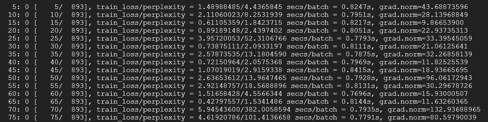
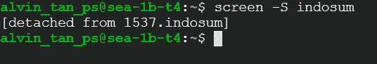
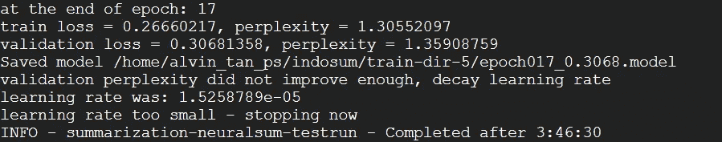

# 用 Linux 屏幕在远程终端上通宵训练你的模型

> 原文：<https://towardsdatascience.com/train-your-model-overnight-on-remote-terminal-with-linux-screen-7fd68d812717>

## 简单的 Linux 命令，继续在后台进行深度学习训练


图片由 [Huper](https://unsplash.com/@huper) 在 [Unsplash](https://unsplash.com/)

> 在本教程中，我将介绍一种在 Linux 终端上进行模型训练的方法，这将非常方便，尤其是当你需要通宵训练的时候。

*另外，这个简短的教程假设读者了解简单的 Linux 命令，比如目录导航和文件复制。*

接触机器学习有一段时间了，我对训练预测模型并不陌生。众所周知，有些模型需要很长的处理时间。特别是在深度学习中，预处理和训练神经网络模型有时需要几个小时，甚至几天才能执行。这通常是由于两个主要原因:

1.  大量数据需要处理(大数据)
2.  复杂的神经架构(例如变压器)

在本地机器上训练一个大模型可能很麻烦，因为这意味着除了消耗宝贵的计算资源之外，你可能还得让机器通宵开机。幸运的是，可以在私有服务器甚至云服务器上的远程 Linux 终端上训练您的模型，并保持训练过程在后台运行，即使在注销后也是如此。

# 1.远程服务器连接和文件传输

要从本地机器终端访问远程服务器 Linux 终端，请键入以下命令:

```
$ ssh remote_username@remote_IP_address
```

此外，当您想要退出 SSH 会话并返回到本地机器终端时，只需键入:

```
$ exit
```

远程私有服务器或云服务器本身是一台全新的机器。有时你需要安装不同的依赖和软件包，或者设置新的 python 虚拟环境，或者安装 Nvidia 驱动程序，如果你需要 GPU 来训练你的模型等等。完成所有这些工作后，就可以将数据集和代码从本地机器移植到远程服务器了。导航到本地机器终端上的数据集/代码目录。有两种方法可以转移。第一种方法是递归传输所有文件(一个接一个):

```
$ scp -r local_folder username@IP_address:/path/to/remote/folder
```

然而，这可能需要很长时间，尤其是如果有很多文件。在第二种方法中，我们可以先将本地文件夹压缩成 tar.gz 文件:

```
$ tar -czvf name-of-archive.tar.gz local_folder
```

然后通过 scp 将 tar.gz 文件传输到远程服务器，不使用-r 标记:

```
$ scp archive.tar.gz username@IP_address:/path/to/remote/folder
```

最后，导航到远程服务器上包含 tar.gz 文件的目录，并将其解压缩:

```
tar -xzvf archive.tar.gz
```

现在，我们准备开始在远程服务器终端上执行 python 脚本进行训练！

# 2.使用 Linux 屏幕进行背景培训

> Screen 或 GNU Screen 是一个终端多路复用器。换句话说，这意味着您可以启动一个屏幕会话，然后在该会话中打开任意数量的窗口(虚拟终端)。当窗口不可见时，在屏幕中运行的进程将继续运行，即使您断开连接。
> 
> —[https://linuxize.com/post/how-to-use-linux-screen/](https://linuxize.com/post/how-to-use-linux-screen/)

在终端上，您可以通过键入以下命令来启动屏幕会话。请注意,“会话名称”是您附加到屏幕会话的标签。

```
$ screen -S session_name
```

在该命令之后，终端上的屏幕会话将立即开始，就像您已经启动了一个新的终端一样。然后，您可以导航到模型目录以执行 python 命令来运行模型脚本:

```
$ python model.py
```



在屏幕会话中开始 NLP 深度学习模型的培训。图片作者。

现在，想象一下训练需要很长时间，你希望关掉电脑去睡觉。关闭终端意味着终止 SSH，模型训练也将终止。要让屏幕会话在后台运行，您应该在键盘上键入以下内容:

`Ctrl+a+d`



在屏幕会话期间键入 Ctrl+a+d 后的终端输出。图片作者。

该命令有效地分离屏幕会话，并将终端返回到原始状态。此时，您可以退出 SSH 会话，甚至关闭终端，您的 python 程序仍将在远程服务器的屏幕会话*中继续执行。*

几个小时后，您打开本地机器并通过 SSH 连接到远程服务器。要恢复屏幕会话并检索模型训练结果，只需应用以下命令即可:

```
$ screen -r session_name
```



恢复屏幕会话后，NLP 深度学习模型的培训已完成。图片作者。

# 3.最后的想法

就是这样！在远程终端训练一个模型就是这么简单！希望这篇教程对你有用。我知道一些崭露头角的数据科学家更熟悉 Jupyter 笔记本上的培训。但随着经验的积累，你可能会想要建立大型深度学习模型并将其生产出来。因此，有必要住在终点站。关闭 SSH 后，在远程机器上的背景中训练模型的这种做法带来了额外的好处。要了解更多关于 screen 命令的其他用法，您可以查看:

[](https://aditya-kumar130901.medium.com/linux-screen-work-from-home-made-easy-e83fa8575f2d) [## Linux 屏幕|让在家工作变得简单

### 什么是屏幕？

aditya-kumar130901.medium.com](https://aditya-kumar130901.medium.com/linux-screen-work-from-home-made-easy-e83fa8575f2d) [](/a-short-tutorial-on-screen-command-47d70020aa5a) [## 屏幕命令的简短教程

### 快速入门教程

towardsdatascience.com](/a-short-tutorial-on-screen-command-47d70020aa5a) 

如果您对 Linux 终端、bash shell 和其他命令不熟悉，请订阅我的邮件列表，及时阅读我的文章。

> *感谢阅读！如果您喜欢这些内容，请在*[](https://tanpengshi.medium.com/)**上阅读我的其他文章，并在*[*LinkedIn*](https://www.linkedin.com/in/tanpengshi/)*上关注我。**
> 
> ****支持我！*** —如果你*没有*订阅 Medium，并且喜欢我的内容，请考虑通过我的[推荐链接](https://tanpengshi.medium.com/membership)加入 Medium 来支持我。*

*[](https://tanpengshi.medium.com/membership) [## 加入我的介绍链接媒体-谭师鹏阿尔文

### 阅读谭·师鹏·阿尔文(以及媒体上成千上万其他作家)的每一个故事。您的会员费直接…

tanpengshi.medium.com](https://tanpengshi.medium.com/membership)*