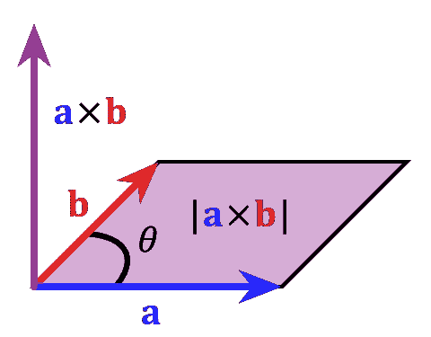
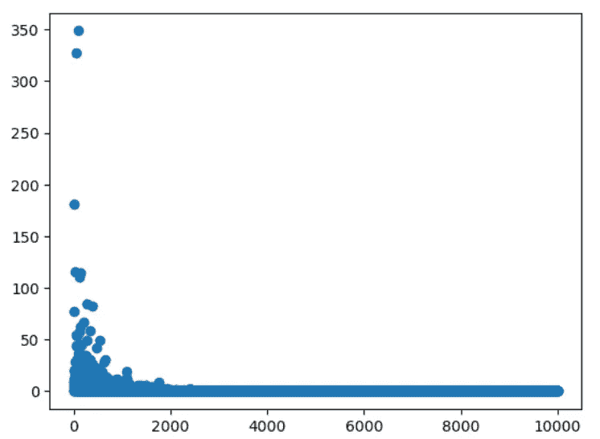

# 为计算叉积的模型定型

> 原文：<https://towardsdatascience.com/training-a-model-to-compute-cross-product-8c9390541fc9>

## 如何使用 PyTorch 训练模型来计算叉积


照片由[马特·里姆斯](https://unsplash.com/@mattreamesfilm?utm_source=medium&utm_medium=referral)在 [Unsplash](https://unsplash.com?utm_source=medium&utm_medium=referral) 上拍摄

有很多关于使用 PyTorch 训练神经网络的教程。为此，我们在此提交一篇关于训练一个非神经网络模型的文章，重点是探索 PyTorch 的“pythonic 式”方面。

这里的任务是训练一个模型来计算两个三维向量的叉积。虽然点积和矩阵乘法在深度学习中被广泛使用，但叉积并不常见。下图展示了这个概念。



来源:[https://www . khanacademy . org/math/multivariable-calculus/thinking-about-multivariable-function/x786f 2022:vectors-and-matrix/a/cross-products-MVC](https://www.khanacademy.org/math/multivariable-calculus/thinking-about-multivariable-function/x786f2022:vectors-and-matrices/a/cross-products-mvc)

我更喜欢用张量形式定义叉积:

这里ϵ是李维-西维塔张量。我们在这里使用指数符号或简化的爱因斯坦符号，这意味着对于重复的指数求和是隐含的。

这是我们模型的基础，张量ϵ是模型的一个可训练参数，我们期望它与 Levi-Civita 张量相匹配。

# 监督学习

首先，我们将使用监督学习方法。我们将运行提供两个随机向量的模型，然后将预测与预期叉积进行比较。



损失与步数的关系

```
4.906782535840648e-09print(ep)Parameter containing:
tensor([[[ 1.0955e-05,  2.9630e-05, -3.7728e-05],
         [ 1.4276e-05,  8.8082e-05,  9.9998e-01],
         [-9.9078e-06, -1.0000e+00,  1.8971e-05]], [[ 8.3094e-06,  1.7124e-06, -9.9999e-01],
         [ 2.7287e-05, -1.4629e-05, -1.5764e-05],
         [ 9.9996e-01, -3.1703e-05, -3.2365e-06]], [[ 2.5212e-05,  9.9996e-01,  2.0671e-05],
         [-9.9997e-01, -3.3963e-05,  1.0797e-05],
         [-3.0542e-05,  3.7616e-05, -6.0207e-05]]], requires_grad=True)
```

我们来讨论一下上面的代码:

1.  在我们的例子中，模型是一个具有形状`(3,3,3)`的参数`ep`。它被初始化为随机值，但是我们期望它收敛到 Levi-Civita 张量。
2.  我们不批量处理向量，因此我们只迭代步骤，不迭代时期。这也意味着没有一个张量有批量维度，这当然更容易理解。
3.  函数`torch.einsum()`是我在深度学习中最喜欢的工具之一。我已经提到了索引，或爱因斯坦符号。`einsum`代表爱因斯坦和。它象征性地显示了张量乘法是如何工作的，求和是通过哪些索引发生的，以及结果的预期维数是多少。我喜欢它，因为当我处理多维张量时，我不必担心转置或置换，我可以清楚地看到求和是如何完成的。
4.  这里的损失是预测值和实际叉积之差。如你所见，训练快速收敛，并且训练的结果张量`ep`非常接近 Levi-Civita 符号。

# 使用叉积的属性为模型定型

在上一节中，我们使用监督学习来学习 Levi-Civita 张量和三维向量的叉积。对我来说，这感觉像是欺骗。我们是否可以根据一些一般原则，而不是通过比较预测值和期望值，来推导叉积？

我们将训练我们的模型来满足这些标准:

1.  叉积运算是反对称的，即

2.它是标准化的，也就是

都等于一。

3.叉积与两项正交，即点积为零:

这些标准仍然不足以保证我们正确地学习叉积函数，因为我们有可能学习负叉积函数。换句话说，这个模型会产生ϵ或者−ϵ

```
1.2659466847253498e-05epParameter containing:
tensor([[[-1.5880e-05,  4.7683e-05,  5.3528e-05],
         [-4.6085e-07,  4.7272e-05, -9.9767e-01],
         [-2.9965e-05,  9.9688e-01, -4.0021e-05]], [[-4.0523e-05,  1.7235e-05,  9.9770e-01],
         [-3.0135e-07, -1.1027e-05, -6.7566e-05],
         [-9.9676e-01,  1.5644e-05,  5.9592e-05]], [[-7.9570e-06, -9.9768e-01, -1.1900e-05],
         [ 9.9689e-01, -4.3567e-05, -3.2372e-05],
         [-7.1624e-06,  3.8180e-05,  6.8536e-05]]], requires_grad=True)
```

代码块几乎完全相同，但损失的计算方式不同。损失的第一部分不利于学习的操作不是反对称的情况。

为了计算损失的第二部分，我们计算单位矢量上的张量运算。对于叉积，我们期望单位向量的叉积长度为 1。我们计算三个张量运算 **e1** 和 **e2** 、 **e1** 和 **e3** 、 **e2** 和 **e3** ，并试图使它们的长度为 1，因为它应该用于叉积。

对于损失的第三部分，我们取预测和向量 **a** 和 **b** 的点积，并惩罚非零结果。让我们回顾一下结果:

```
tensor([ -5.2354,  88.7160, -26.9144], grad_fn=<ViewBackward0>)
tensor([  5.2500, -89.0000,  27.0000])
```

我们可以看到，我们确实学习了负叉积。实际上，叉积的符号是约定俗成的，即 **e1** 和 **e2** 的叉积是 **e3** 而不是 **-e3** 。我邀请读者修正损失函数，以便它更喜欢叉积的正确符号。

# 结论

您可能注意到了，这段代码看起来多么“pythonic 化”。我们不需要创建一个计算损耗的函数(尽管这可能是一个好主意)或者一个自定义层(对于更复杂的模型我们应该这样做)。我们甚至不需要创建一个模型类，因为我们唯一需要训练的是一个单一的参数。

虽然本教程非常简单，但它有很多改进的机会。例如，我们可以考虑三维以上向量空间的叉积，创建一个模块，甚至一个封装功能的层类。这里用到的所有代码都可以在 [my github repo](https://github.com/mlarionov/cross_product/blob/main/cross_product.ipynb) 上找到。