# 手动训练神经网络

> 原文：<https://towardsdatascience.com/training-a-neural-network-by-hand-1bcac4d82a6e>

## 神经网络背后的数学导论

网络图片——作者[克林特·王茂林](https://unsplash.com/@clintadair)

## 介绍

在本文中，我们将讨论训练一个解决回归问题的简单神经网络背后的数学原理。我们将使用输入变量 x 来预测输出变量 y。我们将手动训练两个模型，然后使用 Python 训练最终模型。

在开始之前，最好了解一点多元微积分、线性代数和线性回归，以便完全理解本文中解释的数学过程。如果没有，我会考虑探索[可汗学院](https://www.khanacademy.org/)，因为他们在这些主题上有一些很棒的课程。

让我们首先定义一些数据点来训练模型。

# 1.超级简单神经网络

第一个神经网络将具有带有单个节点的输入层和带有单个节点的输出层。输出层将具有线性激活函数。这是你能得到的最简单的神经网络，但是从这个模型开始会使数学变得非常直观。我们将从初始化模型开始，权重为 0.5，偏差为 0。

初始化模型参数最简单的方法是用 0 到 1 之间的值随机化权重，并用 0 初始化偏差值。设置起始参数的其他方法包括 He 初始化和 Xavier 初始化，旨在减轻爆炸/消失梯度并加速收敛，但这些超出了本文的范围。

## 前进传球

第一步是通过模型传递我们的输入变量来衡量它的表现。这叫做向前传球。

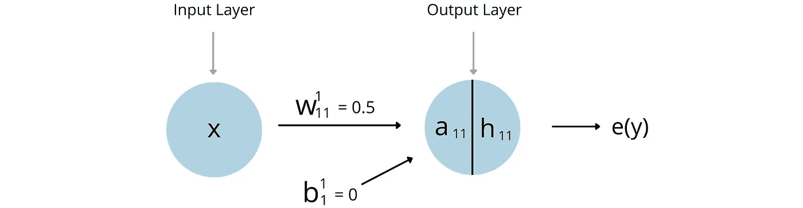

简单神经网络初始参数—作者

在上图中，a(x)是该节点输入的线性组合，h(x)是转换 a(x)的激活函数。当我们使用线性激活函数时，输入的线性组合不会改变。

整个正向传递由以下函数表示。这可能看起来很熟悉，因为这是一条直线的方程。

因此，通过插入每个数据点，我们可以求解方程来获得我们的初始模型预测。

然后，我们使用一个误差函数来确定我们的预测有多好。在这种情况下，我们将使用 1/2 * MSE(均方误差)。我们乘以因子 1/2 的原因是，它减少了我们在反向传播期间计算的链式偏导数中的系数数量。如果这没有意义，不要担心，我将在文章的后面解释它。1/2 * MSE 的公式和计算如下所示。

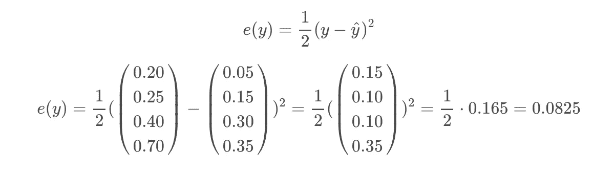

然后，我们可以使用 matplotlib 可视化初始预测。在下图中，蓝色点是真实标注，橙色点是预测标注。蓝线显示了神经网络如何对 0-1 之间的其他 x 值进行分类。重要的是要注意，这条线有一个恒定的斜率，这是预期的，因为模型方程正是直线方程。

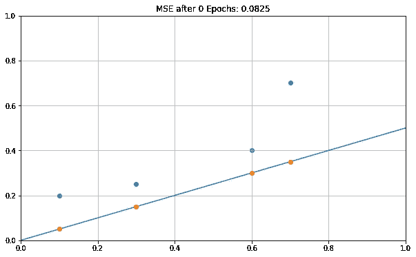

简单神经网络初始预测-作者

## 反向传播

看着上面的图表，你可能会想，你可以选择一个 y 轴截距和斜率来进行更好的预测。你可能是对的。在这一节中，我们将使用反向传播向正确的方向迈出一步。

在反向传播期间，我们对模型中的每个权重和偏差取误差函数的偏导数。误差函数在其方程中不包含任何权重或偏差，因此我们使用链式法则来实现。这样做的结果是每个参数应该被调整的方向和幅度，以最小化误差函数。这个概念叫做梯度下降。

## 重量的链式导数

让我们从计算误差相对于重量值的偏导数开始。我喜欢大声读出链式偏导数，因为它使过程更容易理解。例如，在下面的链式导数中，我们取“误差函数相对于激活函数 h11 的偏导数，然后我们取激活函数 h11 相对于线性组合 a11 的偏导数，然后我们取线性组合 a11 相对于权重 w11 的偏导数。”

我们将计算的第一偏导数是误差函数相对于激活函数 h11 的偏导数。这就是我们看到使用 1/2 * MSE 的好处的地方。通过乘以因子 1/2，我们在所得的偏导数中消除了所有系数(除了 1)。

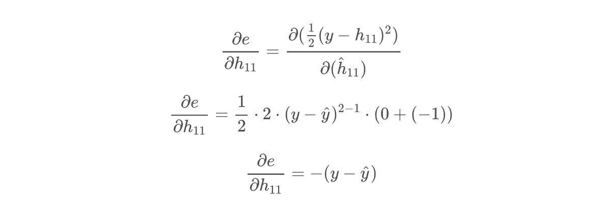

接下来，我们取激活函数 h11 相对于线性组合 a11 的偏导数。由于激活是线性的，这实质上是一个函数对自身的偏导数，也就是 1。

最后，我们求线性组合 a11 相对于权重 w11 的偏导数。

把所有这些放在一起，我们得到下面的等式。我们可以通过这个等式传递所有点，并取平均值来确定我们应该如何改变 w11 参数以最小化误差函数。这被称为批量梯度下降。如果我们使用数据点的子集，这将被称为小批量梯度下降。

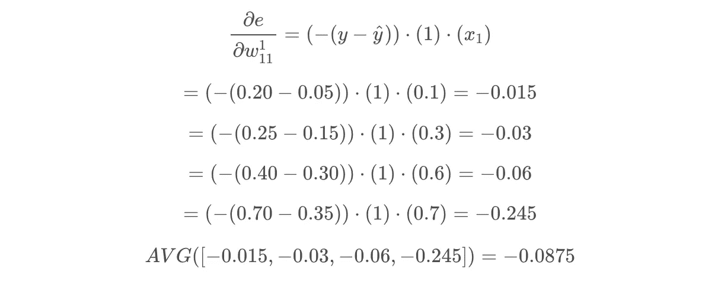

## 偏差的链式导数

我们还没做完偏导数呢！我们还必须调整偏差值。除了链中的最终导数之外，该参数以与重量非常相似的方式更新。谢天谢地，在上一节中，我们已经计算了除一个导数以外的所有导数。

偏差项的链式导数如下所示。注意它和重量的链式导数是多么的相似。

我们需要计算的唯一偏导数是线性组合 a11 相对于偏差 b11 的偏导数。

将所有这些放在一起，我们可以求解每个数据点的方程，并获得我们应该对 b11 做出的平均变化。

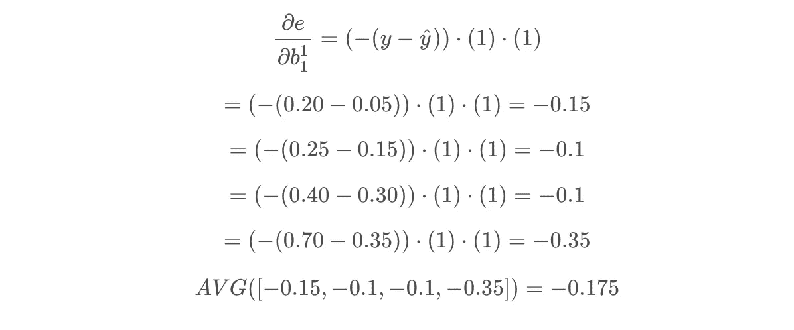

## 更新重量

现在我们已经计算了重量的偏导数，我们可以更新它的值。权重变化的幅度取决于一个称为学习率的参数。如果学习率太低，达到最佳模型参数将需要大量的历元。如果学习率太高，我们会不断超调最佳参数组合。在本文中，我们将使用学习率 1。学习率通常在 0-1 的范围内。

更新每个权重的公式如下。注意，学习率由α表示。

## **更新偏差**

然后我们可以对偏差做同样的处理。用于更新它的公式本质上与用于权重的公式相同，变化的幅度也取决于学习速率。

## 又一次向前传球

现在我们已经更新了网络的权重和偏差，它应该可以做出更好的预测。

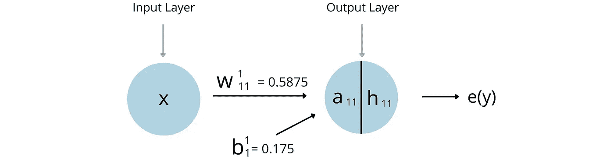

简单神经网络更新参数—按作者

让我们执行另一个向前传递来确认这种情况。

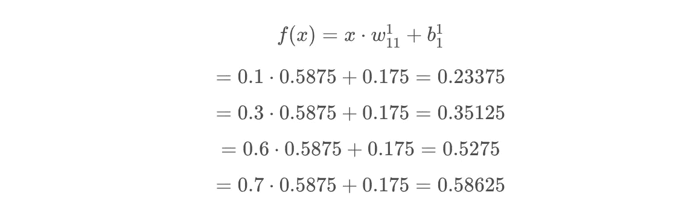

然后我们用 1/2 * MSE 来评估预测有多好。

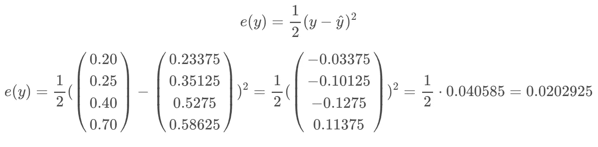

哇！我们能够在一个时期内将误差函数从大约 0.08 改善到大约 0.02。理论上，我们会不断更新权重和偏差，直到我们停止改进误差函数。在现实世界中还有其他需要考虑的事情，例如过度拟合训练数据和使用验证集，但我们现在将跳过这一点。让我们想象 1 个纪元后的预测。

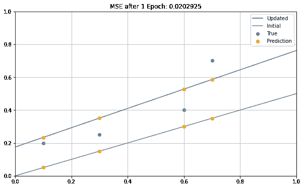

简单神经网络更新预测-作者

我之前简单提到过这个模型是一个简单的线性回归模型。这是因为我们使用了线性激活函数、单输入和单输出节点。如果我们将输入节点的数量增加到 x 的递增幂，我们可以建立任何程度的线性回归模型。这很酷，如果你已经理解了线性回归模型，这是一个过渡到神经网络的好方法。

# 2.稍微复杂一点的神经网络

在本节中，我们将拟合一个具有两个输入节点(x 和 x)和一个输出节点的神经网络。虽然仍然是一个简单的网络，这个模型将显示如何使用神经网络创建一个二阶线性回归模型。

SMC 神经网络初始参数—作者

## 前进传球

在这个网络中，向前传球的公式比前一个模型稍微复杂一些。

使用我们的训练数据，我们可以解决每个数据点的方程。x1 就是 x，x2 是 x 的平方。

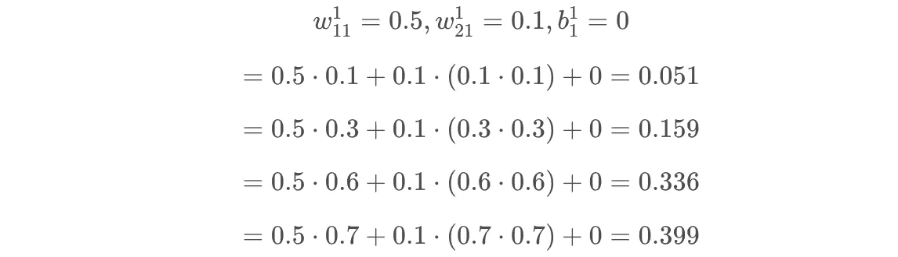

然后，正如我们对之前的模型所做的那样，我们用误差函数(1/2 * MSE)评估预测。

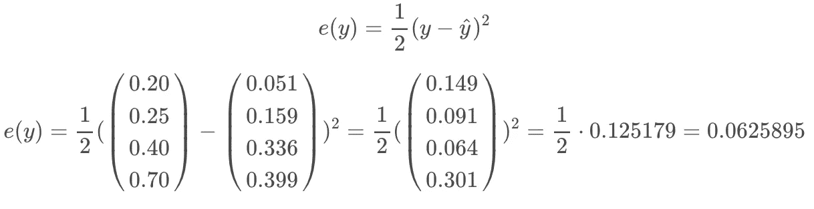

在下图中，我们可以看到，由于我们添加了第二个输入参数，这条线(向上的曲线)有一点凸起。

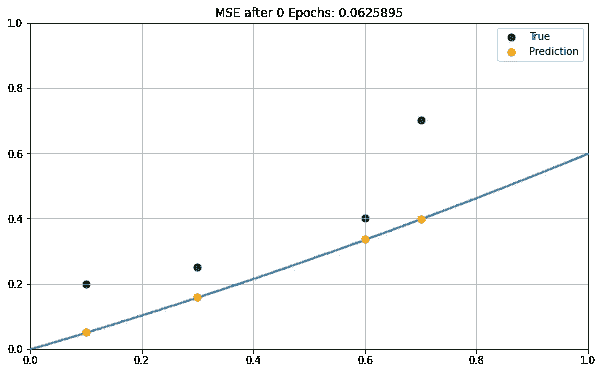

SMC 神经网络初始预测—作者

## 反向传播

现在我们已经做出了初步的预测，我们可以反推计算我们应该如何改变权重和偏差。我们需要计算的三个偏导数链如下。

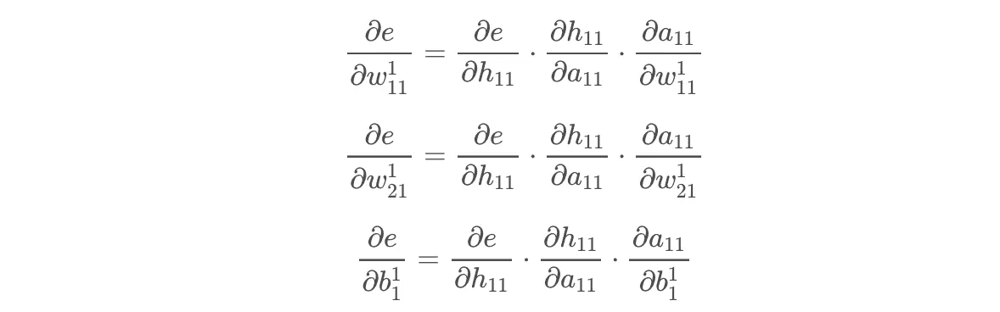

上面三个方程的前两个偏导数与我们用之前的模型计算的完全相同。

每条链的最终偏导数如下。

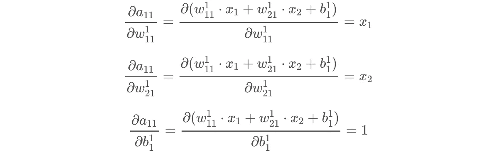

然后我们就可以把每个导数链放在一起，对每个数据点求解，对每个链取平均值！

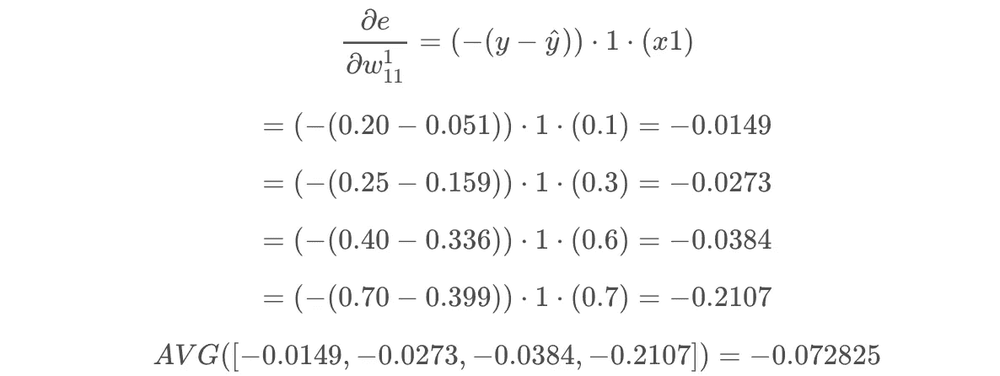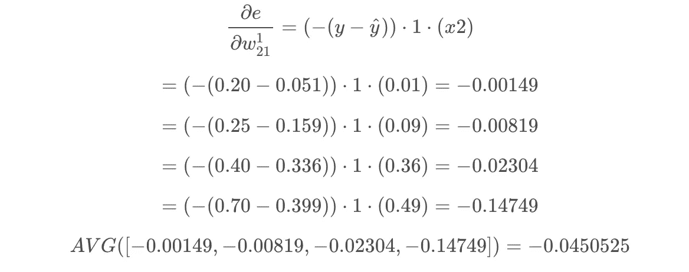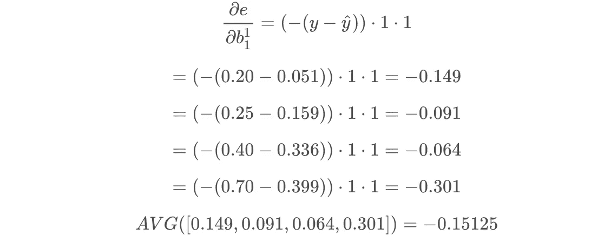

接下来，我们使用与之前相同的公式更新权重和偏差。

我们将再次使用学习率 1。这触发了参数的大跳跃，并且有利于在 1 个时期之后可视化模型中的变化。通常，您会设置一个较低的学习速率，并执行多个时期。

## 又一次向前传球

最后，我们可以执行另一个向前传递，看看模型改进了多少！

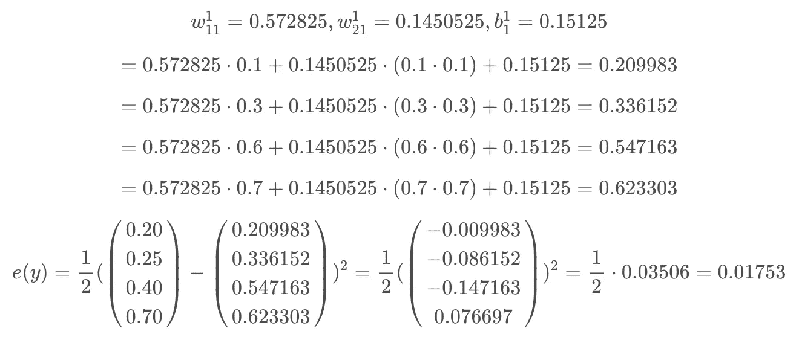

厉害！我们将误差函数从大约 0.06 降低到大约 0.01。在下面的单元格中，我们看到了这种改进。我们对模型训练得越多，我们就应该越接近精确拟合数据点。蓝线是更新的模型，灰线是初始模型。

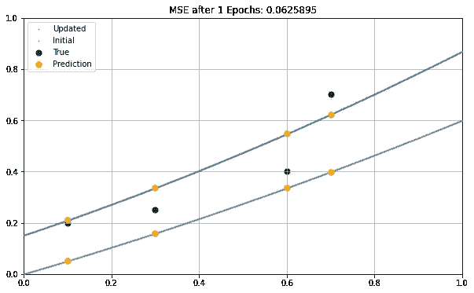

SMC 神经网络更新预测-作者

## 3.用代码训练神经网络

现在我们已经完成了所有的数学，我想向你展示如何使用 Python 训练一个模型。我们上面所做的计算可以由计算机每秒钟完成数千次。下面的代码块为模型定义了一个神经网络类。我鼓励你浏览类函数和代码注释来确认这一点。

首先，我们实例化该类并传入 x 和 y 值。然后，我们可以迭代地执行前向传递和后向传播来更新模型参数。在下面的例子中，我们为 3000 个时期训练模型，并且每 500 个时期记录模型预测。

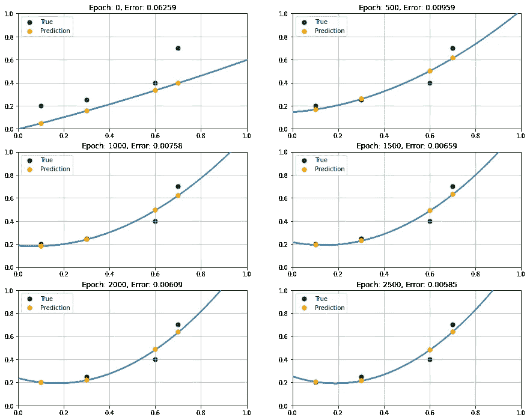

带代码的 SMC NN 按作者

正如我们所见，该模型不断改进其预测，经过 2500 个时代后，我们得到了一个高度准确的模型。由于该模型反映了二阶线性回归模型，因此它仅限于凸函数，其缩放和变换取决于模型参数。训练数据点并不完全是凸函数，因此我们需要增加输入节点的数量来完美地拟合数据。

# 最后的想法

我认为神经网络背后的数学非常棒。希望本文中的几个例子和一些样本数据有助于展示这一点。从线性回归模式的神经网络开始是一个很好的起点，但当您添加多个层和非线性激活函数时，神经网络的真正预测能力就会释放出来。

这篇文章的代码可以在这里找到。

**资源**

1.  [训练神经网络——杰瑞米·乔登](https://www.jeremyjordan.me/neural-networks-training/)
2.  [激活函数及其导数——Lakshmi Panneerselvam](https://www.analyticsvidhya.com/blog/2021/04/activation-functions-and-their-derivatives-a-quick-complete-guide/)
3.  [与 RELU 的反向传播—堆叠交换讨论](https://datascience.stackexchange.com/questions/19272/deep-neural-network-backpropogation-with-relu)
4.  [权重初始化技术— Saurabh Yadav](/weight-initialization-techniques-in-neural-networks-26c649eb3b78)
5.  [深度学习偏差反向传播——Enes Zvornicanin](https://www.baeldung.com/cs/deep-learning-bias-backpropagation)
6.  [逐步反向传播—哈尼族 M. K.](https://hmkcode.com/ai/backpropagation-step-by-step/)