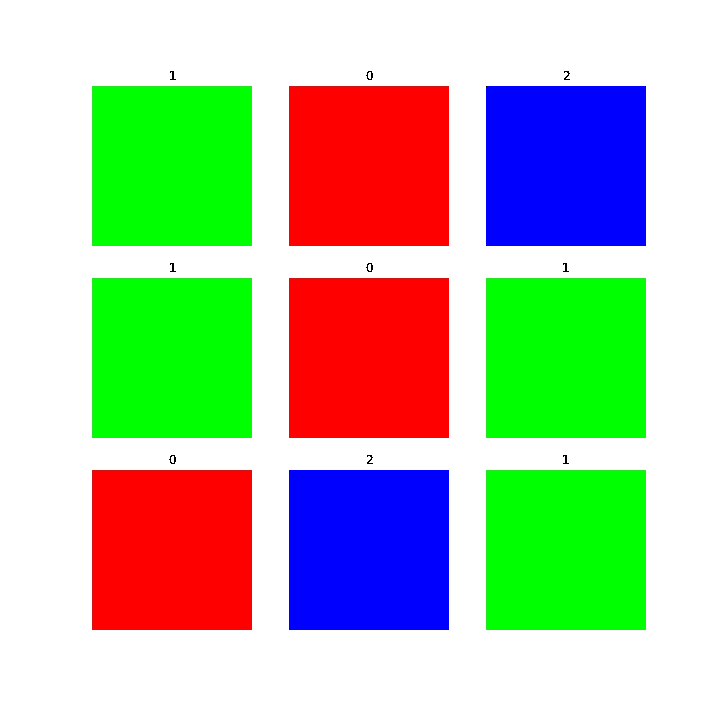

# 在 TFRecord 文件上训练神经网络

> 原文：<https://towardsdatascience.com/training-a-neural-network-on-tfrecord-files-8bff3b6e9ff4>

## TensorFlow 的格式可能不容易开始，但它非常适合模型训练

TFRecord 格式是 Google 用于高效存储和读取数据的数据格式。虽然潜在的想法很简单——将对象打包到盒子里——但第一步有点神秘。我在之前的一篇文章中已经介绍了这个想法，并开始以这种格式存储各种数据类型。

这篇文章延续了以前的工作，并进一步展示了在自定义 TFRecord 数据集上训练神经网络，这是以前没有的。就本文的范围而言，我们创建的数据集非常简单:红色、绿色和蓝色图像的集合。首先，我们导入所有必需的包:

作为上述代码的一部分，我们还直接设置了图像的大小。这些图像只有一种颜色，所以尺寸小于所选的 250×250 像素也可以。然而，与前一篇文章一样，这篇文章同时展示了如何将一个(自定义)数据集分布在多个 TFRecord 文件中。如果我们设置更小的图像尺寸，例如 32 乘 32，所有的数据将更容易放入一个文件中。

# 数据集创建

也就是说，下面的函数为我们生成了给定形状的 *n* 幅图像。每个数据样本根据其颜色进行标记:0 代表红色，2 代表绿色，3 代表蓝色。要创建的图像的颜色是随机选择的，只需先画出标签，然后相应地着色即可:

下面是我们如何创建和检查返回的数据:

# 创建 TFRecords

我们的下一步是将自定义数据集写入 TFRecord 格式。为此，我们将首先定义四个辅助函数:

下一步将使用这些函数来准备写入磁盘的数据。根据我们想要编码的信息，我们选择了效用函数:

下一步，我们构建中央数据写入函数。它接受图像、它们的标签、要写入数据的文件名、每个 TFRecord 文件的最大样本数和一个输出目录。

在这个方法中，我们迭代分割(即，我们想要分割数据的文件数量)并用图像-标签对填充它们。这一步调用我们之前的函数(第 27 行):

要开始将数据写入 TFRecord 格式，我们使用以下命令调用该函数:

根据图像大小、要解析的图像数量以及底层机器的计算能力，这个步骤需要几秒钟。TQDM 库(pip install tqdm)通过保持整洁的进度条来显示进度。

# 从 TFRecords 中读取

我们现在倾向于加载函数来训练数据集上的神经网络。从[我的 TFRecords 实用指南](/a-practical-guide-to-tfrecords-584536bc786c)可以看出，我们可以考虑将数据存储在带标签的桶中。当我们想要读回数据时，我们遍历这些桶，并为每个例子请求图像数据和相应的标签。以编程方式，此步骤由以下函数处理:

仅仅使用这个函数，我们不会走得很远。我们还需要一个(小的)方法来查找所有的 TFRecord 文件，并在数据加载期间通过数据提取方法输入每个样本。此任务通过以下函数完成，该函数返回 TensorFlow 数据集:

为了获得数据集，我们调用这个函数。此外，我们对数据进行批处理，并将每个图像(在下面的代码中命名为 *x* )归一化到 0.0 到 1.0 的范围内。这种重新调整是标准做法:

让我们用下面的代码来可视化一些示例:

输出是一个三乘三的矩阵，包含来自数据集的九个样本:

来自我们三色数据集的九个示例及其标签。图片由作者提供。

# 训练神经网络

下一步，我们创建神经网络。我选择了一个简单的架构。对于其他问题/数据集，可能需要更复杂的网络):

与模型一起，我们创建了损失、指标和优化器。我把自己限制在标准的选择上；请随意尝试:

最后一步是培训的开始:

因为我们简单的数据集，网络可以快速区分不同的颜色。要达到完美的训练分数和零损失，少于五个纪元是必要的。虽然我们没有单独的验证和测试集，但我相信对这些子集的评估会产生同样完美的分数。如果你想验证这一点或者重现上面的任何结果，你可以[在 GitHub](https://github.com/phrasenmaeher/nn-training-on-tfr) 上找到代码。

# 摘要

在本实践指南中，我们介绍了如何根据 TFRecord 数据训练神经网络。我们的第一步是创建一个人工的三色图像数据集。这些数据随后存储在 TFRecord 文件中，在数据集创建过程中使用这些文件。我们最后的步骤是初始化模型，最后，训练它达到完美的分类精度。