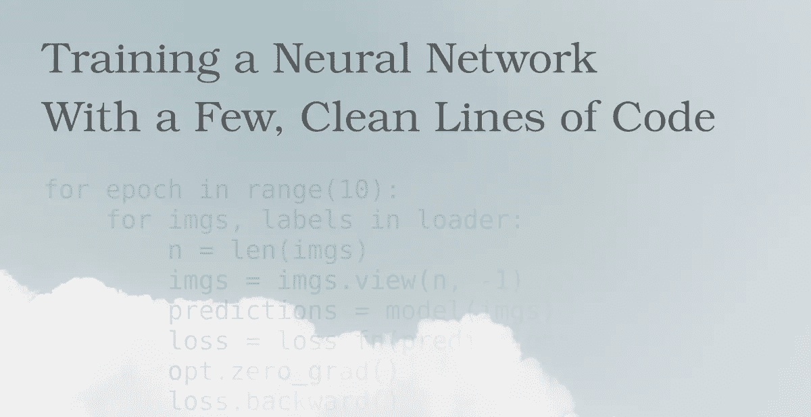

# 用几行简洁的代码训练一个神经网络

> 原文：<https://towardsdatascience.com/training-a-neural-network-with-a-few-clean-lines-of-code-b688da064bd5>

## 可重用、可维护且易于理解的机器学习代码



照片由[米拉德·法库里安](https://unsplash.com/@fakurian?utm_source=unsplash&utm_medium=referral&utm_content=creditCopyText)在 [Unsplash](https://unsplash.com/s/photos/white?utm_source=unsplash&utm_medium=referral&utm_content=creditCopyText) 拍摄——由作者编辑

较少的代码通常会产生易于理解和维护的可读代码。Python 编程语言已经在机器学习社区中非常流行，与其他编程语言相比，它允许您用更少的代码获得更好的结果。

PyTorch 是一个流行的 Python 深度学习框架，它有一个干净的 API，并允许您编写真正像 Python 一样的代码。因此，用 Python 中的 PyTorch 创建模型和进行机器学习实验真的很有趣。

在本文中，我将向您展示训练一个识别手写数字的简单分类器所需的基本步骤。您将看到如何

*   用 PyTorch 的数据加载器加载 MNIST 数据集(用于机器学习的“Hello World”数据集)
*   声明我们模型的架构
*   选择优化程序
*   实施培训循环
*   确定训练模型的准确性

我想让一切尽可能简单。因此，我不涉及过拟合、数据预处理或不同的度量来评估我们的分类器的性能。我们将只实现训练分类器所需的基本构件，这些构件可以很容易地在其他机器学习实验中重用。

所以让我们开始写一些代码。

我们需要做的第一件事是导入必要的包。因为我们使用 PyTorch，所以我们需要导入包`torch`和`torchvision`。

```
import torch
import torchvision as tv
```

# 加载数据

现在，我们可以通过 torchvision 加载我们的训练和验证数据集。

```
t = tv.transforms.ToTensor()mnist_training = tv.datasets.MNIST(
    root='/tmp/mnist',
    train=True,
    download=True,
    transform=t
)mnist_val = tv.datasets.MNIST(
    root='/tmp/mnist', 
    train=False, 
    download=True, 
    transform=t
)
```

首先，我们创建一个`ToTensor()`的实例，用于将从`datasets`包中获得的图像转换成张量。我们需要这一步，因为所有 PyTorch 函数都在张量上运行。如果你不了解张量，这些基本上只是多维数组的一个花哨名字。张量有秩。例如，秩为 0 的张量是标量，秩为 1 的张量是向量，秩为 2 的张量是矩阵，等等。

然后，我们加载我们的训练和验证数据集。使用`root`,我们可以指定用于在光盘上存储数据集的目录。如果我们将`train`设置为真，则训练集被加载。否则，加载验证集。如果我们将`download`设置为 true，PyTorch 将下载数据集并将它们存储到通过`root`指定的目录中。最后，我们可以指定应该应用于训练和验证数据集的每个示例的转换。在我们的情况下，它只是`ToTensor()`。

# 指定我们模型的架构

接下来，我们指定模型的架构。

```
model = torch.nn.Sequential(
    torch.nn.Linear(28*28, 128),
    torch.nn.ReLU(),
    torch.nn.Linear(128, 10)
)
```

# 选择优化器和损失函数

接下来，我们指定优化器和损失函数。

我们正在使用 [Adam 优化器](https://optimization.cbe.cornell.edu/index.php?title=Adam)。通过第一个参数，我们指定了优化器需要优化的模型参数。通过第二个参数`lr`，我们指定了学习率。

在第二行中，我们选择`CrossEntropyLoss`作为损失函数(常用的损失函数的另一个词是*标准*)。此函数获取输出层的非标准化(N x 10)维输出(N 是我们批次的样本数),并计算网络输出和目标标签之间的损失。目标标签被表示为包含输入样本的类别索引的 N 维向量(或者更具体地，秩为 1 的张量)。如您所见，CrossEntropyLoss 是一个非常方便的函数。首先，在我们的网络末端，我们不需要像 softmax 这样的标准化层。第二，我们不必在不同的标签表示之间转换。我们的网络输出分数的 10 维向量，并且目标标签被提供为类别索引的向量(0 到 9 之间的整数)。

接下来，我们为训练数据集创建一个数据加载器。

```
loader = torch.utils.data.DataLoader(
    mnist_training, 
    batch_size=500, 
    shuffle=True
)
```

数据加载器用于从数据集中检索样本。我们可以使用数据加载器来轻松地迭代一批样本。这里，我们创建一个加载器，它在每次迭代中从训练数据集中返回 500 个样本。如果我们设置`shuffle`为真，样本将在批次中被混洗。

# 训练机器学习模型

现在，我们有了训练模型所需的一切。

```
for epoch in range(10):
    for imgs, labels in loader:
        n = len(imgs)
        imgs = imgs.view(n, -1)
        predictions = model(imgs)  
        loss = loss_fn(predictions, labels) 
        opt.zero_grad()
        loss.backward()
        opt.step()
    print(f"Epoch: {epoch}, Loss: {float(loss)}")
```

我们使用 10 个历元来训练我们的网络(第 1 行)。在每个时期，我们对加载器进行迭代，以在每次迭代中获得 500 张图像及其标签(第 2 行)。变量`imgs`是形状的张量(500，1，28，28)。变量`labels`是具有 500 个类别索引的秩为 1 的张量。

在第 3 行，我们将当前批次的图像数量保存在变量`n`中。在第 4 行中，我们将形状(n，1，28，28)的张量`imgs`整形为形状(n，784)的张量。在第 5 行中，我们使用我们的模型来预测当前批次的所有图像的标签。然后，在第 6 行，我们计算这些预测和事实之间的损失。张量`predictions`是形状(n，10)的张量，而`labels`是包含类别索引的秩为 1 的张量。在第 7 行到第 9 行中，我们重置了网络所有参数的梯度，计算了梯度并更新了模型的参数。

我们还在每个时期之后打印损耗，以便我们可以验证网络在每个时期之后变得更好(即损耗减少)。

# 确定准确度

现在，我们已经训练了网络，我们可以确定模型识别手写数字的准确性。

首先，我们需要从验证数据集中获取数据。

```
n = 10000
loader = torch.utils.data.DataLoader(mnist_val, batch_size=n)
images, labels = iter(loader).next()
```

我们的验证数据集`mnist_val`包含 10000 张图片。为了得到所有这些图像，我们使用一个数据加载器，并将`batch_size`设置为 10000。然后，我们可以通过从数据加载器创建一个迭代器，并在迭代器上调用`next()`来获取第一个元素，从而获得数据。

结果是一个元组。这个元组的第一个元素是形状张量(10000，1，28，28)。第二个元素是秩为 1 的张量，它包含图像的类别索引。

现在，我们可以使用我们的模型来预测所有图像的标签。

```
predictions = model(images.view(n, -1))
```

在我们能够向我们的模型提供数据之前，我们需要重塑它(类似于我们已经在训练循环中所做的)。我们模型的输入张量需要具有形状(n，784)。当数据具有正确的形状时，我们可以将其用作模型的输入。

结果是形状的张量(10000，10)。对于我们的验证集的每个图像，这个张量存储了十个可能标签中每个标签的分数。标签的分数越高，样品越有可能属于相应的标签。

通常，样本被分配给具有最高分数的标签。我们可以通过张量的`argmax()`方法很容易地确定标签，因为这个方法返回最大值的位置。

```
predicted_labels = predictions.argmax(dim=1)
```

我们对维度 1 的最大值感兴趣，因为每个样本的分数都存储在这个维度上。结果是秩为 1 的张量，它现在存储预测的类索引而不是分数。

现在，我们可以将预测的类索引与基础事实标签进行比较，以计算验证数据集的准确性。准确度被定义为已经被正确预测的样本的分数，即正确预测的样本数除以样本总数。

获得这个度量的技巧是对预测标签和实际标签进行元素比较。

```
torch.sum(predicted_labels == labels) / n
```

我们比较`predicted_labels`和`labels`是否相等，得到一个布尔向量。如果同一位置的两个元素相等，则该向量中的一个元素为真。否则，元素为 false。然后，我们使用`sum`来计算为真的元素的数量，并将该数量除以 n

如果我们执行所有这些步骤，我们应该可以达到大约 97%的准确率。

GitHub 上也有完整的代码。

# 结论

作为一名软件工程师，我喜欢干净的代码。有时候，我会在一些小代码前坐半个小时甚至更长时间，只是为了让它更优雅、更漂亮。

PyTorch 是一个非常棒的深度学习框架，它允许您编写易于理解并且感觉像 Python 的干净代码。我们已经看到，只用几行代码就可以生成表达性代码来创建和训练最先进的机器学习模型。

我们在这个简单演示中使用的构建模块可以在许多机器学习项目中重用，我希望它们也能在您的机器学习之旅中对您有所帮助。