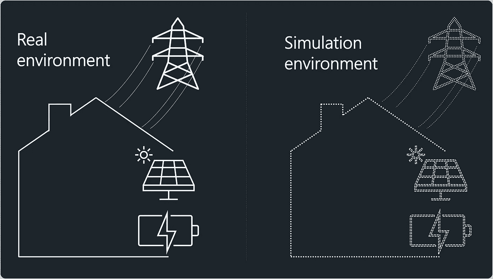
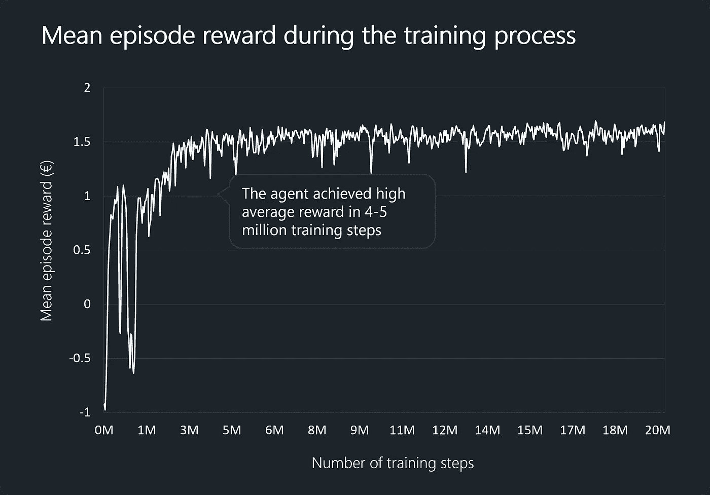
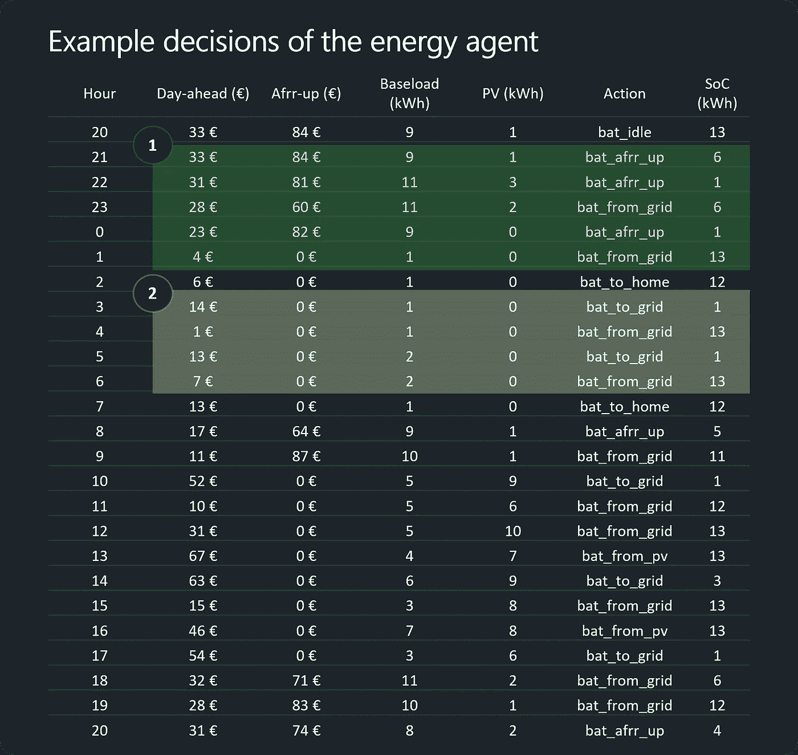

# 用强化学习训练能量决策智能体

> 原文：<https://towardsdatascience.com/training-an-energy-decision-agent-with-reinforcement-learning-a7567b61d0aa>


费德里科·贝卡里在 [Unsplash](https://unsplash.com?utm_source=medium&utm_medium=referral) 上的照片

## 设置、培训过程和结果的高级概述

现实世界的强化学习应用很难找到。本文给出了**构建一个 RL 代理的高层次概述，该代理旨在优化能源使用**。本文分为以下几个部分:

1.  **问题设置** —明确问题和目标。
2.  **构建模拟环境** —描述如何构建培训环境，包括代理的观察空间、行动空间和奖励。
3.  **训练过程** —训练中使用的框架、算法和训练过程的图表。
4.  **行动中的代理** —一个训练有素的代理如何做出决策的例子。
5.  **结论** —最终想法。

# 问题设置

我们有一个家庭**用 12 kWp 单元**产生自己的太阳能，并且能够**将这种能量存储在家用电池中(容量为 13 kWh 的特斯拉 Powerwall 2)**，这可以通过 API 来控制。该户的电力合同基于**日前市场价格**，该存储装置也可用于**参与** [**备用/备用**](https://www.next-kraftwerke.com/knowledge/afrr) **市场**。

我们的目标是**培训一个代理，通过** **控制电池**考虑能源市场(日前市场、频率市场)、当地条件(例如，家庭的基本负荷)和用户偏好(例如，电池水平不能低于某个阈值)来最小化家庭的能源成本。

# 构建模拟环境

在强化学习中，主体通过在环境中做出动作、接受对这些动作的奖励/惩罚并相应地修改其动作模式(策略)来学习。

人们可以使用真实环境(真实的家庭和能源市场)或模拟环境。在这个项目中，建立了一个模拟环境，使用 [OpenAI Gym](https://github.com/openai/gym) 作为框架。



模拟环境是真实物理环境的数字表示，用于训练强化学习代理(图片由作者提供)。

开发能源决策代理的模拟环境包括以下步骤:

1.  用数字表示环境的当前情况(状态)。状态表示需要包含我们的代理培训所需的所有信息。
2.  用数字表示可能的行为(我们的代理可以用我们的电池做的事情)。表示和更新家用电池的当前状态。
3.  发展一种逻辑，说明在环境中采取特定行动意味着什么。换句话说，表示当代理执行特定动作时，家庭、电池和能源成本会发生什么。

总之，我们环境的程序表示包括大约 700 行代码(包括助手函数)。接下来，我将解释环境的一些关键部分。

## 代表当前状态/观察

状态/观察是当前情况的数字表示。在我们的项目中，这意味着代表能源市场、家庭和资产的当前状态。

## 当前状态的初始表示

我们的初始(未修改的)观察空间由以下信息组成:

*   未来一天能源市场价格的 12 小时预测，
*   afrr_up 频率市场价格的 12 小时预测，
*   家庭消费的 12 小时预测，
*   当地太阳能生产的 12 小时预报，
*   关于电池的信息(长度为 4 的向量):电池的容量(例如 13k wh)；电池的当前充电水平(例如 2 千瓦时)；最大充电功率(例如 5kw)；允许的最低充电水平(例如 1 千瓦时)。

下面的代码块代表未修改的观察组件的一个示例:我们有 12 个前一天和后一天市场价格的预测值，相同数量的相应基本负载和 pv 产品值，以及 4 个代表电池信息的值。

```
'day_ahead': array([ 4, 6, 12, 41, -12, 18, 46, 69, 41, 65, 64, 22], dtype = int32)
'afrr_up': array([ 0, 78, 62, 0, 0, 0, 0, 0, 0, 0, 0, 87], dtype=int32)
'baseload': array([ 2, 10, 10, 4, 4, 3, 5, 4, 4, 4, 4, 9], dtype=int32)
'pv': array([ 0, 1, 2, 4, 10, 4, 12, 6, 10, 5, 9, 0], dtype=int32)
'bat': array([13., 2., 15., 1.], dtype=float32)
```

## 修改的观察空间

初始观察表示被修改，以便使它更容易被我们的代理用于学习的神经网络处理。每个观察值都经过了**归一化**(在 0 和 1 之间表示)和**平坦化**(作为单个向量而不是五个不同的向量给出)。修改后的观察结果如下所示:

```
array([0.159375, 0.175 , 0.10625 , 0.09375 , 0.13125 , 0.084375, 0.096875, 
0.121875, 0.078125, 0.103125, 0.09375 , 0.19375 , 0.3 , 0.34375 , 0.0625 , 
0.0625 , 0.0625 , 0.0625 , 0.0625 , 0.0625 , 0.0625 , 0.365625, 0.375 , 
0.0625 , 0.5625 , 0.625 , 0.125 , 0.125 , 0.0625 , 0.0625 , 0.0625 , 
0.125 , 0.0625 , 0.6875 , 0.5625 , 0.375 , 0\. , 0.0625 , 0\. , 0\. , 
0\. , 0\. , 0\. , 0\. , 0\. , 0.125 , 0.0625 , 0.5 , 0.8125 , 0.125 , 
0.9375 , 0.0625 ])
```

## 行为空间

动作空间表示代理可以做出的决策(动作)。我们的能量决策代理具有长度为 6 的离散动作空间。

```
0: 'bat_from_grid' #battery is charged from the grid
1: 'bat_to_grid' #battery sends energy to the grid 
2: 'bat_to_home' #battery fulfills household’s energy need 
3: 'bat_from_pv' #battery charges from solar panels production
4: 'bat_afrr_up' #battery participates in afrr frequency market 
5: 'bat_idle' #battery doesn’t do anything (stays idle)
```

每个值(从 0 到 5)对应于代理可以对电池执行的操作之一。每个动作都会影响电池的充电状态，并具有相应的成本/收益。

复杂性:一集是 24 小时，每小时我们有 6 个动作可以选择。我们有***4 738 381 338 321 616 896****(4.7 万亿)种可能的方式在一集里使用这个电池。*

## 报酬

代理人**在每一步**都获得奖励，奖励等于家庭经历的能源成本。例如，如果代理决定行动值为 0:“bat _ from _ grid”，则最大可能数量的能量从电网充入电池，代理收到的奖励等于:*充电成本+家庭基本负载成本+光伏生产收入+ …*

代理人的目标是**最大化 24 小时时间跨度**的回报(即:24 小时被定义为一集)。

# 培训过程

在培训阶段，代理人在模拟环境中采取行动，并试图找到对家庭最有利的行动计划。在这个项目中，代理由 IMPALA 算法的 [RLLIB 实现来表示。IMPALA 能够同时训练多个 CPU 内核的代理。该项目中的设置包括 4 个核心/工作人员和每个工作人员 3 个环境。](https://github.com/ray-project/ray/blob/master/rllib/algorithms/impala/impala.py)

下图显示了培训过程中每集的平均奖励(以 100 集的平均值计算)。我们可以看到，代理进化得非常快，但在最初的两百万步训练中，策略(其决策模式)的稳定性相当低。在培训的最后阶段，我们的代理能够持续获得每集 1.5-1.6€的平均报酬。



经纪人培训过程中的平均剧集奖励。平均回报代表家庭 24 小时的能源成本。正回报是指住户通过向电网售电挣钱(图片由作者提供)。

# 行动中的代理

作为最后一步，让我们看看我们的代理为示例 24 小时期间建议的操作(下图)。“前一天”和“后一天”列代表这些小时的市场价格。基本负荷和光伏代表家庭的常规消耗和光伏生产(单位为 kWh)。“行动”栏显示我们的能源决策代理建议的行动/决策,“SoC”栏显示一小时结束时(执行建议的行动后)的电池电量(单位为 kWh)。

表中第一个突出显示的区域显示了我们的代理如何在高价时段(21、22、0 小时)在 afrr-up 市场上分配电池，并在当天价格较低的时段(28 和 4 小时)从电网充电。



经过培训的代理人的决策示例——我们可以看到，我们的代理人能够在不同的市场价格之间进行套利(作者列表)。

第二个突出显示的区域表明了我们代理人的纯市场价格套利——在高价时段(第 3 和第 5 小时)放电，在低价时段(第 4 和第 6 小时)充电。

# 结论

最后，我想强调以下几个方面:

*   强化学习可以用来训练能量决策智能体。
*   构建强化学习的现实应用的关键在于构建一个与物理世界非常相似的训练环境。
*   RL 代理不能保证最优性，并且对环境中的微小变化非常敏感。
*   好好想想。也许你的问题可以用更简单的方法解决！